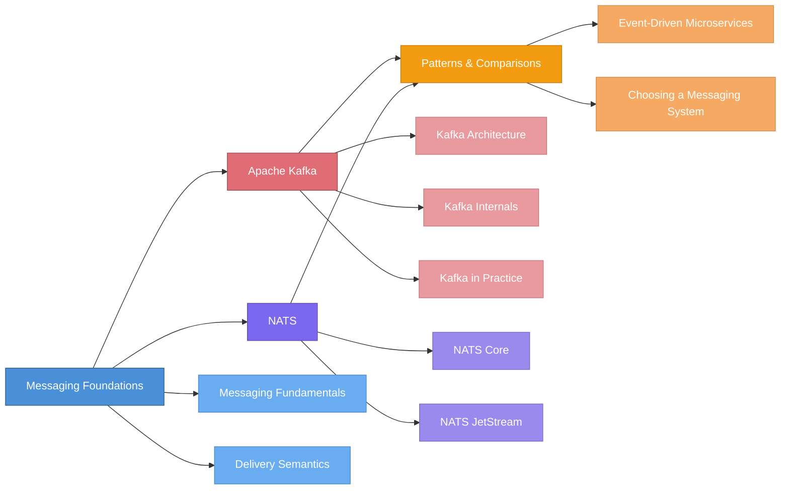

# Deep Dive into Distributed Messaging

> A structured, tutorial-style knowledge base covering distributed messaging systems, Apache Kafka, NATS, and event-driven architecture — from foundations to production patterns.

## Learning Roadmap

## Table of Contents

### 1. Messaging Foundations
- [Section Overview](docs/01-messaging-foundations/README.md)
- [Messaging Fundamentals](docs/01-messaging-foundations/messaging-fundamentals.md) — Core paradigms (point-to-point, pub-sub, request-reply), broker vs brokerless architectures, message anatomy, and event-driven design primitives
- [Delivery Semantics](docs/01-messaging-foundations/delivery-semantics.md) — At-most-once, at-least-once, and exactly-once delivery guarantees, ordering, consumer acknowledgment, idempotency, and backpressure

### 2. Apache Kafka
- [Section Overview](docs/02-apache-kafka/README.md)
- [Kafka Architecture](docs/02-apache-kafka/kafka-architecture.md) — Topics, partitions, brokers, producers, consumers, replication, and the ZooKeeper-to-KRaft migration
- [Kafka Internals](docs/02-apache-kafka/kafka-internals.md) — Commit log, storage engine, replication protocol, idempotent and transactional producers, consumer coordination, and performance internals
- [Kafka in Practice](docs/02-apache-kafka/kafka-in-practice.md) — Producer and consumer best practices, Kafka Streams, Kafka Connect, Schema Registry, operational monitoring, and when (not) to use Kafka

### 3. NATS
- [Section Overview](docs/03-nats/README.md)
- [NATS Core](docs/03-nats/nats-core.md) — Subject-based messaging, wildcards, pub-sub, request-reply, queue groups, clustering, gateways, leaf nodes, security, and multi-tenancy
- [NATS JetStream](docs/03-nats/nats-jetstream.md) — Persistence layer, streams, push and pull consumers, exactly-once delivery, key-value store, object store, and stream mirroring

### 4. Patterns & Comparisons
- [Section Overview](docs/04-patterns-and-comparisons/README.md)
- [Event-Driven Microservices](docs/04-patterns-and-comparisons/event-driven-microservices.md) — CQRS, Event Sourcing, Saga, Outbox, error handling patterns (DLQ, retry, circuit breaker), and schema evolution
- [Choosing a Messaging System](docs/04-patterns-and-comparisons/choosing-a-messaging-system.md) — Kafka vs NATS Core vs NATS JetStream across architecture, performance, features, and operational complexity

### Resources
- [Papers & References](resources/papers-and-references.md) — Curated reading list with annotations
- [Tools & Frameworks](resources/tools-and-frameworks.md) — Reference guide to the Kafka, NATS, and cross-platform tooling ecosystem

## Who Is This For?

- **Backend / Platform Engineers** who need to understand messaging systems for building event-driven architectures, data pipelines, or microservices
- **Software Engineers** evaluating Kafka, NATS, or other messaging systems for their architecture and want concept-first, practical explanations
- **Technical Leaders** making decisions about messaging infrastructure and need structured trade-off analysis
- **Students & Researchers** looking for a curated, opinionated guide through distributed messaging concepts and literature

## Quick-Start Reading Guide

| Your Goal | Start Here |
|---|---|
| Understand messaging from scratch | [Messaging Fundamentals](docs/01-messaging-foundations/messaging-fundamentals.md) |
| Learn delivery guarantees and trade-offs | [Delivery Semantics](docs/01-messaging-foundations/delivery-semantics.md) |
| Deep dive into Apache Kafka | [Kafka Architecture](docs/02-apache-kafka/kafka-architecture.md) |
| Understand Kafka's internal mechanics | [Kafka Internals](docs/02-apache-kafka/kafka-internals.md) |
| Production-ready Kafka guidance | [Kafka in Practice](docs/02-apache-kafka/kafka-in-practice.md) |
| Deep dive into NATS | [NATS Core](docs/03-nats/nats-core.md) |
| Understand NATS persistence (JetStream) | [NATS JetStream](docs/03-nats/nats-jetstream.md) |
| Learn event-driven architecture patterns | [Event-Driven Microservices](docs/04-patterns-and-comparisons/event-driven-microservices.md) |
| Choose between Kafka and NATS | [Choosing a Messaging System](docs/04-patterns-and-comparisons/choosing-a-messaging-system.md) |
| Find key papers and books to read | [Papers & References](resources/papers-and-references.md) |
| Explore the tooling ecosystem | [Tools & Frameworks](resources/tools-and-frameworks.md) |
