# Messaging Foundations

> **Before you can choose between Kafka, RabbitMQ, NATS, or any other messaging system, you need to deeply understand the universal concepts they all share.** This section builds that foundation from the ground up.

---

## What This Section Covers

Messaging is the backbone of modern distributed systems. Whether you are splitting a monolith into microservices, building a real-time data pipeline, or designing an event-driven platform, **the same fundamental concepts show up again and again**: delivery guarantees, messaging paradigms, broker architectures, and event-driven design patterns.

This section strips away vendor-specific details and focuses on the **ideas that transcend any single tool**. By the time you finish these pages, you will be able to evaluate any messaging system against a clear mental model — understanding not just *what* it does, but *why* it makes the trade-offs it makes.

---

## Concept Map

The diagram below shows how the core concepts in this section relate to one another. Start from "Messaging Foundations" in the center and trace outward to see how each idea connects.

```mermaid
graph TB
    MF["Messaging<br/>Foundations"]

    MP["Messaging<br/>Paradigms"]
    DS["Delivery<br/>Semantics"]
    BA["Broker<br/>Architecture"]
    EDA["Event-Driven<br/>Architecture"]

    P2P["Point-to-Point<br/>(Queues)"]
    PS["Publish-<br/>Subscribe"]
    RR["Request-<br/>Reply"]

    AMO["At-Most-Once"]
    ALO["At-Least-Once"]
    EO["Exactly-Once"]
    ORD["Ordering<br/>Guarantees"]

    BRK["Brokered<br/>(Kafka, RabbitMQ, NATS)"]
    BRL["Brokerless<br/>(ZeroMQ)"]

    EVT["Events vs Commands<br/>vs Queries"]
    PAT["Event Patterns<br/>(Notification, State Transfer,<br/>Event Sourcing)"]
    IDP["Idempotency &<br/>Deduplication"]
    BP["Backpressure &<br/>Flow Control"]

    MF --> MP
    MF --> DS
    MF --> BA
    MF --> EDA

    MP --> P2P
    MP --> PS
    MP --> RR

    DS --> AMO
    DS --> ALO
    DS --> EO
    DS --> ORD

    BA --> BRK
    BA --> BRL

    EDA --> EVT
    EDA --> PAT

    DS --> IDP
    DS --> BP

    style MF fill:#4a90d9,stroke:#2c5f8a,color:#fff
    style MP fill:#4a90d9,stroke:#2c5f8a,color:#fff
    style DS fill:#4a90d9,stroke:#2c5f8a,color:#fff
    style BA fill:#4a90d9,stroke:#2c5f8a,color:#fff
    style EDA fill:#4a90d9,stroke:#2c5f8a,color:#fff

    style P2P fill:#6aacf0,stroke:#4a8ad0,color:#fff
    style PS fill:#6aacf0,stroke:#4a8ad0,color:#fff
    style RR fill:#6aacf0,stroke:#4a8ad0,color:#fff
    style AMO fill:#6aacf0,stroke:#4a8ad0,color:#fff
    style ALO fill:#6aacf0,stroke:#4a8ad0,color:#fff
    style EO fill:#6aacf0,stroke:#4a8ad0,color:#fff
    style ORD fill:#6aacf0,stroke:#4a8ad0,color:#fff
    style BRK fill:#6aacf0,stroke:#4a8ad0,color:#fff
    style BRL fill:#6aacf0,stroke:#4a8ad0,color:#fff
    style EVT fill:#6aacf0,stroke:#4a8ad0,color:#fff
    style PAT fill:#6aacf0,stroke:#4a8ad0,color:#fff
    style IDP fill:#6aacf0,stroke:#4a8ad0,color:#fff
    style BP fill:#6aacf0,stroke:#4a8ad0,color:#fff
```

---

## Pages in This Section

| # | Page | What You Will Learn |
|---|------|---------------------|
| 1 | [Messaging Fundamentals](./messaging-fundamentals.md) | What messaging is, the three core paradigms (point-to-point, pub-sub, request-reply), broker vs brokerless architectures, the anatomy of a message, and how event-driven architecture builds on top of messaging primitives. |
| 2 | [Delivery Semantics](./delivery-semantics.md) | The three delivery guarantees (at-most-once, at-least-once, exactly-once), ordering guarantees, consumer acknowledgment patterns, idempotency strategies, and backpressure/flow control mechanisms. |

---

## Suggested Reading Order

1. **Start with [Messaging Fundamentals](./messaging-fundamentals.md).** This page introduces the vocabulary and mental models you will use throughout the rest of the knowledge base. Even if you have experience with messaging systems, a quick read will ensure we share the same terminology.

2. **Then read [Delivery Semantics](./delivery-semantics.md).** Delivery guarantees are the single most important axis along which messaging systems differ. Understanding the spectrum from "at-most-once" to "exactly-once" — and the real-world trade-offs at every point — will sharpen every design decision you make going forward.

3. **After completing this section**, you will be ready to dive into the technology-specific deep dives on [Apache Kafka](../02-apache-kafka/README.md) and [NATS](../03-nats/README.md), where you will see these foundations applied to real systems with concrete configuration and code examples.

---

## Prerequisites

No prior messaging experience is required. Familiarity with basic distributed systems concepts (clients, servers, networks, latency) will be helpful but is not strictly necessary — we define terms as we go.

---

*Next up: [Messaging Fundamentals](./messaging-fundamentals.md)*
