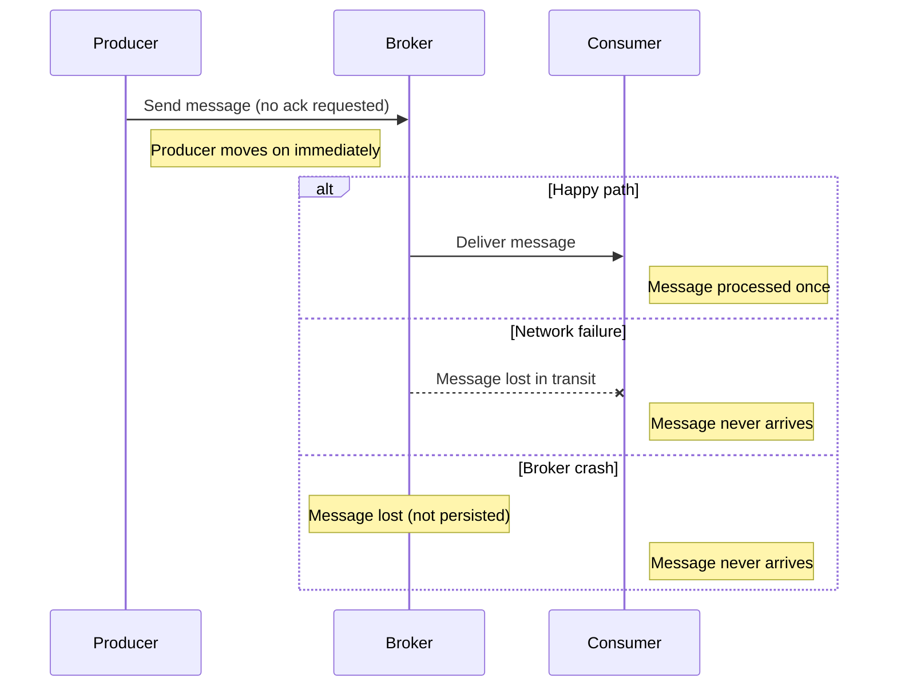
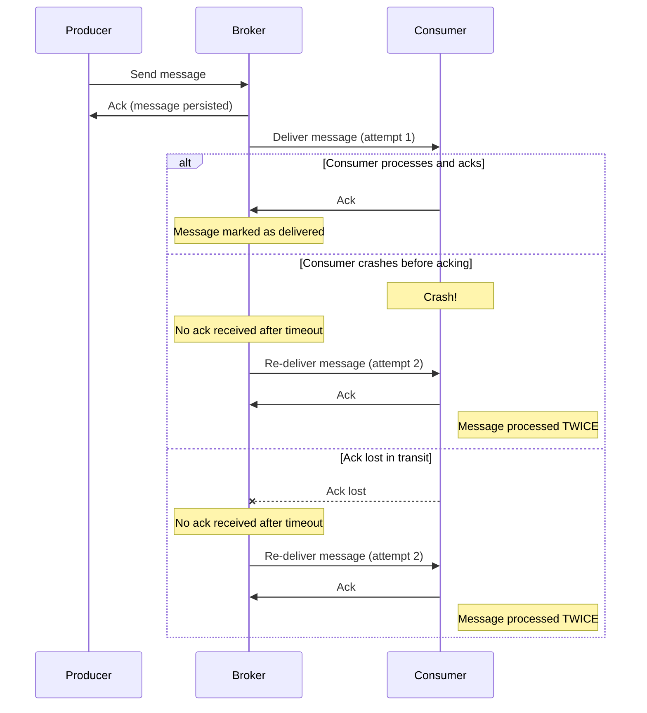
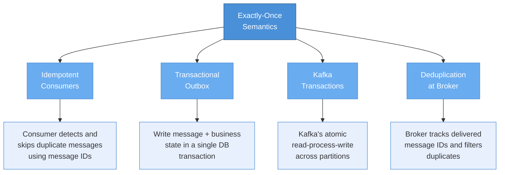
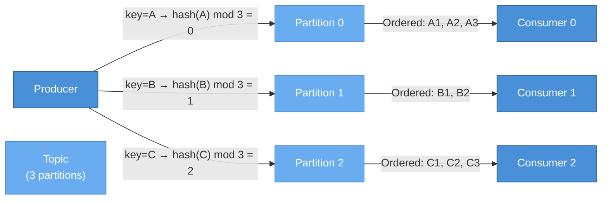
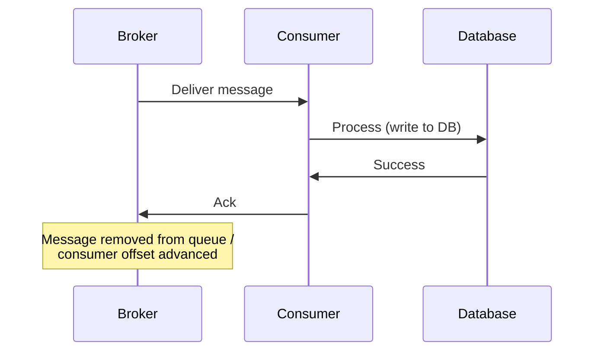
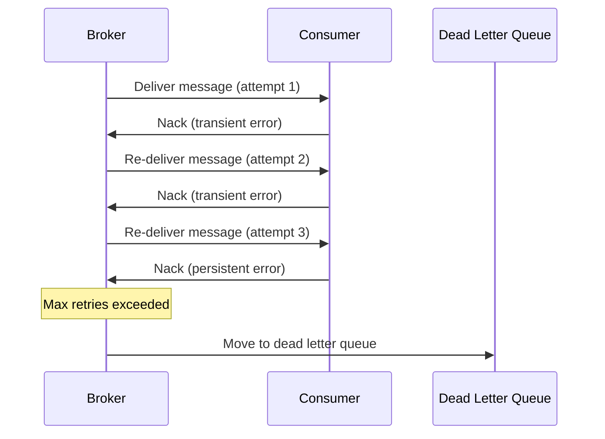
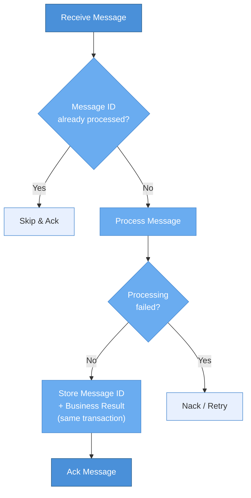
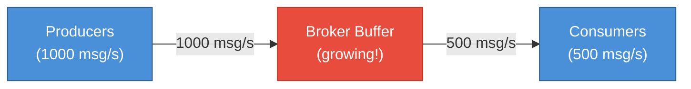
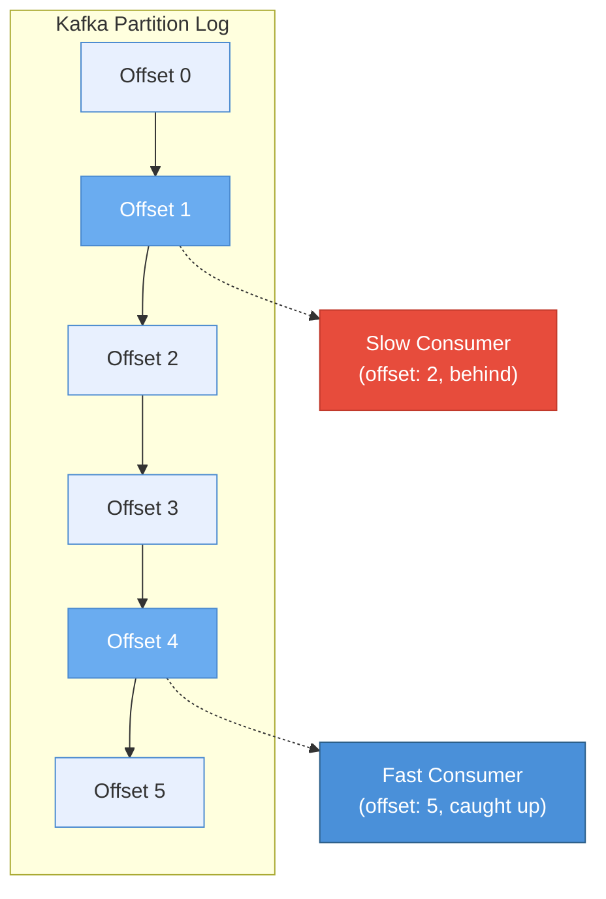

# Delivery Semantics

> **TL;DR** — Every messaging system must answer the question: "Will this message be delivered, and if so, how many times?" The three guarantees are **at-most-once** (fast, may lose messages), **at-least-once** (reliable, may duplicate), and **exactly-once** (ideal, but technically impossible in the general case — practical implementations use idempotency and transactions to approximate it). Beyond delivery count, you must also reason about **ordering**, **acknowledgment patterns**, **idempotency**, and **backpressure**. These five dimensions determine the correctness and performance characteristics of your entire messaging pipeline.

---

## Table of Contents

- [Why This Matters](#why-this-matters)
- [The Three Delivery Guarantees](#the-three-delivery-guarantees)
  - [At-Most-Once Delivery](#at-most-once-delivery)
  - [At-Least-Once Delivery](#at-least-once-delivery)
  - [Exactly-Once Delivery](#exactly-once-delivery)
  - [Delivery Guarantees Comparison](#delivery-guarantees-comparison)
- [Ordering Guarantees](#ordering-guarantees)
  - [Total Ordering](#total-ordering)
  - [Partial Ordering](#partial-ordering)
  - [No Ordering](#no-ordering)
  - [Ordering in Kafka](#ordering-in-kafka)
  - [Ordering in NATS](#ordering-in-nats)
  - [Ordering vs Throughput](#ordering-vs-throughput)
- [Consumer Acknowledgment Patterns](#consumer-acknowledgment-patterns)
  - [Manual Acknowledgment](#manual-acknowledgment)
  - [Automatic Acknowledgment](#automatic-acknowledgment)
  - [Negative Acknowledgment](#negative-acknowledgment)
  - [Dead Letter Queues](#dead-letter-queues)
  - [Acknowledgment Pattern Comparison](#acknowledgment-pattern-comparison)
- [Idempotency in Practice](#idempotency-in-practice)
  - [Why Idempotency Matters](#why-idempotency-matters)
  - [Deduplication Strategies](#deduplication-strategies)
  - [Idempotency Keys](#idempotency-keys)
  - [Implementing Idempotent Consumers](#implementing-idempotent-consumers)
- [Backpressure and Flow Control](#backpressure-and-flow-control)
  - [What Happens When Consumers Cannot Keep Up](#what-happens-when-consumers-cannot-keep-up)
  - [Backpressure Strategies](#backpressure-strategies)
  - [Flow Control in Practice](#flow-control-in-practice)
- [Key Takeaways](#key-takeaways)
- [References](#references)

---

## Why This Matters

Delivery semantics are the **single most important axis** along which messaging systems differ. Two systems might both call themselves "message brokers," but if one provides at-most-once delivery and the other provides at-least-once, they are suitable for **fundamentally different workloads**.

Getting delivery semantics wrong is one of the most common sources of production incidents in distributed systems:

- **Lost messages** (at-most-once where you needed at-least-once) lead to silent data loss — orders that never get processed, payments that never get recorded, notifications that never get sent.
- **Duplicate messages** (at-least-once without idempotency) lead to double charges, duplicate emails, incorrect analytics, and corrupted state.
- **Out-of-order messages** lead to state corruption — a "user deleted" event processed before a "user created" event leaves you with a ghost user.

Understanding these semantics — and knowing which guarantee is actually needed for each use case — is the difference between a system that works in the happy path and a system that works in production.

---

## The Three Delivery Guarantees

### At-Most-Once Delivery

At-most-once delivery means a message is delivered **zero or one times**. The producer sends the message and does not wait for an acknowledgment. If the message is lost in transit — due to a network failure, a broker crash, or a consumer that is not running — it is simply gone.



**Characteristics:**

| Property | Value |
|----------|-------|
| **Maximum deliveries** | 1 |
| **Minimum deliveries** | 0 |
| **Data loss risk** | Yes |
| **Duplicate risk** | No |
| **Latency** | Lowest (no ack round-trip) |
| **Throughput** | Highest (no ack overhead) |

**When at-most-once is appropriate:**

- **Metrics and telemetry** — If you lose 0.1% of your CPU utilization metrics, your dashboards are still accurate. The next data point arrives in seconds.
- **Log forwarding** — Missing a few log lines is acceptable in many logging pipelines. The alternative (slowing down the application to guarantee delivery) is worse.
- **Real-time sensor data** — In IoT scenarios with high-frequency readings, a missing data point is immediately superseded by the next one.
- **Ephemeral notifications** — "User X is typing" indicators in chat applications. Losing one is invisible to the user.

**When at-most-once is NOT appropriate:**

- Financial transactions, order processing, anything where losing a single message has business impact.

---

### At-Least-Once Delivery

At-least-once delivery means a message is delivered **one or more times**. The broker persists the message and requires an **acknowledgment** from the consumer. If the acknowledgment is not received (because the consumer crashed, the network dropped, or the ack was lost), the broker **re-delivers** the message.



The critical insight is in the last two scenarios: the consumer **may have already processed the message** before crashing or before the ack was lost. The broker has no way to know this, so it re-delivers. This is why at-least-once delivery **inherently risks duplicates**.

**Characteristics:**

| Property | Value |
|----------|-------|
| **Maximum deliveries** | Unlimited (until acked) |
| **Minimum deliveries** | 1 |
| **Data loss risk** | No (if broker is durable) |
| **Duplicate risk** | Yes |
| **Latency** | Moderate (ack round-trip) |
| **Throughput** | Moderate (ack overhead) |

**When at-least-once is appropriate:**

- **Most production workloads.** At-least-once with idempotent consumers is the practical sweet spot for the vast majority of messaging use cases.
- Any workload where losing a message is unacceptable, and you can design your consumer to handle duplicates.

**The duplicate problem is solvable.** See the [Idempotency in Practice](#idempotency-in-practice) section below for strategies.

---

### Exactly-Once Delivery

Exactly-once delivery means a message is delivered **exactly one time** — no loss, no duplicates. This is the holy grail of messaging semantics, and it is also the source of more confusion, debate, and marketing spin than any other concept in distributed systems.

**The hard truth:** Exactly-once *delivery* is impossible in the general case of distributed systems. This is a consequence of the **Two Generals Problem** and the impossibility results around distributed consensus with unreliable networks.

Consider: if the consumer processes a message and sends an ack, but the ack is lost, the broker must choose between:

1. **Re-deliver** (risking a duplicate) — this is at-least-once.
2. **Not re-deliver** (risking a loss) — this is at-most-once.

There is no third option without additional coordination.

**So what does "exactly-once" actually mean in practice?** It means **exactly-once *processing semantics*** — the system ensures that even if a message is *delivered* multiple times, its *effect* is applied exactly once. This is achieved through a combination of:



**Approach 1: Idempotent consumers.** The consumer stores the message ID of every processed message. Before processing a new message, it checks if the ID has been seen before. If yes, it skips. This works with any messaging system but requires the consumer to maintain state (typically a database table or cache).

**Approach 2: Transactional outbox.** The producer writes the message to an "outbox" table in the same database transaction as the business operation. A separate process reads the outbox and publishes to the broker. This guarantees that the business operation and the message publication are atomic — either both happen or neither does.

**Approach 3: Kafka's exactly-once semantics (EOS).** Kafka provides built-in exactly-once semantics for **read-process-write** patterns within the Kafka ecosystem. This uses idempotent producers (sequence numbers to deduplicate at the broker), transactions (atomic writes across multiple partitions), and consumer position commits within the same transaction. This is powerful but scoped to Kafka-to-Kafka pipelines.

**Approach 4: Broker-level deduplication.** Some brokers (including NATS JetStream) support deduplication at the broker level. The producer attaches a unique ID to each message, and the broker rejects duplicates within a configurable time window.

---

### Delivery Guarantees Comparison

| Guarantee | Message Loss | Duplicates | Complexity | Performance | Common Use Cases |
|-----------|:----------:|:----------:|:----------:|:-----------:|------------------|
| **At-Most-Once** | Possible | No | Low | Highest | Metrics, logs, ephemeral data |
| **At-Least-Once** | No | Possible | Moderate | Moderate | Most production workloads |
| **Exactly-Once** | No | No | Highest | Lowest | Financial transactions, billing, inventory |

---

## Ordering Guarantees

Delivery count is only half the story. The other half is **order**: if Producer sends messages A, B, C, does the consumer see them in that order?

### Total Ordering

**Total ordering** guarantees that **all consumers** see **all messages** in the **same order**. This is the strongest possible guarantee and the most expensive to provide.

In practice, total ordering requires funneling all messages through a **single serialization point** — a single partition, a single node, or a consensus protocol. This fundamentally limits throughput because you cannot parallelize writes.

**Systems that provide total ordering:** Single-partition Kafka topics, Raft-based replicated logs, Apache BookKeeper.

### Partial Ordering

**Partial ordering** guarantees ordering **within a subset** of messages, but not across subsets. This is the practical sweet spot for most systems.

The most common form is **per-key ordering**: all messages with the same key are ordered relative to each other, but messages with different keys have no ordering relationship.

```mermaid
graph TB
    subgraph "Partition 0 (key: user-A)"
        A1["user-A: Created"] --> A2["user-A: Updated"] --> A3["user-A: Deleted"]
    end

    subgraph "Partition 1 (key: user-B)"
        B1["user-B: Created"] --> B2["user-B: Updated"]
    end

    subgraph "Partition 2 (key: user-C)"
        C1["user-C: Created"] --> C2["user-C: Updated"] --> C3["user-C: Updated"]
    end

    style A1 fill:#6aacf0,stroke:#4a8ad0,color:#fff
    style A2 fill:#6aacf0,stroke:#4a8ad0,color:#fff
    style A3 fill:#6aacf0,stroke:#4a8ad0,color:#fff
    style B1 fill:#4a90d9,stroke:#2c5f8a,color:#fff
    style B2 fill:#4a90d9,stroke:#2c5f8a,color:#fff
    style C1 fill:#6aacf0,stroke:#4a8ad0,color:#fff
    style C2 fill:#6aacf0,stroke:#4a8ad0,color:#fff
    style C3 fill:#6aacf0,stroke:#4a8ad0,color:#fff
```



This is sufficient for the vast majority of use cases. You need "user created" to come before "user deleted" for the same user, but you do not need user-A's events to be ordered relative to user-B's events.

### No Ordering

Some systems provide **no ordering guarantees** at all. Messages may arrive in any order, regardless of the order they were published. This offers the highest throughput and the most parallelism, but requires consumers to be fully order-independent.

**Systems with no inherent ordering:** NATS core (without JetStream), Amazon SNS, Redis Pub/Sub.

### Ordering in Kafka

Kafka's ordering model is one of its defining design decisions:

- **Within a partition:** Messages are strictly ordered. Consumers see messages in exactly the order they were written to the partition's append-only log.
- **Across partitions:** No ordering guarantee. Messages in partition 0 and partition 1 are independent.
- **Key-based routing:** Producers assign a key to each message. Kafka hashes the key to determine the partition. All messages with the same key go to the same partition and are therefore ordered.



**Important caveat:** If you increase the number of partitions on a topic, existing keys may be remapped to different partitions (because `hash(key) mod N` changes when `N` changes). This means ordering for in-flight messages can be disrupted during repartitioning.

### Ordering in NATS

NATS takes a different approach depending on the layer:

- **NATS Core (pub-sub):** No ordering guarantees. Messages are delivered in a best-effort manner. If the consumer is not connected when a message is published, it is simply lost.
- **NATS JetStream:** Provides ordering within a stream. JetStream streams are append-only logs (similar in concept to Kafka partitions). Consumers can request messages in order and acknowledge them individually.
- **Ordered consumers in JetStream:** NATS JetStream supports an "ordered consumer" mode that guarantees in-order delivery to a single consumer by automatically recovering from gaps and reconnections.

### Ordering vs Throughput

There is a fundamental tension between ordering and throughput:

| Ordering Level | Throughput | Parallelism | Use Case |
|---------------|:----------:|:-----------:|----------|
| **Total ordering** | Low | None (single writer/reader) | Consensus logs, leader election |
| **Per-key ordering** | High | Yes (across keys) | Most event-driven systems |
| **No ordering** | Highest | Full | Stateless processing, metrics aggregation |

**Rule of thumb:** Use per-key ordering unless you have a specific reason not to. It gives you the ordering guarantees you actually need (events for the same entity arrive in order) without sacrificing the parallelism you need for throughput.

---

## Consumer Acknowledgment Patterns

Acknowledgments (acks) are the mechanism by which a consumer tells the broker "I have successfully processed this message." The choice of ack pattern directly determines your delivery guarantee.

### Manual Acknowledgment

The consumer explicitly sends an ack after successfully processing the message. This is the safest pattern and the foundation of at-least-once delivery.



**Considerations:**

- Ack **after** processing ensures that a crash during processing results in re-delivery.
- Ack **before** processing (sometimes called "pre-ack") is dangerous — if the consumer crashes after acking but before processing, the message is lost. This effectively downgrades to at-most-once.
- The time between message delivery and ack is the **ack timeout** (or **visibility timeout** in SQS terms). If the consumer does not ack within this window, the broker assumes failure and re-delivers.

### Automatic Acknowledgment

The broker considers the message acknowledged **as soon as it is delivered** to the consumer. No explicit ack is needed.

**Characteristics:**

- Simplest to implement.
- Highest throughput (no ack round-trip).
- At-most-once delivery — if the consumer crashes after receiving the message but before processing it, the message is lost.
- Appropriate for the same use cases as at-most-once delivery: metrics, logs, ephemeral data.

### Negative Acknowledgment

A **negative ack (nack)** tells the broker that the consumer received the message but **cannot process it**. This is different from a timeout — the consumer is explicitly saying "I tried and failed."

The broker's response to a nack depends on configuration:

- **Re-deliver immediately** — Useful for transient errors (e.g., a downstream service was temporarily unavailable).
- **Re-deliver after a delay** — Useful when you want to give the failing condition time to resolve.
- **Route to a dead letter queue** — Useful for permanent errors (e.g., malformed message payload).



### Dead Letter Queues

A **dead letter queue (DLQ)** is a special queue where messages go when they cannot be processed after a configured number of retries. DLQs are your safety net — they prevent "poison pill" messages from blocking the entire queue while preserving the message for investigation.

**DLQ best practices:**

- **Always set up a DLQ.** Without one, a single malformed message can block your entire queue (a "poison pill").
- **Monitor the DLQ.** A growing DLQ is a signal that something is wrong — a bug in the consumer, a schema change, or a downstream failure.
- **Include context.** When routing to a DLQ, include the original message, the error reason, the number of attempts, and the timestamps. This makes debugging much easier.
- **Have a re-processing strategy.** After fixing the bug, you need a way to replay DLQ messages back to the original queue. Some brokers support this natively; others require a manual process.

### Acknowledgment Pattern Comparison

| Pattern | Delivery Guarantee | Throughput | Data Safety | Complexity |
|---------|:------------------:|:----------:|:-----------:|:----------:|
| **Auto ack** | At-most-once | Highest | Lowest | Simplest |
| **Manual ack (after processing)** | At-least-once | Moderate | High | Moderate |
| **Manual ack + nack + DLQ** | At-least-once (with error handling) | Moderate | Highest | Highest |

---

## Idempotency in Practice

### Why Idempotency Matters

If you use at-least-once delivery (and you should, for anything important), duplicates **will** happen. Not maybe. **Will.** Network blips, consumer restarts, broker failovers, rebalances — all of these can trigger re-deliveries.

An operation is **idempotent** if performing it multiple times has the same effect as performing it once. Idempotent consumers are the key to achieving exactly-once *processing* semantics on top of at-least-once *delivery* semantics.

**Examples of naturally idempotent operations:**

| Operation | Idempotent? | Why? |
|-----------|:-----------:|------|
| `SET user.email = "alice@example.com"` | Yes | Setting the same value twice has no additional effect |
| `DELETE FROM orders WHERE id = 123` | Yes | Deleting an already-deleted row is a no-op |
| `INSERT INTO ledger (amount) VALUES (100)` | **No** | Each insert adds another row |
| `UPDATE accounts SET balance = balance + 100` | **No** | Each update changes the balance again |
| `PUT /users/123 { "name": "Alice" }` | Yes | HTTP PUT is defined as idempotent |

### Deduplication Strategies

When the operation is not naturally idempotent, you need a deduplication strategy:

**Strategy 1: Message ID tracking.** Store the ID of every processed message in a database. Before processing, check if the ID exists. If yes, skip.

```
Pseudocode:

function processMessage(msg):
    if db.exists("processed_messages", msg.id):
        log("Duplicate detected, skipping: " + msg.id)
        ack(msg)
        return

    beginTransaction()
        db.insert("processed_messages", msg.id, now())
        performBusinessLogic(msg)
    commitTransaction()

    ack(msg)
```

**Important:** The deduplication check and the business logic **must be in the same transaction**. If they are separate, a crash between the check and the insert results in a lost message; a crash between the business logic and the deduplication record results in a duplicate.

**Strategy 2: Natural idempotency keys.** Instead of tracking message IDs, use a business key that makes the operation naturally idempotent. For example, instead of `INSERT INTO payments (amount) VALUES (100)`, use `INSERT INTO payments (payment_id, amount) VALUES ('pay-123', 100) ON CONFLICT DO NOTHING`. The `payment_id` comes from the message and makes the insert idempotent.

**Strategy 3: Version/sequence numbers.** Attach a monotonically increasing sequence number to each message. The consumer only processes messages with a sequence number higher than the last processed number. This is how Kafka's idempotent producer works — the broker tracks the producer's sequence number per partition and rejects duplicates.

**Strategy 4: Content hashing.** Hash the message payload and use the hash as a deduplication key. This is useful when you do not control the message format and cannot add a unique ID. However, it fails for messages that are intentionally identical (e.g., two legitimate transfers of the same amount).

### Idempotency Keys

An **idempotency key** is a unique identifier attached to each message (or request) that allows the consumer to detect and skip duplicates. It is the most practical and widely used deduplication mechanism.

| Property | Recommendation |
|----------|----------------|
| **Generation** | Produce at the source (producer), not at the broker. The producer knows the business intent. |
| **Format** | UUID v4, ULID, or a composite business key (e.g., `user-123:order-456:attempt-1`). |
| **Storage** | Database table, Redis SET with TTL, or Bloom filter (probabilistic but space-efficient). |
| **TTL** | Keep idempotency records for at least 2x your maximum retry window. If your max retry is 24 hours, keep records for 48 hours. |
| **Scope** | Per-consumer, per-topic. Different consumers processing the same message are independent. |

### Implementing Idempotent Consumers

Here is the general pattern for an idempotent consumer, regardless of messaging system:



**Key design decisions:**

1. **Check before processing** — Do not waste compute on messages you have already handled.
2. **Atomic storage** — The deduplication record and the business operation must be in the same transaction. This is the only way to prevent gaps.
3. **Ack after commit** — The message is only acknowledged after the transaction commits. If the commit fails, the message is re-delivered and the deduplication check will correctly detect it as new (because the previous insert was rolled back).
4. **Handle the "gray zone"** — If the transaction commits but the ack fails, the message will be re-delivered. The deduplication check catches this.

---

## Backpressure and Flow Control

### What Happens When Consumers Cannot Keep Up

In any messaging system, there is always the possibility that producers generate messages faster than consumers can process them. This is not an edge case — it is a **normal operating condition** that occurs during traffic spikes, consumer slowdowns, consumer restarts, and rebalances.

Without explicit flow control, unprocessed messages accumulate somewhere:



If the buffer is unbounded, it eventually exhausts memory and the broker crashes. If the buffer is bounded, you must decide what happens when it fills up. This decision is **backpressure** — the mechanism by which a slow consumer signals to the rest of the system that it needs the flow rate to decrease.

### Backpressure Strategies

There are four fundamental strategies for handling backpressure, each with different trade-offs:

| Strategy | How It Works | Pros | Cons | Example |
|----------|-------------|------|------|---------|
| **Buffering** | Accumulate messages in a buffer (memory, disk, or both) until the consumer catches up. | No data loss; producer is not slowed. | Buffer can grow unboundedly; high memory/disk usage; increased latency for buffered messages. | Kafka log retention (days of buffering), RabbitMQ persistent queues. |
| **Dropping** | When the buffer is full, discard the oldest or newest messages. | Bounded memory; producer is not slowed. | Data loss. | NATS core (drops if subscriber is slow), UDP-based protocols, ring buffers. |
| **Blocking** | When the buffer is full, block the producer until space is available. | No data loss; bounded memory. | Producer throughput drops; can cascade to upstream systems; risk of deadlocks. | TCP flow control, Kafka producer `max.block.ms`, synchronous queues. |
| **Rate limiting** | Explicitly limit the rate at which producers can publish or consumers can receive. | Predictable resource usage; no unbounded growth. | Requires capacity planning; messages may queue upstream. | API rate limits, Kafka quotas, NATS `max_pending`. |

### Flow Control in Practice

**Kafka's approach:** Kafka uses **log retention** as its primary backpressure mechanism. Messages are written to append-only logs on disk and retained for a configurable period (e.g., 7 days) or until a size limit is reached. Consumers read from the log at their own pace, tracking their position with an **offset**. If a consumer falls behind, the messages are still there — as long as they have not been deleted by retention policy. This is one of Kafka's most powerful design decisions: the broker does not need to track what has been delivered to whom. It just writes to a log and lets consumers manage their own read position.



If the slow consumer falls behind the retention window, it loses data. The key metric to monitor is **consumer lag** — the difference between the latest offset in the partition and the consumer's committed offset.

**NATS Core approach:** NATS core is designed for real-time messaging and uses a **drop** strategy. If a subscriber cannot keep up, NATS will drop messages (and close the connection if the slow consumer buffer overflows). This is by design — NATS core prioritizes system stability over guaranteed delivery. For durability, NATS JetStream adds a log-based persistence layer similar to Kafka.

**RabbitMQ's approach:** RabbitMQ uses **consumer prefetch** as its primary flow control mechanism. The `prefetch_count` setting limits how many unacknowledged messages a consumer can have at once. When the limit is reached, the broker stops delivering to that consumer until it acks some messages. This provides natural backpressure without dropping messages:

- **Low prefetch** (e.g., 1): Maximum fairness, minimum throughput. Each consumer processes one message at a time.
- **High prefetch** (e.g., 1000): Maximum throughput, risk of consumer overload. Consumer has 1000 messages in memory.
- **Optimal prefetch:** Depends on your processing time and message size. Start with a value between 10-50 and tune from there.

**Monitoring for backpressure:**

| Metric | What It Tells You | Alarm Threshold |
|--------|-------------------|-----------------|
| **Consumer lag** (Kafka) | How far behind the consumer is, measured in messages or time. | Growing lag over a sustained period. |
| **Queue depth** (RabbitMQ) | How many messages are waiting in the queue. | Queue depth exceeding expected steady-state. |
| **Pending count** (NATS) | How many messages are pending delivery to a subscriber. | Approaching the max pending limit. |
| **Processing latency** | p99 time from message publish to consumer processing completion. | Increasing latency trend. |
| **DLQ depth** | How many messages have failed processing. | Any non-zero and growing count. |

---

## Key Takeaways

- The three delivery guarantees — **at-most-once, at-least-once, and exactly-once** — represent a spectrum of trade-offs between reliability, performance, and complexity. Most systems should default to **at-least-once with idempotent consumers**.
- **Exactly-once delivery** is impossible in the general distributed systems case. Practical "exactly-once" means exactly-once *processing semantics*, achieved through idempotency, transactions, or broker-level deduplication.
- **Ordering** is a separate axis from delivery count. Per-key (partial) ordering is the practical sweet spot — it gives you the ordering you need without sacrificing the parallelism you need.
- **Consumer acknowledgment patterns** directly determine your delivery guarantee. Ack after processing for at-least-once; auto-ack for at-most-once. Always use dead letter queues as a safety net.
- **Idempotency** is not optional in at-least-once systems. Build it in from day one — it is much harder to retrofit.
- **Backpressure** is a normal operating condition, not a failure mode. Choose your strategy explicitly (buffer, drop, block, or rate limit) rather than letting the system choose for you by crashing.
- **Monitor consumer lag, queue depth, and DLQ depth.** These are your early warning signals for delivery semantics problems in production.

---

## References

- [Designing Data-Intensive Applications](https://dataintensive.net/) — Martin Kleppmann, Chapter 11 ("Stream Processing"). The most rigorous treatment of delivery semantics, exactly-once processing, and stream processing guarantees.
- [You Cannot Have Exactly-Once Delivery](https://bravenewgeek.com/you-cannot-have-exactly-once-delivery/) — Tyler Treat. A widely-cited blog post explaining why exactly-once delivery is impossible and what "exactly-once" actually means in practice.
- [Kafka: The Definitive Guide (2nd Edition)](https://www.confluent.io/resources/kafka-the-definitive-guide-v2/) — Chapters on producers, consumers, and exactly-once semantics. Covers idempotent producers, transactions, and consumer group rebalancing.
- [Apache Kafka Documentation: Exactly-Once Semantics](https://kafka.apache.org/documentation/#semantics) — Official documentation on Kafka's exactly-once capabilities, including idempotent producers and transactional messaging.
- [NATS JetStream Documentation](https://docs.nats.io/nats-concepts/jetstream) — Covers NATS JetStream's approach to persistence, at-least-once delivery, and exactly-once via message deduplication.
- [RabbitMQ: Consumer Acknowledgements and Publisher Confirms](https://www.rabbitmq.com/confirms.html) — Official RabbitMQ documentation on acknowledgment patterns, prefetch, and dead letter exchanges.
- [Enterprise Integration Patterns: Idempotent Receiver](https://www.enterpriseintegrationpatterns.com/patterns/messaging/IdempotentReceiver.html) — The original pattern description from Hohpe & Woolf.
- [Pat Helland: Idempotence Is Not a Medical Condition](https://queue.acm.org/detail.cfm?id=2187821) — ACM Queue article on building idempotent systems at scale.
- [The Two Generals' Problem](https://en.wikipedia.org/wiki/Two_Generals%27_Problem) — Wikipedia article explaining the fundamental impossibility result that underlies the challenge of exactly-once delivery.
- [Jay Kreps: Why Local State is a Fundamental Primitive in Stream Processing](https://www.oreilly.com/ideas/why-local-state-is-a-fundamental-primitive-in-stream-processing) — Explains how local state and changelogs enable exactly-once processing in stream processors.
- [CloudEvents Specification](https://cloudevents.io/) — CNCF specification for describing event data in a common format, including standard attributes for deduplication and ordering.

---

*Previous: [Messaging Fundamentals](./messaging-fundamentals.md) | Back to [Section Overview](./README.md)*
