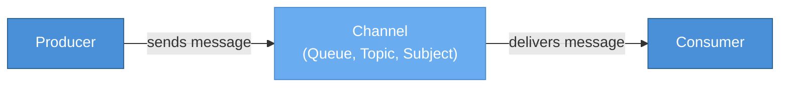
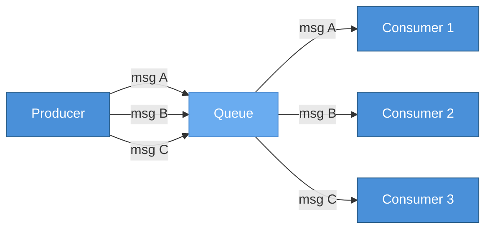
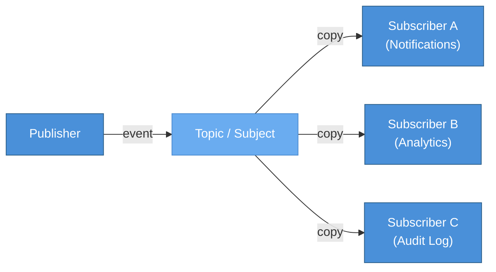
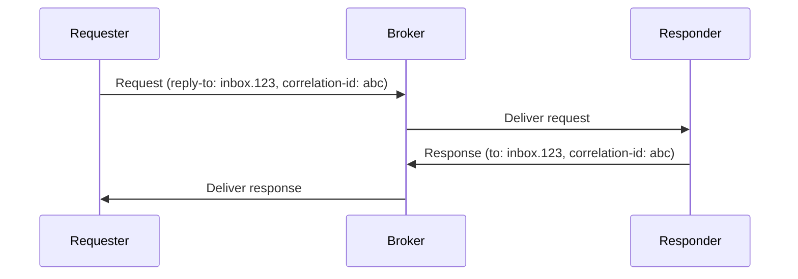
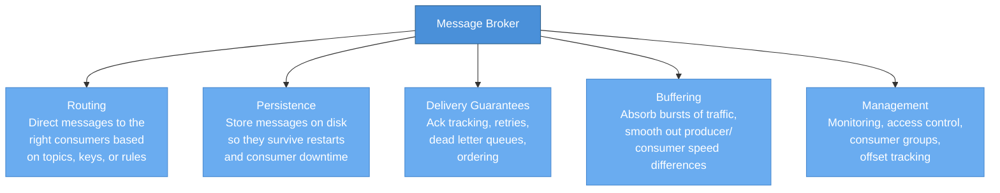
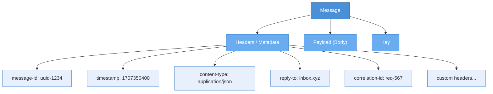
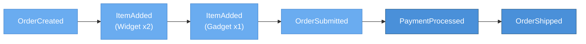

# Messaging Fundamentals

> **TL;DR** — Messaging is how distributed components talk without being directly connected. There are three core paradigms: **point-to-point** (one producer, one consumer, work distribution), **publish-subscribe** (one-to-many fan-out), and **request-reply** (synchronous semantics over async transport). A **message broker** sits in the middle to handle routing, persistence, and delivery guarantees — though brokerless approaches exist for ultra-low-latency needs. Every message has headers, a payload, and metadata. **Event-driven architecture** builds on messaging by distinguishing events, commands, and queries, and by introducing patterns like event notification, event-carried state transfer, and event sourcing.

---

## Table of Contents

- [Why This Matters](#why-this-matters)
- [What Is Messaging?](#what-is-messaging)
- [Messaging Paradigms](#messaging-paradigms)
  - [Point-to-Point (Queue-Based)](#point-to-point-queue-based)
  - [Publish-Subscribe](#publish-subscribe)
  - [Request-Reply](#request-reply)
  - [Paradigm Comparison](#paradigm-comparison)
- [Message Brokers vs Brokerless](#message-brokers-vs-brokerless)
  - [What Brokers Do](#what-brokers-do)
  - [Popular Brokers at a Glance](#popular-brokers-at-a-glance)
  - [Brokerless Approaches](#brokerless-approaches)
  - [When to Choose Which](#when-to-choose-which)
- [Anatomy of a Message](#anatomy-of-a-message)
- [Event-Driven Architecture](#event-driven-architecture)
  - [Events vs Commands vs Queries](#events-vs-commands-vs-queries)
  - [Event Patterns](#event-patterns)
  - [Benefits of Event-Driven Architecture](#benefits-of-event-driven-architecture)
  - [Challenges of Event-Driven Architecture](#challenges-of-event-driven-architecture)
- [Key Takeaways](#key-takeaways)
- [References](#references)

---

## Why This Matters

Every modern distributed system — from a two-service backend to a planet-scale streaming platform — relies on messaging in some form. HTTP request/response is technically messaging. gRPC is messaging. Kafka topics, RabbitMQ queues, NATS subjects: all messaging.

The problem is that **messaging is easy to use and hard to use correctly**. It is trivially simple to publish a message to a topic. It is extraordinarily difficult to guarantee that message gets processed exactly once, in order, without losing data, without blocking your entire pipeline, and without your on-call engineer getting paged at 3 AM.

Understanding the foundations — the paradigms, the trade-offs, the architecture patterns — gives you the vocabulary and mental models to make good decisions *before* you pick a technology. These concepts are portable across every messaging system you will ever encounter.

---

## What Is Messaging?

At its core, messaging is **the act of sending structured data from one software component to another through an intermediary channel**, rather than through a direct function call or network request.

In a monolithic application, components communicate by calling each other's methods directly. This is fast, simple, and gives you compile-time safety — but it also creates **tight coupling**. Component A must know where Component B lives, how to call it, and it must wait for B to respond.

Messaging introduces an abstraction layer — a **channel** — that decouples the sender (producer) from the receiver (consumer):



This indirection buys you several critical properties:

| Property | What It Means |
|----------|---------------|
| **Temporal decoupling** | The producer and consumer do not need to be running at the same time. The producer can fire a message and move on; the consumer can process it seconds, minutes, or hours later. |
| **Spatial decoupling** | The producer does not need to know the consumer's network address, instance count, or even what language it is written in. |
| **Logical decoupling** | The producer does not need to know *who* consumes the message or *how many* consumers there are. New consumers can be added without changing the producer. |

These properties are what make messaging the foundation of **microservice architectures**, **data pipelines**, **event-driven systems**, and **CQRS/event sourcing** patterns.

---

## Messaging Paradigms

There are three fundamental paradigms for how messages flow from producers to consumers. Every messaging system implements some combination of these three.

### Point-to-Point (Queue-Based)

In the point-to-point model, a message is sent to a **queue** and consumed by **exactly one consumer**. If multiple consumers are listening on the same queue, the broker distributes messages across them — this is the basis for **competing consumers** (also called **work queues** or **load balancing**).



**Key characteristics:**

- Each message is delivered to **one and only one** consumer.
- Consumers **compete** for messages — this is how you scale processing horizontally.
- Messages are typically **removed** from the queue after successful consumption (or after acknowledgment).
- If a consumer fails to process a message, the broker can **re-deliver** it to another consumer.

**When to use it:**

- Task distribution (e.g., processing image uploads, sending emails, running background jobs).
- Any workload where you want **parallel processing** with **no duplicate work**.

**Real-world examples:**

- RabbitMQ queues with multiple consumers.
- Amazon SQS.
- Kafka consumer groups (each partition is consumed by one consumer in the group — effectively point-to-point within a group).
- NATS queue groups.

---

### Publish-Subscribe

In the publish-subscribe (pub-sub) model, a message is published to a **topic** (or **subject**, or **channel**, depending on the system) and delivered to **all subscribers**. This is **fan-out**: one message, many recipients.



**Key characteristics:**

- Each subscriber gets its **own copy** of every message.
- Subscribers are **independent** — one subscriber being slow or down does not affect others.
- The publisher does not know (or care) how many subscribers exist.
- New subscribers can be added at any time without changing the publisher.

**When to use it:**

- Event broadcasting (e.g., "order placed" event consumed by inventory, billing, notifications, and analytics).
- Real-time data distribution (e.g., stock price feeds, sensor data).
- Any workload where **multiple systems need to react** to the same event.

**Real-world examples:**

- Kafka topics (each consumer group gets all messages independently).
- NATS core pub-sub.
- RabbitMQ fanout exchanges.
- Redis Pub/Sub.
- Google Cloud Pub/Sub.

---

### Request-Reply

Request-reply overlays **synchronous-style interactions** on top of an asynchronous messaging transport. The requester sends a message and **waits** for a correlated response on a reply channel.



**Key characteristics:**

- Requires a **reply-to address** (a temporary or dedicated queue/subject for responses).
- Requires a **correlation ID** to match responses to requests (since the reply channel might carry responses for multiple outstanding requests).
- Introduces **coupling in time** (the requester must wait), but retains spatial and logical decoupling.
- Often used with a **timeout** — if the response does not arrive within N milliseconds, the requester gives up.

**When to use it:**

- Service-to-service calls where you need the result before proceeding (e.g., "get user profile", "validate payment").
- Gradual migration from HTTP-based service calls to messaging-based communication.
- NATS is particularly well-suited for this pattern with its built-in request-reply support.

---

### Paradigm Comparison

| Characteristic | Point-to-Point | Publish-Subscribe | Request-Reply |
|----------------|:--------------:|:-----------------:|:-------------:|
| **Message delivery** | One consumer | All subscribers | One responder |
| **Primary use case** | Work distribution | Event broadcasting | Synchronous queries |
| **Coupling** | Low | Very low | Moderate (temporal) |
| **Scalability** | Add consumers | Add subscribers | Add responders (with load balancing) |
| **Message lifetime** | Until consumed | Until delivered (or TTL) | Until response (or timeout) |
| **Ordering** | Usually preserved | Per-subscriber | N/A (single request/response) |

---

## Message Brokers vs Brokerless

### What Brokers Do

A **message broker** is the intermediary infrastructure that receives, stores, routes, and delivers messages. Think of it as a highly specialized database optimized for message throughput rather than query flexibility.

Brokers provide these core services:



### Popular Brokers at a Glance

| Broker | Model | Persistence | Best For |
|--------|-------|-------------|----------|
| **Apache Kafka** | Distributed log | Yes (append-only log) | High-throughput event streaming, data pipelines, event sourcing |
| **RabbitMQ** | Traditional message broker | Yes (optional) | Task queues, complex routing, RPC patterns |
| **NATS** | Lightweight messaging | JetStream (optional) | Microservice communication, request-reply, edge/IoT |
| **Amazon SQS/SNS** | Managed cloud queues/topics | Yes (managed) | AWS-native workloads, serverless architectures |
| **Apache Pulsar** | Distributed log + queue | Yes (tiered storage) | Multi-tenancy, unified streaming and queuing |
| **Redis Streams** | In-memory log | Yes (with AOF/RDB) | Low-latency streams, lightweight event processing |

### Brokerless Approaches

Not every messaging pattern needs a broker. **Brokerless** (or **peer-to-peer**) messaging libraries embed the messaging logic directly into the application:

- **ZeroMQ** — A library (not a server) that provides socket-like abstractions for messaging patterns (pub-sub, push-pull, request-reply). No broker process, no persistence, no delivery guarantees — but sub-microsecond latency.
- **nanomsg / nng** — Spiritual successor to ZeroMQ with a simpler API.
- **Direct gRPC streaming** — Bidirectional streams between services, no intermediary.

### When to Choose Which

| Consideration | Brokered | Brokerless |
|---------------|----------|------------|
| **Durability** | Messages survive crashes | Messages lost if receiver is down |
| **Decoupling** | Full (temporal + spatial) | Spatial only (both must be running) |
| **Latency** | Higher (network hop to broker) | Lower (direct connection) |
| **Operational overhead** | Broker cluster to manage | No infrastructure, but more app-level complexity |
| **Delivery guarantees** | Built-in (acks, retries, DLQ) | Application must implement |
| **Scalability** | Broker handles fan-out | Application must handle discovery |

**Rule of thumb:** If you need persistence, delivery guarantees, or decoupling in time, use a broker. If you need raw speed and can tolerate message loss, brokerless is a valid option.

---

## Anatomy of a Message

Regardless of the messaging system, every message shares a common structure. Understanding these components helps you design message schemas that are robust, debuggable, and forward-compatible.



| Component | Purpose | Examples |
|-----------|---------|----------|
| **Message ID** | Unique identifier for deduplication and tracing. | UUID, ULID, snowflake ID |
| **Timestamp** | When the message was produced. Critical for ordering, debugging, and TTL. | Unix epoch (ms), ISO 8601 |
| **Key** | Used for **partitioning** (Kafka) or **subject routing** (NATS). Messages with the same key go to the same partition, preserving order. | `user-123`, `order-456` |
| **Headers** | Arbitrary key-value metadata. Used for routing, tracing, content negotiation. | `content-type`, `trace-id`, `source-service` |
| **Payload (Body)** | The actual data. Can be JSON, Protobuf, Avro, MessagePack, plain text, or raw bytes. | `{"event": "order.placed", "orderId": "789"}` |
| **Reply-to** | Address where the response should be sent (for request-reply patterns). | `inbox.abc123` |
| **Correlation ID** | Links a response back to its originating request. | Same as the request's message ID |

**Design tips:**

- Always include a **message ID** and **timestamp** — they cost almost nothing and save you countless hours of debugging.
- Use a **schema registry** (e.g., Confluent Schema Registry with Avro/Protobuf) for payload serialization in production systems. This prevents producers and consumers from drifting out of sync.
- Keep payloads **as small as practical**. If you need to transfer large blobs, store them in object storage and pass a reference (URL or key) in the message.
- Version your message schemas from day one. Adding a `"schema_version": 1` field is trivially easy now and painful to retrofit later.

---

## Event-Driven Architecture

Event-driven architecture (EDA) is an **architectural style** that uses messaging as its backbone. It goes beyond "send a message from A to B" and introduces a disciplined approach to how systems communicate, react, and evolve.

### Events vs Commands vs Queries

These three message types look similar on the wire, but they carry fundamentally different **semantics** and **coupling** implications:

| Type | Intent | Direction | Naming Convention | Coupling | Example |
|------|--------|-----------|-------------------|----------|---------|
| **Event** | "Something happened" | Broadcast (pub-sub) | Past tense: `OrderPlaced`, `UserRegistered` | Very low — producer does not know or care who listens | `{ "event": "OrderPlaced", "orderId": "123" }` |
| **Command** | "Do something" | Targeted (point-to-point) | Imperative: `PlaceOrder`, `SendEmail` | Moderate — sender knows a specific handler exists | `{ "command": "SendEmail", "to": "user@example.com" }` |
| **Query** | "Tell me something" | Request-reply | Question form: `GetUserProfile`, `ListOrders` | Higher — sender expects a specific response format | `{ "query": "GetUserProfile", "userId": "456" }` |

**The critical distinction:** Events are **facts about the past**. They cannot be rejected — they already happened. Commands are **requests for the future**. They can be rejected, retried, or fail. This distinction shapes how you design error handling, retries, and compensation logic.

### Event Patterns

There are three progressively richer patterns for using events:

#### 1. Event Notification

The simplest pattern. The event says **"something happened"** but carries **minimal data** — just enough for subscribers to decide if they care.

```
{ "event": "OrderPlaced", "orderId": "789", "timestamp": "2025-01-15T10:30:00Z" }
```

Subscribers that need more details must **call back** to the originating service (e.g., `GET /orders/789`). This keeps events small but introduces **runtime coupling** — the originating service must be available.

#### 2. Event-Carried State Transfer

The event carries **all the data** a subscriber might need, eliminating the need for callbacks:

```json
{
  "event": "OrderPlaced",
  "orderId": "789",
  "customer": { "id": "456", "name": "Alice", "email": "alice@example.com" },
  "items": [{ "sku": "WIDGET-1", "qty": 2, "price": 19.99 }],
  "total": 39.98,
  "timestamp": "2025-01-15T10:30:00Z"
}
```

**Pros:** Subscribers are fully decoupled — they can build their own local read models without ever calling the producer. **Cons:** Larger messages, potential for data duplication across services, and the producer must anticipate what data subscribers need.

#### 3. Event Sourcing

The most powerful (and most complex) pattern. Instead of storing the **current state** of an entity, you store the **complete sequence of events** that led to that state:



To get the current state, you **replay** all events from the beginning (or from a snapshot). This gives you a complete audit trail, the ability to rebuild state at any point in time, and the ability to add new projections by replaying history.

**Trade-off:** Event sourcing introduces significant complexity in schema evolution, snapshotting, and rebuilding projections. It is not a default choice — it is a deliberate trade-off for systems where auditability, temporal queries, or multi-model projections are critical requirements.

### Benefits of Event-Driven Architecture

- **Loose coupling** — Services communicate through events without direct dependencies. Teams can develop, deploy, and scale services independently.
- **Scalability** — Event consumers can be scaled horizontally. Adding more instances of a consumer does not require changes to the producer.
- **Resilience** — If a consumer goes down, events are buffered by the broker. The consumer catches up when it recovers. No data is lost (assuming durable messaging).
- **Extensibility** — New functionality can be added by subscribing to existing events. The "order placed" event that originally only triggered email notifications can now also trigger analytics, fraud detection, and inventory updates — without touching the order service.
- **Auditability** — Events naturally form an audit log. You can reconstruct exactly what happened and when.

### Challenges of Event-Driven Architecture

- **Eventual consistency** — Since events are processed asynchronously, the system is not immediately consistent after a write. A user who places an order might see "order pending" for a few seconds before the order confirmation appears. This requires careful UX design and clear communication with stakeholders.
- **Debugging complexity** — Tracing a request across multiple services that communicate through events is harder than following a synchronous call chain. Distributed tracing (OpenTelemetry, Jaeger, Zipkin) becomes essential.
- **Ordering** — Events may arrive out of order, especially across partitions or services. Your consumers must either enforce ordering or be designed to handle out-of-order events.
- **Schema evolution** — Events are a contract. Changing the structure of an event requires careful versioning to avoid breaking existing consumers. This is the distributed systems equivalent of a breaking API change.
- **Error handling** — When a consumer fails to process an event, you need a strategy: retry? dead-letter queue? manual intervention? Compensation events? Each approach has trade-offs.
- **Observability** — You need visibility into event flow: what is the lag? Are consumers keeping up? Are messages accumulating in dead-letter queues? This requires purpose-built monitoring.

---

## Key Takeaways

- **Messaging decouples** producers from consumers in time, space, and logic — this is its fundamental value proposition.
- The three paradigms — **point-to-point, pub-sub, and request-reply** — are the building blocks of all messaging patterns. Most real systems combine multiple paradigms.
- **Brokers** add routing, persistence, delivery guarantees, and buffering at the cost of operational complexity and latency. Choose brokerless only when you have a specific latency requirement and can tolerate message loss.
- Every message has **headers, a key, and a payload**. Design your message schemas with deduplication, tracing, and schema evolution in mind from day one.
- **Events, commands, and queries** have different semantics and coupling implications. Events are facts about the past; commands are requests for the future.
- Event-driven architecture offers **loose coupling, scalability, and resilience** but introduces **eventual consistency, debugging complexity, and ordering challenges**. It is a trade-off, not a silver bullet.
- **Start simple.** You do not need event sourcing, CQRS, and a schema registry on day one. Start with straightforward pub-sub or queue patterns and introduce complexity only when the requirements demand it.

---

## References

- [Enterprise Integration Patterns](https://www.enterpriseintegrationpatterns.com/) — Hohpe & Woolf. The definitive reference for messaging patterns. Covers channels, routers, transformers, and endpoints in exhaustive detail.
- [Designing Data-Intensive Applications](https://dataintensive.net/) — Martin Kleppmann, Chapters 11-12. Covers stream processing, event sourcing, and exactly-once semantics with rigorous correctness analysis.
- [Martin Fowler: What do you mean by "Event-Driven"?](https://martinfowler.com/articles/201701-event-driven.html) — Distinguishes event notification, event-carried state transfer, event sourcing, and CQRS.
- [Apache Kafka Documentation](https://kafka.apache.org/documentation/) — The official Kafka docs cover producer/consumer semantics, partitioning, and exactly-once processing.
- [RabbitMQ Tutorials](https://www.rabbitmq.com/getstarted.html) — Step-by-step tutorials covering queues, pub-sub, routing, and RPC patterns.
- [NATS Documentation](https://docs.nats.io/) — Covers core NATS pub-sub, request-reply, queue groups, and JetStream for persistence.
- [ZeroMQ Guide](https://zguide.zeromq.org/) — The "zguide" is both a technical reference and an opinionated guide to distributed system design.
- [CloudEvents Specification](https://cloudevents.io/) — A CNCF specification for describing events in a common format across systems.
- [Greg Young: CQRS and Event Sourcing](https://cqrs.files.wordpress.com/2010/11/cqrs_documents.pdf) — The foundational document on CQRS and event sourcing patterns.
- [Ben Stopford: Designing Event-Driven Systems (O'Reilly)](https://www.confluent.io/designing-event-driven-systems/) — Free ebook from Confluent covering event-driven design with Kafka.

---

*Next: [Delivery Semantics](./delivery-semantics.md)*
