# Apache Kafka

Apache Kafka is the most widely adopted distributed event streaming platform in the industry. Originally developed at LinkedIn to handle trillions of messages per day, Kafka has become the backbone of modern data infrastructure at companies like Netflix, Uber, Airbnb, and thousands of others. Understanding Kafka is not optional for engineers building event-driven architectures, real-time data pipelines, or microservices at scale.

This section takes you from Kafka's high-level architecture down to its internal storage engine, replication protocol, and production best practices. Whether you are evaluating Kafka for the first time or tuning a cluster that handles millions of events per second, these pages will give you the depth you need.

---

## Concept Map

```mermaid
graph TD
    A["Apache Kafka"]
    A --> B["Brokers & Clusters"]
    A --> C["Topics & Partitions"]
    A --> D["Producers"]
    A --> E["Consumers & Groups"]
    A --> F["Replication"]
    A --> G["Kafka Streams"]
    A --> H["Kafka Connect"]

    B --> B1["Controller Broker"]
    B --> B2["KRaft / ZooKeeper"]

    C --> C1["Partition Keys"]
    C --> C2["Ordering Guarantees"]

    D --> D1["Batching & Compression"]
    D --> D2["Acks Configuration"]
    D --> D3["Idempotent & Transactional"]

    E --> E1["Consumer Group Protocol"]
    E --> E2["Offset Management"]
    E --> E3["Rebalancing"]

    F --> F1["Leader / Follower"]
    F --> F2["ISR (In-Sync Replicas)"]
    F --> F3["High Watermark"]

    G --> G1["KStream & KTable"]
    G --> G2["Stateful Processing"]
    G --> G3["Exactly-Once Semantics"]

    H --> H1["Source Connectors"]
    H --> H2["Sink Connectors"]
    H --> H3["Schema Registry"]

    style A fill:#e06c75,stroke:#a84e55,color:#fff
    style B fill:#e89a9f,stroke:#c87a7f,color:#fff
    style C fill:#e89a9f,stroke:#c87a7f,color:#fff
    style D fill:#e89a9f,stroke:#c87a7f,color:#fff
    style E fill:#e89a9f,stroke:#c87a7f,color:#fff
    style F fill:#e89a9f,stroke:#c87a7f,color:#fff
    style G fill:#e89a9f,stroke:#c87a7f,color:#fff
    style H fill:#e89a9f,stroke:#c87a7f,color:#fff
    style B1 fill:#e89a9f,stroke:#c87a7f,color:#fff
    style B2 fill:#e89a9f,stroke:#c87a7f,color:#fff
    style C1 fill:#e89a9f,stroke:#c87a7f,color:#fff
    style C2 fill:#e89a9f,stroke:#c87a7f,color:#fff
    style D1 fill:#e89a9f,stroke:#c87a7f,color:#fff
    style D2 fill:#e89a9f,stroke:#c87a7f,color:#fff
    style D3 fill:#e89a9f,stroke:#c87a7f,color:#fff
    style E1 fill:#e89a9f,stroke:#c87a7f,color:#fff
    style E2 fill:#e89a9f,stroke:#c87a7f,color:#fff
    style E3 fill:#e89a9f,stroke:#c87a7f,color:#fff
    style F1 fill:#e89a9f,stroke:#c87a7f,color:#fff
    style F2 fill:#e89a9f,stroke:#c87a7f,color:#fff
    style F3 fill:#e89a9f,stroke:#c87a7f,color:#fff
    style G1 fill:#e89a9f,stroke:#c87a7f,color:#fff
    style G2 fill:#e89a9f,stroke:#c87a7f,color:#fff
    style G3 fill:#e89a9f,stroke:#c87a7f,color:#fff
    style H1 fill:#e89a9f,stroke:#c87a7f,color:#fff
    style H2 fill:#e89a9f,stroke:#c87a7f,color:#fff
    style H3 fill:#e89a9f,stroke:#c87a7f,color:#fff
```

---

## Pages in This Section

| # | Page | What You Will Learn |
|---|------|---------------------|
| 1 | [Kafka Architecture](./kafka-architecture.md) | Core building blocks — topics, partitions, brokers, producers, consumers, replication, and the ZooKeeper-to-KRaft migration. Everything you need to reason about a Kafka cluster. |
| 2 | [Kafka Internals](./kafka-internals.md) | How Kafka actually works under the hood — the commit log, storage engine, replication protocol, idempotent and transactional producers, consumer coordination, and the performance tricks that make Kafka fast. |
| 3 | [Kafka in Practice](./kafka-in-practice.md) | Production-grade guidance — producer and consumer best practices, Kafka Streams, Kafka Connect, Schema Registry, operational monitoring, and when (and when not) to use Kafka. |

---

## Suggested Reading Order

1. **Start with Architecture** if you are new to Kafka or need a refresher on the core concepts and how they fit together.
2. **Move to Internals** once you understand the architecture — this is where you learn *why* Kafka behaves the way it does, which is essential for debugging and performance tuning.
3. **Finish with Practice** to translate your understanding into real-world decisions about configuration, tooling, and operational patterns.

If you are already comfortable with Kafka basics and are here for production guidance, feel free to jump directly to [Kafka in Practice](./kafka-in-practice.md) and refer back to the other pages as needed.
