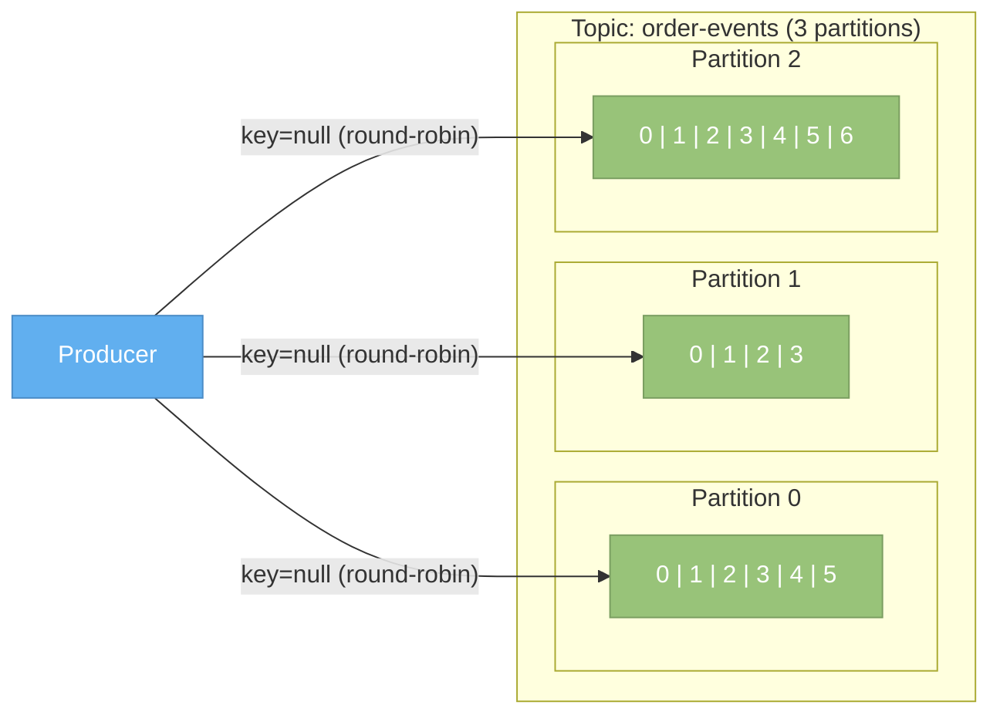
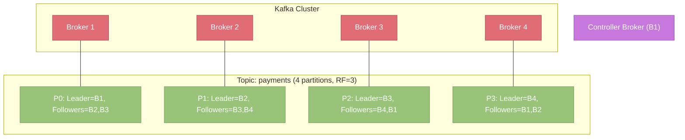
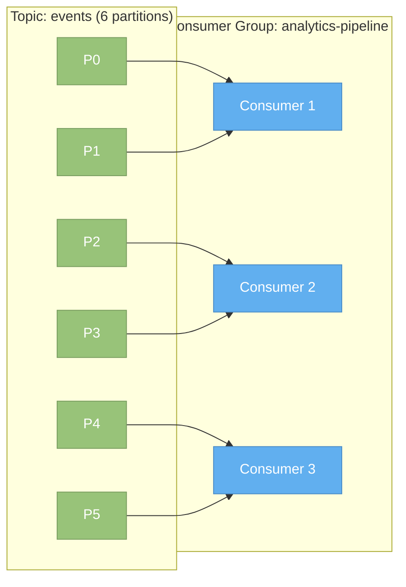
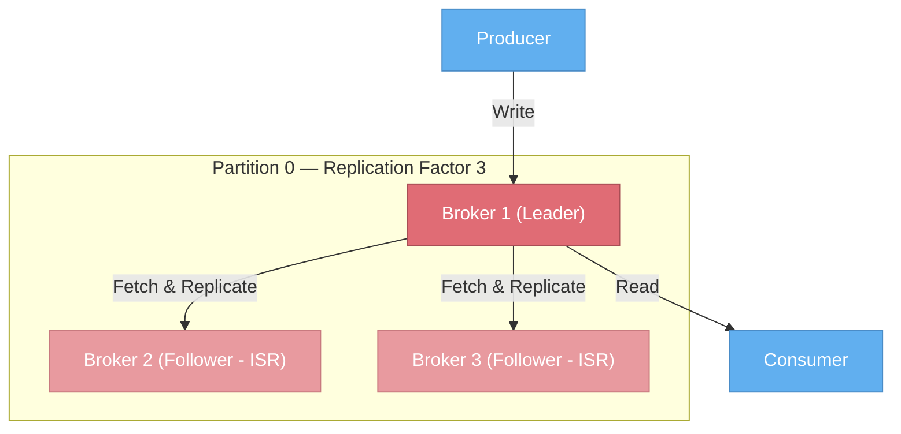
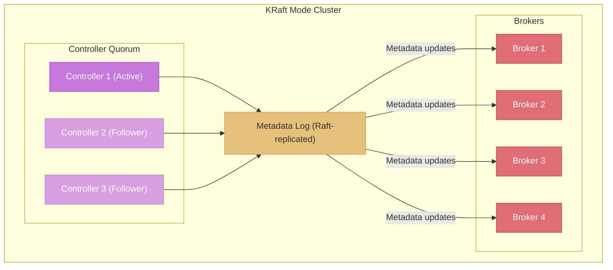

# Kafka Architecture

> **TL;DR:** Apache Kafka is a distributed, partitioned, replicated commit log that functions as a high-throughput event streaming platform. Data is organized into **topics** split across **partitions**, served by a **cluster of brokers**, and durably stored through **replication**. Producers write events, consumers read them via **consumer groups** that automatically balance partition assignments. Kafka is migrating its metadata management from ZooKeeper to the new KRaft consensus protocol, simplifying operations and removing a major external dependency.

---

## Table of Contents

- [Why This Matters](#why-this-matters)
- [What Is Kafka?](#what-is-kafka)
- [Core Concepts](#core-concepts)
  - [Topics and Partitions](#topics-and-partitions)
  - [Brokers and Clusters](#brokers-and-clusters)
  - [Producers](#producers)
  - [Consumers and Consumer Groups](#consumers-and-consumer-groups)
  - [Replication](#replication)
- [ZooKeeper to KRaft Migration](#zookeeper-to-kraft-migration)
- [Kafka's Guarantees](#kafkas-guarantees)
- [Key Takeaways](#key-takeaways)
- [References](#references)

---

## Why This Matters

Every major streaming architecture decision you will make — how many partitions to create, what replication factor to set, how to configure your consumers, whether to enable exactly-once semantics — flows directly from understanding Kafka's architecture. Misconfigure any of these and you get data loss, duplicate processing, consumer lag spiraling out of control, or a cluster that cannot scale. This page gives you the mental model you need to make those decisions correctly.

---

## What Is Kafka?

Apache Kafka is a **distributed event streaming platform** capable of handling trillions of events per day. It was originally developed at LinkedIn in 2010 by Jay Kreps, Neha Narkhede, and Jun Rao to solve the problem of reliably moving massive volumes of data between systems. LinkedIn needed a unified platform that could ingest user activity events, application metrics, and database change streams — all at scale, with low latency, and with durability guarantees that traditional message brokers could not provide.

Kafka was open-sourced in 2011 and became a top-level Apache project in 2012. Today it serves as the central nervous system for event-driven architectures at organizations ranging from startups to the largest technology companies in the world.

What makes Kafka different from traditional message brokers like RabbitMQ or ActiveMQ:

| Characteristic | Traditional Brokers | Apache Kafka |
|----------------|---------------------|-------------|
| Storage model | Messages deleted after consumption | Durable commit log with configurable retention |
| Consumption model | Push-based, message removed from queue | Pull-based, consumers track their own position |
| Throughput | Thousands to tens of thousands msg/s | Millions of msg/s per cluster |
| Ordering | Per-queue ordering | Per-partition ordering |
| Replay | Not possible (message is gone) | Consumers can seek to any offset |
| Scaling model | Vertical or federated queues | Horizontal via partitions |

Kafka is not a message queue — it is a **distributed commit log** that happens to be an excellent foundation for messaging, stream processing, event sourcing, and data integration.

---

## Core Concepts

### Topics and Partitions

A **topic** is a named, logical channel to which producers write events and from which consumers read events. Think of it as a category or feed name — `user-signups`, `order-events`, `click-stream`.

Every topic is divided into one or more **partitions**. A partition is an ordered, immutable sequence of records, each assigned a sequential ID called an **offset**. Partitions are the fundamental unit of parallelism and ordering in Kafka.

**Why partitions matter:**

- **Parallelism.** Each partition can be consumed by a different consumer in a consumer group, so more partitions means more consumers can read in parallel. A topic with 12 partitions can have up to 12 consumers in a single consumer group processing concurrently.
- **Ordering.** Kafka guarantees ordering **within a partition**, not across partitions. If you need all events for a given entity (say, all orders for customer ID 42) to be processed in order, you must ensure they land in the same partition.
- **Scalability.** Partitions are distributed across brokers. Adding more partitions (and brokers) increases the cluster's total throughput linearly.

**Partition keys** control which partition a record lands in. When a producer sends a record with a key, Kafka hashes the key and maps it to a partition: `partition = hash(key) % num_partitions`. Records with the same key always go to the same partition, guaranteeing ordering for that key. When no key is provided, Kafka uses a round-robin or sticky partitioner to distribute records evenly.

> **Important:** Changing the number of partitions for a topic changes the key-to-partition mapping. Records with the same key may start going to a different partition. This is why partition count should be chosen carefully upfront and is difficult to change later for keyed topics.

---

### Brokers and Clusters

A **broker** is a single Kafka server process. It receives records from producers, stores them on disk, and serves them to consumers. A Kafka **cluster** is a group of brokers working together.

Key aspects of brokers and clusters:

- **Partition leadership.** Every partition has exactly one broker that serves as its **leader**. All produce and consume requests for that partition go through the leader. Other brokers that hold copies of the partition are **followers** (see [Replication](#replication)).
- **Load distribution.** Kafka distributes partition leaders across brokers so that no single broker handles all the traffic. The goal is balanced leadership across the cluster.
- **Controller broker.** One broker in the cluster is elected as the **controller**. The controller is responsible for administrative operations: assigning partitions to brokers, monitoring broker health, and triggering leader elections when a broker fails. In the ZooKeeper era, the controller was elected via ZooKeeper. In KRaft mode, the controller is part of a Raft-based quorum (see [ZooKeeper to KRaft Migration](#zookeeper-to-kraft-migration)).
- **Broker discovery.** Clients connect to any broker (the "bootstrap server") and receive metadata about the full cluster — which brokers exist, which partitions they lead, and how to reach them. Clients then communicate directly with the appropriate broker for each partition.

---

### Producers

A producer is any application that publishes records to Kafka topics. The producer client handles partitioning, serialization, batching, compression, and delivery acknowledgment.

**Partitioning strategies:**

| Strategy | How It Works | When to Use |
|----------|-------------|-------------|
| **Key-based** (default with key) | `hash(key) % num_partitions` | When you need ordering per entity (e.g., all events for an order ID) |
| **Round-robin** | Rotate across partitions | When ordering does not matter and you want even distribution |
| **Sticky partitioner** | Stick to one partition per batch, then rotate | Default in modern Kafka when key is null — reduces request overhead |
| **Custom partitioner** | Implement `Partitioner` interface | When you need specialized routing logic (e.g., geographic sharding) |

**Batching and compression:**

Producers do not send each record individually. Instead, they accumulate records into **batches** grouped by target partition. Two configuration parameters control batching:

- `batch.size` — Maximum batch size in bytes (default: 16 KB). Once the batch reaches this size, it is sent immediately.
- `linger.ms` — How long to wait for more records before sending an incomplete batch (default: 0 ms). Increasing this adds small latency but significantly improves throughput.

Batches can be compressed using `compression.type` (none, gzip, snappy, lz4, zstd). Compression happens at the batch level, so larger batches compress better. In production, `lz4` or `zstd` are the most common choices, offering a good balance of CPU cost and compression ratio.

**Acknowledgment configuration (`acks`):**

The `acks` setting controls how many brokers must acknowledge a write before the producer considers it successful. This is one of the most important configuration decisions you will make:

```mermaid
graph TD
    subgraph "acks=0 (Fire and Forget)"
        P0["Producer"] -->|"Send"| L0["Leader"]
        L0 -.->|"No ack sent"| P0
    end

    subgraph "acks=1 (Leader Only)"
        P1["Producer"] -->|"Send"| L1["Leader"]
        L1 -->|"Ack after local write"| P1
        L1 -.->|"Replicate async"| F1["Followers"]
    end

    subgraph "acks=all (Full ISR)"
        P2["Producer"] -->|"Send"| L2["Leader"]
        L2 -->|"Replicate"| F2["Followers"]
        F2 -->|"Ack to leader"| L2
        L2 -->|"Ack after ISR write"| P2
    end

    style P0 fill:#61afef,stroke:#4a8cc7,color:#fff
    style P1 fill:#61afef,stroke:#4a8cc7,color:#fff
    style P2 fill:#61afef,stroke:#4a8cc7,color:#fff
    style L0 fill:#e06c75,stroke:#a84e55,color:#fff
    style L1 fill:#e06c75,stroke:#a84e55,color:#fff
    style L2 fill:#e06c75,stroke:#a84e55,color:#fff
    style F1 fill:#e89a9f,stroke:#c87a7f,color:#fff
    style F2 fill:#e89a9f,stroke:#c87a7f,color:#fff
```

| Setting | Durability | Throughput | Latency | Risk |
|---------|-----------|-----------|---------|------|
| `acks=0` | None — producer does not wait for any acknowledgment | Highest | Lowest | Data loss if leader fails before writing |
| `acks=1` | Leader only — record is written to the leader's local log | High | Low | Data loss if leader fails before followers replicate |
| `acks=all` (`acks=-1`) | All in-sync replicas must acknowledge | Lower (but still very high) | Higher | No data loss as long as ISR has quorum. This is the recommended setting for critical data. |

> **Best practice:** Use `acks=all` with `min.insync.replicas=2` and a replication factor of 3. This ensures that writes are acknowledged only when at least two replicas (including the leader) have the data, protecting against single-broker failure.

---

### Consumers and Consumer Groups

A **consumer** is any application that reads records from Kafka topics. Consumers pull data from brokers by specifying a topic, partition, and offset.

A **consumer group** is a set of consumers that cooperate to consume a topic. Kafka assigns each partition to exactly one consumer within the group, enabling parallel processing:

Key rules:

- Each partition is assigned to **exactly one consumer** within a group.
- If there are more consumers than partitions, the extra consumers sit idle.
- If a consumer fails, its partitions are reassigned to the remaining consumers (**rebalancing**).
- Multiple consumer groups can independently consume the same topic (each group maintains its own offsets).

**Partition assignment strategies:**

| Strategy | Behavior | Trade-offs |
|----------|----------|------------|
| **Range** | Assigns consecutive partitions of each topic to each consumer | Can lead to uneven distribution when topic count is not a multiple of consumer count |
| **Round-robin** | Distributes partitions one at a time across consumers | More even than Range, but all partitions move during rebalance |
| **Sticky** | Like round-robin, but minimizes partition movement during rebalancing | Better for stateful consumers — reduces reprocessing after rebalance |
| **Cooperative-sticky** | Same as Sticky but uses **incremental cooperative rebalancing** — only the partitions that need to move are revoked | Avoids the "stop-the-world" rebalance where all consumers briefly stop processing. **This is the recommended strategy for new applications.** |

**Rebalancing** occurs when consumers join or leave the group, or when the topic's partition count changes. During an "eager" rebalance (Range, Round-robin), all consumers temporarily revoke their partitions and receive new assignments. During a "cooperative" rebalance, only the affected partitions are moved, and the remaining consumers continue processing without interruption.

**Offset management:**

Each consumer tracks its position in each partition using an **offset** — the sequence number of the next record to read. Offsets are committed to an internal Kafka topic called `__consumer_offsets`. Consumers can commit offsets automatically (at regular intervals) or manually (after processing). The choice between these strategies has significant implications for at-least-once versus at-most-once delivery semantics (covered in [Kafka in Practice](./kafka-in-practice.md)).

---

### Replication

Kafka achieves durability and fault tolerance through **replication**. Each partition is replicated across multiple brokers. One replica is the **leader** (handles all reads and writes), and the others are **followers** (passively replicate from the leader).

**In-Sync Replicas (ISR):**

The ISR set is the subset of replicas that are fully caught up with the leader. A follower is considered "in sync" if it has fetched all records up to the leader's log end offset within a configurable time window (`replica.lag.time.max.ms`, default 30 seconds). If a follower falls too far behind, it is removed from the ISR.

The ISR is critical because:

- **Writes with `acks=all`** only wait for ISR members to acknowledge. If a slow replica has fallen out of the ISR, it does not block writes.
- **Leader election** prefers ISR members to avoid data loss. If only ISR members can be elected leader, all committed records are guaranteed to be present on the new leader.

**Key configuration parameters:**

| Parameter | Default | Description |
|-----------|---------|-------------|
| `replication.factor` | 1 (topic-level) | Number of copies of each partition across the cluster |
| `min.insync.replicas` | 1 | Minimum number of ISR members required for a write to succeed when `acks=all` |
| `unclean.leader.election.enable` | false | Whether a non-ISR replica can be elected leader. Enabling this risks data loss but increases availability. |
| `replica.lag.time.max.ms` | 30000 | How long a follower can lag behind the leader before being removed from the ISR |

**The durability equation:**

- `replication.factor=3` + `min.insync.replicas=2` + `acks=all` = **survive any single broker failure without data loss**.
- If two of three replicas fail simultaneously, the producer will receive errors (there are not enough in-sync replicas to satisfy `min.insync.replicas=2`). This is the desired behavior — it is better to reject writes than to accept them onto a single replica that might also fail.

**Unclean leader election:**

When all ISR replicas for a partition are unavailable, Kafka has a choice: keep the partition offline (safe but unavailable) or elect an out-of-sync replica as leader (available but potentially losing some recently committed records). The `unclean.leader.election.enable` flag controls this trade-off. For most production systems, it should remain `false` — availability is less important than data consistency.

---

## ZooKeeper to KRaft Migration

### Why ZooKeeper Was Used

From its inception through Kafka 3.x, Kafka relied on **Apache ZooKeeper** for critical cluster metadata management:

- **Broker registration** — tracking which brokers are alive.
- **Topic and partition metadata** — which topics exist, their partition counts, and replica assignments.
- **Controller election** — choosing which broker serves as the cluster controller.
- **ACLs and configuration** — storing access control lists and dynamic configuration overrides.

### ZooKeeper's Limitations

While ZooKeeper served Kafka well for years, it introduced significant operational challenges:

1. **Operational complexity.** Running Kafka meant running two distributed systems (Kafka + ZooKeeper), each with its own deployment, monitoring, and failure modes.
2. **Scalability bottleneck.** ZooKeeper stores all metadata in memory. As clusters grew to hundreds of thousands of partitions, ZooKeeper became a bottleneck for metadata operations.
3. **Controller failover latency.** When the controller broker failed, the new controller had to reload all metadata from ZooKeeper, which could take minutes for very large clusters. During this time, no partition reassignment or leader election could occur.
4. **Split-brain risks.** Network partitions between Kafka and ZooKeeper could lead to inconsistent views of cluster state.

### KRaft Architecture

**KRaft (Kafka Raft)** replaces ZooKeeper with a built-in Raft-based consensus protocol. Metadata is now managed by a **quorum of controller nodes** within the Kafka cluster itself.

Key improvements with KRaft:

- **Single system to operate.** No external ZooKeeper dependency.
- **Faster controller failover.** New active controller already has metadata in memory via Raft replication — failover takes milliseconds, not minutes.
- **Better scalability.** The metadata log model supports millions of partitions per cluster.
- **Simpler mental model.** Metadata changes are events in a log (the very thing Kafka is good at) rather than ZNodes in a separate system.

### Migration Path

Kafka supports a **bridge release** mode where a cluster runs with both ZooKeeper and KRaft simultaneously, allowing a rolling migration:

1. Deploy Kafka brokers in KRaft mode alongside ZooKeeper-mode brokers.
2. Migrate metadata from ZooKeeper to the KRaft controller quorum.
3. Reconfigure brokers to use KRaft.
4. Decommission ZooKeeper.

As of Kafka 3.5+, KRaft is production-ready. ZooKeeper support is deprecated and scheduled for removal.

---

## Kafka's Guarantees

Understanding what Kafka does and does not guarantee is essential for building correct systems:

| Guarantee | Scope | Details |
|-----------|-------|---------|
| **Ordering** | Per-partition | Records within a single partition are strictly ordered by offset. No ordering guarantee exists across partitions. |
| **Durability** | Configurable | With `replication.factor=3`, `acks=all`, and `min.insync.replicas=2`, committed records survive any single broker failure. |
| **Delivery semantics** | At-least-once (default) | With default settings, consumers may process a record more than once after a failure (offset committed after processing). Exactly-once is achievable with idempotent producers + transactional semantics. |
| **Availability** | Partition-level | Each partition can tolerate `replication.factor - min.insync.replicas` broker failures while remaining writable. |
| **Retention** | Time or size based | Records are retained for a configurable duration (`retention.ms`) or until the log reaches a size limit (`retention.bytes`). Compacted topics retain the latest value per key indefinitely. |

**What Kafka does NOT guarantee:**

- **Cross-partition ordering.** If you need global ordering, you must use a single partition (which limits throughput).
- **Exactly-once by default.** You must explicitly enable idempotent producers and transactional semantics.
- **Bounded latency.** Kafka is optimized for throughput. While latencies are typically low (single-digit milliseconds), they are not bounded in the same way as a real-time system.

---

## Key Takeaways

1. **Kafka is a distributed commit log**, not a traditional message queue. Records are retained and consumers control their own position.
2. **Partitions are the unit of parallelism and ordering.** Choose your partition key carefully — it determines both ordering guarantees and load distribution.
3. **Replication provides durability.** The combination of `replication.factor`, `acks`, and `min.insync.replicas` determines your durability and availability trade-offs.
4. **Consumer groups enable parallel consumption** with automatic partition assignment and rebalancing. Use cooperative-sticky assignment for minimal disruption.
5. **KRaft replaces ZooKeeper**, simplifying operations and improving scalability. New clusters should use KRaft exclusively.
6. **Kafka provides at-least-once delivery by default.** Exactly-once requires additional configuration (idempotent + transactional producers).

---

## References

- [Apache Kafka Official Documentation](https://kafka.apache.org/documentation/) — The canonical reference for all Kafka concepts and configuration.
- [Kafka: The Definitive Guide (O'Reilly)](https://www.oreilly.com/library/view/kafka-the-definitive/9781492043072/) — Comprehensive book covering Kafka architecture and operations.
- [KIP-500: Replace ZooKeeper with a Self-Managed Metadata Quorum](https://cwiki.apache.org/confluence/display/KAFKA/KIP-500%3A+Replace+ZooKeeper+with+a+Self-Managed+Metadata+Quorum) — The KRaft proposal that removed the ZooKeeper dependency.
- [KIP-595: A Raft Protocol for the Metadata Quorum](https://cwiki.apache.org/confluence/display/KAFKA/KIP-595%3A+A+Raft+Protocol+for+the+Metadata+Quorum) — Technical design of the KRaft consensus protocol.
- [Kafka Design Documentation](https://kafka.apache.org/documentation/#design) — Deep dive into Kafka's storage, replication, and producer/consumer protocols.
- [Confluent Developer — Kafka Architecture](https://developer.confluent.io/courses/architecture/get-started/) — Free course covering Kafka architecture fundamentals.
- [Jay Kreps — The Log: What every software engineer should know about real-time data's unifying abstraction](https://engineering.linkedin.com/distributed-systems/log-what-every-software-engineer-should-know-about-real-time-datas-unifying) — Foundational blog post on the commit log abstraction that inspired Kafka.
