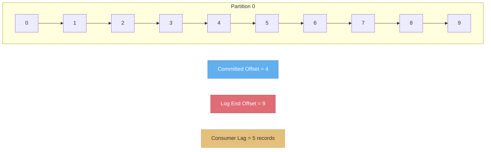
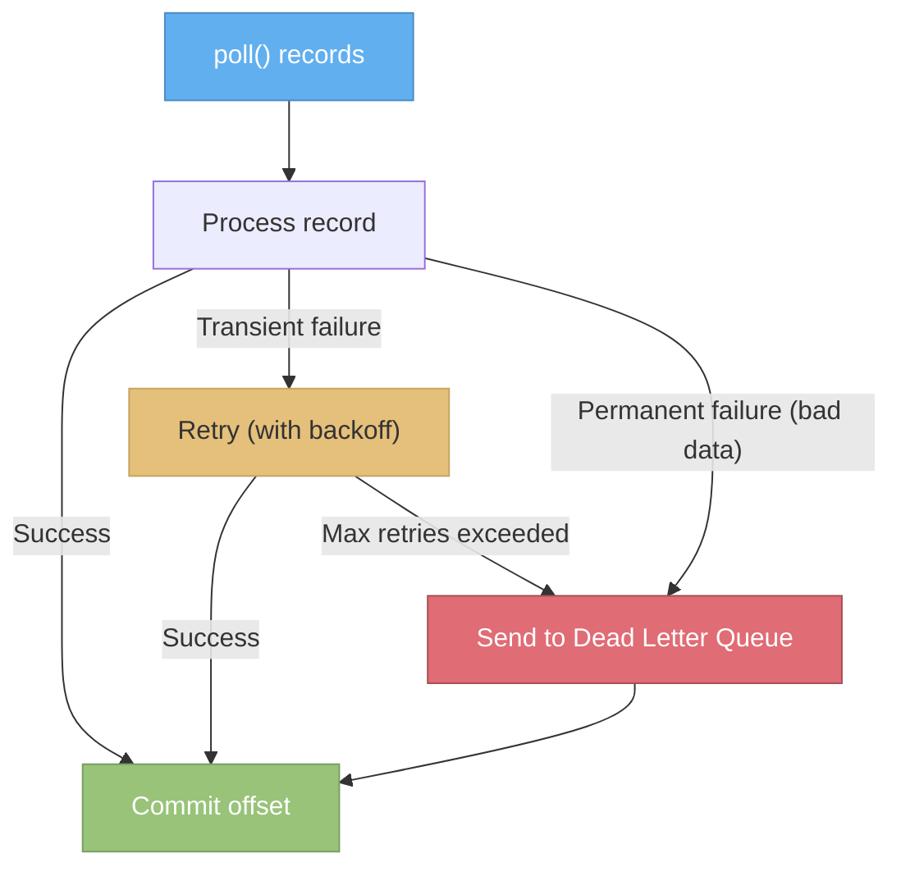
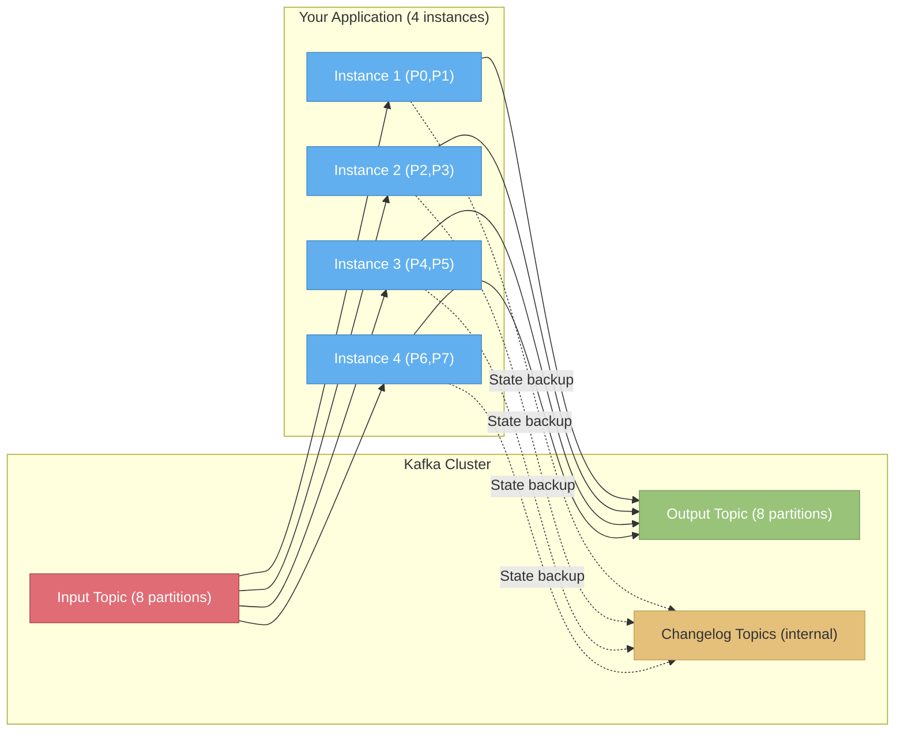
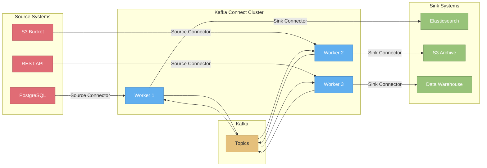
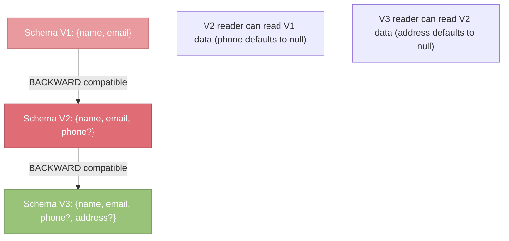

# Kafka in Practice

> **TL;DR:** This page translates Kafka's architecture and internals into real-world guidance. On the producer side, use `acks=all` with idempotency for critical data, tune batching for your throughput/latency trade-off, and adopt schema-first serialization with Avro or Protobuf. On the consumer side, prefer manual offset commits, monitor consumer lag religiously, and handle rebalances gracefully. Beyond basic produce/consume, Kafka offers **Kafka Streams** for stateful stream processing (with exactly-once semantics), **Kafka Connect** for integrating with external systems without writing code, and **Schema Registry** for governing data contracts. Operationally, get your partition count right upfront, monitor under-replicated partitions and consumer lag, and know when Kafka is — and is not — the right tool for the job.

---

## Table of Contents

- [Why This Matters](#why-this-matters)
- [Producer Best Practices](#producer-best-practices)
  - [Choosing acks](#choosing-acks)
  - [Idempotent Producers](#idempotent-producers)
  - [Retry Configuration](#retry-configuration)
  - [Error Handling](#error-handling)
  - [Serialization](#serialization)
- [Consumer Best Practices](#consumer-best-practices)
  - [Commit Strategies](#commit-strategies)
  - [Consumer Lag Monitoring](#consumer-lag-monitoring)
  - [Handling Rebalances](#handling-rebalances)
  - [Error Handling and Dead Letter Queues](#error-handling-and-dead-letter-queues)
- [Kafka Streams](#kafka-streams)
  - [What Is Kafka Streams?](#what-is-kafka-streams)
  - [KStream vs KTable](#kstream-vs-ktable)
  - [Stateful Operations](#stateful-operations)
  - [Exactly-Once Processing](#exactly-once-processing)
  - [Windowing](#windowing)
  - [Interactive Queries](#interactive-queries)
- [Kafka Connect](#kafka-connect)
  - [Architecture](#connect-architecture)
  - [Source and Sink Connectors](#source-and-sink-connectors)
  - [Standalone vs Distributed Mode](#standalone-vs-distributed-mode)
  - [Single Message Transforms](#single-message-transforms)
  - [Common Connectors](#common-connectors)
- [Schema Registry](#schema-registry)
  - [Why Schemas Matter](#why-schemas-matter)
  - [Supported Formats](#supported-formats)
  - [Compatibility Modes](#compatibility-modes)
  - [Schema Evolution Best Practices](#schema-evolution-best-practices)
- [Operational Considerations](#operational-considerations)
  - [Topic Design](#topic-design)
  - [Monitoring](#monitoring)
  - [Common Failure Modes](#common-failure-modes)
- [When to Use Kafka](#when-to-use-kafka)
- [Key Takeaways](#key-takeaways)
- [References](#references)

---

## Why This Matters

Kafka's documentation is extensive, but it is organized around features, not decisions. When you sit down to build a production system, you need to answer questions like: What acks setting should I use? How many partitions? Should I commit offsets manually? Do I need Schema Registry? Can I use Kafka for this use case at all? This page answers those questions with opinionated, practical guidance drawn from real-world production experience.

---

## Producer Best Practices

### Choosing acks

The `acks` setting is the single most impactful configuration for data durability:

| Scenario | Recommended `acks` | Why |
|----------|-------------------|-----|
| Financial transactions, order events, payments | `all` | Zero tolerance for data loss |
| User activity tracking, clickstream | `all` or `1` | Some loss may be acceptable; depends on SLA |
| Metrics, debug logs | `1` | High throughput matters more than guaranteed delivery |
| Fire-and-forget telemetry | `0` | Maximum throughput; loss is expected and acceptable |

**The recommended default for almost all production use cases is `acks=all`** with `min.insync.replicas=2` and a replication factor of 3. The throughput difference between `acks=1` and `acks=all` is smaller than most people expect (typically 10-20% lower throughput, not orders of magnitude), and the durability improvement is enormous.

### Idempotent Producers

Since Kafka 3.0, idempotency is enabled by default (`enable.idempotence=true`). This should be left on for all producers. It eliminates duplicate records caused by producer retries at essentially zero performance cost.

When idempotency is enabled, Kafka automatically enforces:
- `acks=all`
- `max.in.flight.requests.per.connection <= 5`
- `retries` is set to `Integer.MAX_VALUE`

This means you get exactly-once delivery to each partition without any additional configuration.

### Retry Configuration

Transient failures (network blips, leader elections, broker restarts) are normal in distributed systems. The producer must be configured to retry:

| Parameter | Recommended Value | Description |
|-----------|------------------|-------------|
| `retries` | `2147483647` (MAX_INT) | Always retry. With idempotency enabled, this is the default. |
| `delivery.timeout.ms` | `120000` (2 min) | Total time allowed for a record to be sent (including retries). This is the real timeout — retries continue until this expires. |
| `retry.backoff.ms` | `100` | Initial backoff between retries. Kafka applies jitter automatically. |
| `request.timeout.ms` | `30000` | Timeout for a single produce request to the broker. |

The key insight: control retry behavior through `delivery.timeout.ms`, not `retries`. Setting `retries=MAX_INT` with `delivery.timeout.ms=120000` means "retry as much as you can within 2 minutes, then give up."

### Error Handling

Producer errors fall into two categories:

**Retriable errors** (handled automatically by the client):
- `NotLeaderForPartition` — leader election in progress.
- `NetworkException` — transient connectivity issue.
- `RequestTimedOut` — broker was slow to respond.

**Non-retriable errors** (must be handled by application code):
- `SerializationException` — the record cannot be serialized.
- `RecordTooLargeException` — the record exceeds `max.request.size`.
- `AuthorizationException` — the producer does not have permission.

Best practice for handling the send callback:

```
producer.send(record, (metadata, exception) -> {
    if (exception == null) {
        // Success — record was written to topic-partition at offset
        log.debug("Sent to {}-{} at offset {}",
            metadata.topic(), metadata.partition(), metadata.offset());
    } else if (exception instanceof RetriableException) {
        // This should not happen if delivery.timeout.ms is generous
        // The client already exhausted retries
        log.error("Retriable error after exhausting retries", exception);
        sendToDeadLetterQueue(record, exception);
    } else {
        // Non-retriable — do not retry, handle explicitly
        log.error("Non-retriable producer error", exception);
        alertOperations(record, exception);
    }
});
```

### Serialization

Raw bytes are Kafka's lingua franca. The producer serializes keys and values before sending; the consumer deserializes after receiving. The choice of serialization format has long-term implications:

| Format | Schema Enforcement | Evolution Support | Size | Speed | Ecosystem |
|--------|-------------------|------------------|------|-------|-----------|
| **Avro** | Schema Registry | Excellent (backward/forward compatible) | Compact (binary) | Fast | Kafka Streams, Connect, most mature |
| **Protobuf** | Schema Registry | Excellent | Compact (binary) | Very fast | gRPC interop, strong typing |
| **JSON Schema** | Schema Registry | Limited | Verbose (text) | Moderate | Human-readable, easy debugging |
| **Plain JSON** | None | None | Verbose (text) | Moderate | Simple, but no contract enforcement |
| **String** | None | None | Varies | Fast | Only for simple key-value use cases |

**Recommendation:** Use **Avro or Protobuf** with Schema Registry for any topic that will be consumed by more than one service or that needs to evolve over time. JSON without a schema leads to silent breaking changes and debugging nightmares at scale.

---

## Consumer Best Practices

### Commit Strategies

Offset commits determine your delivery semantics. The core trade-off:

```mermaid
graph TD
    subgraph "Auto Commit (at-most-once risk)"
        A1["poll()"] --> A2["Records returned"]
        A2 --> A3["Offsets auto-committed on next poll()"]
        A3 --> A4["Process records"]
        A4 -->|"Crash here"| A5["Records lost — offsets already committed"]
    end

    subgraph "Manual Commit After Processing (at-least-once)"
        B1["poll()"] --> B2["Records returned"]
        B2 --> B3["Process records"]
        B3 --> B4["commitSync() / commitAsync()"]
        B4 -->|"Crash before commit"| B5["Records re-delivered — safe"]
    end

    style A5 fill:#e06c75,stroke:#a84e55,color:#fff
    style B5 fill:#98c379,stroke:#7a9e61,color:#fff
```



| Strategy | Setting | Semantics | Use When |
|----------|---------|-----------|----------|
| **Auto commit** | `enable.auto.commit=true` | At-most-once (if processing fails after commit) or at-least-once (if processing is fast and reliable) | Simple consumers where occasional reprocessing is acceptable |
| **Manual sync commit** | `commitSync()` after processing | At-least-once | When you need to guarantee every record is processed. Blocks until commit completes. |
| **Manual async commit** | `commitAsync()` after processing | At-least-once (with rare edge case of duplicates from stale commits) | When commit latency would impact throughput. Use with a callback to handle failures. |
| **Manual sync on rebalance + async normally** | `commitAsync()` in loop, `commitSync()` in rebalance listener | At-least-once with minimal overhead | **Recommended pattern** for most applications. Async commits are fast, sync commit on rebalance ensures clean handoff. |

**Recommended pattern:**

```
while (running) {
    records = consumer.poll(Duration.ofMillis(100));

    for (record in records) {
        process(record);
    }

    consumer.commitAsync((offsets, exception) -> {
        if (exception != null) {
            log.warn("Async commit failed", exception);
        }
    });
}

// In ConsumerRebalanceListener.onPartitionsRevoked():
consumer.commitSync();  // Ensure clean handoff during rebalance
```

### Consumer Lag Monitoring

**Consumer lag** is the difference between the latest offset in a partition (the log end offset) and the consumer group's committed offset. It is the single most important metric for Kafka consumers.



**What consumer lag tells you:**

| Lag Behavior | Meaning | Action |
|-------------|---------|--------|
| Lag is zero or near-zero | Consumer is keeping up with production rate | All good |
| Lag is constant and small | Consumer is slightly behind but stable | Acceptable for most use cases |
| Lag is growing steadily | Consumer cannot keep up with production rate | Scale consumers (add more to the group) or optimize processing |
| Lag spikes then recovers | Temporary slowdown (GC pause, downstream outage) | Investigate root cause; may need to tune timeouts |
| Lag suddenly jumps to millions | Consumer likely crashed and restarted from an old offset, or committed wrong offsets | Investigate immediately |

**Monitoring tools:**

- `kafka-consumer-groups.sh --describe` — built-in CLI tool showing per-partition lag.
- **Burrow** (LinkedIn open source) — dedicated consumer lag monitoring with evaluation rules.
- **Prometheus + JMX Exporter** — export `records-lag-max` metric from consumer JMX.

### Handling Rebalances

Rebalances are disruptive. During an eager rebalance, all consumers in the group briefly stop consuming. During a cooperative rebalance, only affected partitions are paused. Either way, you need to handle them properly.

**Use a `ConsumerRebalanceListener`:**

```
consumer.subscribe(topics, new ConsumerRebalanceListener() {
    onPartitionsRevoked(partitions) {
        // Called BEFORE partitions are reassigned
        // Commit offsets, flush buffers, close resources
        consumer.commitSync();
        flushBatchBuffer();
    }

    onPartitionsAssigned(partitions) {
        // Called AFTER new partitions are assigned
        // Initialize resources for new partitions
        for (partition in partitions) {
            initializeStateFor(partition);
        }
    }
});
```

**Best practices for stable consumer groups:**

1. Use **cooperative-sticky** assignment strategy (`partition.assignment.strategy=org.apache.kafka.clients.consumer.CooperativeStickyAssignor`).
2. Use **static group membership** (`group.instance.id`) for applications that restart frequently.
3. Set `max.poll.records` to a value your processing can handle within `max.poll.interval.ms`.
4. Keep processing logic fast. If you need to do slow work (HTTP calls, database writes), decouple it from the poll loop using a local buffer or thread pool.

### Error Handling and Dead Letter Queues

Not every record can be processed successfully. A malformed payload, a schema mismatch, or a downstream service failure can all cause processing to fail. You need a strategy:



A **Dead Letter Queue (DLQ)** is a separate Kafka topic (e.g., `my-topic.DLQ`) where unprocessable records are sent. This allows the consumer to make progress (commit the offset of the failed record) without losing the data. Operations teams can then inspect and reprocess DLQ records later.

**DLQ record enrichment:** When sending a record to the DLQ, include metadata headers:

| Header | Value |
|--------|-------|
| `dlq.original.topic` | Source topic name |
| `dlq.original.partition` | Source partition |
| `dlq.original.offset` | Source offset |
| `dlq.error.message` | Exception message |
| `dlq.error.timestamp` | When the error occurred |
| `dlq.retry.count` | Number of retries attempted |

---

## Kafka Streams

### What Is Kafka Streams?

Kafka Streams is a **client library** for building stream processing applications. This distinction is critical: Kafka Streams is NOT a cluster or a separate infrastructure component. It is a Java/Scala library that you embed in your application. Your application instances form the processing topology, and Kafka Streams handles partitioning, state management, fault tolerance, and exactly-once processing for you.



**Why Kafka Streams instead of Flink or Spark Streaming?**

- No separate cluster to manage — it deploys as a standard application.
- Exactly-once semantics built in (leveraging Kafka's transactional producer).
- Scales by simply running more instances of your application.
- Ideal when both input and output are Kafka topics.

### KStream vs KTable

These are the two fundamental abstractions:

| Abstraction | Represents | Example | Backed By |
|-------------|-----------|---------|-----------|
| **KStream** | An unbounded stream of events (facts). Each record is an independent event. | Click events, log entries, sensor readings | A regular Kafka topic |
| **KTable** | A changelog stream representing the latest state per key. Each record is an update. | User profiles, account balances, product catalog | A compacted Kafka topic |

The same underlying topic can be read as either a KStream or a KTable — the difference is in how the application interprets updates:

```
// Read as KStream: every record is a new event
KStream<String, OrderEvent> orders = builder.stream("orders");

// Read as KTable: each record updates the state for that key
KTable<String, UserProfile> users = builder.table("user-profiles");

// Join: enrich each order with the user's current profile
KStream<String, EnrichedOrder> enriched = orders.join(users,
    (order, profile) -> new EnrichedOrder(order, profile)
);
```

### Stateful Operations

Kafka Streams supports stateful operations — aggregations, joins, windowing — using **state stores** backed by RocksDB (local to each instance):

```
// Count events per key in a 5-minute tumbling window
KStream<String, PageView> views = builder.stream("page-views");

KTable<Windowed<String>, Long> viewCounts = views
    .groupByKey()
    .windowedBy(TimeWindows.ofSizeWithNoGrace(Duration.ofMinutes(5)))
    .count(Materialized.as("view-counts-store"));
```

State stores are:
- **Local** — each instance holds state only for the partitions it owns.
- **Backed up** — state changes are written to internal changelog topics in Kafka, enabling recovery if an instance fails.
- **Queryable** — you can read state stores directly (see [Interactive Queries](#interactive-queries)).

### Exactly-Once Processing

Kafka Streams achieves exactly-once processing by combining:

1. **Idempotent producer** — eliminates duplicate writes.
2. **Transactional producer** — atomically writes output records AND commits input offsets.
3. **Consumer read_committed isolation** — downstream consumers only see committed records.

Enable it with a single configuration:

```
processing.guarantee=exactly_once_v2
```

Under the hood, for each processed batch:
1. Begin transaction.
2. Write output records to output topics.
3. Write consumer offset commits to `__consumer_offsets`.
4. Commit transaction — both output records and offset commits become visible atomically.

If the instance crashes mid-transaction, the transaction is aborted, and a new instance reprocesses from the last committed offset.

### Windowing

Kafka Streams supports four windowing types for time-based aggregations:

| Window Type | Description | Use Case |
|-------------|-------------|----------|
| **Tumbling** | Fixed-size, non-overlapping windows | "Count events per 5-minute interval" |
| **Hopping** | Fixed-size, overlapping windows (advance by hop interval) | "Count events in 10-minute windows, updated every 1 minute" |
| **Sliding** | Windows defined by time difference between records | "Alert if two events for the same key occur within 30 seconds" |
| **Session** | Dynamic windows based on activity gaps | "Group user click events into sessions with 30-minute inactivity timeout" |

```
// Tumbling window: 1-hour non-overlapping
.windowedBy(TimeWindows.ofSizeWithNoGrace(Duration.ofHours(1)))

// Hopping window: 1-hour windows advancing every 5 minutes
.windowedBy(TimeWindows.ofSizeAndGrace(Duration.ofHours(1), Duration.ofMinutes(5))
    .advanceBy(Duration.ofMinutes(5)))

// Session window: 30-minute inactivity gap
.windowedBy(SessionWindows.ofInactivityGapWithNoGrace(Duration.ofMinutes(30)))
```

### Interactive Queries

Kafka Streams allows you to **query state stores directly** from your application, turning your stream processing application into a queryable service:

```
// Expose the state store for queries
ReadOnlyKeyValueStore<String, Long> store =
    streams.store(
        StoreQueryParameters.fromNameAndType(
            "view-counts-store",
            QueryableStoreTypes.keyValueStore()
        )
    );

// Query it directly
Long count = store.get("product-42");

// Or iterate
KeyValueIterator<String, Long> range = store.range("product-1", "product-99");
```

Since state is partitioned across instances, querying a specific key might require routing the request to the instance that owns the relevant partition. Kafka Streams provides the `KeyQueryMetadata` API to discover which instance hosts which keys, enabling you to build a distributed query layer.

---

## Kafka Connect

### Connect Architecture

Kafka Connect is a framework for streaming data between Kafka and external systems — databases, key-value stores, search indexes, file systems, and more — without writing custom producer or consumer code.



### Source and Sink Connectors

| Connector Type | Direction | Description |
|---------------|-----------|-------------|
| **Source** | External system -> Kafka | Reads data from an external system and produces it to Kafka topics |
| **Sink** | Kafka -> External system | Consumes data from Kafka topics and writes it to an external system |

Each connector defines **tasks** — the units of parallelism. A connector with 4 tasks runs 4 parallel threads, each handling a subset of the work (e.g., different database tables or different topic partitions).

### Standalone vs Distributed Mode

| Mode | Description | Use Case |
|------|-------------|----------|
| **Standalone** | Single worker process, configuration from local files | Development, testing, single-machine deployments |
| **Distributed** | Multiple workers forming a cluster, configuration via REST API, automatic task balancing | **Production.** Workers share the load and automatically redistribute tasks if a worker fails. |

In distributed mode, connector configurations and offsets are stored in internal Kafka topics (`connect-configs`, `connect-offsets`, `connect-status`), making the Connect cluster itself stateless and easy to scale.

### Single Message Transforms

**Single Message Transforms (SMTs)** are lightweight transformations applied to each record as it flows through a connector, without needing a full stream processing application:

| Transform | Description |
|-----------|-------------|
| `InsertField` | Add a field (e.g., add a timestamp or static value) |
| `ReplaceField` | Rename, blacklist, or whitelist fields |
| `MaskField` | Replace field values with a type-appropriate null (for PII masking) |
| `ExtractField` | Pull a single field from a complex value |
| `TimestampRouter` | Route records to time-based topic names (e.g., `logs-2024-01-15`) |
| `RegexRouter` | Route records to topics based on regex patterns |
| `Flatten` | Flatten nested structures into a flat structure |

SMTs are composable — you can chain multiple transforms. However, they are designed for simple transformations. For complex business logic, joins, or aggregations, use Kafka Streams.

### Common Connectors

| Connector | Type | Description |
|-----------|------|-------------|
| **JDBC Source/Sink** | Both | Stream data to/from any JDBC-compatible database (MySQL, PostgreSQL, Oracle) |
| **Debezium** | Source | Change Data Capture (CDC) — captures row-level changes from database transaction logs (MySQL binlog, PostgreSQL WAL, MongoDB oplog) |
| **S3 Sink** | Sink | Archive Kafka topic data to S3 in Parquet, Avro, or JSON format |
| **Elasticsearch Sink** | Sink | Index Kafka records into Elasticsearch for full-text search |
| **BigQuery Sink** | Sink | Stream data into Google BigQuery for analytics |
| **HTTP Source/Sink** | Both | Pull from or push to REST APIs |
| **FileStream Source/Sink** | Both | Read from or write to local files (mainly for development and testing) |

> **Debezium** deserves special attention. It captures changes from the database's transaction log (not by polling), which means it captures every change (including deletes), has minimal impact on the source database, and provides exactly-once change events. It is the gold standard for CDC with Kafka.

---

## Schema Registry

### Why Schemas Matter

In a distributed system where many services produce and consume Kafka topics, the data contract between them is critical. Without schemas:

- A producer adds a field — consumers that do not expect it may fail.
- A producer removes a field — consumers that depend on it silently get nulls.
- A producer changes a field type — consumers deserialize garbage.
- Nobody knows what fields a topic contains without reading the producer's source code.

Schema Registry provides a centralized service for managing and enforcing schemas. Producers register schemas, and consumers retrieve them. The registry enforces compatibility rules that prevent breaking changes.

### Supported Formats

| Format | Description | Schema Registry Support |
|--------|-------------|------------------------|
| **Apache Avro** | Binary format with schema embedded in the registry. Most mature Kafka schema format. | Full support, most widely used |
| **Protocol Buffers** | Google's binary serialization. Strong typing, generated code. | Full support |
| **JSON Schema** | JSON with structural validation. Human-readable. | Full support, but less efficient than binary formats |

### Compatibility Modes

Schema Registry enforces compatibility between schema versions:

| Mode | Rule | What Can Change | What Cannot Change |
|------|------|-----------------|-------------------|
| **BACKWARD** (default) | New schema can read old data | Add optional fields, remove fields | Add required fields without defaults |
| **FORWARD** | Old schema can read new data | Remove optional fields, add fields | Remove required fields |
| **FULL** | Both backward and forward | Add optional fields with defaults, remove optional fields | Add/remove required fields |
| **BACKWARD_TRANSITIVE** | New schema can read ALL previous versions | Same as BACKWARD but checked against all versions | Same as BACKWARD |
| **FORWARD_TRANSITIVE** | ALL previous schemas can read new data | Same as FORWARD but checked against all versions | Same as FORWARD |
| **FULL_TRANSITIVE** | Both directions, all versions | Most restrictive | Most restrictive |
| **NONE** | No compatibility checking | Anything | Nothing enforced |



### Schema Evolution Best Practices

1. **Always provide default values** for new fields. This ensures backward compatibility.
2. **Never remove required fields** without a migration plan. Deprecate first, then remove in a later version.
3. **Use `BACKWARD` or `FULL` compatibility** for topics consumed by multiple services.
4. **Use the Schema Registry Maven/Gradle plugin** to validate compatibility at build time, not at deploy time.
5. **Subject naming strategy:** Use `TopicNameStrategy` (default) for topics with a single schema, or `RecordNameStrategy` for topics with multiple event types.
6. **Schema ID is embedded in the record.** The first 5 bytes of every Avro/Protobuf record in Kafka contain a magic byte + 4-byte schema ID. Consumers use this ID to fetch the schema from the registry and deserialize correctly.

---

## Operational Considerations

### Topic Design

**Naming conventions:**

Adopt a consistent naming convention across your organization. Common patterns:

| Pattern | Example | When |
|---------|---------|------|
| `<domain>.<entity>.<event>` | `payments.order.created` | Event-driven architecture |
| `<team>.<system>.<topic>` | `analytics.clickstream.raw` | Team-based ownership |
| `<env>.<domain>.<entity>` | `prod.inventory.updates` | Multi-environment with shared clusters |

**Partition count selection:**

| Factor | Guidance |
|--------|----------|
| Target throughput | Each partition can handle ~10 MB/s write or ~30 MB/s read on modern hardware. Calculate: `target_throughput / per_partition_throughput = min_partitions`. |
| Consumer parallelism | Partition count sets the upper bound on parallel consumers in a group. If you want 12 consumers, you need at least 12 partitions. |
| Key cardinality | If you use key-based partitioning, having far more partitions than unique keys leads to empty partitions. |
| Future growth | You can increase partitions but not decrease them, and increasing breaks key-based ordering guarantees. Err on the side of more partitions upfront. |
| Cluster overhead | Each partition requires memory for indexes, file handles, and ISR tracking. Aim for < 4,000 partitions per broker. |

**Rule of thumb:** Start with `max(expected_throughput_MB_per_sec * 3, expected_consumer_count * 2)` partitions per topic, rounded up to a reasonable number. For most topics, 6-30 partitions is a good range. High-throughput topics may need 50-200.

**When to use compacted topics:**

- The topic represents **entity state** (user profiles, account settings, product catalog).
- Consumers need to **rebuild current state** by reading from the beginning.
- You need a **CDC changelog** that serves as a current snapshot of the source.
- Internal Kafka Streams **changelog topics** (automatically configured).

### Monitoring

The most critical Kafka metrics to track:

| Metric | Source | Alert Threshold | What It Means |
|--------|--------|-----------------|---------------|
| **Under-replicated partitions** | Broker JMX | > 0 for > 5 min | A follower cannot keep up with the leader. Indicates broker health or network issues. |
| **ISR shrinks/expands per sec** | Broker JMX | > 0 sustained | Replicas are flapping in and out of ISR. Investigate disk, network, or GC. |
| **Consumer group lag** | Consumer JMX or external tool | Growing over time | Consumer cannot keep up with production rate. |
| **Request latency (p99)** | Broker JMX | > 100ms produce, > 50ms fetch | Broker is overloaded or experiencing disk issues. |
| **Active controller count** | Broker JMX | != 1 cluster-wide | Zero means no controller (cluster is in trouble). More than one is a split-brain scenario. |
| **Offline partitions** | Broker JMX | > 0 | A partition has no leader and is unavailable. Critical alert. |
| **Log flush latency** | Broker JMX | > 100ms p99 | Disk is slow. Consider faster storage or reducing write load. |
| **Network handler idle %** | Broker JMX | < 30% | Broker network threads are saturated. |
| **Request handler idle %** | Broker JMX | < 30% | Broker I/O threads are saturated. |

**Monitoring stack:** The standard approach is **JMX -> Prometheus JMX Exporter -> Prometheus -> Grafana**. Confluent provides pre-built Grafana dashboards. For Confluent Platform users, **Confluent Control Center** provides an integrated monitoring UI.

### Common Failure Modes

| Failure | Symptoms | Root Cause | Resolution |
|---------|----------|------------|------------|
| **Consumer rebalance storm** | Frequent rebalances, spiky consumer lag | `max.poll.interval.ms` too low, slow processing, unstable network | Increase `max.poll.interval.ms`, reduce `max.poll.records`, use static membership |
| **Under-replicated partitions** | `UnderReplicatedPartitions` metric > 0 | Slow disk, network issues, overloaded broker, long GC pauses | Check disk I/O, network throughput, GC logs; consider rebalancing partitions |
| **Consumer lag growing** | Lag metric increasing steadily | Consumer throughput < production rate | Add consumers to the group, increase partitions, optimize processing |
| **Broker disk full** | Produce failures, broker crash | Retention misconfigured, partition count explosion | Increase disk, fix retention settings, delete unused topics |
| **Unbalanced partition leaders** | One broker has high CPU/network while others are idle | Leaders concentrated on one broker after restarts | Run `kafka-leader-election.sh` with `--election-type PREFERRED` |
| **Message too large** | `RecordTooLargeException` | Record exceeds `max.message.bytes` (broker) or `max.request.size` (producer) | Increase limits or redesign to use references instead of large payloads |
| **Duplicate messages** | Downstream system sees duplicates | Idempotency not enabled, or consumer commits before processing | Enable idempotent producer, implement idempotent consumers |

---

## When to Use Kafka

### Ideal Use Cases

| Use Case | Why Kafka Excels |
|----------|------------------|
| **Event streaming / event-driven architecture** | Core design — durable, ordered, replayable event log |
| **Log aggregation** | High throughput, built-in retention, integrates with Elasticsearch/Splunk via Connect |
| **Change Data Capture (CDC)** | Debezium + Kafka captures every database change in real-time |
| **Activity tracking** | Originally built for this at LinkedIn — handles billions of events per day |
| **Stream processing** | Kafka Streams provides stateful processing with exactly-once |
| **Metrics and monitoring pipeline** | High ingestion rate, connect to time-series databases |
| **Data integration / ETL** | Kafka Connect moves data between systems without custom code |
| **Event sourcing** | Compacted topics provide append-only event stores with state rebuild capability |

### When NOT to Use Kafka

| Scenario | Why Not | Better Alternative |
|----------|---------|-------------------|
| **Request-reply / RPC** | Kafka is designed for async event streaming, not synchronous communication | gRPC, HTTP, NATS request-reply |
| **Very low message volume** (< 100 msg/day) | Operational overhead of a Kafka cluster is not justified | Managed queue service (SQS, Cloud Pub/Sub), or even a database table |
| **Strict message ordering across ALL events** | Kafka only orders within a partition. Global ordering requires a single partition, limiting throughput. | A single-node queue, or a database with sequence numbers |
| **Long-running tasks triggered by messages** | Kafka consumers are designed for fast processing. Long tasks risk rebalances. | A task queue (Celery, Temporal, AWS Step Functions) |
| **Exactly-once delivery to external systems** | Kafka's exactly-once is within the Kafka ecosystem. Delivery to external systems requires idempotent consumers. | Design your consumers to be idempotent |
| **Tiny payloads, extreme low latency (< 1ms)** | Kafka batching and replication add latency. Minimum is typically 2-5ms end-to-end. | NATS, ZeroMQ, or direct TCP |

---

## Key Takeaways

1. **Use `acks=all` with idempotency enabled** for all producers handling important data. The throughput cost is minimal; the durability benefit is enormous.
2. **Commit offsets manually after processing**, not before. Use async commits in the loop and sync commits during rebalances.
3. **Monitor consumer lag** as your primary health indicator. Growing lag means your consumers are falling behind.
4. **Kafka Streams is a library, not a cluster.** It gives you stateful stream processing with exactly-once semantics, deployed as a regular application.
5. **Kafka Connect eliminates connector boilerplate.** Use Debezium for CDC, JDBC connectors for databases, and S3 connectors for archiving.
6. **Schema Registry is not optional for production.** Enforce schemas with Avro or Protobuf and use backward-compatible evolution.
7. **Get partition count right upfront.** You can add partitions but not remove them, and adding breaks key-based ordering.
8. **Know when Kafka is not the answer.** Request-reply, low-volume messaging, and sub-millisecond latency requirements are better served by other tools.

---

## References

- [Apache Kafka Official Documentation — Configuration](https://kafka.apache.org/documentation/#configuration) — Complete reference for all producer, consumer, broker, and Streams configuration parameters.
- [Kafka Streams Documentation](https://kafka.apache.org/documentation/streams/) — Official guide to the Kafka Streams API, including DSL and Processor API.
- [Kafka Connect Documentation](https://kafka.apache.org/documentation/#connect) — Official guide to the Connect framework, including REST API and configuration.
- [Confluent Schema Registry Documentation](https://docs.confluent.io/platform/current/schema-registry/) — Complete reference for Schema Registry, including API, compatibility modes, and client integration.
- [Debezium Documentation](https://debezium.io/documentation/) — Comprehensive guide to CDC connectors for MySQL, PostgreSQL, MongoDB, SQL Server, and more.
- [Kafka Streams in Action (Manning)](https://www.manning.com/books/kafka-streams-in-action) — Practical book on building stream processing applications with Kafka Streams.
- [Designing Event-Driven Systems (O'Reilly, free)](https://www.confluent.io/designing-event-driven-systems/) — Ben Stopford's book on event-driven architecture patterns with Kafka.
- [Confluent Blog — Exactly-Once Semantics Are Possible](https://www.confluent.io/blog/exactly-once-semantics-are-possible-heres-how-apache-kafka-does-it/) — Deep dive into Kafka's exactly-once implementation.
- [Confluent Developer Tutorials](https://developer.confluent.io/) — Hands-on tutorials for Kafka, Kafka Streams, ksqlDB, and Connect.
- [Uber Engineering — Kafka at Scale](https://www.uber.com/blog/kafka/) — How Uber operates Kafka at massive scale.
- [Netflix Tech Blog — Kafka Inside Keystone Pipeline](https://netflixtechblog.com/kafka-inside-keystone-pipeline-dd5aeabaf6bb) — How Netflix uses Kafka for real-time data pipeline.
