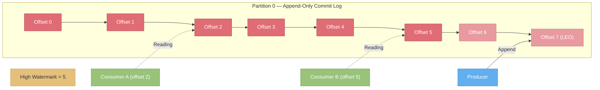
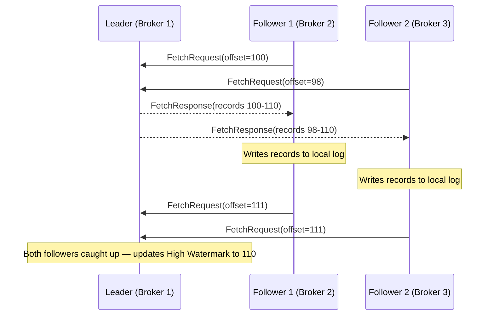
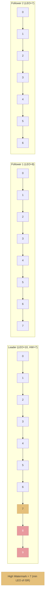
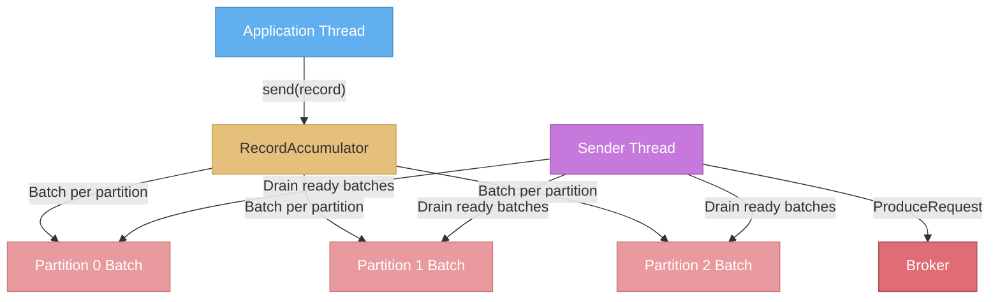
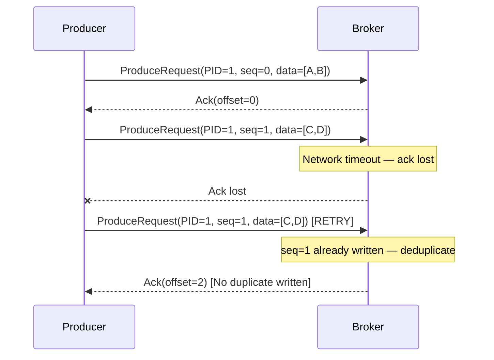
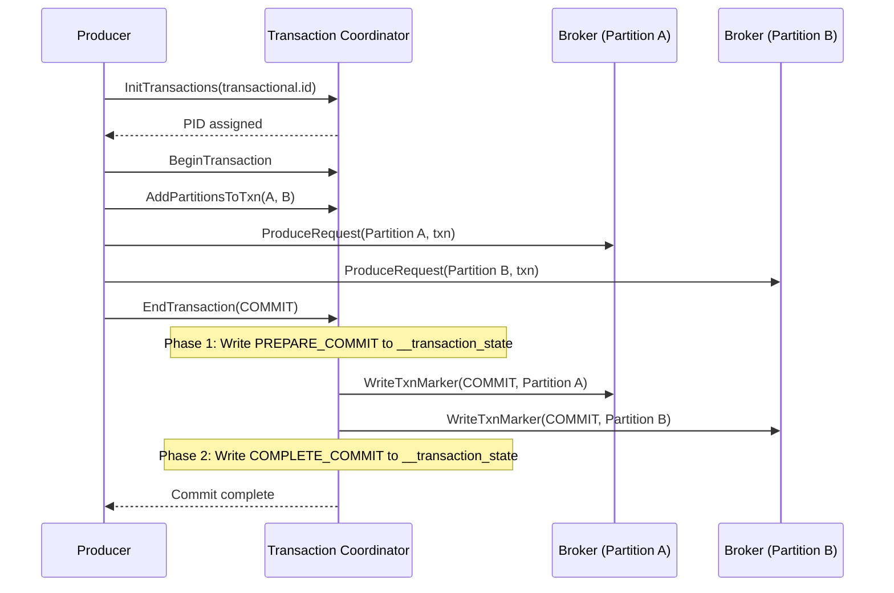
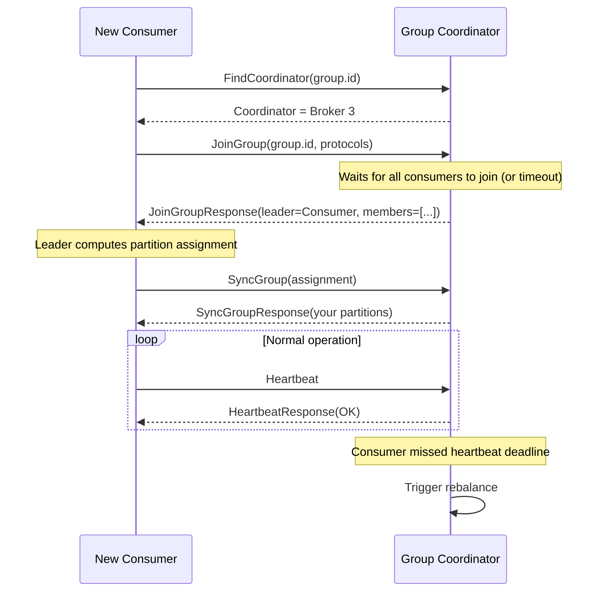
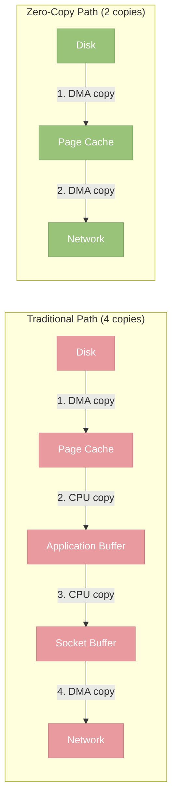

# Kafka Internals

> **TL;DR:** Under the hood, Kafka stores data as an append-only **commit log** organized into **segments** with offset and timestamp indexes for fast lookups. Its replication protocol uses a **leader-follower model** with a **high watermark** to track committed data, and an **ISR (in-sync replica) set** that adapts to follower health. Producers can achieve **exactly-once semantics** through idempotent writes and two-phase commit transactions. Consumers coordinate through a group protocol using heartbeats and offset tracking via the internal `__consumer_offsets` topic. Kafka's legendary performance comes from **zero-copy transfers**, **sequential I/O**, **page cache utilization**, and **batch compression** — design choices that let it saturate network and disk bandwidth simultaneously.

---

## Table of Contents

- [Why This Matters](#why-this-matters)
- [The Commit Log](#the-commit-log)
- [Storage Architecture](#storage-architecture)
  - [Log Segments](#log-segments)
  - [Indexes](#indexes)
  - [Log Compaction](#log-compaction)
- [Replication Protocol Deep Dive](#replication-protocol-deep-dive)
  - [How Followers Replicate from Leaders](#how-followers-replicate-from-leaders)
  - [High Watermark and Log End Offset](#high-watermark-and-log-end-offset)
  - [ISR Management](#isr-management)
  - [Leader Election](#leader-election)
- [Producer Internals](#producer-internals)
  - [Record Batching and linger.ms](#record-batching-and-lingerms)
  - [Idempotent Producer](#idempotent-producer)
  - [Transactional Producer](#transactional-producer)
- [Consumer Internals](#consumer-internals)
  - [Offset Tracking](#offset-tracking)
  - [Fetch Protocol](#fetch-protocol)
  - [Consumer Group Coordination](#consumer-group-coordination)
  - [Static Group Membership](#static-group-membership)
- [Performance Optimizations](#performance-optimizations)
- [Key Takeaways](#key-takeaways)
- [References](#references)

---

## Why This Matters

Knowing Kafka's architecture tells you *what* Kafka does. Knowing Kafka's internals tells you *why* it behaves the way it does — and that is the difference between configuring a cluster that works and diagnosing one that does not. When consumer lag spikes, when end-to-end latency suddenly doubles, when a broker runs out of disk despite your retention policy, or when you need to decide between compaction and deletion — these are all problems that require understanding the internal machinery. This page gives you that understanding.

---

## The Commit Log

At its core, Kafka is a **distributed commit log**. Every partition is an ordered, append-only sequence of records. New records are always written to the end of the log; existing records are never modified.

This is fundamentally different from traditional message queues, where messages are typically stored in a data structure (like a B-tree or heap) and **deleted upon consumption**. In Kafka, records remain in the log for a configurable retention period regardless of whether any consumer has read them. Multiple consumers can independently read the same data at different speeds, and any consumer can "rewind" to re-read historical records.



The commit log model provides three properties that are remarkably powerful:

1. **Replay.** Consumers can re-read any data still within the retention window by seeking to an earlier offset. This makes Kafka ideal for event sourcing, reprocessing after bug fixes, and populating new downstream systems.
2. **Decoupling.** Producers and consumers operate independently. Adding a new consumer does not affect existing ones or the producers.
3. **Deterministic ordering.** Within a partition, records are assigned monotonically increasing offsets. The order is immutable and can be relied upon for correctness.

---

## Storage Architecture

### Log Segments

A partition's log is not stored as a single file — that would be impractical for multi-terabyte logs. Instead, the log is split into **segments**. Each segment is a pair of files on disk:

- A `.log` file containing the actual record data.
- An `.index` file containing the offset-to-position mapping (see [Indexes](#indexes)).
- A `.timeindex` file mapping timestamps to offsets.

```mermaid
graph TD
    subgraph "Partition 0 — /data/kafka-logs/topic-0/"
        S1["00000000000000000000.log (Segment 0)"]
        S1I["00000000000000000000.index"]
        S1T["00000000000000000000.timeindex"]

        S2["00000000000000054321.log (Segment 1)"]
        S2I["00000000000000054321.index"]
        S2T["00000000000000054321.timeindex"]

        S3["00000000000000108642.log (Active Segment)"]
        S3I["00000000000000108642.index"]
        S3T["00000000000000108642.timeindex"]
    end

    Producer["New writes"] -->|"Append only"| S3

    style S1 fill:#e89a9f,stroke:#c87a7f,color:#fff
    style S2 fill:#e89a9f,stroke:#c87a7f,color:#fff
    style S3 fill:#e06c75,stroke:#a84e55,color:#fff
    style S1I fill:#d8a0e0,stroke:#b880c0,color:#fff
    style S2I fill:#d8a0e0,stroke:#b880c0,color:#fff
    style S3I fill:#d8a0e0,stroke:#b880c0,color:#fff
    style S1T fill:#e5c07b,stroke:#c7a35d,color:#333
    style S2T fill:#e5c07b,stroke:#c7a35d,color:#333
    style S3T fill:#e5c07b,stroke:#c7a35d,color:#333
    style Producer fill:#61afef,stroke:#4a8cc7,color:#fff
```



The segment file names are the **base offset** — the offset of the first record in that segment. At any time, exactly one segment is the **active segment** (the one currently being written to). Older segments are immutable and eligible for deletion or compaction.

**Segment rotation** occurs when either condition is met:

| Trigger | Configuration | Default |
|---------|--------------|---------|
| Segment reaches size limit | `log.segment.bytes` | 1 GB |
| Segment reaches age limit | `log.roll.ms` / `log.roll.hours` | 7 days |

When a segment is rotated, the current active segment is closed (becomes immutable), and a new segment is created.

**Retention** is applied at the segment level, not the record level. Kafka deletes (or compacts) entire segments when they meet the retention criteria:

| Retention Mode | Configuration | Behavior |
|---------------|--------------|----------|
| Time-based deletion | `retention.ms` | Delete segments older than the threshold |
| Size-based deletion | `retention.bytes` | Delete oldest segments until partition size is under the limit |
| Compaction | `cleanup.policy=compact` | Keep only the latest record per key (see [Log Compaction](#log-compaction)) |
| Both | `cleanup.policy=compact,delete` | Compact first, then delete segments older than retention |

---

### Indexes

Consumers need to seek to specific offsets efficiently. Reading through gigabytes of log data sequentially to find offset 108,700 would be unacceptable. Kafka solves this with **sparse indexes** stored alongside each segment.

**Offset Index (`.index`)**

The offset index maps record offsets to their physical byte position in the `.log` file. The index is *sparse* — not every offset is indexed. Instead, Kafka creates an index entry every `log.index.interval.bytes` (default 4 KB) worth of records. To find a specific offset, Kafka performs:

1. **Binary search** across segment files to find the right segment (using segment file names as base offsets).
2. **Binary search** within the segment's `.index` file to find the largest indexed offset less than or equal to the target.
3. **Sequential scan** forward from that position in the `.log` file to find the exact offset.

This gives O(log n) lookup performance with minimal memory overhead.

**Timestamp Index (`.timeindex`)**

The timestamp index maps timestamps to offsets, enabling consumers to seek to a specific point in time (e.g., "replay all events from 2 hours ago"). The lookup process:

1. Binary search the `.timeindex` to find the offset corresponding to the requested timestamp.
2. Use the offset index to find the physical position.

This is how the `offsetsForTimes()` consumer API works.

---

### Log Compaction

While time-based and size-based retention simply delete old segments, **log compaction** is a fundamentally different retention strategy. Instead of deleting records based on age, compaction ensures that the log retains **at least the last known value for each record key** within a partition.

```mermaid
graph TD
    subgraph "Before Compaction"
        direction LR
        R1["K1:V1"] --> R2["K2:V1"] --> R3["K1:V2"] --> R4["K3:V1"] --> R5["K2:V2"] --> R6["K1:V3"] --> R7["K3:null &#40;tombstone&#41;"]
    end

    subgraph "After Compaction"
        direction LR
        C1["K2:V2"] --> C2["K1:V3"] --> C3["K3:null &#40;tombstone&#41;"]
    end

    style R1 fill:#e89a9f,stroke:#c87a7f,color:#fff
    style R2 fill:#e89a9f,stroke:#c87a7f,color:#fff
    style R3 fill:#e89a9f,stroke:#c87a7f,color:#fff
    style R4 fill:#e89a9f,stroke:#c87a7f,color:#fff
    style R5 fill:#e89a9f,stroke:#c87a7f,color:#fff
    style R6 fill:#e89a9f,stroke:#c87a7f,color:#fff
    style R7 fill:#e89a9f,stroke:#c87a7f,color:#fff
    style C1 fill:#98c379,stroke:#7a9e61,color:#fff
    style C2 fill:#98c379,stroke:#7a9e61,color:#fff
    style C3 fill:#98c379,stroke:#7a9e61,color:#fff
```



**How compaction works:**

1. The **log cleaner** (a background thread pool) selects segments that have a high ratio of duplicate keys ("dirty" segments).
2. It reads the dirty segment(s) and the corresponding clean segments, building an in-memory map of key-to-latest-offset.
3. It writes a new "clean" segment containing only the latest value for each key.
4. The old segments are replaced atomically.

**Tombstones:** A record with a key and a `null` value is a **tombstone**. It signals that the key should be considered deleted. During compaction, tombstones are retained for a configurable period (`delete.retention.ms`, default 24 hours) to ensure that consumers who are slightly behind can observe the deletion. After this grace period, the tombstone itself is removed.

**Compaction vs. deletion — when to use which:**

| Use Case | Retention Policy | Why |
|----------|-----------------|-----|
| Event stream (clicks, logs) | `delete` | Events are time-bounded; old events lose value |
| Changelog / state updates | `compact` | Need the latest state per entity; old versions are redundant |
| Combined (CDC) | `compact,delete` | Keep latest state, but also delete entries older than retention window |

**Important use cases for compaction:**

- **Kafka Streams KTable materialization.** Changelog topics that back KTables use compaction so that state stores can be rebuilt from the topic at any time.
- **Consumer offset storage.** The `__consumer_offsets` topic uses compaction — it only needs the latest committed offset per consumer group and partition.
- **Database CDC.** Change data capture topics often use compaction so the topic serves as a "current state" snapshot of the source database table.

---

## Replication Protocol Deep Dive

### How Followers Replicate from Leaders

Followers replicate data from the leader by issuing **fetch requests**, the same mechanism consumers use. Each follower maintains a fetcher thread that continuously sends `FetchRequest` RPCs to the leader, specifying the offset it wants to fetch from.



The replication is **pull-based** — followers pull from the leader, not the other way around. This is simpler to implement, naturally handles slow followers (they just fall behind), and reuses the existing fetch protocol.

---

### High Watermark and Log End Offset

Two pointers track the state of a partition's log:

- **Log End Offset (LEO):** The offset of the next record to be written. Each replica has its own LEO.
- **High Watermark (HW):** The offset up to which all ISR replicas have replicated. Only records below the high watermark are visible to consumers.



The high watermark is calculated as: `HW = min(LEO of all replicas in ISR)`.

**Why the high watermark matters:**

- **Consumers can only read up to the high watermark.** Records between the high watermark and the leader's LEO are "uncommitted" — they exist on the leader but have not been replicated to all ISR members. If the leader crashed before replication completed, those records would be lost.
- **This prevents consumers from reading data that might be rolled back** after a leader failure, which would violate the durability guarantee.

---

### ISR Management

The **In-Sync Replica (ISR)** set is dynamic. Replicas join and leave the ISR based on their replication lag:

**Falling out of ISR:**

A follower is removed from the ISR when it has not fetched from the leader for `replica.lag.time.max.ms` (default: 30 seconds). This can happen due to:

- **Broker failure** — the follower process crashed or the host is unreachable.
- **Network issues** — the follower cannot reach the leader.
- **Slow disk** — the follower cannot write replicated data fast enough to keep up.
- **GC pauses** — long garbage collection pauses on the follower JVM.

**Rejoining the ISR:**

When a recovered follower catches up to the leader's LEO (by fetching all missing records), it is added back to the ISR. The process is:

1. The follower starts fetching from its last known LEO.
2. As it fetches batches of records, its LEO advances toward the leader's LEO.
3. Once it is fully caught up (LEO matches the leader's LEO), the leader adds it back to the ISR.

**ISR shrink and expand** are logged as metadata events in the cluster metadata log (or ZooKeeper, in older versions). Monitoring ISR changes is one of the most important operational practices — frequent ISR shrinks indicate broker health problems.

---

### Leader Election

When a partition's leader broker becomes unavailable, a new leader must be elected from the remaining replicas.

**Preferred leader election:**

Each partition has a **preferred leader** — the first broker in the replica assignment list. The preferred leader is chosen during topic creation to balance leadership across the cluster. If the preferred leader is in the ISR and available, it is elected. The `auto.leader.rebalance.enable` setting (default: true) periodically triggers preferred leader election to rebalance leadership after broker restarts.

**Unclean leader election:**

When **no ISR member** is available for a partition, Kafka faces a fundamental trade-off:

| Option | Setting | Consequence |
|--------|---------|-------------|
| Wait for ISR member to recover | `unclean.leader.election.enable=false` | Partition stays offline until an ISR member returns — **no data loss** but reduced availability |
| Elect an out-of-sync replica | `unclean.leader.election.enable=true` | Partition becomes available immediately, but **recently committed records that were not replicated to this follower are permanently lost** |

For the vast majority of production systems, unclean leader election should remain disabled. Data loss is almost always worse than temporary unavailability.

---

## Producer Internals

### Record Batching and linger.ms

Internally, the Kafka producer accumulates records in a buffer organized by partition. Each partition has a **RecordAccumulator** that builds batches:



A batch is considered "ready" when:

1. It reaches `batch.size` (default: 16,384 bytes), OR
2. `linger.ms` has elapsed since the first record was added to the batch (default: 0 ms), OR
3. The `buffer.memory` limit is reached and the accumulator needs to flush.

The **sender thread** runs in the background, draining ready batches and sending them to brokers. It groups batches destined for the same broker into a single `ProduceRequest`, minimizing network round trips.

**Practical tuning:**

- `linger.ms=0` means batches are sent immediately, which maximizes latency sensitivity but may produce many small requests.
- `linger.ms=5` to `linger.ms=100` allows more records to accumulate, producing larger batches with better compression and fewer requests — at the cost of added latency.
- `batch.size=65536` or higher is common in high-throughput scenarios.

---

### Idempotent Producer

Without idempotency, a producer retry after a network timeout can result in **duplicate records**. The producer sent a batch, the broker received and wrote it, but the acknowledgment was lost. The producer retries, and the broker writes the batch again.

The **idempotent producer** (enabled with `enable.idempotence=true`, default since Kafka 3.0) solves this:

1. The producer is assigned a **Producer ID (PID)** by the broker on initialization.
2. Each record batch is tagged with a **sequence number** (per partition).
3. The broker tracks the latest sequence number per PID/partition pair.
4. If a batch arrives with a sequence number that has already been written, the broker **discards it as a duplicate** and returns a success acknowledgment.



Idempotency guarantees **exactly-once delivery to a single partition**. It does NOT provide exactly-once semantics across multiple partitions or across produce-and-consume workflows — that requires transactions.

> **Important:** Idempotency requires `acks=all` and `max.in.flight.requests.per.connection <= 5`. Kafka enforces these when idempotency is enabled.

---

### Transactional Producer

Transactions extend idempotency to provide **exactly-once semantics across multiple partitions and topics**, and importantly, across the produce-consume-produce pattern (read from a topic, process, write to another topic).

The transactional producer uses a **two-phase commit** protocol coordinated by the **transaction coordinator** (a broker that hosts the relevant partition of the `__transaction_state` internal topic):



Key details:

- The producer is identified across restarts by its `transactional.id` (a string you configure). This allows the coordinator to fence ("zombie-fence") old producers with the same ID.
- Records written within a transaction are visible to consumers only after the transaction commits (when consumers use `isolation.level=read_committed`).
- If the producer crashes before committing, the coordinator will eventually **abort** the transaction (after `transaction.timeout.ms`), and the records become invisible.
- The transactional protocol adds latency (due to the two-phase commit) but is essential for exactly-once stream processing in Kafka Streams.

---

## Consumer Internals

### Offset Tracking

Consumer offsets are stored in a special internal topic: `__consumer_offsets`. This topic has 50 partitions by default and uses log compaction to retain only the latest committed offset per consumer group and partition.

The mapping of a consumer group to an `__consumer_offsets` partition is: `partition = hash(group.id) % 50`. The broker that leads this partition is the **group coordinator** for that consumer group.

When a consumer commits an offset, it sends an `OffsetCommitRequest` to the group coordinator, which writes the offset to the `__consumer_offsets` topic. When a consumer starts and needs to know where to begin, it sends an `OffsetFetchRequest` to the group coordinator to retrieve the last committed offset.

**Offset reset policy:**

If a consumer group has no committed offset for a partition (first time reading) or if the committed offset is no longer valid (it was deleted by retention), the `auto.offset.reset` configuration determines behavior:

| Setting | Behavior |
|---------|----------|
| `earliest` | Start from the beginning of the partition |
| `latest` | Start from the end (only consume new records) |
| `none` | Throw an exception — the application must handle this case explicitly |

---

### Fetch Protocol

Consumers retrieve data from brokers using `FetchRequest` RPCs. Several parameters control the fetch behavior:

| Parameter | Default | Description |
|-----------|---------|-------------|
| `fetch.min.bytes` | 1 | Minimum data the broker should return. If not enough data is available, the broker waits. |
| `fetch.max.wait.ms` | 500 | Maximum time the broker will wait to accumulate `fetch.min.bytes` before returning a (possibly empty) response. |
| `fetch.max.bytes` | 52,428,800 (50 MB) | Maximum data returned in a single fetch response across all partitions. |
| `max.partition.fetch.bytes` | 1,048,576 (1 MB) | Maximum data returned per partition in a fetch response. |
| `max.poll.records` | 500 | Maximum number of records returned by a single `poll()` call (client-side limit, not a broker setting). |

The interaction between `fetch.min.bytes` and `fetch.max.wait.ms` creates an adaptive batching mechanism: if the topic has high throughput, the broker returns data immediately (it quickly accumulates `fetch.min.bytes`). If the topic has low throughput, the broker waits up to `fetch.max.wait.ms` before returning what it has, avoiding tight polling loops.

---

### Consumer Group Coordination

Consumer group coordination is managed through a protocol of heartbeats and rebalances between consumers and the **group coordinator** (a broker).

**The lifecycle:**



**Key configuration parameters:**

| Parameter | Default | Purpose |
|-----------|---------|---------|
| `heartbeat.interval.ms` | 3000 | How often the consumer sends heartbeats to the coordinator |
| `session.timeout.ms` | 45000 | If no heartbeat is received within this window, the consumer is considered dead and a rebalance is triggered |
| `max.poll.interval.ms` | 300000 (5 min) | Maximum time between `poll()` calls. If exceeded, the consumer is considered stuck and a rebalance is triggered. This catches consumers that are alive but making no progress. |

The relationship between these settings:

- `heartbeat.interval.ms` should be roughly 1/3 of `session.timeout.ms` to allow for a few missed heartbeats before the session times out.
- `max.poll.interval.ms` should be set based on the maximum processing time for a batch of records. If your processing takes up to 2 minutes per batch, set this to at least 150 seconds with safety margin.
- Setting `session.timeout.ms` too low causes unnecessary rebalances during GC pauses. Setting it too high means slow detection of truly failed consumers.

---

### Static Group Membership

Traditional consumer group membership is **dynamic**: every time a consumer restarts, it gets a new member ID and triggers a rebalance. This is problematic for applications that restart frequently (rolling deployments, Kubernetes pod restarts) because each restart causes a full rebalance that briefly interrupts all consumers in the group.

**Static group membership** (introduced in KIP-345) solves this by assigning a persistent `group.instance.id` to each consumer:

- When a consumer with a `group.instance.id` disconnects, the coordinator does not immediately trigger a rebalance. Instead, it waits for `session.timeout.ms`.
- If the consumer reconnects with the same `group.instance.id` before the timeout, it reclaims its previous partition assignment **without triggering a rebalance**.
- This dramatically reduces rebalance frequency during rolling deployments.

```
// Consumer configuration for static membership
group.instance.id=consumer-host-1
session.timeout.ms=300000  // 5 minutes — generous for rolling restarts
```

With static membership, you typically set `session.timeout.ms` higher (minutes instead of seconds) since the value now represents the maximum time you expect a restart to take, not the failure detection latency.

---

## Performance Optimizations

Kafka's throughput comes from several deliberate engineering decisions that optimize the data path from producer to disk to consumer.

### Zero-Copy Transfer

When a consumer reads data, the typical path would be:

1. Read data from disk into kernel page cache.
2. Copy from kernel space to user space (Kafka broker JVM).
3. Copy from user space back to kernel space (socket buffer).
4. Send over the network.

This involves **four data copies** and **two context switches**. Kafka eliminates the middle two copies using the Linux `sendfile()` system call, which transfers data directly from the page cache to the network socket:



This optimization is why Kafka brokers can serve consumers at network-line-rate — the JVM heap is not involved in the data path for reads.

### Page Cache Utilization

Kafka deliberately avoids maintaining its own in-process cache. Instead, it relies on the operating system's **page cache**:

- Writes are appended to files and end up in the page cache.
- Reads from consumers that are caught up hit the page cache directly (the data was just written).
- The OS manages eviction, which it does well for sequential access patterns.
- If the Kafka process crashes, the page cache (and thus all cached data) survives because it is managed by the kernel.

This design means that **Kafka performance improves with more RAM** (larger page cache), and that the JVM heap should be kept relatively small (6-8 GB is typical) to leave more memory for the page cache.

### Sequential I/O

Kafka's append-only write pattern and sequential read pattern align perfectly with how modern storage devices work:

- **HDDs:** Sequential throughput on spinning disks is 100-200 MB/s, while random I/O is 100-200 IOPS. Kafka's sequential pattern means even HDDs can sustain high throughput.
- **SSDs:** While SSDs handle random I/O better than HDDs, sequential access still benefits from reduced write amplification and better wear leveling.

### Batching and Compression

Every layer of Kafka uses batching:

| Layer | Batching Mechanism | Benefit |
|-------|-------------------|---------|
| **Producer** | `batch.size` and `linger.ms` accumulate records | Fewer network round trips, better compression ratio |
| **Broker** | Writes batches to disk as a unit | Sequential I/O, fewer fsync operations |
| **Replication** | Followers fetch batches of records | Fewer fetch requests, higher replication throughput |
| **Consumer** | `fetch.min.bytes` controls batch size | Fewer fetch requests, amortized network overhead |

Compression (configured with `compression.type`) is applied at the batch level by the producer. Critically, **brokers store compressed batches as-is** — they do not decompress and re-compress. Consumers decompress. This means the broker's CPU is largely not involved in compression, and compressed data takes less disk space and less network bandwidth.

The compression type `zstd` typically offers the best compression ratio with acceptable CPU cost. `lz4` offers faster compression/decompression with slightly lower ratios. `snappy` is a legacy choice that is generally outperformed by `lz4`.

---

## Key Takeaways

1. **The commit log is Kafka's foundation.** Append-only, immutable, segmented storage with sparse indexes gives Kafka its performance characteristics and replay capabilities.
2. **Log compaction is not just garbage collection** — it is a powerful primitive for maintaining latest-state-per-key semantics, essential for KTables, CDC, and consumer offsets.
3. **The high watermark separates committed from uncommitted data.** Consumers only see committed data, preventing read-your-writes anomalies after leader failures.
4. **Idempotent producers eliminate duplicates** using PID + sequence numbers. Transactional producers extend this to exactly-once across partitions via two-phase commit.
5. **Consumer group coordination is heartbeat-based.** Tuning `session.timeout.ms`, `max.poll.interval.ms`, and using static membership are critical for stability.
6. **Zero-copy, page cache, sequential I/O, and batching** are the four pillars of Kafka's performance. Understanding them helps you tune both the brokers and the OS.

---

## References

- [Kafka Design Documentation — Storage](https://kafka.apache.org/documentation/#design_filesystem) — Official documentation on Kafka's storage layer, page cache strategy, and constant-time access.
- [Kafka Design Documentation — Replication](https://kafka.apache.org/documentation/#replication) — Detailed description of the replication protocol, ISR management, and leader election.
- [KIP-98: Exactly Once Delivery and Transactional Messaging](https://cwiki.apache.org/confluence/display/KAFKA/KIP-98+-+Exactly+Once+Delivery+and+Transactional+Messaging) — The design document for idempotent and transactional producers.
- [KIP-345: Introduce static membership protocol to reduce consumer rebalances](https://cwiki.apache.org/confluence/display/KAFKA/KIP-345%3A+Introduce+static+membership+protocol+to+reduce+consumer+rebalances) — Static group membership proposal.
- [KIP-320: Allow fetchers to detect and handle log truncation](https://cwiki.apache.org/confluence/display/KAFKA/KIP-320%3A+Allow+fetchers+to+detect+and+handle+log+truncation) — Improvements to the high watermark and leader epoch protocol.
- [Kafka: The Definitive Guide — Chapter 5: Kafka Internals](https://www.oreilly.com/library/view/kafka-the-definitive/9781492043072/) — O'Reilly book chapter on Kafka's internal mechanisms.
- [Efficient data transfer through zero copy (IBM Developer)](https://developer.ibm.com/articles/j-zerocopy/) — Explanation of the zero-copy optimization used by Kafka.
- [Jay Kreps — The Log](https://engineering.linkedin.com/distributed-systems/log-what-every-software-engineer-should-know-about-real-time-datas-unifying) — The original blog post on the commit log abstraction.
- [Kafka Producer Internals (Confluent Blog)](https://www.confluent.io/blog/apache-kafka-producer-improvements-sticky-partitioner/) — Deep dive into the producer architecture and sticky partitioner.
- [Kafka Consumer Group Protocol (Confluent Developer)](https://developer.confluent.io/courses/architecture/consumer-group-protocol/) — Walkthrough of the consumer group coordination protocol.
