# NATS

> **NATS is the connective tissue of cloud-native systems — a messaging system so lightweight and fast that it disappears into the infrastructure, yet powerful enough to handle everything from simple pub/sub to persistent streaming with exactly-once semantics.** This section takes you from core concepts to production-ready architecture.

---

## What This Section Covers

NATS occupies a unique position in the messaging landscape. Created by Derek Collison (who also built messaging systems at TIBCO and Apcera), NATS was designed from the ground up for the cloud-native era: a single, tiny binary that starts in milliseconds, requires zero configuration, and delivers messages with sub-millisecond latency. As a CNCF incubating project, it has become the default messaging layer for an increasingly wide range of distributed systems — from microservice communication and IoT edge networks to Kubernetes control planes and real-time data pipelines.

What makes NATS especially interesting is its **layered architecture**. Core NATS gives you blazing-fast, fire-and-forget messaging with subjects, wildcards, and built-in load balancing. When you need persistence, JetStream adds durable streams, consumers, and exactly-once delivery — all running inside the same server binary, using the same protocol and subjects. On top of JetStream sit higher-level abstractions like a distributed key-value store and an object store, all built from the same primitives.

This section walks through each of these layers in depth, then shows you how to put them together in production.

---

## Concept Map

The diagram below shows how the key NATS concepts relate to one another. Start from "NATS" in the center and trace outward to see the layered architecture — core messaging at the top, persistence and storage in the middle, and operational concerns at the bottom.

```mermaid
graph TB
    NATS["NATS"]

    CORE["Core NATS"]
    JS["JetStream"]
    OPS["Operations &<br/>Deployment"]

    SUBJ["Subject-Based<br/>Messaging"]
    PS["Publish-<br/>Subscribe"]
    RR["Request-<br/>Reply"]
    QG["Queue<br/>Groups"]

    STR["Streams"]
    CON["Consumers"]
    KV["Key-Value<br/>Store"]
    OBJ["Object<br/>Store"]

    CLUST["Clustering &<br/>Full Mesh"]
    GW["Gateways &<br/>Super Clusters"]
    LN["Leaf<br/>Nodes"]
    SEC["Security &<br/>Multi-Tenancy"]

    NATS --> CORE
    NATS --> JS
    NATS --> OPS

    CORE --> SUBJ
    CORE --> PS
    CORE --> RR
    CORE --> QG

    JS --> STR
    JS --> CON
    JS --> KV
    JS --> OBJ

    OPS --> CLUST
    OPS --> GW
    OPS --> LN
    OPS --> SEC

    style NATS fill:#7b68ee,stroke:#5a4cb5,color:#fff
    style CORE fill:#7b68ee,stroke:#5a4cb5,color:#fff
    style JS fill:#7b68ee,stroke:#5a4cb5,color:#fff
    style OPS fill:#7b68ee,stroke:#5a4cb5,color:#fff

    style SUBJ fill:#9a8aee,stroke:#7a6ace,color:#fff
    style PS fill:#9a8aee,stroke:#7a6ace,color:#fff
    style RR fill:#9a8aee,stroke:#7a6ace,color:#fff
    style QG fill:#9a8aee,stroke:#7a6ace,color:#fff
    style STR fill:#9a8aee,stroke:#7a6ace,color:#fff
    style CON fill:#9a8aee,stroke:#7a6ace,color:#fff
    style KV fill:#9a8aee,stroke:#7a6ace,color:#fff
    style OBJ fill:#9a8aee,stroke:#7a6ace,color:#fff
    style CLUST fill:#9a8aee,stroke:#7a6ace,color:#fff
    style GW fill:#9a8aee,stroke:#7a6ace,color:#fff
    style LN fill:#9a8aee,stroke:#7a6ace,color:#fff
    style SEC fill:#9a8aee,stroke:#7a6ace,color:#fff
```

---

## Pages in This Section

| # | Page | What You Will Learn |
|---|------|---------------------|
| 1 | [NATS Core](./nats-core.md) | What NATS is and why it exists, subject-based messaging with wildcards, publish-subscribe and request-reply patterns, queue groups for load balancing, clustering with full mesh and gateways, leaf nodes for edge computing, the text-based NATS protocol, security and multi-tenancy, and performance characteristics. |
| 2 | [NATS JetStream](./nats-jetstream.md) | The persistence layer built into NATS, streams and their retention policies, push vs pull consumers and acknowledgment semantics, exactly-once delivery with deduplication, the key-value and object stores built on top of JetStream, stream sourcing and mirroring for disaster recovery, and how JetStream replaced NATS Streaming (STAN). |
| 3 | [NATS in Practice](./nats-in-practice.md) | How to use NATS for microservice communication, common messaging patterns (fan-out, work queues, saga/choreography, CQRS), deploying NATS in Kubernetes, operational monitoring and CLI tools, scaling strategies, and a decision matrix for when to use core NATS vs JetStream. |

---

## Suggested Reading Order

1. **Start with [NATS Core](./nats-core.md).** This page builds your mental model of how NATS works at the protocol and server level. Even if you plan to use JetStream for everything, understanding core NATS is essential because JetStream is built entirely on top of these primitives.

2. **Then read [NATS JetStream](./nats-jetstream.md).** Once you understand core NATS subjects and pub/sub, this page shows you how JetStream adds persistence, replay, and exactly-once semantics without changing the fundamental model.

3. **Finish with [NATS in Practice](./nats-in-practice.md).** This page takes the concepts from the first two pages and applies them to real-world scenarios — microservice architectures, Kubernetes deployments, operational tooling, and decision frameworks for choosing the right NATS features.

---

## Prerequisites

You should be comfortable with the concepts from [Messaging Foundations](../01-messaging-foundations/README.md), especially delivery semantics (at-most-once, at-least-once, exactly-once) and messaging paradigms (pub/sub, request-reply, point-to-point). If those terms are unfamiliar, start there first.

---

*Next up: [NATS Core](./nats-core.md)*
