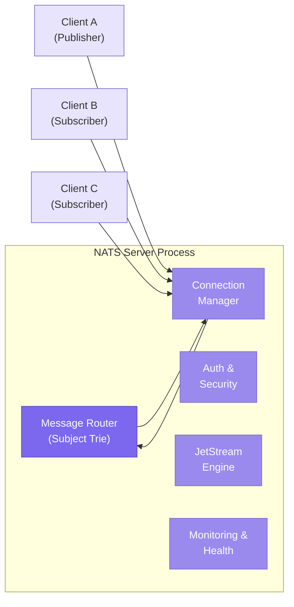
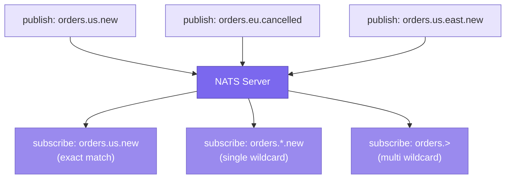
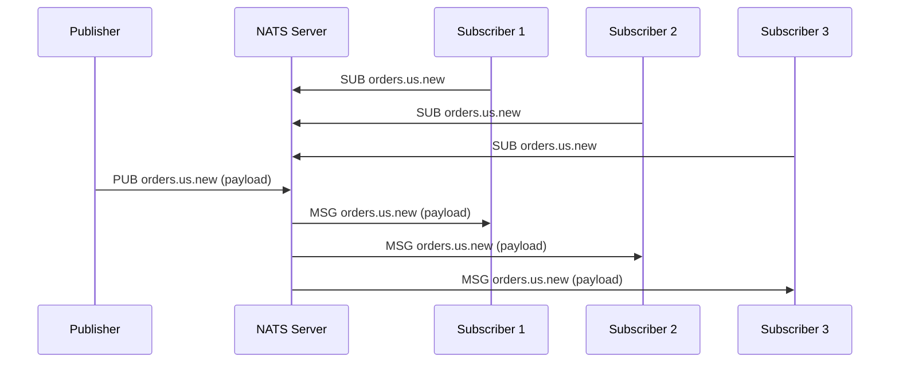
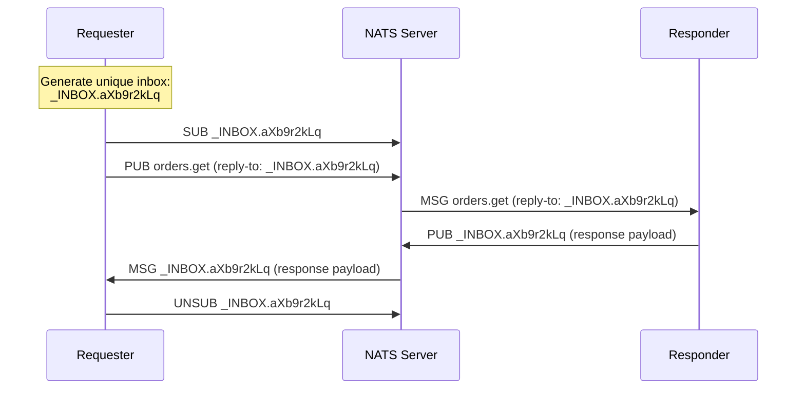
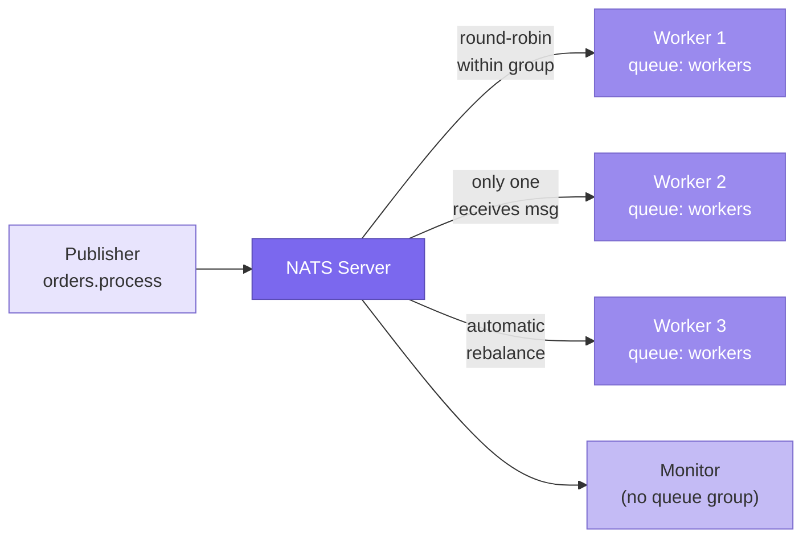
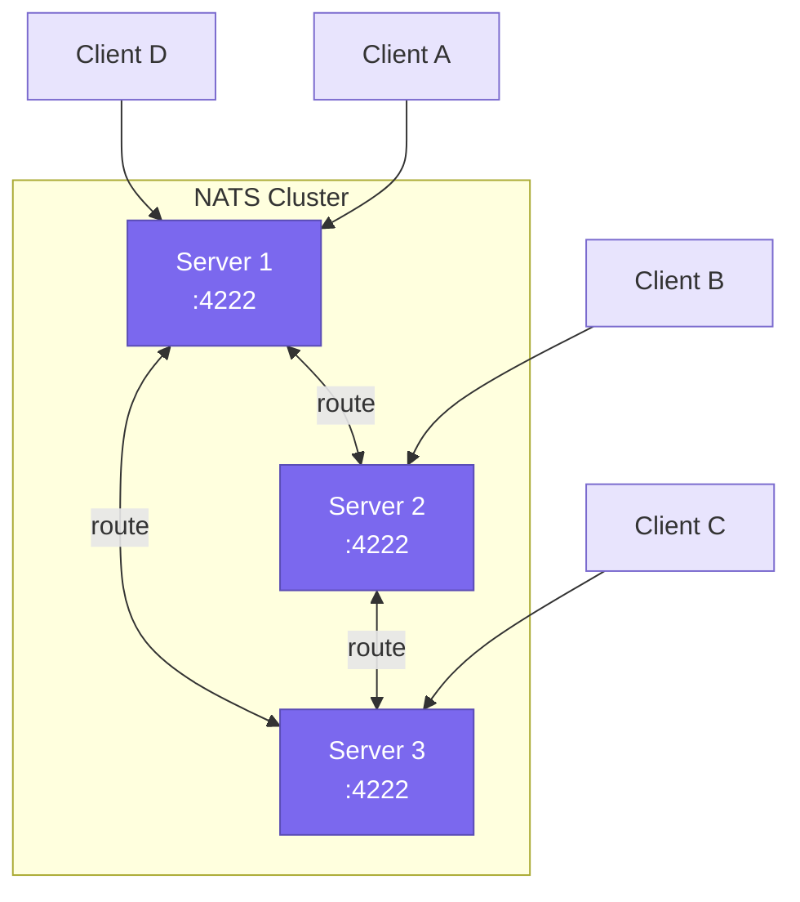
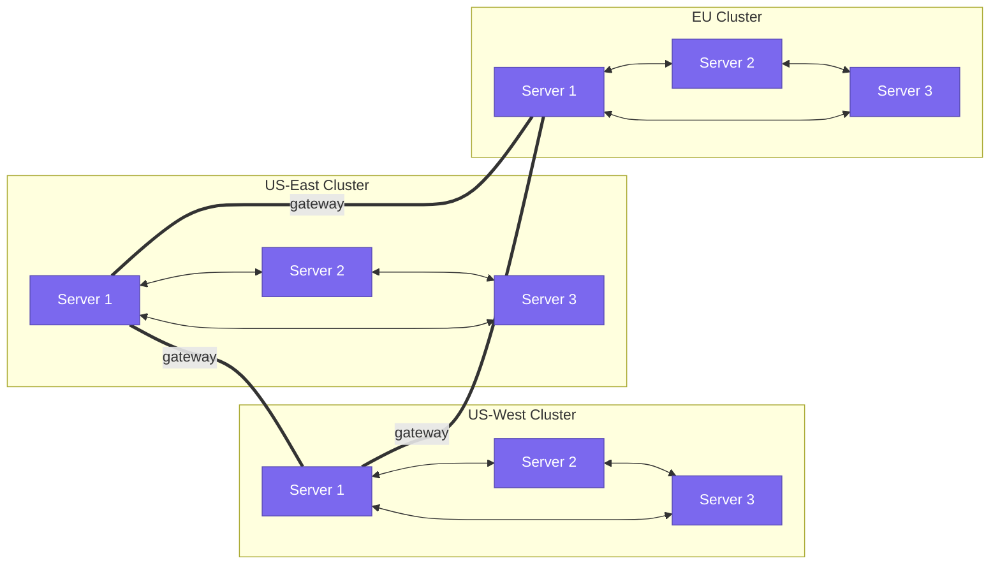
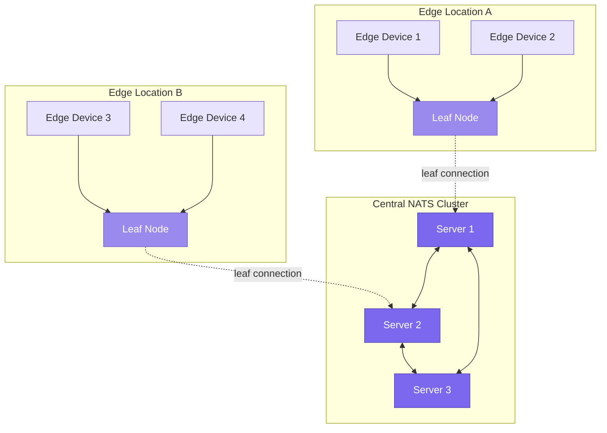
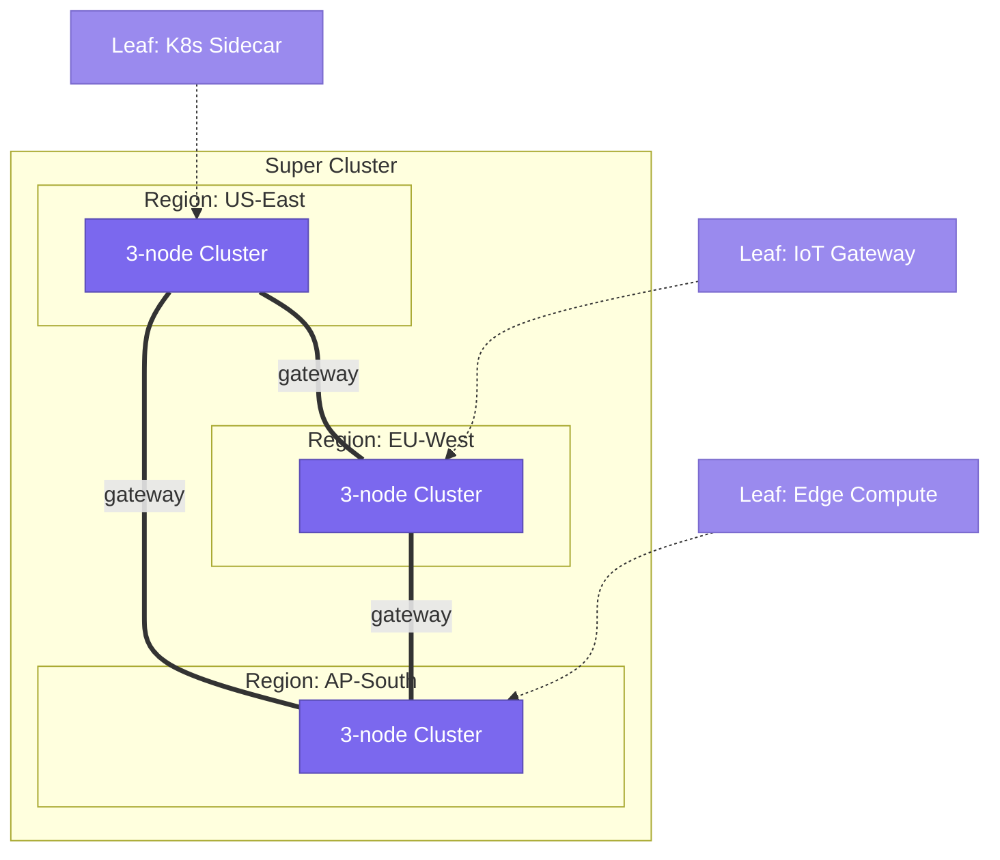
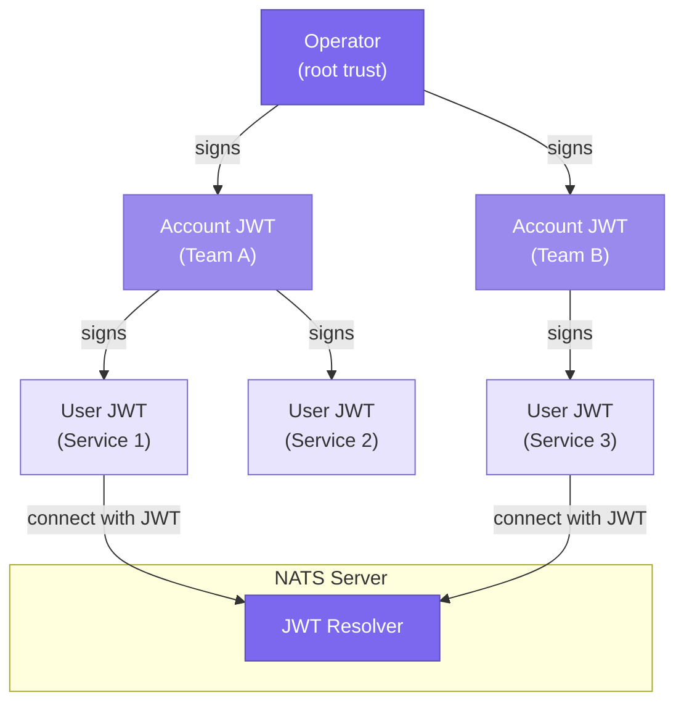

# NATS Core

> **TL;DR** — NATS is a cloud-native messaging system built around a single design principle: simplicity. A single Go binary with zero external dependencies delivers sub-millisecond publish-subscribe, request-reply, and queue-based load balancing — all through a human-readable, text-based protocol. Subject-based addressing with powerful wildcards replaces the rigid topic/queue configuration of traditional brokers. Core NATS provides at-most-once delivery by design; when you need persistence, JetStream adds it as a layer on top without changing the fundamental model. Clustering, gateways, and leaf nodes let you scale from a laptop to a globally distributed super cluster.

---

## Table of Contents

- [Why This Matters](#why-this-matters)
- [What Is NATS?](#what-is-nats)
- [Core NATS Architecture](#core-nats-architecture)
  - [The NATS Server](#the-nats-server)
  - [Subject-Based Messaging](#subject-based-messaging)
  - [Publish-Subscribe](#publish-subscribe)
  - [Request-Reply](#request-reply)
  - [Queue Groups](#queue-groups)
- [NATS Clustering](#nats-clustering)
  - [Full Mesh Topology](#full-mesh-topology)
  - [Gateway Connections](#gateway-connections)
  - [Leaf Nodes](#leaf-nodes)
  - [Super Clusters](#super-clusters)
- [The NATS Protocol](#the-nats-protocol)
- [Security](#security)
- [Performance Characteristics](#performance-characteristics)
- [Key Takeaways](#key-takeaways)
- [References](#references)

---

## Why This Matters

Most messaging systems force you to make a painful choice early in your project: either accept the operational complexity of a distributed log like Kafka (ZooKeeper/KRaft, partitions, consumer groups, schema registries) or settle for a traditional message broker like RabbitMQ that requires careful queue configuration and management.

NATS offers a third path. It starts with an almost absurdly simple core — a message router that fits in under 20 MB of RAM, starts in under a second, and requires exactly zero configuration to get going. This simplicity is not a limitation; it is the point. By making the base layer as thin and fast as possible, NATS lets you adopt exactly the complexity you need: core pub/sub for fire-and-forget, JetStream for persistence, key-value for lightweight state, and so on.

Understanding core NATS is essential even if you plan to use JetStream exclusively. Every JetStream stream, consumer, and key-value bucket is built on top of the same subjects, subscriptions, and protocol messages described in this page. The core is the foundation for everything.

---

## What Is NATS?

**NATS** (originally an acronym for "Neural Autonomic Transport System") is a connective technology for distributed systems. It was created by **Derek Collison**, a messaging veteran who previously built the messaging backbone at TIBCO and designed the internal messaging for Cloud Foundry at VMware. Collison founded Synadia Communications to build NATS as an open-source project, and it was accepted into the **Cloud Native Computing Foundation (CNCF)** as an incubating project in 2018.

The design philosophy of NATS rests on three pillars:

| Pillar | What It Means |
|--------|--------------|
| **Simplicity** | A single, statically compiled Go binary. No external dependencies (no JVM, no ZooKeeper, no etcd). Zero mandatory configuration — start the binary and connect. |
| **Performance** | Sub-millisecond message latency. Millions of messages per second on commodity hardware. A protocol designed to minimize allocations and copies. |
| **Always-On** | Self-healing clustering with automatic failover. Clients automatically reconnect and resubscribe. The system protects itself from slow consumers rather than degrading globally. |

NATS is not just a message broker — it is a **multi-modal communication system**. Out of the box, it supports:

- **Publish-Subscribe** — one-to-many message distribution
- **Request-Reply** — synchronous RPC-style communication
- **Queue Groups** — load-balanced message distribution
- **JetStream** — persistent streaming with at-least-once and exactly-once delivery
- **Key-Value Store** — distributed key-value storage with change notification
- **Object Store** — large binary object storage

All of these run inside the same server process, use the same wire protocol, and share the same subject namespace.

---

## Core NATS Architecture

### The NATS Server

The NATS server (`nats-server`) is a single binary, typically around 15-20 MB on disk. It compiles to native code (Go) with no runtime dependencies. Here is what makes it architecturally distinctive:



Key architectural properties of `nats-server`:

- **Zero configuration startup.** Run `nats-server` with no arguments and you have a fully functional message router listening on port 4222. Configuration is optional, not required.
- **In-memory message routing.** Core NATS does not write messages to disk. It is a pure router — messages flow from publishers to matching subscribers and are then gone. This is a deliberate design choice, not a missing feature.
- **Subject trie for routing.** Internally, the server uses a highly optimized trie (prefix tree) data structure to match published subjects against active subscriptions. This is what enables sub-microsecond routing decisions even with millions of active subscriptions.
- **Connection-oriented.** Each client maintains a persistent TCP connection to the server. The server tracks all subscriptions for that connection and routes messages accordingly.
- **Self-protecting.** If a subscriber cannot keep up with message flow, the server will first buffer, then slow down, and ultimately disconnect the slow consumer — protecting the rest of the system from degradation.

### Subject-Based Messaging

Subjects are the addressing mechanism in NATS. Unlike Kafka (which uses topics with partitions) or RabbitMQ (which uses exchanges, bindings, and queues), NATS uses a **flat, dot-delimited subject namespace** that requires no pre-creation or configuration.

A subject is simply a string of tokens separated by dots:

```
orders.us.new
orders.eu.cancelled
payments.stripe.completed
telemetry.device42.temperature
```

The power of subjects comes from **wildcards**:

| Wildcard | Syntax | Matches | Example |
|----------|--------|---------|---------|
| **Single token** | `*` | Exactly one token at the wildcard position | `orders.*.new` matches `orders.us.new` and `orders.eu.new` but not `orders.us.east.new` |
| **Multiple tokens** | `>` | One or more tokens at the tail position | `orders.>` matches `orders.us.new`, `orders.eu.cancelled`, and `orders.us.east.new` |

These two wildcards are composable and remarkably expressive:



In this example:
- `orders.us.new` receives only exact matches (1 message).
- `orders.*.new` receives `orders.us.new` and `orders.eu.cancelled`... wait, no. It matches `orders.us.new` only — the `*` matches a single token, and `cancelled` does not equal `new`. To receive both `new` and `cancelled`, you would subscribe to `orders.*.*`.
- `orders.>` receives all three messages because `>` matches one or more trailing tokens.

**Subject mapping** (introduced in NATS 2.x) allows the server to transform subjects on the fly — useful for migrations, A/B testing, and traffic shaping without changing publisher or subscriber code.

**Design insight:** The subject namespace is entirely flat and dynamic. You do not need to create, configure, or delete subjects. They exist as long as someone publishes to or subscribes on them. This eliminates an entire category of operational overhead that plagues other messaging systems.

### Publish-Subscribe

Publish-subscribe (pub/sub) is the fundamental messaging pattern in NATS. A publisher sends a message to a subject, and every active subscriber on that subject receives a copy.



Critical properties of core NATS pub/sub:

- **Fire-and-forget.** The publisher sends the message and immediately moves on. There is no acknowledgment from the server, no delivery receipt, no persistence.
- **At-most-once delivery.** If no subscriber is listening at the moment the message is published, the message is discarded. If a subscriber is connected but its buffer is full, the message may be dropped. This is by design.
- **No persistence.** Core NATS does not store messages. It is a pure message router. If you need persistence, you use JetStream (covered in the [next page](./nats-jetstream.md)).
- **No ordering guarantee across subjects.** Messages on different subjects may arrive in any order. Messages on the *same* subject from the *same* publisher are delivered in order to each subscriber.
- **Fan-out is free.** Adding another subscriber to a subject has negligible cost. The server writes the message to each matching subscriber's connection buffer. There is no "topic replication" or "partition assignment" overhead.

**When is at-most-once acceptable?** More often than you might think. Telemetry data, real-time dashboards, live notifications, presence indicators, and many control-plane signals are all cases where the latest value matters more than guaranteed delivery of every value. Core NATS is purpose-built for these scenarios.

### Request-Reply

While pub/sub is one-to-many, request-reply is a one-to-one (or one-to-many-pick-first) pattern built directly into NATS. It enables synchronous, RPC-style communication without any special infrastructure.

Here is how it works under the hood:



The key insight is that **request-reply is not a separate protocol** — it is composed entirely from pub/sub primitives:

1. The requester generates a unique **inbox subject** (conventionally `_INBOX.<unique-id>`).
2. The requester subscribes to the inbox.
3. The requester publishes the request to the target subject with a `reply-to` field set to the inbox.
4. The responder receives the message, processes it, and publishes the response to the `reply-to` subject.
5. The requester receives the response on its inbox and unsubscribes.

This elegant composition means that **any NATS subject can be used for request-reply** without configuration. The pattern also naturally supports **scatter-gather**: if multiple responders are subscribed to the request subject, the requester can collect multiple responses by not auto-unsubscribing after the first reply.

| Pattern | Description | Use Case |
|---------|-------------|----------|
| **Simple request-reply** | One requester, one responder, first response wins | Service-to-service RPC, API gateways |
| **Scatter-gather** | One requester, multiple responders, collect N responses | Price comparison, distributed search, health checks |
| **Request with timeout** | Requester sets a deadline; no response = error | Circuit-breaking, failover detection |

### Queue Groups

Queue groups are NATS's built-in load balancing mechanism. When multiple subscribers join the same **queue group** on a subject, each message is delivered to **exactly one** member of the group — the server handles the distribution automatically.



Critical properties of queue groups:

- **No broker configuration required.** Unlike RabbitMQ (where you create queues and bindings) or Kafka (where you create consumer groups bound to partitions), a NATS queue group exists the moment a subscriber declares it. No setup, no administration.
- **Multiple queue groups on the same subject.** You can have several independent queue groups all subscribed to the same subject. Each group receives one copy of the message (distributed to one member of that group). Non-queue subscribers also receive every message. In the diagram above, the `workers` group delivers each message to one worker, while the `Monitor` receives every message for logging.
- **Automatic rebalancing.** When a worker joins or leaves the group, message distribution automatically adjusts. There is no partition reassignment delay, no rebalance protocol, no stop-the-world pause.
- **Weighted distribution.** By default, distribution is roughly round-robin (weighted by each subscriber's processing speed). The server naturally sends more messages to faster consumers.

**Design insight:** Queue groups in NATS are a subscriber-side concept. The publisher has no awareness of queue groups — it simply publishes to a subject. The server decides whether to fan-out (regular pub/sub) or load-balance (queue group) based on the subscription type. This means you can add load balancing to any existing subject without changing publishers.

---

## NATS Clustering

### Full Mesh Topology

A single NATS server can handle substantial load (hundreds of thousands of connections, millions of messages per second), but production deployments use clustering for high availability and horizontal scaling.

A NATS cluster is a set of servers connected in a **full mesh** topology — every server maintains a route (TCP connection) to every other server in the cluster.



How clustering works:

- **Interest propagation.** When a client on Server 1 subscribes to `orders.>`, Server 1 propagates that interest to Server 2 and Server 3 over the route connections. If a client on Server 2 publishes to `orders.us.new`, Server 2 knows to forward it to Server 1.
- **Gossip-based discovery.** You only need to tell each server about one or two other servers in the cluster. The gossip protocol discovers the full topology automatically. New servers added to the cluster are discovered and connected within seconds.
- **Client failover.** Clients are configured with a list of server URLs. If their current server goes down, they automatically reconnect to another server in the cluster and resubscribe. This happens transparently — the application code does not need to handle it.
- **No leader election for routing.** Unlike Kafka or RabbitMQ, there is no concept of a "leader" or "controller" for core NATS message routing. Every server is equal. There is no single point of failure for the routing layer. (JetStream uses Raft consensus for stream replication, but that is a separate concern.)

**Scaling note:** Full mesh works well up to roughly 20-30 servers. Beyond that, the number of inter-server connections grows quadratically (N * (N-1) / 2). For larger deployments, you use **gateways** and **super clusters**.

### Gateway Connections

Gateways connect separate NATS clusters into a larger federated system. Each cluster maintains its own full mesh internally, and gateway connections link clusters together.



Gateways operate in **interest-only mode** by default. This means that messages are only forwarded across a gateway if there is an active subscriber on the remote cluster. This is crucial for efficiency — in a global deployment, you do not want every telemetry message from Tokyo forwarded to Frankfurt unless something in Frankfurt actually needs it.

Key gateway behaviors:

- **Optimistic interest start.** When a gateway first connects, it starts in "full interest" mode (forwarding everything). As it learns which subjects have no remote subscribers, it prunes them. This ensures no messages are lost during gateway establishment.
- **Queue group awareness.** Queue groups work across gateways. If `workers` exists in both US-East and US-West, the gateway protocol ensures each message is delivered to only one worker globally — not one per cluster.
- **Account awareness.** Gateways respect NATS account boundaries, so multi-tenant deployments work correctly across clusters.

### Leaf Nodes

Leaf nodes are a lightweight way to extend a NATS cluster to the edge, to IoT devices, to Kubernetes sidecars, or to security-isolated environments.



A leaf node is a regular `nats-server` instance that connects to a cluster as a **client** rather than as a full cluster member. This has several advantages:

- **No full mesh overhead.** A leaf node maintains a single connection to the cluster, not N connections. You can have thousands of leaf nodes without the quadratic scaling problem.
- **Local traffic stays local.** Clients connected to the leaf node can communicate with each other without traffic traversing the WAN connection to the central cluster.
- **Subject mapping and isolation.** Leaf nodes can remap subjects between the local namespace and the cluster namespace. This enables security isolation — an IoT leaf node might only expose `telemetry.>` to the cluster while keeping local control subjects private.
- **Resilience to disconnection.** If the WAN link drops, the leaf node continues to route local messages. When connectivity resumes, interest is re-propagated automatically.

**Common leaf node use cases:**

| Use Case | Configuration |
|----------|--------------|
| **Kubernetes sidecar** | Leaf node runs in a pod alongside your service, connects to the central NATS cluster |
| **IoT edge gateway** | Leaf node runs on edge hardware, aggregates telemetry from local sensors |
| **Security boundary** | Leaf node in a DMZ exposes only specific subjects to the internal cluster |
| **Multi-cloud bridge** | Leaf node in AWS connects to a NATS cluster in GCP through a single connection |

### Super Clusters

A super cluster is the combination of multiple NATS clusters connected via gateways, optionally with leaf nodes at the edges. This is the full-scale NATS deployment model for global, multi-region systems.



From the perspective of an application developer, a super cluster is transparent. A publisher in Tokyo and a subscriber in Frankfurt communicate over the same subjects, using the same client library, with the same API. The routing infrastructure handles the rest.

---

## The NATS Protocol

One of the most distinctive features of NATS is its **text-based protocol**. Unlike binary protocols (Kafka uses a custom binary protocol, AMQP is binary), the NATS protocol is human-readable and can be debugged with telnet or netcat.

Here is a complete NATS client session:

```
# Client connects to server
INFO {"server_id":"NCXBNG...","version":"2.10.4","proto":1,...}

# Client identifies itself
CONNECT {"verbose":false,"pedantic":false,"name":"my-app","lang":"go","version":"1.31.0"}

# Client subscribes to a subject
SUB orders.us.new 1

# Client subscribes to a subject with a queue group
SUB orders.process workers 2

# Server delivers a message
MSG orders.us.new 1 45
{"order_id":"abc123","amount":99.99,"region":"us"}

# Client publishes a message
PUB notifications.email 32
{"to":"user@example.com","body":"Hi"}

# Client publishes with a reply-to subject
PUB orders.get _INBOX.xK9r2 15
{"id":"abc123"}

# Keepalive
PING
PONG

# Client disconnects
-ERR 'Authorization Violation'
```

| Protocol Command | Direction | Purpose |
|-----------------|-----------|---------|
| `INFO` | Server -> Client | Server metadata, capabilities, connection parameters |
| `CONNECT` | Client -> Server | Client identification, auth credentials, protocol options |
| `PUB` | Client -> Server | Publish a message to a subject |
| `HPUB` | Client -> Server | Publish with headers (NATS 2.2+) |
| `SUB` | Client -> Server | Subscribe to a subject, optionally with queue group |
| `UNSUB` | Client -> Server | Unsubscribe (optionally after N messages) |
| `MSG` | Server -> Client | Deliver a message to a subscriber |
| `HMSG` | Server -> Client | Deliver a message with headers |
| `PING`/`PONG` | Bidirectional | Keepalive and liveness detection |
| `+OK` | Server -> Client | Acknowledgment (verbose mode only) |
| `-ERR` | Server -> Client | Protocol error |

**Why a text protocol matters:** Debuggability. You can use `telnet localhost 4222` to connect to a NATS server, type `SUB test 1`, and see messages arrive in real time. No Wireshark, no protocol decoders, no hexadecimal. For a distributed system that might have thousands of connections, this simplicity is invaluable when troubleshooting.

**Headers (NATS 2.2+).** The `HPUB`/`HMSG` commands added HTTP-style headers to messages. Headers are key-value pairs transmitted before the payload, enabling metadata (trace IDs, content types, deduplication IDs) without polluting the message body.

---

## Security

NATS provides a layered security model that ranges from simple token authentication to a fully decentralized, JWT-based multi-tenant system.

| Security Layer | Description | Use Case |
|---------------|-------------|----------|
| **TLS** | Mutual TLS for client-to-server and server-to-server connections. Encrypts all traffic and verifies identities via certificates. | Any production deployment |
| **Token Auth** | Simple shared token in the connection URL. | Development, simple deployments |
| **Username/Password** | Basic credentials stored in server configuration. | Small teams, simple setups |
| **NKey Authentication** | Ed25519 public-key authentication. The server never sees the private key — the client signs a challenge nonce. | Secure production deployments |
| **JWT-Based Decentralized Auth** | Operators issue account JWTs, accounts issue user JWTs. The server validates the JWT chain without needing to contact any external auth service. | Multi-tenant platforms, SaaS |

The JWT-based system deserves special attention because it is architecturally unique:



**Accounts** are the multi-tenancy primitive in NATS. Each account has its own subject namespace — `orders.new` in Account A is completely isolated from `orders.new` in Account B. Accounts can selectively **export** subjects (making them available to other accounts) and **import** subjects (subscribing to another account's exports). This creates a secure, fine-grained service mesh without network-level isolation.

**Practical implication:** In a Kubernetes environment, you can run a single NATS cluster shared by multiple teams or services, with each team in its own account. Subject isolation, connection limits, data limits, and export/import permissions are all controlled via JWTs — no server reconfiguration required.

---

## Performance Characteristics

NATS was designed for performance from the ground up. Here are the key metrics and how they compare to alternatives:

| Metric | NATS | Kafka | RabbitMQ |
|--------|------|-------|----------|
| **Publish latency** | < 0.1 ms (sub-millisecond) | 2-10 ms (batched) | 0.5-2 ms |
| **Throughput (single server)** | 10-18M msgs/sec | 1-2M msgs/sec | 20-50K msgs/sec |
| **Memory footprint** | 10-30 MB | 1-6 GB (JVM) | 100-500 MB (Erlang) |
| **Startup time** | < 1 second | 30-60 seconds | 5-15 seconds |
| **Binary size** | ~20 MB | ~100 MB + JVM | ~30 MB + Erlang |
| **Configuration required** | None (zero-config start) | Significant | Moderate |

**Why is NATS so fast?**

1. **No persistence in core.** Core NATS never touches the disk. Messages live in memory buffers for microseconds before being forwarded. This eliminates the single largest source of latency in most messaging systems.
2. **Minimal allocations.** The Go implementation is carefully tuned to minimize garbage collection pauses. The subject trie avoids allocations on the hot path.
3. **Protocol efficiency.** The text protocol has minimal framing overhead. A small message adds only ~20-30 bytes of protocol overhead.
4. **No coordination overhead.** There is no leader election, no ISR management, no partition assignment. Every server can independently route messages.

**Important caveat:** These throughput numbers are for core NATS (at-most-once, no persistence). When you enable JetStream persistence, throughput drops to the level typical of other persistent messaging systems (hundreds of thousands to low millions of messages per second) because messages must be written to disk and replicated. This is expected and appropriate — you are trading raw speed for durability.

---

## Key Takeaways

1. **NATS is a message router, not a message broker (in core mode).** It does not store messages — it routes them from publishers to subscribers in real time. This architectural choice gives it extraordinary performance and simplicity.

2. **Subject-based addressing with wildcards is remarkably expressive.** The combination of hierarchical dot-delimited subjects, single-token wildcards (`*`), and multi-token wildcards (`>`) eliminates the need for complex topic/queue/exchange configuration.

3. **Request-reply is composed from pub/sub.** There is no separate RPC protocol — request-reply uses inbox subjects and the reply-to field. This means any subject can be used for request-reply without configuration.

4. **Queue groups provide load balancing without configuration.** Subscribers declare their queue group name, and the server distributes messages automatically. No queue creation, no partition assignment, no rebalance protocol.

5. **Clustering is transparent to clients.** Full mesh within a cluster, gateways between clusters, and leaf nodes at the edges — all managed by the server infrastructure. Clients see a single, unified subject namespace.

6. **The text protocol is a feature, not a limitation.** Being able to debug your messaging system with telnet is enormously valuable in production.

7. **Security scales from simple to sophisticated.** Token auth for development, NKeys for production, JWT-based decentralized auth for multi-tenant platforms — all without changing the protocol.

8. **Core NATS is the foundation for everything else.** JetStream, the key-value store, the object store, and the service API are all built on top of the same subjects, subscriptions, and protocol messages described in this page.

---

## References

- [NATS Documentation](https://docs.nats.io/) — Official documentation covering all NATS features and configuration.
- [NATS Architecture Overview](https://docs.nats.io/nats-concepts/overview) — High-level architecture description.
- [NATS Subject-Based Messaging](https://docs.nats.io/nats-concepts/subjects) — Detailed guide to subjects and wildcards.
- [NATS Protocol Documentation](https://docs.nats.io/reference/reference-protocols/nats-protocol) — Full specification of the client-server protocol.
- [NATS Clustering](https://docs.nats.io/running-a-nats-service/configuration/clustering) — Configuration guide for NATS clusters.
- [NATS Gateway Configuration](https://docs.nats.io/running-a-nats-service/configuration/gateways) — Setting up gateways for super clusters.
- [NATS Leaf Nodes](https://docs.nats.io/running-a-nats-service/configuration/leafnodes) — Configuring leaf node connections.
- [NATS Security](https://docs.nats.io/running-a-nats-service/configuration/securing_nats) — TLS, authentication, and authorization.
- [NATS by Example](https://natsbyexample.com/) — Runnable code examples across all client languages.
- [Derek Collison - "NATS: Past, Present, and Future" (CNCF)](https://www.youtube.com/watch?v=lHQXEqyH57U) — Talk by the creator covering NATS design philosophy.
- [Synadia Blog](https://www.synadia.com/blog) — Deep technical posts on NATS internals and use cases.
- [NATS GitHub Repository](https://github.com/nats-io/nats-server) — Source code for the NATS server.

---

*Next up: [NATS JetStream](./nats-jetstream.md)*
