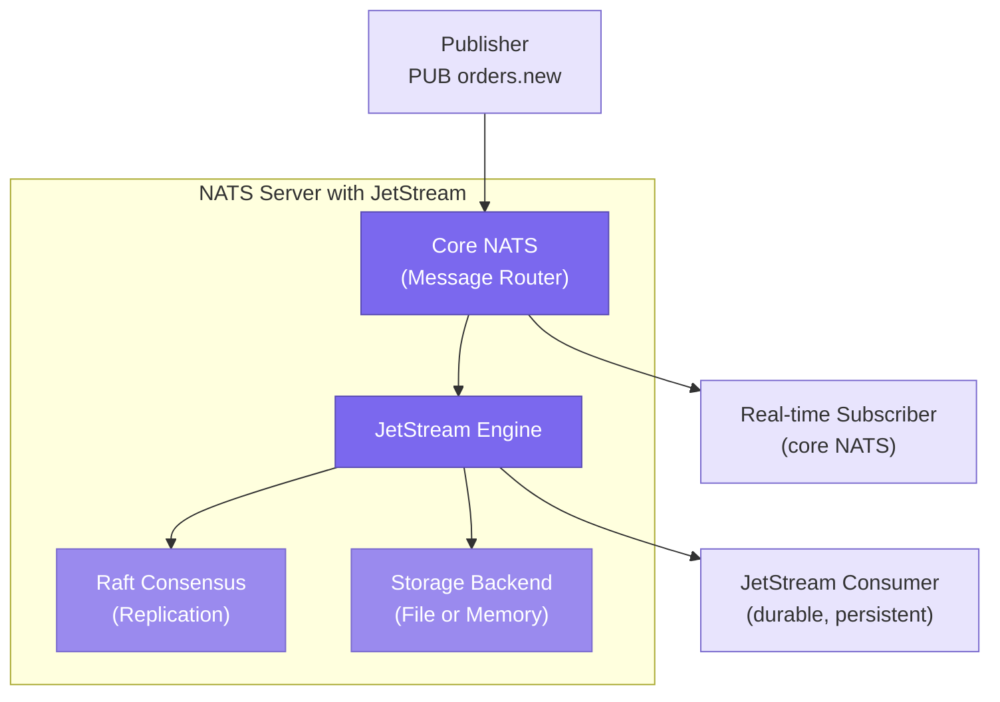
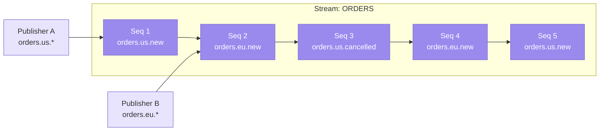
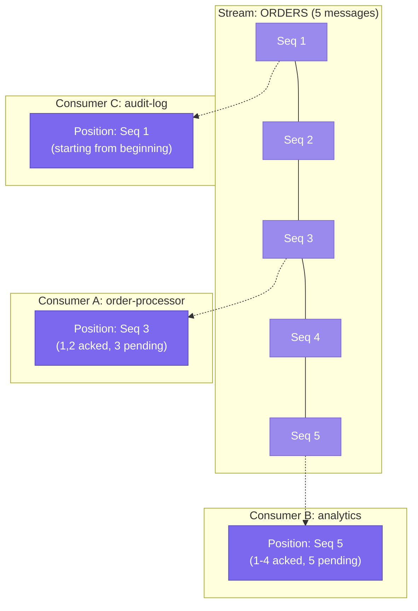
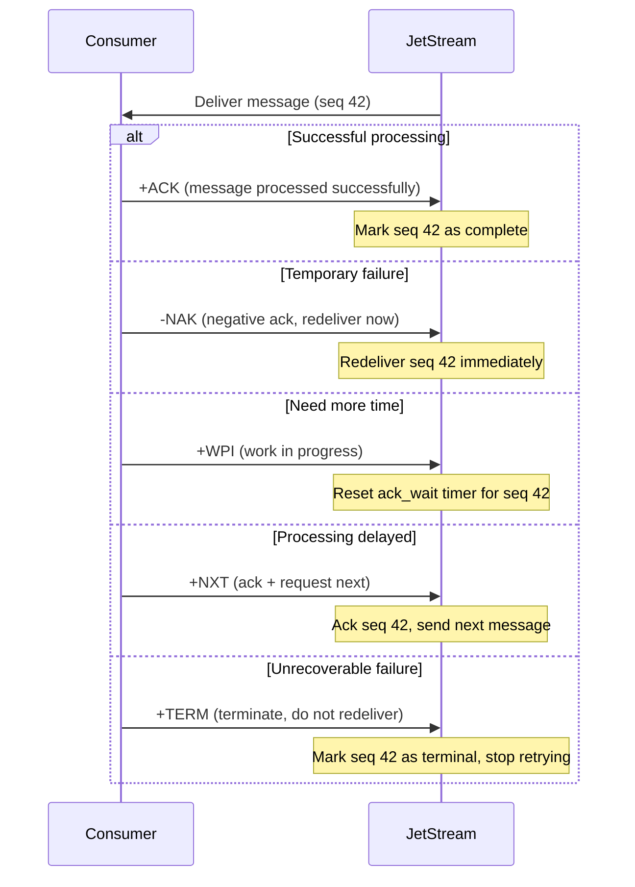
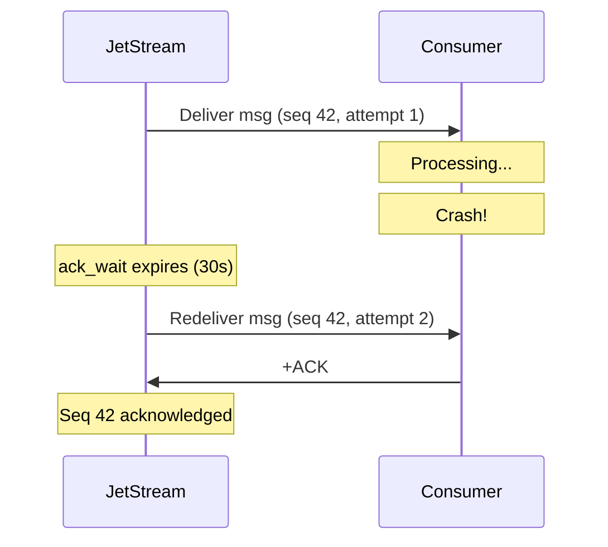
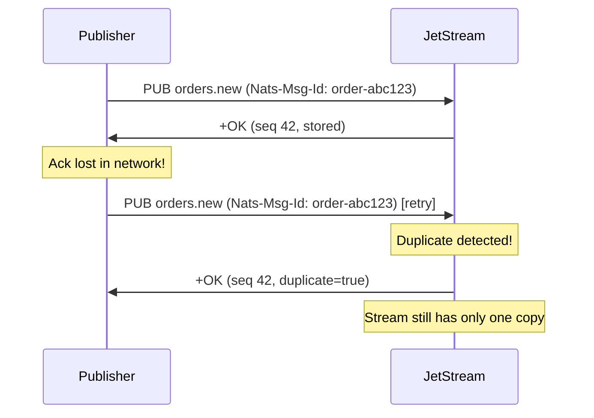
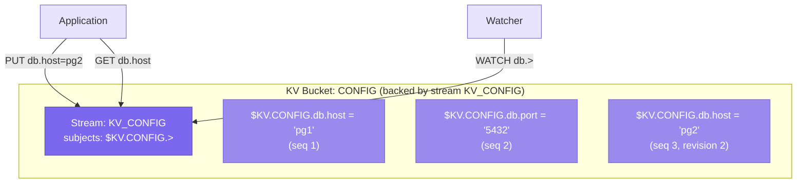
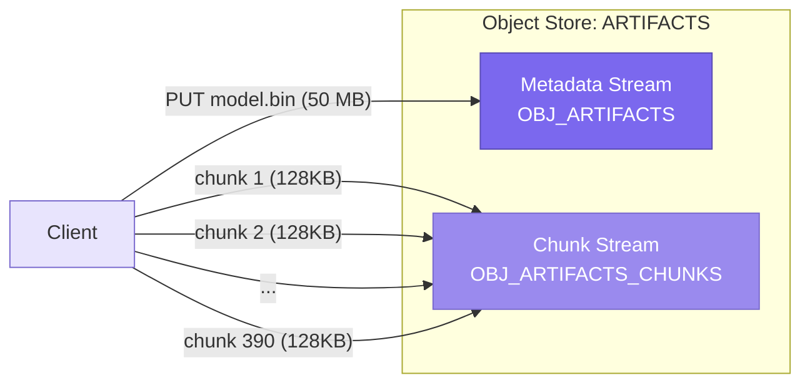
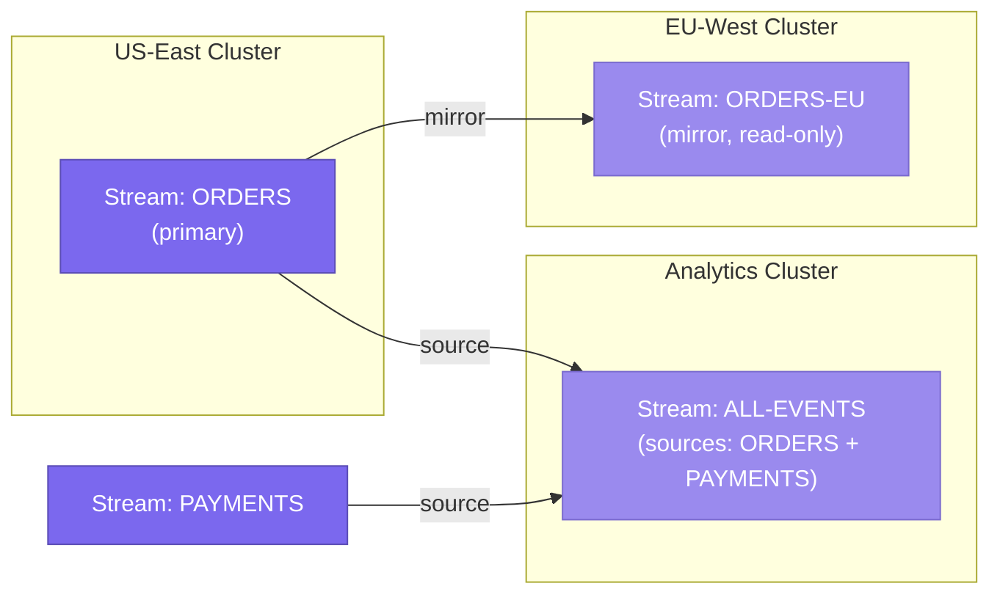

# NATS JetStream

> **TL;DR** — JetStream is the persistence and streaming layer built directly into the NATS server. It fills the gap between core NATS (blazing fast, at-most-once, no persistence) and the needs of real-world applications that require durable message storage, replay, at-least-once delivery, and exactly-once semantics. JetStream works by storing messages in durable **streams** and delivering them through configurable **consumers** — all using the same subjects and protocol as core NATS. On top of streams, JetStream provides a distributed **key-value store** and an **object store**, making NATS a single infrastructure component that can replace multiple specialized systems.

---

## Table of Contents

- [Why This Matters](#why-this-matters)
- [What Is JetStream?](#what-is-jetstream)
- [JetStream Architecture](#jetstream-architecture)
  - [How JetStream Builds on Core NATS](#how-jetstream-builds-on-core-nats)
  - [Streams](#streams)
  - [Stream Configuration](#stream-configuration)
  - [Consumers](#consumers)
  - [Consumer Acknowledgment](#consumer-acknowledgment)
- [Delivery Semantics in JetStream](#delivery-semantics-in-jetstream)
  - [At-Least-Once Delivery](#at-least-once-delivery)
  - [Exactly-Once Semantics](#exactly-once-semantics)
  - [Idempotent Consumers](#idempotent-consumers)
- [Advanced JetStream Features](#advanced-jetstream-features)
  - [Key-Value Store](#key-value-store)
  - [Object Store](#object-store)
  - [Sourcing and Mirroring](#sourcing-and-mirroring)
  - [Subject Transforms](#subject-transforms)
- [JetStream vs NATS Streaming (STAN)](#jetstream-vs-nats-streaming-stan)
- [Key Takeaways](#key-takeaways)
- [References](#references)

---

## Why This Matters

Core NATS is extraordinary for real-time messaging, but many applications need more. An order processing system cannot afford to lose a message if a consumer restarts. An audit log must retain events for days or months. A microservice that was offline for an hour needs to catch up on missed events when it comes back. A CQRS system needs to replay the full event history to rebuild a read model.

Before JetStream, you had two choices: use core NATS and accept its at-most-once semantics, or add a second system (Kafka, RabbitMQ, or the now-deprecated NATS Streaming) for persistence. JetStream eliminates this dilemma by embedding a full streaming and persistence engine inside the same `nats-server` binary. There is no separate process, no additional deployment, no new protocol to learn.

This matters architecturally because it means you can use a single infrastructure component for both ephemeral messaging (core NATS) and durable streaming (JetStream) in the same application, on the same subjects, with the same client library. The result is dramatically reduced operational complexity.

---

## What Is JetStream?

JetStream is a **built-in persistence layer** for the NATS server. It was introduced in NATS Server 2.2 (2021) as the successor to NATS Streaming (STAN), a separate server process that sat alongside NATS but had fundamental architectural limitations.

The key design decisions behind JetStream:

| Decision | Rationale |
|----------|-----------|
| **Built into `nats-server`** | No separate process, no separate deployment, no separate protocol. JetStream is enabled with a single configuration flag or command-line argument (`--jetstream`). |
| **Same subjects, same protocol** | A message published to `orders.new` can be captured by a JetStream stream without the publisher knowing. Subscribers can read from JetStream using the same subjects. |
| **Additive, not replacing** | JetStream does not change core NATS behavior. Core pub/sub, request-reply, and queue groups work exactly as before. JetStream adds persistence *alongside* the existing real-time routing. |
| **RAFT-based replication** | Stream data is replicated across servers using the Raft consensus protocol, providing high availability and consistency guarantees. |
| **Multi-tenant** | JetStream respects NATS accounts. Each account has its own streams, consumers, and resource limits. |



Notice the dual path: a publisher sends a message to `orders.new`, and that message is simultaneously delivered to any real-time core NATS subscribers *and* stored in the JetStream stream (if a stream is configured to capture that subject). This dual path is fundamental to understanding JetStream — it does not replace core NATS; it observes and stores the same message flow.

---

## JetStream Architecture

### How JetStream Builds on Core NATS

The genius of JetStream's design is that it is **layered on top of core NATS** rather than being a parallel system. When you create a stream that captures `orders.>`, the JetStream engine internally subscribes to `orders.>` on the core NATS message router — just like any other subscriber. When a message arrives, it stores the message in the stream's backing store and acknowledges persistence back to the publisher (if the publisher requested acknowledgment).

This means:

- **Publishers do not need to know about JetStream.** A service publishing to `orders.new` works identically whether or not a stream is capturing that subject.
- **JetStream subjects are core NATS subjects.** There is no separate "JetStream topic" concept. You subscribe to the same subjects you always have.
- **JetStream administration uses core NATS.** Stream and consumer management happens through special API subjects (`$JS.API.STREAM.CREATE`, etc.) using the standard NATS request-reply pattern.

### Streams

A **stream** is a durable, ordered sequence of messages. It is the fundamental storage abstraction in JetStream.



Key properties of streams:

- **Subject association.** A stream captures messages from one or more subjects. The `ORDERS` stream above captures `orders.>` (all subjects starting with `orders.`). A message published to `orders.us.new` lands in this stream.
- **Sequential numbering.** Every message in a stream gets a unique, monotonically increasing sequence number. This enables precise replay, gap detection, and consumer position tracking.
- **Original subject preserved.** Even though messages from different subjects are interleaved in a single stream, each message retains its original subject. Consumers can filter by subject within the stream.
- **Retention policies.** Streams support three retention policies that control when messages are deleted.
- **Storage backends.** Messages can be stored on **file** (default, durable, survives restart) or in **memory** (faster, lost on restart).
- **Replication.** Streams can be replicated across 1, 3, or 5 servers using Raft consensus for high availability.

**Retention Policies:**

| Policy | Behavior | Use Case |
|--------|----------|----------|
| **Limits** (default) | Messages are retained until the stream hits a configured limit (max messages, max bytes, or max age), then oldest messages are discarded. | General-purpose event storage, logs, audit trails |
| **Interest** | Messages are retained only as long as there are active consumers. Once all consumers have acknowledged a message, it is eligible for deletion. | Multi-consumer fan-out where long-term storage is not needed |
| **Work Queue** | Each message is removed after being acknowledged by exactly one consumer. The stream acts as a durable, persistent work queue. | Task distribution, job queues, command processing |

### Stream Configuration

Streams are highly configurable. Here are the most important configuration options:

| Configuration | Description | Default |
|--------------|-------------|---------|
| `name` | Unique name for the stream | (required) |
| `subjects` | List of subjects to capture (e.g., `["orders.>"]`) | (required) |
| `retention` | Retention policy: `limits`, `interest`, or `workqueue` | `limits` |
| `storage` | Storage backend: `file` or `memory` | `file` |
| `replicas` | Number of replicas (1, 3, or 5) | `1` |
| `max_msgs` | Maximum number of messages in the stream | unlimited |
| `max_bytes` | Maximum total size of the stream in bytes | unlimited |
| `max_age` | Maximum age of messages (e.g., `24h`, `7d`) | unlimited |
| `max_msg_size` | Maximum size of a single message | `1 MB` |
| `discard` | When limits are reached: `old` (discard oldest) or `new` (reject new messages) | `old` |
| `duplicate_window` | Time window for message deduplication | `2 minutes` |
| `num_replicas` | Replication factor for HA | `1` |
| `allow_rollup` | Allow purging via header roll-ups (used by KV store) | `false` |

**Discard policies** deserve attention:

- **`discard: old`** (default): When the stream is full, the oldest messages are removed to make room for new ones. This is the right choice for most streaming scenarios — you want to keep accepting new data even if it means losing old data.
- **`discard: new`**: When the stream is full, new messages are rejected. This is useful when you absolutely cannot lose old messages and prefer to apply backpressure to publishers instead.

**Duplicate window:** JetStream uses the `Nats-Msg-Id` header to detect duplicate messages within the configured time window. If a publisher retries a message (e.g., because it did not receive the publish acknowledgment), and the duplicate lands within the window, JetStream silently deduplicates it. This is a critical building block for exactly-once semantics.

### Consumers

A **consumer** is a named, stateful view into a stream. It tracks which messages have been delivered and acknowledged, enabling each consumer to independently progress through the stream at its own pace.



**Push vs Pull Consumers:**

JetStream supports two delivery models for consumers:

| Aspect | Push Consumer | Pull Consumer |
|--------|--------------|---------------|
| **How it works** | Server pushes messages to a configured delivery subject. The consumer subscribes to that subject. | Client explicitly requests a batch of messages from the server when ready. |
| **Flow control** | Server-side. The server decides when to send messages. Flow control headers prevent overwhelming the client. | Client-side. The client decides when and how many messages to request. Natural backpressure. |
| **Queue group support** | Yes, via delivery subject + queue group | Yes, multiple clients can pull from the same consumer |
| **Scaling** | Trickier — requires careful flow control tuning | Simpler — clients pull at their own pace |
| **Recommended** | Legacy use, simple notification pipelines | **Preferred for most new applications** |

**Why pull consumers are preferred:** Pull consumers give the client explicit control over message flow. The client says "give me 10 messages" and processes them. When done, it asks for 10 more. This eliminates an entire class of problems around slow consumers, buffer overflows, and flow control tuning. The NATS team recommends pull consumers for virtually all new development.

**Durable vs Ephemeral Consumers:**

| Type | Behavior | Use Case |
|------|----------|----------|
| **Durable** | Has a name. Survives client disconnection. The server remembers the consumer's position. | Production workloads, any consumer that needs to resume from where it left off. |
| **Ephemeral** | No name (or auto-generated). Deleted when the client disconnects (after an inactivity threshold). | Temporary queries, debugging, one-off replays. |

**Consumer Configuration Options:**

| Configuration | Description |
|--------------|-------------|
| `durable_name` | Name for a durable consumer |
| `deliver_policy` | Where to start: `all` (beginning), `last` (last message), `new` (only new), `by_start_sequence`, `by_start_time`, `last_per_subject` |
| `ack_policy` | How to acknowledge: `explicit`, `none`, `all` |
| `ack_wait` | How long the server waits for an ack before redelivering (default: 30s) |
| `max_deliver` | Maximum number of delivery attempts before giving up (-1 for unlimited) |
| `filter_subject` | Only deliver messages matching this subject from the stream |
| `max_ack_pending` | Maximum number of unacknowledged messages (flow control) |
| `backoff` | Custom backoff schedule for redelivery (e.g., `[1s, 5s, 30s, 5m]`) |

### Consumer Acknowledgment

Acknowledgment is the mechanism by which a consumer tells the server it has successfully processed a message. JetStream provides several acknowledgment modes and response types:

**Ack Policies:**

| Policy | Behavior |
|--------|----------|
| `AckExplicit` | Each message must be individually acknowledged. The server tracks per-message state. This is the default and recommended policy. |
| `AckNone` | No acknowledgment required. The server considers messages delivered as soon as they are sent. Use for non-critical, high-throughput workloads. |
| `AckAll` | Acknowledging sequence N implicitly acknowledges all messages with sequence <= N. Similar to Kafka's offset commit. Reduces ack traffic but risks reprocessing on failure. |

**Ack Response Types:**



| Response | Meaning | Effect |
|----------|---------|--------|
| `+ACK` | Message processed successfully | Message marked as acknowledged, not redelivered |
| `-NAK` | Negative acknowledgment | Message redelivered immediately (or after backoff) |
| `+WPI` | Work in progress | Ack wait timer is reset; gives the consumer more time |
| `+NXT` | Ack and request next | Shorthand for ack + pull next (pull consumers only) |
| `+TERM` | Terminate delivery | Message is never redelivered, even if max_deliver is not reached |

**Backoff policies** allow you to specify a custom redelivery schedule for NAK'd messages. Instead of retrying immediately, you can configure exponential or custom backoff:

```
backoff: [1s, 5s, 30s, 2m, 10m]
```

This means: first retry after 1 second, second after 5 seconds, third after 30 seconds, and so on. This is invaluable for handling transient failures (database temporarily unavailable, rate-limited API) without hammering the failing dependency.

---

## Delivery Semantics in JetStream

### At-Least-Once Delivery

At-least-once is the **default delivery guarantee** in JetStream when using `AckExplicit`:

1. The server delivers a message to the consumer.
2. If the consumer does not acknowledge within `ack_wait`, the server redelivers the message.
3. This continues up to `max_deliver` times.

The implication is that a consumer may see the same message more than once — especially during failures, restarts, or slow processing. Your application must be prepared to handle duplicate delivery.



### Exactly-Once Semantics

JetStream provides mechanisms for exactly-once semantics, but it is important to understand that true exactly-once is achieved through a combination of server-side and client-side techniques.

**Publisher-side deduplication:**

When publishing, include a `Nats-Msg-Id` header with a unique identifier for each logical message:

```
HPUB orders.new 48 30
Nats-Msg-Id: order-abc123-created
NATS/1.0\r\n\r\n
{"order_id":"abc123","event":"created"}
```

If the publisher retries (e.g., because it did not receive the publish ack due to a network hiccup), JetStream compares the `Nats-Msg-Id` against its deduplication window. If the ID has been seen before, the duplicate is silently discarded. The publisher receives a successful ack, and the stream contains exactly one copy of the message.



**Consumer-side double acknowledgment:**

For exactly-once consumption, JetStream supports a **double ack protocol**. When a consumer sends an ack, the server responds with a confirmation that the ack was received. This eliminates the "ack lost in transit" failure mode:

1. Consumer processes message.
2. Consumer sends `+ACK`.
3. Server processes the ack and sends a confirmation back to the consumer.
4. Consumer receives confirmation, completing the exactly-once cycle.

Without double ack, the consumer sends `+ACK` but does not know if the server received it. If the ack is lost, the server redelivers the message, and the consumer sees it again — breaking exactly-once.

### Idempotent Consumers

Even with JetStream's exactly-once machinery, the pragmatic approach to achieving exactly-once in a distributed system is to make your consumers **idempotent**. This means designing your message processing logic so that processing the same message twice produces the same result as processing it once.

Common idempotency strategies:

| Strategy | How It Works | Example |
|----------|-------------|---------|
| **Idempotency key** | Track processed message IDs in a database. Skip if already seen. | Store `Nats-Msg-Id` in a `processed_events` table |
| **Conditional writes** | Use database constraints to prevent duplicate effects. | `INSERT ... ON CONFLICT DO NOTHING` |
| **Version checks** | Only apply changes if the entity version matches expectations. | Optimistic concurrency control on the aggregate |
| **Natural idempotency** | Design operations that are inherently idempotent. | `SET balance = 100` is idempotent; `SET balance = balance + 10` is not |

**Practical advice:** Use JetStream's publisher-side deduplication to prevent duplicates from entering the stream. Use `AckExplicit` with double ack for critical consumers. And always design your consumers to be idempotent as a defense-in-depth measure. The combination of all three gives you effective exactly-once in practice.

---

## Advanced JetStream Features

### Key-Value Store

JetStream includes a built-in **distributed key-value store** that runs on top of streams. This sounds like a marketing feature, but the implementation is elegant and genuinely useful.

**How it works internally:**



The key-value store is implemented as:

1. **A JetStream stream** with one subject per key. A KV bucket named `CONFIG` creates a stream named `KV_CONFIG` with subjects `$KV.CONFIG.>`.
2. **Each PUT is a publish.** Setting `db.host = "pg2"` publishes a message to `$KV.CONFIG.db.host` with the value as payload.
3. **GET reads the last message for a subject.** Since the stream retains messages, reading the latest message on `$KV.CONFIG.db.host` gives you the current value.
4. **Log compaction** keeps only the latest value per key (using JetStream's `allow_rollup` and subject-based discard).
5. **Watch uses core NATS subscriptions.** Subscribing to `$KV.CONFIG.db.>` gives you real-time change notifications for all keys matching the pattern.

**KV Store operations:**

| Operation | Description |
|-----------|-------------|
| `PUT(key, value)` | Set the value for a key. Returns a revision number. |
| `GET(key)` | Get the current value and revision for a key. |
| `DELETE(key)` | Mark a key as deleted (tombstone). |
| `PURGE(key)` | Remove all history for a key. |
| `WATCH(key_pattern)` | Subscribe to changes for keys matching a pattern. |
| `HISTORY(key)` | Retrieve all revisions of a key. |
| `KEYS()` | List all keys in the bucket. |
| `CREATE(key, value)` | Set value only if the key does not exist (CAS). |
| `UPDATE(key, value, revision)` | Set value only if the current revision matches (CAS). |

**Use cases for the KV store:**

- **Configuration management.** Store service configuration (database URLs, feature flags, rate limits) with change watching. Services update their config in real time without polling.
- **Feature flags.** Toggle features across a fleet of services by updating a key. All services receive the change notification simultaneously.
- **Service discovery.** Services register themselves by writing to a KV bucket. Other services watch for changes to discover new instances.
- **Session storage.** Store user session data with TTLs. The KV store supports per-key TTLs through JetStream's max age configuration.
- **Leader election.** Use the `CREATE` (compare-and-swap) operation to implement simple leader election primitives.

**Why not just use Redis or etcd?** If your application already uses NATS, the KV store eliminates a separate infrastructure component. It is replicated via Raft (same as JetStream streams), supports change watching, and is accessible from any NATS client. For use cases that fit (configuration, feature flags, lightweight state), it meaningfully reduces operational complexity.

### Object Store

The object store extends JetStream to handle **large binary objects** — files, images, models, artifacts — that exceed NATS's default message size limit (1 MB).

**How it works:**

1. The client splits the large object into **chunks** (default: 128 KB each).
2. Each chunk is published as a separate message to a stream dedicated to the object store.
3. Metadata (filename, content type, total size, chunk count, SHA-256 digest) is stored in a companion KV-style stream.
4. Retrieval reassembles the chunks in order and verifies the digest.



**Use cases:**

- Distributing machine learning models to edge devices via NATS
- Sharing build artifacts between CI/CD pipeline stages
- Storing and retrieving configuration bundles (multi-file)
- Sharing large payloads between microservices without an external blob store

The object store supports **watching** for changes (just like the KV store), so a subscriber can be notified when a new version of an object is uploaded and download it automatically.

### Sourcing and Mirroring

JetStream supports replicating stream data across clusters for disaster recovery, data locality, and read scaling.

**Mirroring:** A mirror is a read-only copy of a source stream. It asynchronously replicates all messages from the source. If the source is in US-East and the mirror is in EU-West, EU consumers can read from the local mirror with low latency.

**Sourcing:** A stream can source messages from multiple other streams, combining them into a single aggregated stream. Unlike mirroring (one-to-one), sourcing is many-to-one.



**Disaster recovery pattern:** Maintain a mirror of critical streams in a separate cluster or region. If the primary fails, promote the mirror by creating a new stream with the same subjects. Clients reconnect (via NATS's built-in failover) and continue consuming.

### Subject Transforms

Subject transforms allow you to remap subjects when messages flow between streams, sources, or mirrors. This is useful for:

- **Namespace migration.** You renamed `orders.created` to `orders.new` but old publishers still use the old name. A subject transform maps the old subject to the new one.
- **Multi-tenant aggregation.** Multiple tenant streams (`tenant-a.orders.>`, `tenant-b.orders.>`) are sourced into a single analytics stream with subjects remapped to `analytics.orders.>`.
- **Version routing.** Map `api.v1.>` and `api.v2.>` to different streams based on version.

Subject transforms are configured at the stream level and applied automatically to every message as it flows through the source/mirror pipeline.

---

## JetStream vs NATS Streaming (STAN)

NATS Streaming (STAN) was the original persistence layer for NATS, but it had fundamental architectural problems that JetStream was designed to solve:

| Aspect | NATS Streaming (STAN) | JetStream |
|--------|----------------------|-----------|
| **Architecture** | Separate server process connected to NATS as a client | Built into `nats-server` |
| **Protocol** | Custom binary protocol layered on NATS | Native NATS protocol with headers |
| **Clustering** | Raft-based, but separate from NATS clustering | Integrated with NATS clustering and Raft |
| **Security** | Limited, separate from NATS auth | Full NATS security (accounts, JWTs, TLS) |
| **Multi-tenancy** | Not supported | Full account isolation |
| **Subjects** | STAN channels (separate from NATS subjects) | Regular NATS subjects |
| **Wildcards** | Not supported in subscriptions | Full wildcard support |
| **Key-Value Store** | Not available | Built-in |
| **Object Store** | Not available | Built-in |
| **Status** | **Deprecated** (end of life June 2023) | Active development, recommended |

**Migration path:** NATS Streaming was officially deprecated in 2023. The recommended migration is to replace STAN channels with JetStream streams and STAN subscriptions with JetStream consumers. Since JetStream uses standard NATS subjects, the migration often simplifies the overall architecture. The NATS documentation provides detailed migration guides.

---

## Key Takeaways

1. **JetStream is not a separate system — it is NATS with persistence.** It runs inside the same binary, uses the same protocol, and operates on the same subjects. This is its most important architectural property.

2. **Streams capture messages; consumers read them.** A stream is a durable, ordered sequence of messages. A consumer is a stateful cursor into a stream. Multiple consumers can independently progress through the same stream at different rates.

3. **Pull consumers are the recommended default.** They give clients explicit control over message flow, making them easier to scale, easier to reason about, and less prone to slow-consumer problems.

4. **Exactly-once requires cooperation.** Publisher-side deduplication (via `Nats-Msg-Id`) prevents duplicates from entering the stream. Consumer-side double ack prevents redelivery after acknowledgment. Idempotent consumer design provides defense in depth.

5. **Three retention policies serve different use cases.** Limits for general streaming, Interest for multi-consumer fan-out, and Work Queue for task distribution. Choose the right one and JetStream handles the cleanup.

6. **The KV store is genuinely useful, not a gimmick.** Built on the same stream primitives, it provides distributed key-value storage with change watching, CAS operations, and Raft-based replication — all without an additional infrastructure component.

7. **Sourcing and mirroring enable cross-cluster data flow.** Mirrors for disaster recovery and read locality, sources for stream aggregation — both operate asynchronously and integrate with JetStream's replication.

8. **JetStream replaced STAN.** NATS Streaming is deprecated. All new persistent messaging on NATS should use JetStream.

---

## References

- [JetStream Documentation](https://docs.nats.io/nats-concepts/jetstream) — Official JetStream concepts and configuration.
- [JetStream Streams](https://docs.nats.io/nats-concepts/jetstream/streams) — Detailed stream configuration guide.
- [JetStream Consumers](https://docs.nats.io/nats-concepts/jetstream/consumers) — Consumer types, delivery policies, and acknowledgment.
- [JetStream Key-Value Store](https://docs.nats.io/nats-concepts/jetstream/key-value-store) — KV store concepts and API.
- [JetStream Object Store](https://docs.nats.io/nats-concepts/jetstream/obj_store) — Object store usage and configuration.
- [Exactly-Once Delivery in NATS](https://docs.nats.io/using-nats/developer/develop_jetstream/model_deep_dive#exactly-once-semantics) — Deduplication and double ack protocol.
- [NATS Streaming to JetStream Migration](https://docs.nats.io/running-a-nats-service/nats_admin/jetstream_admin/disaster_recovery) — Migration guide for STAN users.
- [NATS by Example - JetStream](https://natsbyexample.com/) — Runnable JetStream code samples.
- [Synadia Blog - JetStream Deep Dive](https://www.synadia.com/blog) — Technical posts on JetStream internals.
- [NATS JetStream Design Specification](https://github.com/nats-io/nats-architecture-and-design) — Architecture Decision Records for JetStream.
- [Byron Ruth - "JetStream: NATS Persistence Engine" (KubeCon)](https://www.youtube.com/results?search_query=jetstream+nats+kubecon) — Conference talk on JetStream architecture.

---

*Next up: [NATS in Practice](./nats-in-practice.md)*
