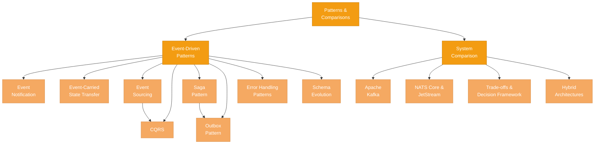

# Patterns & Comparisons

> **You understand the fundamentals, you have explored Kafka and NATS in depth — now it is time to put it all together.** This section covers the practical patterns that make event-driven microservices work in production, and gives you a structured framework for choosing the right messaging system for your use case.

---

## What This Section Covers

Knowing how a messaging system works under the hood is necessary, but not sufficient. The real challenge is applying that knowledge to solve architectural problems: How do you keep data consistent across services without distributed transactions? How do you evolve schemas without breaking consumers? How do you decide between Kafka, NATS Core, and NATS JetStream for a given workload?

This section bridges the gap between **theory and practice**. The first page focuses on **event-driven microservice patterns** — the battle-tested architectural recipes (CQRS, Event Sourcing, Sagas, Outbox, and more) that solve real problems in distributed systems. The second page provides a **structured comparison** of the messaging systems covered in this knowledge base, with concrete guidance on when to use which.

---

## Concept Map

The diagram below shows how the topics in this section relate to one another. Start from "Patterns & Comparisons" in the center and trace outward.

---

## Pages in This Section

| # | Page | What You Will Learn |
|---|------|---------------------|
| 1 | [Event-Driven Microservices](./event-driven-microservices.md) | The core event-driven patterns (Notification, State Transfer, Event Sourcing, CQRS), distributed transaction strategies (Saga, Outbox, Inbox), error handling patterns (DLQ, retry, circuit breaker), schema evolution, and anti-patterns to avoid. |
| 2 | [Choosing a Messaging System](./choosing-a-messaging-system.md) | A structured comparison of Apache Kafka, NATS Core, and NATS JetStream across architecture, performance, features, and operational complexity — with a decision matrix and flowchart to guide your choice. |

---

## Suggested Reading Order

1. **Start with [Event-Driven Microservices](./event-driven-microservices.md).** This page equips you with the architectural patterns you will need regardless of which messaging system you choose. Understanding Sagas, CQRS, and the Outbox pattern will make the trade-offs in the comparison page much more concrete.

2. **Then read [Choosing a Messaging System](./choosing-a-messaging-system.md).** With the patterns fresh in your mind, you will be able to evaluate each system not just on raw features, but on how well it supports the patterns your architecture actually needs.

3. **After completing this section**, you will have the full picture — from [messaging foundations](../01-messaging-foundations/README.md) through technology deep dives on [Kafka](../02-apache-kafka/README.md) and [NATS](../03-nats/README.md), all the way to production patterns and informed system selection.

---

## Prerequisites

This section assumes you have read (or are comfortable with) the material in the previous sections:

- **[Messaging Foundations](../01-messaging-foundations/README.md)** — delivery semantics, messaging paradigms, broker architecture
- **[Apache Kafka](../02-apache-kafka/README.md)** — partitions, consumer groups, log-based storage (helpful but not strictly required)
- **[NATS](../03-nats/README.md)** — core NATS, JetStream, subject-based addressing (helpful but not strictly required)

If you skipped the technology-specific sections, you can still follow along — we recap key concepts where relevant — but you will get more out of the comparisons if you have seen the systems in detail first.

---

*Next up: [Event-Driven Microservices](./event-driven-microservices.md)*
