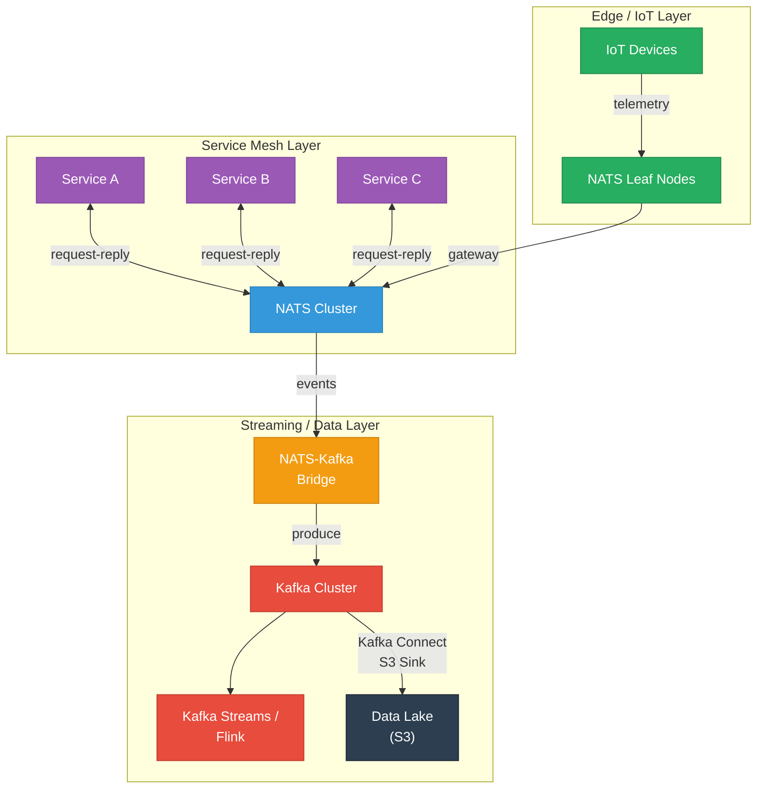
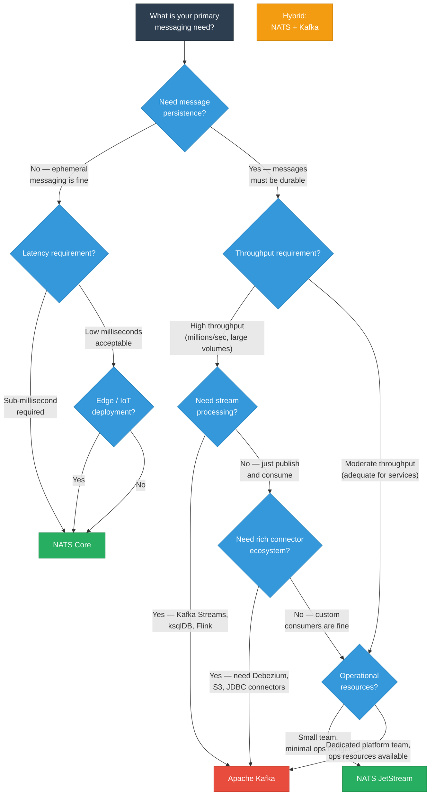

# Choosing a Messaging System: Kafka vs NATS

> **TL;DR** — Apache Kafka is the heavyweight champion for high-throughput event streaming, log-based storage, and ecosystem richness. NATS (Core + JetStream) is the lightweight contender for low-latency messaging, operational simplicity, and cloud-native deployments. They solve overlapping but distinct problems, and in many architectures the right answer is to use both. This page gives you the structured comparison and decision framework to make an informed choice.

---

## Table of Contents

- [Why This Matters](#why-this-matters)
- [Systems Under Comparison](#systems-under-comparison)
- [Architecture Comparison](#architecture-comparison)
- [Performance Comparison](#performance-comparison)
  - [Latency Profiles](#latency-profiles)
  - [Throughput Characteristics](#throughput-characteristics)
  - [Resource Footprint](#resource-footprint)
  - [Scaling Characteristics](#scaling-characteristics)
- [Feature Comparison](#feature-comparison)
- [Operational Complexity](#operational-complexity)
  - [Kafka Operations](#kafka-operations)
  - [NATS Operations](#nats-operations)
  - [Day-2 Operations Comparison](#day-2-operations-comparison)
- [Use Case Decision Matrix](#use-case-decision-matrix)
- [Can They Coexist?](#can-they-coexist)
- [Migration Considerations](#migration-considerations)
- [Decision Flowchart](#decision-flowchart)
- [Key Takeaways](#key-takeaways)
- [References](#references)

---

## Why This Matters

Choosing a messaging system is one of the most consequential infrastructure decisions a team makes. It is hard to reverse, it shapes your architecture, and it affects every team that builds on top of it. The wrong choice does not usually cause a dramatic failure — it causes a slow, steady accumulation of friction: operational overhead that drains your platform team, performance characteristics that don't match your workload, or missing features that force you to build workarounds.

The goal of this page is not to declare a winner. Kafka and NATS are both excellent systems built for different primary use cases. The goal is to give you a clear, honest framework so that when someone asks "why did we choose X?" you have a better answer than "it's what our last company used."

---

## Systems Under Comparison

### Apache Kafka

Kafka is a distributed event streaming platform originally built at LinkedIn and open-sourced in 2011. It models messages as an **append-only, partitioned, replicated log** that persists to disk. Kafka is designed for high-throughput, durable event streaming with strong ordering guarantees within partitions. Its ecosystem (Kafka Connect, Kafka Streams, ksqlDB, Schema Registry) makes it a full-featured data streaming platform.

### NATS Core

NATS Core is a lightweight, high-performance messaging system written in Go. It uses a **subject-based publish-subscribe** model with **at-most-once delivery** by default — messages are delivered to connected subscribers and then forgotten. NATS Core is designed for speed and simplicity: sub-millisecond latency, a tiny operational footprint, and a text-based protocol. It is not a log and does not persist messages.

### NATS JetStream

JetStream is NATS's built-in persistence layer, adding **durable streams, consumer acknowledgments, exactly-once delivery, replay, and key-value/object stores** on top of NATS Core. Think of it as NATS's answer to the durability features of Kafka, but with a fundamentally different architecture — it uses NATS's existing clustering (Raft-based) rather than requiring separate coordination infrastructure.

---

## Architecture Comparison

| Aspect | Apache Kafka | NATS Core | NATS JetStream |
|--------|-------------|-----------|----------------|
| **Protocol** | Binary (Kafka protocol over TCP) | Text-based (simple TCP, similar to Redis/SMTP) | Text-based (same NATS protocol, extended commands) |
| **Clustering model** | Broker cluster with KRaft controller quorum (formerly ZooKeeper). Partitions replicated across brokers. | Mesh cluster with full-mesh routing. No leader election needed — stateless by design. | Raft consensus per stream. Stream replicas placed across NATS servers. |
| **Persistence model** | Append-only log segments on disk per partition. Retention by time, size, or compaction. | None — fire-and-forget, in-memory only. | Append-only log per stream, stored on disk (file-based or memory-backed). |
| **Default delivery guarantee** | At-least-once (configurable to exactly-once with idempotent producers + transactions) | At-most-once — if no subscriber is connected, the message is dropped. | At-least-once (configurable to exactly-once with double-ack protocol). |
| **Ordering guarantees** | Total order within a partition. No ordering across partitions. | No ordering guarantees (best-effort). | Total order within a stream subject. Configurable per consumer. |
| **Message retention** | Configurable: time-based, size-based, or log compaction (keep latest per key). | None — messages are ephemeral. | Configurable: limits (time/size/count), interest-based, or work-queue policy. |
| **Consumer model** | Consumer groups with partition assignment. Each partition consumed by exactly one consumer in a group. | Queue groups for load balancing. Any subscriber can receive any message. | Push-based or pull-based consumers. Durable consumers with ack tracking. |
| **Built-in features** | Kafka Connect, Kafka Streams, Transactions, Log Compaction, Tiered Storage | Request-Reply, Wildcard Subjects, Leaf Nodes, Multi-Tenancy (accounts) | Key-Value Store, Object Store, Request-Reply, Subject Mapping, Mirror/Source streams |

---

## Performance Comparison

### Latency Profiles

Latency is where NATS and Kafka differ most dramatically.

| Metric | Kafka | NATS Core | NATS JetStream |
|--------|-------|-----------|----------------|
| **Publish latency (p50)** | 2-5 ms | 50-200 us | 0.5-2 ms |
| **Publish latency (p99)** | 10-50 ms | 0.5-1 ms | 5-15 ms |
| **End-to-end latency (p50)** | 5-15 ms | 100-500 us | 2-5 ms |
| **End-to-end latency (p99)** | 20-100 ms | 1-3 ms | 10-30 ms |

**Why Kafka is slower:** Every produce request in Kafka involves writing to the page cache, replicating to follower brokers (in-sync replicas), and acknowledging. The `acks=all` setting (recommended for durability) requires all ISRs to acknowledge before the producer gets a response. Batching (controlled by `linger.ms` and `batch.size`) trades latency for throughput.

**Why NATS is faster:** NATS Core does zero persistence — the message goes from TCP buffer to subscriber TCP buffer, often in a single event loop iteration. NATS JetStream adds persistence overhead but still benefits from NATS's efficient protocol and Go's low-overhead concurrency model.

**The practical takeaway:** If your use case requires sub-millisecond latency (real-time control planes, live gaming, high-frequency request-reply), NATS Core is the clear choice. If you can tolerate low-single-digit millisecond latency and need durability, both JetStream and Kafka work — but Kafka's latency floor is higher.

### Throughput Characteristics

| Metric | Kafka | NATS Core | NATS JetStream |
|--------|-------|-----------|----------------|
| **Max throughput (single broker)** | 500 MB/s - 1+ GB/s | 10-20 million msgs/s (small msgs) | 1-5 million msgs/s |
| **Max throughput (cluster)** | Scales linearly with brokers and partitions | Scales with servers (fan-out model) | Scales with streams and servers |
| **Batching** | Native batch support — key to high throughput | No batching (message-at-a-time) | Limited batching (pull-based consumers) |
| **Compression** | Native (gzip, snappy, lz4, zstd) | No native compression | No native compression |

**Why Kafka wins on throughput:** Kafka's sequential disk I/O, zero-copy transfer (`sendfile` syscall), native batching, and compression make it extraordinarily efficient at moving large volumes of data. A well-tuned Kafka cluster can sustain millions of messages per second with strong durability guarantees.

**Where NATS wins:** NATS Core's message-per-second count is very high for small messages because there's no disk I/O and minimal per-message overhead. But for high-bandwidth workloads (large messages, sustained throughput), Kafka's batching and compression give it a decisive advantage.

### Resource Footprint

| Resource | Kafka | NATS |
|----------|-------|------|
| **Runtime** | JVM (Java) — requires JVM tuning, GC pauses possible | Single Go binary — no runtime dependencies |
| **Minimum memory** | 4-8 GB heap recommended (plus page cache) | 64-256 MB typical |
| **Disk** | Requires fast disk (SSD recommended for low latency) | JetStream: modest disk; Core: none |
| **Binary size** | ~100 MB (plus JVM) | ~20 MB single binary |
| **Startup time** | 30-60 seconds (JVM warmup, log recovery) | 1-2 seconds |
| **Container image** | ~500 MB+ (JVM + Kafka) | ~20 MB (Alpine-based) |
| **CPU at idle** | Moderate (JVM background threads, GC) | Minimal |

This difference is not merely about being "lightweight" — it has real architectural consequences. NATS can run on edge devices, in sidecar containers, and in resource-constrained environments where Kafka simply cannot. Kafka's resource requirements mean it typically runs as a dedicated, centrally-managed cluster.

### Scaling Characteristics

| Aspect | Kafka | NATS |
|--------|-------|------|
| **Horizontal scaling** | Add brokers, then rebalance partitions (semi-manual, can be disruptive) | Add servers to cluster (automatic route discovery) |
| **Partition/stream scaling** | Must pre-plan partition count; increasing is possible but decreasing is not | Streams can be created, modified, and deleted dynamically |
| **Consumer scaling** | Limited by number of partitions (max consumers = partitions in a group) | No inherent limit — queue groups auto-balance |
| **Multi-region** | MirrorMaker 2 or Confluent Cluster Linking (non-trivial) | Leaf nodes, gateway connections, super-clusters (built-in) |

---

## Feature Comparison

| Feature | Kafka | NATS Core | NATS JetStream |
|---------|-------|-----------|----------------|
| **Persistence** | Yes — durable log | No | Yes — durable streams |
| **Exactly-once semantics** | Yes — idempotent producers + transactions | No | Yes — double-ack protocol |
| **Message replay** | Yes — seek to any offset | No | Yes — deliver from any sequence |
| **Log compaction / KV store** | Log compaction (keep latest per key) | No | Built-in Key-Value Store |
| **Stream processing** | Kafka Streams, ksqlDB (built-in) | No | No (use external tools) |
| **Connector ecosystem** | Kafka Connect — hundreds of connectors (Debezium, S3, JDBC, Elasticsearch, etc.) | Limited — community connectors | Limited — community connectors, NATS-Kafka bridge |
| **Schema registry** | Confluent Schema Registry (Avro, Protobuf, JSON Schema) | No built-in (use external) | No built-in (use external) |
| **Multi-tenancy** | Topic ACLs, quotas | Built-in accounts with subject isolation, permissions | Inherits NATS accounts |
| **Request-Reply** | Not native (build on top of topics) | First-class primitive | First-class primitive |
| **Wildcard subscriptions** | No (subscribe to specific topics) | Yes — `>` and `*` wildcards on subjects | Yes — same wildcards |
| **Edge / IoT support** | Not suitable (too resource-heavy) | Excellent — leaf nodes, tiny footprint | Good — JetStream on edge with leaf nodes |
| **Object storage** | No | No | Built-in Object Store |
| **WebSocket support** | Not native (requires proxy) | Built-in WebSocket gateway | Built-in (via NATS gateway) |
| **Dead letter queue** | Kafka Connect DLQ; consumer-side implementation | Consumer-side implementation | Consumer-side implementation (via max deliver + advisory) |

---

## Operational Complexity

### Kafka Operations

Kafka is a powerful but operationally demanding system. Here is what your platform team needs to manage:

**Cluster coordination:**
- Historically required a separate **ZooKeeper** ensemble (3-5 nodes) for metadata management, controller election, and configuration storage. ZooKeeper itself requires monitoring, patching, and capacity planning.
- **KRaft mode** (production-ready since Kafka 3.3) eliminates ZooKeeper, but migration from ZooKeeper to KRaft is a non-trivial operation for existing clusters.

**JVM tuning:**
- Kafka runs on the JVM, which means you need to tune heap size, garbage collection (G1GC is the standard), and monitor GC pauses. A long GC pause can cause a broker to appear dead to the cluster, triggering partition reassignment.
- Recommended: 6-8 GB heap for most workloads, dedicated machines (not colocated with other JVM apps).

**Topic and partition management:**
- Choosing the right number of partitions at topic creation time is critical — you can increase partitions later, but you can never decrease them, and increasing partitions breaks per-key ordering for existing keys.
- Rule of thumb: 3-6 partitions per topic per broker for most workloads, but high-throughput topics may need hundreds.

**Kafka Connect:**
- Running connectors requires a separate **Kafka Connect cluster** (additional JVM processes). Managing connector configurations, monitoring connector health, handling connector failures, and scaling connectors adds significant operational overhead.

**Monitoring:**
- Kafka exposes hundreds of JMX metrics. You need to collect, aggregate, and alert on: under-replicated partitions, ISR shrink/expand, consumer lag (critical!), request latency, log flush time, and network utilization.

### NATS Operations

NATS was designed with operational simplicity as a core value:

**Deployment:**
- Single static binary. No JVM, no runtime dependencies, no separate coordination service.
- Configuration is a single file (or flags). A production-ready config file is typically 20-50 lines.
- Container image is ~20 MB (Alpine-based). Starts in 1-2 seconds.

**Clustering:**
- Add a server to a cluster by pointing it at any existing server with `--routes`. Automatic route discovery handles the rest.
- JetStream replication uses Raft, which is built into the same binary — no separate consensus system to manage.

**Built-in tooling:**
- `nats` CLI for cluster inspection, stream management, consumer management, benchmarking, and diagnostics.
- Built-in health monitoring endpoint (`/healthz`).
- Built-in Prometheus metrics endpoint.

**Upgrades:**
- Rolling restarts with zero downtime. The binary is backward compatible; you can run mixed-version clusters during upgrades.

### Day-2 Operations Comparison

| Operation | Kafka | NATS |
|-----------|-------|------|
| **Upgrading** | Rolling restart, but test for JVM/GC regressions. ZooKeeper and KRaft migrations are complex. | Rolling restart. Single binary, minimal risk. |
| **Adding capacity** | Add broker, then rebalance partitions (can take hours for large clusters). | Add server, routes auto-discover. JetStream streams can be moved. |
| **Backup & restore** | Topic mirroring (MirrorMaker 2) or snapshot tools. Complex for large clusters. | Stream snapshots, stream mirroring (built-in). Straightforward. |
| **Monitoring** | JMX metrics (need collector like Prometheus JMX Exporter), consumer lag monitoring (Burrow or similar). | Native Prometheus endpoint. `nats` CLI for live inspection. |
| **Debugging** | Consumer lag analysis, partition skew detection, ISR issues. Requires Kafka expertise. | `nats` CLI, server advisory subjects, request tracing. Lower learning curve. |
| **Disaster recovery** | MirrorMaker 2, Cluster Linking (Confluent), or Stretch clusters. Non-trivial failover. | Super-clusters, leaf nodes, stream mirroring. Simpler multi-region story. |
| **Security** | SASL (SCRAM, OAUTHBEARER, Kerberos), TLS, ACLs per topic. | TLS, NKey/JWT auth, per-account/subject permissions, decentralized auth. |
| **Team expertise needed** | Dedicated Kafka/platform team recommended for production clusters. | Generalist infrastructure team can operate. |

---

## Use Case Decision Matrix

This table maps common use cases to the recommended system. Where both systems could work, the recommendation reflects which system has the stronger natural fit.

| Use Case | Recommended System | Why |
|----------|-------------------|-----|
| **High-throughput event streaming** (millions of events/sec, analytics pipelines) | **Kafka** | Batching, compression, sequential I/O, and the Kafka Streams/ksqlDB ecosystem are purpose-built for this. |
| **Microservice request-reply** (synchronous-style RPC over messaging) | **NATS Core** | First-class request-reply primitive with sub-millisecond latency. Kafka has no native request-reply. |
| **Lightweight persistent messaging** (durable queues, modest throughput) | **NATS JetStream** | Full persistence, ack-based delivery, and dramatically lower operational overhead than Kafka. |
| **Log aggregation** (centralized collection of application logs) | **Kafka** | Kafka's log-based retention, Kafka Connect sinks (Elasticsearch, S3), and high-volume ingestion are ideal. |
| **IoT / Edge messaging** (constrained devices, geo-distributed) | **NATS** | 20 MB binary, leaf nodes for edge-to-cloud, MQTT bridge, minimal resource requirements. Kafka cannot run at the edge. |
| **Change Data Capture (CDC)** (streaming database changes) | **Kafka** | Debezium + Kafka Connect is the industry standard for CDC. No equivalent in the NATS ecosystem. |
| **Real-time control plane** (service discovery, config push, live status) | **NATS Core** | Ephemeral pub-sub with wildcard subjects, sub-millisecond delivery, and built-in request-reply. |
| **Event Sourcing** | **Kafka** or **JetStream** | Kafka: proven at scale, infinite retention, log compaction for snapshots. JetStream: simpler operations, good for moderate scale. See trade-offs below. |
| **Cloud-native / Kubernetes-first** | **NATS** | NATS Operator, Helm charts, tiny pod footprint, fast startup. Kafka on K8s (Strimzi, Confluent Operator) works but is heavier. |
| **Data lake ingestion** (streaming to S3, HDFS, data warehouse) | **Kafka** | Kafka Connect S3 Sink, Kafka-native integration with Spark/Flink, tiered storage to S3. |
| **WebSocket fan-out** (real-time updates to browsers/mobile) | **NATS** | Built-in WebSocket gateway, wildcard subjects for topic hierarchy, lightweight server for high connection counts. |
| **Exactly-once stream processing** | **Kafka** | Kafka Streams with EOS (exactly-once semantics) is a mature, well-tested solution. |

**Event Sourcing trade-offs expanded:**

Kafka is the more proven choice for event sourcing at scale. Its append-only log model is a natural fit, infinite retention keeps events forever, and log compaction can serve as a snapshot mechanism. The Kafka Streams library can build projections directly.

NATS JetStream works well for event sourcing at moderate scale. Streams provide the append-only log, the Key-Value Store provides snapshots, and replay is built-in. The advantages are operational simplicity and lower resource requirements. The trade-off is that JetStream's ecosystem for building projections and stream processing is less mature — you will build more yourself.

---

## Can They Coexist?

**Yes, and often they should.** Kafka and NATS solve different problems, and many production architectures use both:

**Hybrid architecture pattern:**
- **NATS Core** handles real-time, low-latency microservice communication: request-reply, ephemeral notifications, service discovery signals, and control plane messaging.
- **NATS JetStream** provides lightweight persistent messaging for operational events that need durability but not the full weight of Kafka.
- **Kafka** handles the heavy-duty data streaming: CDC pipelines, event sourcing at scale, analytics streams, log aggregation, and data lake ingestion.
- A **NATS-Kafka bridge** (or custom service) connects the two worlds, forwarding relevant NATS events to Kafka topics for long-term retention and stream processing.

**When hybrid makes sense:**
- You have both low-latency request-reply AND high-throughput streaming workloads
- You operate at the edge (IoT, CDN) where Kafka can't run but NATS can
- Different teams have different needs — a platform team manages Kafka for data infrastructure while product teams use NATS for service-to-service messaging
- You want to keep your service mesh lightweight while feeding events into a heavy-duty analytics pipeline

**When hybrid is overkill:**
- You only have one type of messaging workload
- Your team is small and operating two messaging systems doubles the operational burden
- Your throughput and latency requirements are in the "either system works fine" zone

---

## Migration Considerations

Moving between messaging systems — or adding a second one — requires careful planning. Here is what to watch out for.

### Moving from Kafka to NATS JetStream

| Consideration | Details |
|---------------|---------|
| **Delivery semantics** | Kafka's consumer offset model maps to JetStream's consumer sequence tracking. Both support at-least-once; migration is straightforward. |
| **Partitioning → Subjects** | Kafka partitions don't map 1:1 to NATS subjects. Redesign your subject namespace. Use subject-based filtering instead of partition keys where possible. |
| **Kafka Connect** | No NATS equivalent. You lose the connector ecosystem. Plan to replace connectors with custom services or third-party tools. |
| **Stream processing** | Kafka Streams / ksqlDB don't exist in NATS. You need Flink, custom consumers, or a different stream processing approach. |
| **Schema Registry** | Confluent Schema Registry is Kafka-centric but can be used with NATS if you handle schema ID embedding yourself. |
| **Consumer groups** | Kafka consumer groups map to JetStream durable consumers. The rebalancing model is different — test thoroughly. |
| **Ordering** | Kafka guarantees per-partition order. JetStream guarantees per-subject order within a stream. Design subjects carefully. |

### Moving from NATS to Kafka

| Consideration | Details |
|---------------|---------|
| **Request-Reply** | Kafka has no native request-reply. You must build it with temporary response topics or switch those interactions to HTTP/gRPC. |
| **Wildcard subscriptions** | Kafka does not support wildcard topic subscriptions. You need explicit topic subscriptions or a naming convention with regex. |
| **Subject hierarchy** | NATS subjects (`orders.us.created`) don't map directly to Kafka topics. Flatten or encode the hierarchy into topic names. |
| **Operational weight** | Prepare for JVM tuning, ZooKeeper/KRaft management, and significantly higher resource requirements. |
| **Latency impact** | Expect p50 latency to increase from sub-millisecond to low-single-digit milliseconds. |

### General Migration Strategy

1. **Run both systems in parallel** — publish events to both during the migration window
2. **Migrate consumers first** — verify they work correctly on the new system while producers still write to the old one
3. **Use a bridge** — for the transition period, bridge events between systems so both have complete data
4. **Migrate producers last** — switch producers to the new system after consumers are verified
5. **Keep the old system as a fallback** — don't decommission until you've run the new system in production for a confidence period (typically 2-4 weeks)

---

## Decision Flowchart

Use this flowchart as a starting point. It captures the most common decision factors, but every architecture has nuances that a flowchart cannot capture — use it as guidance, not gospel.

**Reading the flowchart:**

- If you need ephemeral, low-latency messaging (no persistence required), NATS Core is almost always the right answer.
- If you need persistence, the next question is throughput. High-throughput data streaming with stream processing or a rich connector ecosystem points to Kafka. Moderate throughput with a preference for operational simplicity points to JetStream.
- If you need both patterns (low-latency service messaging AND high-throughput data streaming), consider the hybrid approach.

---

## Key Takeaways

1. **Kafka and NATS are not competitors — they are complementary tools** designed for different primary use cases. Kafka excels at high-throughput, durable event streaming and data pipelines. NATS excels at low-latency, operationally simple service-to-service messaging.

2. **Operational complexity is a real cost.** Kafka requires dedicated expertise — JVM tuning, partition management, ZooKeeper/KRaft, Kafka Connect. NATS deploys as a single binary with minimal configuration. Factor operational burden into your decision alongside raw feature comparisons.

3. **Latency profiles differ by an order of magnitude.** NATS Core delivers sub-millisecond latency. Kafka's latency floor is low-single-digit milliseconds with `acks=all`. If you need true real-time response, NATS Core is the only option in this comparison.

4. **Kafka's ecosystem is its moat.** Kafka Connect, Schema Registry, Kafka Streams, ksqlDB, Debezium — the ecosystem around Kafka is vast and mature. NATS's ecosystem is growing but cannot match Kafka's breadth for data integration and stream processing.

5. **NATS shines at the edge and in resource-constrained environments.** Its 20 MB binary, 64 MB memory footprint, and leaf node architecture make it viable in places where Kafka simply cannot run — edge devices, sidecar containers, IoT gateways.

6. **JetStream is a credible Kafka alternative for moderate-scale persistent messaging.** If you don't need Kafka Streams, a massive connector ecosystem, or extreme throughput, JetStream gives you durable messaging with dramatically lower operational overhead.

7. **Hybrid architectures are legitimate.** Using NATS for service-to-service messaging and Kafka for data streaming is a pattern used in production at multiple organizations. The NATS-Kafka bridge makes this practical.

8. **The right choice depends on your constraints**, not on which system is "better." Consider: your team's expertise, your operational capacity, your latency and throughput requirements, your need for stream processing and connectors, and whether you need to run at the edge. The decision matrix and flowchart above will get you to a sound starting point.

---

## References

- Kreps, J. (2013). ["The Log: What every software engineer should know about real-time data's unifying abstraction"](https://engineering.linkedin.com/distributed-systems/log-what-every-software-engineer-should-know-about-real-time-datas-unifying) — The foundational essay on log-based messaging that motivated Kafka's design.
- Apache Kafka Documentation. ["Design"](https://kafka.apache.org/documentation/#design) — Kafka's official design documentation covering persistence, efficiency, and replication.
- NATS Documentation. ["NATS Concepts"](https://docs.nats.io/nats-concepts/overview) — Overview of NATS core concepts, subject-based messaging, and quality of service.
- NATS Documentation. ["JetStream"](https://docs.nats.io/nats-concepts/jetstream) — JetStream persistence model, streams, consumers, and exactly-once delivery.
- Confluent Blog. ["Kafka vs. NATS"](https://www.confluent.io/blog/) — Confluent's perspective on the Kafka ecosystem.
- Synadia (NATS). ["NATS Architecture"](https://docs.nats.io/nats-server/nats_server) — Server architecture, clustering, and security model.
- Debezium Documentation. ["Connectors"](https://debezium.io/documentation/reference/connectors/) — CDC connectors for Kafka Connect.
- Confluent. ["Kafka Connect"](https://docs.confluent.io/platform/current/connect/index.html) — The full connector ecosystem.
- Strimzi. ["Running Kafka on Kubernetes"](https://strimzi.io/) — Kafka operator for Kubernetes deployments.
- NATS. ["NATS Kubernetes Operator"](https://github.com/nats-io/nats-operator) — NATS operator for Kubernetes.
- Tyler Treat. ["You Cannot Have Exactly-Once Delivery"](https://bravenewgeek.com/you-cannot-have-exactly-once-delivery/) — A nuanced exploration of delivery semantics relevant to both systems.
- Stopford, B. (2018). *Designing Event-Driven Systems*. O'Reilly Media / Confluent. — Broader architectural patterns applicable to both Kafka and NATS.

---

*Previous: [Event-Driven Microservices](./event-driven-microservices.md) | Back to [Section Overview](./README.md)*
