# Event-Driven Microservices: Patterns for Production

> **TL;DR** — Event-driven architecture is more than just publishing and subscribing. Production systems need patterns like CQRS, Event Sourcing, Sagas, and the Transactional Outbox to handle consistency, scalability, and failure gracefully. This page covers the core event patterns, distributed transaction strategies, error handling mechanisms, schema evolution practices, and anti-patterns to avoid — everything you need to design event-driven microservices that actually work at scale.

---

## Table of Contents

- [Why This Matters](#why-this-matters)
- [Event-Driven Architecture Revisited](#event-driven-architecture-revisited)
- [Core Event Patterns](#core-event-patterns)
  - [Event Notification](#1-event-notification)
  - [Event-Carried State Transfer](#2-event-carried-state-transfer)
  - [Event Sourcing](#3-event-sourcing)
  - [CQRS — Command Query Responsibility Segregation](#4-cqrs--command-query-responsibility-segregation)
- [Distributed Transaction Patterns](#distributed-transaction-patterns)
  - [The Problem: Why 2PC Falls Short](#the-problem-why-2pc-falls-short)
  - [Saga Pattern](#saga-pattern)
  - [Transactional Outbox Pattern](#transactional-outbox-pattern)
  - [Inbox Pattern](#inbox-pattern)
- [Error Handling Patterns](#error-handling-patterns)
  - [Dead Letter Queues](#dead-letter-queues)
  - [Retry with Backoff](#retry-with-backoff)
  - [Circuit Breaker](#circuit-breaker)
- [Schema Evolution](#schema-evolution)
- [Anti-Patterns to Avoid](#anti-patterns-to-avoid)
- [Key Takeaways](#key-takeaways)
- [References](#references)

---

## Why This Matters

You have learned how messaging systems work — brokers, topics, delivery guarantees, consumer groups. But knowing the mechanics of Kafka or NATS does not tell you **how to architect a system** with them. The gap between "I can publish a message" and "I can build a reliable, maintainable event-driven platform" is where most teams struggle.

This page covers the patterns that bridge that gap. These are not theoretical exercises — they are the solutions that engineering teams at companies like Netflix, Uber, Shopify, and Wealthsimple have converged on after years of operating event-driven systems in production. Understanding them will help you:

- **Choose the right event style** for each interaction between services
- **Maintain data consistency** across service boundaries without distributed transactions
- **Handle failures gracefully** so that a crashed consumer does not corrupt your business state
- **Evolve your system** over time without coordinated "big bang" deployments

Every pattern here comes with trade-offs. There is no silver bullet — only informed decisions. Let's get into it.

---

## Event-Driven Architecture Revisited

Before we dive into patterns, let's establish a shared mental model. In an event-driven architecture (EDA), services communicate by producing and consuming **events** — records of things that happened. Unlike synchronous REST calls, the producer does not wait for the consumer to respond and typically does not even know who the consumers are.

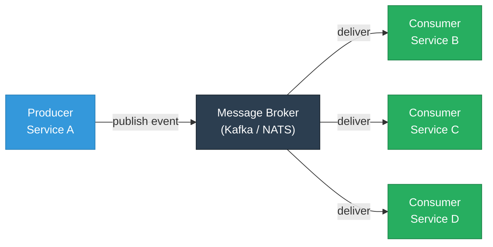

This decoupling is the core value proposition: services can evolve independently, scale independently, and fail independently. But decoupling introduces new challenges — eventual consistency, message ordering, duplicate processing, and distributed failure modes — that the patterns below address.

The question is not whether to use events, but **what kind of events** and **what patterns** to wrap around them.

---

## Core Event Patterns

Martin Fowler identifies three distinct styles of event-driven integration. Each carries different trade-offs for coupling, data freshness, and complexity. Let's examine each one, plus the closely related CQRS pattern.

### 1. Event Notification

**The idea:** An event is a minimal signal — "something happened" — that carries just enough information to identify what changed (typically an entity type and ID). Consumers who need details must call back to the producing service to fetch them.

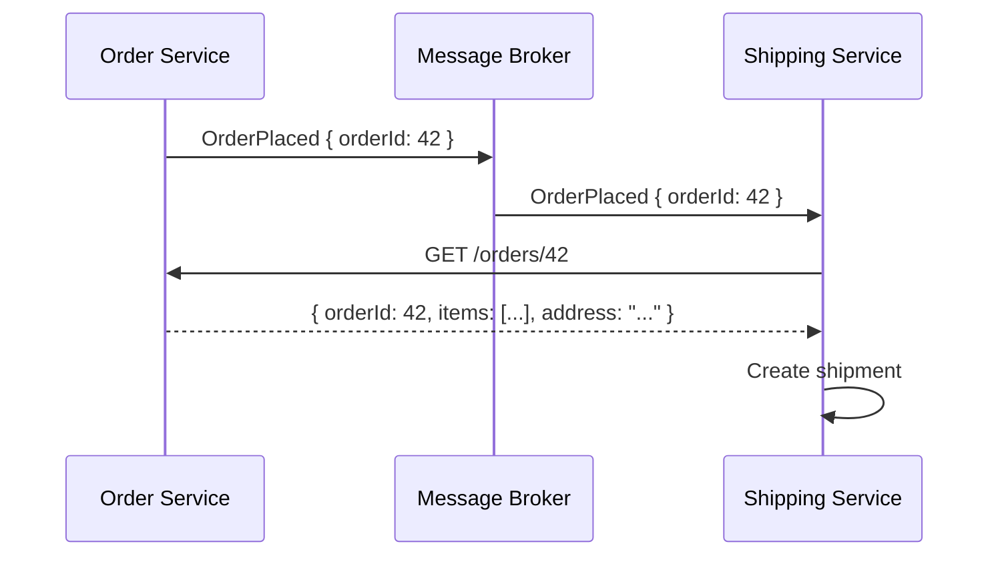

**What the event looks like:**

```json
{
  "type": "OrderPlaced",
  "orderId": "order-42",
  "timestamp": "2025-03-15T10:30:00Z"
}
```

Notice how small this is — no line items, no shipping address, no payment details. Just the fact that an order was placed and its ID.

**Pros:**
- Simple to implement — events are tiny and easy to define
- Low coupling on the event schema — changes to order data don't require event format changes
- Producer controls the canonical data — consumers always get the latest version when they call back

**Cons:**
- **Runtime coupling** — the consumer needs the producer to be available to fetch details, partially negating the benefit of asynchronous messaging
- **Chattiness** — every consumer issues a callback, which can amplify load on the producer, especially with many consumers
- **Latency** — two network hops (receive event + fetch data) instead of one

**When to use it:** Low-stakes notifications where not all consumers need the full payload, or when the event data is large and only a few consumers care about the details.

---

### 2. Event-Carried State Transfer

**The idea:** Events carry the complete data that consumers need to do their job, eliminating the need for callbacks. Each consuming service builds its own local copy of the data it needs.

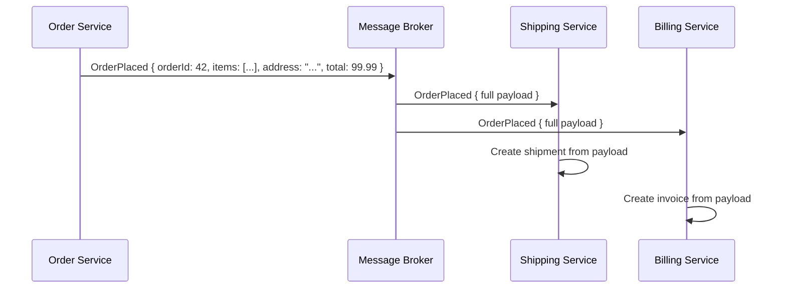

**What the event looks like:**

```json
{
  "type": "OrderPlaced",
  "orderId": "order-42",
  "timestamp": "2025-03-15T10:30:00Z",
  "customer": {
    "id": "cust-7",
    "name": "Ada Lovelace",
    "email": "ada@example.com"
  },
  "shippingAddress": {
    "street": "123 Babbage Lane",
    "city": "London",
    "postalCode": "SW1A 1AA"
  },
  "items": [
    { "sku": "WIDGET-01", "quantity": 2, "unitPrice": 29.99 },
    { "sku": "GADGET-05", "quantity": 1, "unitPrice": 40.01 }
  ],
  "totalAmount": 99.99,
  "currency": "GBP"
}
```

**Pros:**
- **Full autonomy** — consumers can process events without calling back to the producer; if the producer goes down, consumers keep working
- **Better performance** — single message, no extra network call
- **Natural caching** — each consumer holds a local projection of the data it needs, which can serve reads without cross-service calls

**Cons:**
- **Larger messages** — events can grow significantly, especially for complex aggregates
- **Data duplication** — the same data now lives in multiple services, which can drift if events are missed
- **Schema coupling** — changes to the event structure require coordination with consumers (mitigated by schema evolution practices, covered below)

**When to use it:** The default choice for most microservice integrations. Use this whenever consumers need the data to do their work and you want services to be fully autonomous.

---

### 3. Event Sourcing

**The idea:** Instead of storing the *current state* of an entity in a database, you store the *sequence of events* that led to that state. The event log is the source of truth. Current state is derived by replaying events.

Think of it like a bank account: you don't just store the balance (current state) — you store every deposit, withdrawal, and transfer (events). The balance is a derived value that you can always recalculate.

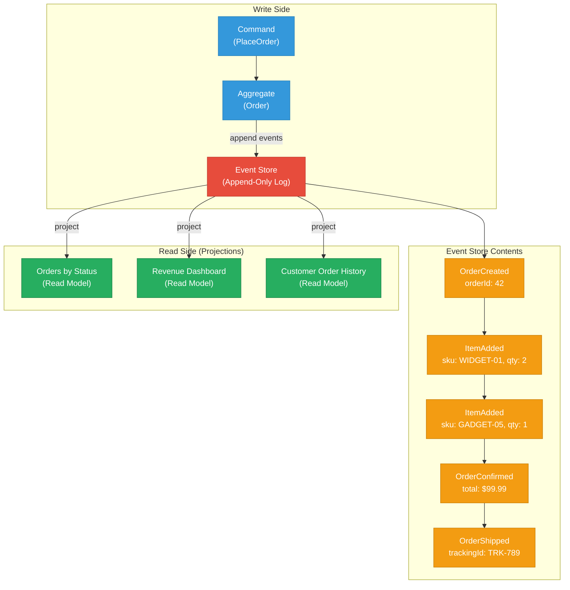

**How state is rebuilt:**

To get the current state of Order 42, you replay all five events in sequence:

1. `OrderCreated` — initialize an empty order
2. `ItemAdded (WIDGET-01, qty 2)` — add first item
3. `ItemAdded (GADGET-05, qty 1)` — add second item
4. `OrderConfirmed ($99.99)` — mark as confirmed, set total
5. `OrderShipped (TRK-789)` — mark as shipped

The result is the current state: a shipped order with two items totaling $99.99.

**Snapshots for performance:** Replaying thousands of events for every read is expensive. The solution is **snapshots** — periodically save the derived state at a point in time, then only replay events after the snapshot. For example, snapshot at event 1000, then replay events 1001+ to get current state.

**How messaging systems support this:**

| Aspect | Kafka | NATS JetStream |
|--------|-------|----------------|
| Event store | Topics with log compaction disabled; infinite retention | Streams with `RetentionPolicy: Limits` or `Interest` |
| Ordering | Per-partition ordering; use entity ID as partition key | Per-subject ordering within a stream |
| Replay | Consumer seeks to offset 0 | Consumer with `DeliverPolicy: All` |
| Snapshots | Compacted topic keyed by entity ID | Key-Value store bucket |
| Scale | Excellent — billions of events per topic | Good — designed for lower-volume, higher-velocity workloads |

**Pros:**
- **Complete audit trail** — every change is recorded; you can answer "what happened and when" for any entity
- **Temporal queries** — rebuild state at any point in time ("what did this order look like last Tuesday?")
- **Debugging power** — reproduce bugs by replaying the exact event sequence
- **Multiple projections** — build different read models from the same event stream (orders by status, revenue by region, customer activity timelines)

**Cons:**
- **Complexity** — fundamentally different from CRUD; requires new mental models and tooling
- **Event schema evolution** — old events never go away, so you must handle old formats forever (or migrate them)
- **Eventual consistency** — projections lag behind the event store; reads may be stale
- **Replay time** — without snapshots, rebuilding state for long-lived entities is slow

**When to use it:** Systems where auditability, temporal queries, or the ability to build multiple read models from the same data justifies the added complexity. Common in financial systems, regulatory-heavy domains, and complex domain models.

---

### 4. CQRS — Command Query Responsibility Segregation

**The idea:** Use different models for reading and writing data. The **command side** handles writes (commands that change state), while the **query side** handles reads through optimized read models. Events bridge the two sides.

CQRS is often paired with Event Sourcing but **does not require it** — you can use CQRS with a traditional CRUD database on the write side. The key insight is that read and write workloads often have fundamentally different requirements (schema, scale, latency, consistency), so forcing them through a single model creates compromises on both sides.

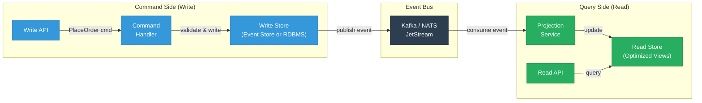

**When CQRS is worth the complexity:**

| Scenario | Why CQRS Helps |
|----------|---------------|
| Read:write ratio is heavily skewed (100:1 or more) | Scale read and write sides independently |
| Complex queries across aggregates | Build denormalized read models optimized for each query pattern |
| Different consistency requirements | Strong consistency on writes, eventual consistency (but faster) on reads |
| Multiple teams own different read views | Each team maintains its own projection without touching the write model |
| Combined with Event Sourcing | CQRS provides the read model that Event Sourcing needs, since querying an event log directly is impractical |

**When CQRS is NOT worth it:**

- Simple CRUD applications with straightforward query patterns
- When your team is not prepared to handle eventual consistency between write and read models
- When a single relational database comfortably serves both reads and writes

The honest truth: most applications do not need CQRS. But for the ones that do — high-scale, complex-domain systems — it is transformative.

---

## Distributed Transaction Patterns

### The Problem: Why 2PC Falls Short

In a monolith, you can wrap multiple operations in a database transaction. Either everything commits, or everything rolls back. Simple and reliable.

In microservices, each service owns its own database. When a business operation spans multiple services — say, placing an order requires updating the Order Service, charging the Payment Service, and reserving stock in the Inventory Service — there is no single transaction that can wrap all three.

**Two-Phase Commit (2PC)** is the traditional distributed transaction protocol: a coordinator asks all participants to prepare, then tells them all to commit. But 2PC has critical problems in microservice architectures:

- **Synchronous and blocking** — all participants must be available simultaneously, negating the benefits of asynchronous messaging
- **Single point of failure** — the coordinator is a bottleneck; if it crashes between prepare and commit, participants are stuck holding locks
- **High latency** — two round trips plus lock hold time
- **Poor fit with messaging** — message brokers are not transactional resources in the 2PC sense

The patterns below achieve the same goal — cross-service consistency — without the drawbacks of 2PC, by embracing **eventual consistency** and **compensating actions**.

---

### Saga Pattern

A **saga** is a sequence of local transactions across services, where each step either succeeds and triggers the next, or fails and triggers **compensating transactions** to undo the previous steps. There are two flavors: choreography and orchestration.

#### Choreography-Based Saga

Each service listens for events and decides what to do next. There is no central coordinator — the flow emerges from the event chain.

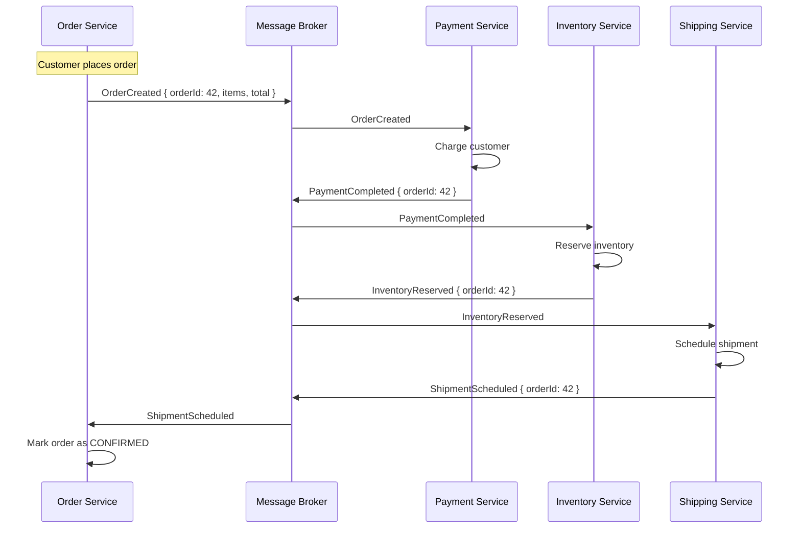

**Compensating flow** — when inventory reservation fails:

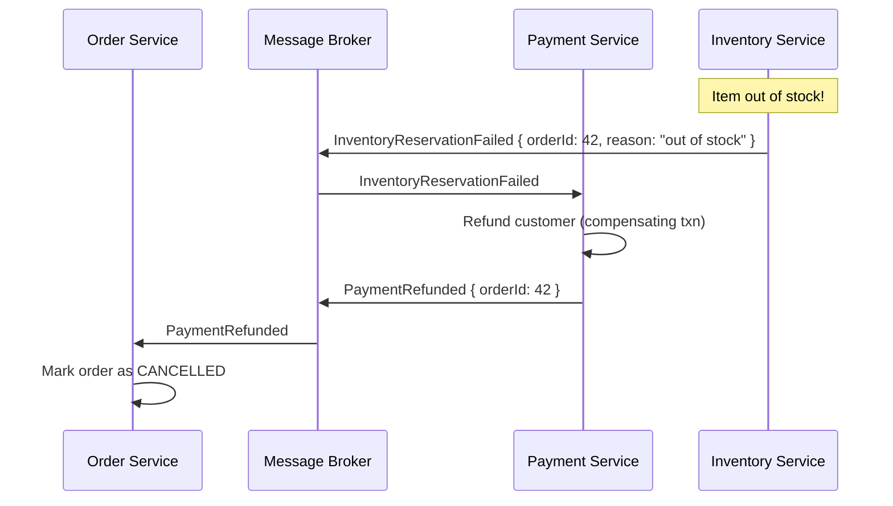

**Choreography pros:** No single point of failure, services are fully decoupled, easy to add new steps by subscribing to existing events.

**Choreography cons:** Hard to understand the overall flow (it's distributed across services), difficult to debug, testing the full saga requires all services, risk of cyclic dependencies.

#### Orchestration-Based Saga

A central **saga orchestrator** coordinates the flow, telling each service what to do and handling the compensation logic.

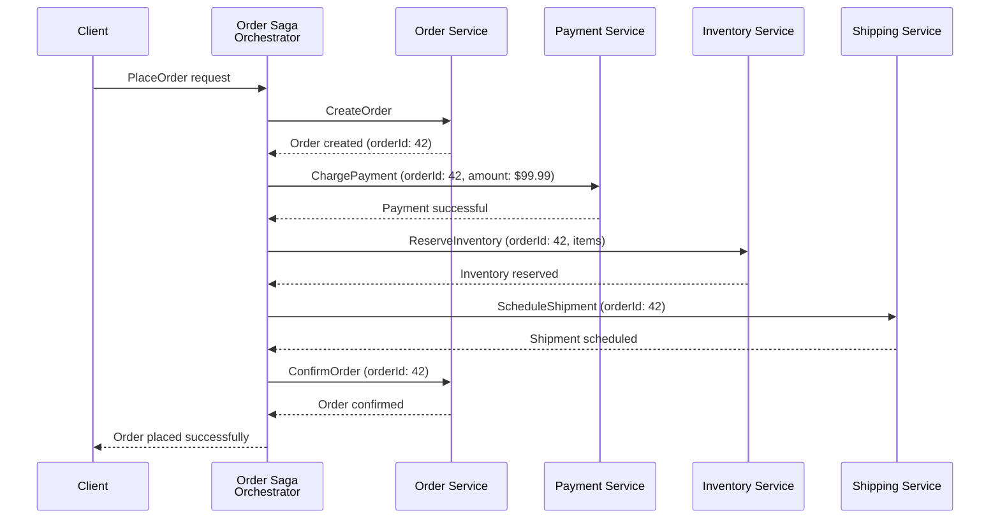

**Orchestration compensation flow:**

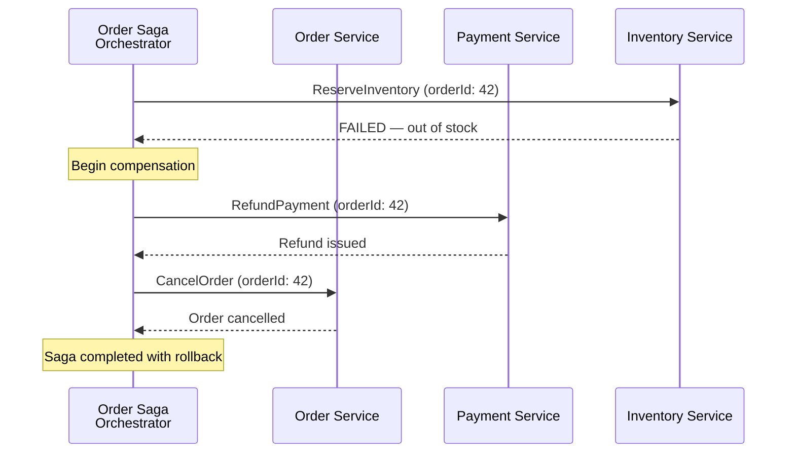

**Orchestration pros:** The full saga flow is visible in one place, easier to debug and test, compensation logic is centralized, no risk of cyclic event chains.

**Orchestration cons:** The orchestrator is a single point of failure (mitigate with stateful replication), can become a bottleneck, introduces coupling between the orchestrator and all participating services.

**Which flavor to choose?**

| Factor | Choreography | Orchestration |
|--------|-------------|---------------|
| Number of steps | 2-4 steps (simple) | 4+ steps (complex) |
| Visibility | Flow is implicit, spread across services | Flow is explicit, in one place |
| Coupling | Very loose | Orchestrator coupled to all services |
| Error handling | Each service handles its own compensation | Centralized compensation logic |
| Testing | Integration testing across all services | Orchestrator can be tested in isolation |
| Common in | Simple, well-understood workflows | Complex business processes, long-running sagas |

---

### Transactional Outbox Pattern

The **dual-write problem** is one of the most common pitfalls in event-driven microservices: a service needs to update its database *and* publish an event to the message broker. If it does both non-atomically, you risk inconsistency — the database update succeeds but the event publish fails (or vice versa).

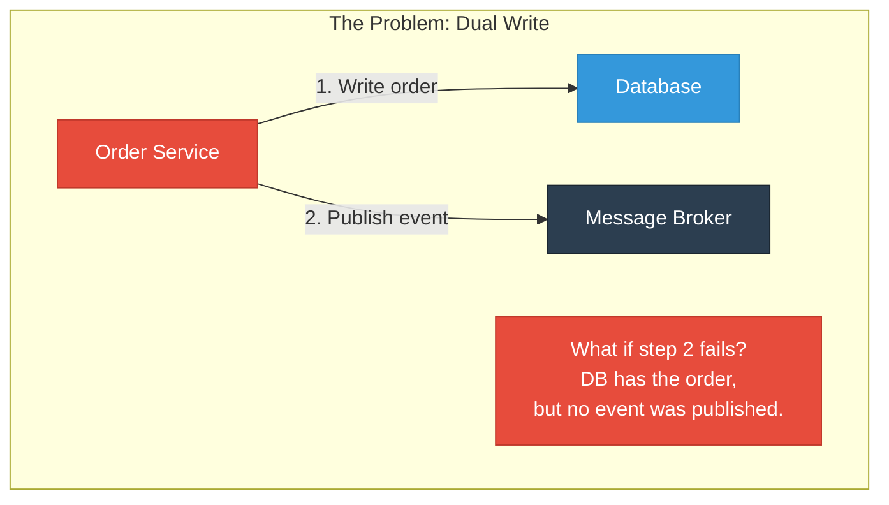

**The solution:** Write the event to an **outbox table** in the same database, in the same transaction as the business data. A separate process (the "relay" or "publisher") reads from the outbox table and publishes events to the broker.

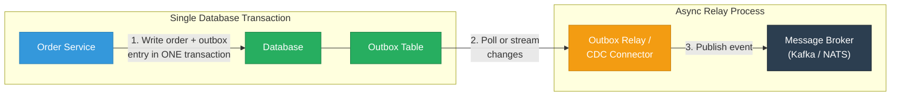

**Outbox table schema:**

```sql
CREATE TABLE outbox (
    id            UUID PRIMARY KEY DEFAULT gen_random_uuid(),
    aggregate_type VARCHAR(255) NOT NULL,    -- e.g., 'Order'
    aggregate_id   VARCHAR(255) NOT NULL,    -- e.g., 'order-42'
    event_type     VARCHAR(255) NOT NULL,    -- e.g., 'OrderPlaced'
    payload        JSONB NOT NULL,           -- full event payload
    created_at     TIMESTAMP NOT NULL DEFAULT NOW(),
    published_at   TIMESTAMP                -- NULL until published
);
```

**Two implementation approaches:**

1. **Polling publisher** — a background process periodically queries the outbox table for unpublished rows (`WHERE published_at IS NULL`), publishes them, and marks them as published. Simple but introduces polling latency and database load.

2. **Change Data Capture (CDC)** — use a tool like **Debezium** to stream database changes directly from the transaction log (WAL in PostgreSQL, binlog in MySQL) to Kafka. This is the production-grade approach: near-real-time, no polling overhead, and Debezium handles exactly-once delivery to Kafka via its offset tracking.

**Debezium + Kafka Connect setup:**


The outbox pattern is one of the most important patterns in this entire page. If you take one thing away from the distributed transaction section, let it be this: **never do a dual write without an outbox**.

---

### Inbox Pattern

The **inbox pattern** is the consumer-side counterpart to the outbox. It ensures **idempotent message processing** by tracking which messages have already been processed.

The problem it solves: with at-least-once delivery (the default in both Kafka and NATS JetStream), consumers may receive the same message more than once — due to rebalances, retries, or network issues. Without idempotency, processing a `PaymentCharged` event twice means charging the customer twice.

**How it works:**

1. When a consumer receives a message, check whether the message ID exists in the **inbox table**
2. If it does, skip processing (it's a duplicate)
3. If it doesn't, process the message and insert the message ID into the inbox table — **in the same database transaction** as the business logic

```sql
CREATE TABLE inbox (
    message_id    VARCHAR(255) PRIMARY KEY,  -- from the event's unique ID
    event_type    VARCHAR(255) NOT NULL,
    processed_at  TIMESTAMP NOT NULL DEFAULT NOW()
);
```

```
-- Pseudocode for idempotent consumer
BEGIN TRANSACTION;
  -- Check if already processed
  SELECT 1 FROM inbox WHERE message_id = :msg_id;
  IF found THEN
    ROLLBACK;  -- Skip duplicate
    RETURN;
  END IF;

  -- Process the business logic
  UPDATE orders SET status = 'PAID' WHERE id = :order_id;

  -- Record that we processed this message
  INSERT INTO inbox (message_id, event_type) VALUES (:msg_id, 'PaymentCompleted');
COMMIT;
```

The inbox table can be periodically cleaned up — entries older than your broker's maximum retention period are safe to delete, since those messages can never be redelivered.

---

## Error Handling Patterns

Even with sagas and outbox patterns, things go wrong. Messages arrive that cannot be processed, downstream services go down, and transient errors cause temporary failures. These patterns handle those realities.

### Dead Letter Queues

A **Dead Letter Queue (DLQ)** is a special queue or topic where messages go when they cannot be processed after multiple attempts. Instead of blocking the consumer forever or silently dropping the message, you move it aside for later investigation.

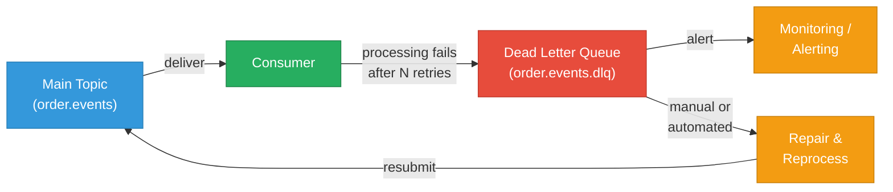

**Messages end up in the DLQ when:**
- The message payload is malformed or fails schema validation (poison pill)
- A required downstream service is permanently unavailable
- A bug in consumer logic causes an unrecoverable exception
- The message violates a business rule that cannot be retried

**DLQ best practices:**
- **Always monitor DLQ depth** — a growing DLQ is a leading indicator of production issues
- **Preserve the original message metadata** — include the original topic, partition, offset, error message, and timestamp so engineers can diagnose the problem
- **Build tooling to reprocess** — you need a way to fix the issue and resubmit messages from the DLQ back to the main topic
- **Set retention on the DLQ** — don't let it grow unbounded; stale DLQ messages are rarely useful

**Kafka implementation:** Use the `DeadLetterQueueSinkConnector` or implement in consumer code by catching exceptions and producing to a `.dlq` topic.

**NATS JetStream implementation:** Not built-in, but straightforward to implement by publishing failed messages to a dedicated DLQ stream after `MaxDeliver` attempts are exhausted.

---

### Retry with Backoff

Not all failures are permanent. A downstream database might be momentarily unavailable, or a rate limit might be temporarily exceeded. **Retry with exponential backoff** handles transient errors by waiting progressively longer between attempts.

**Exponential backoff formula:**

```
wait_time = min(base_delay * 2^attempt + random_jitter, max_delay)
```

| Attempt | Base Delay | Calculated Wait | With Jitter (example) |
|---------|------------|----------------|-----------------------|
| 1 | 100ms | 200ms | 237ms |
| 2 | 100ms | 400ms | 389ms |
| 3 | 100ms | 800ms | 842ms |
| 4 | 100ms | 1,600ms | 1,523ms |
| 5 | 100ms | 3,200ms | 3,107ms |
| 6+ | 100ms | capped at 30s | 29,841ms |

**Why jitter matters:** Without jitter, all consumers that failed at the same time will retry at the same time, creating a "thundering herd" that can overload the downstream service again. Random jitter spreads retries across time.

**After max retries:** Send the message to the DLQ (see above). Don't retry forever — it wastes resources and blocks processing of subsequent messages.

**Kafka implementation:** Consumer-side retry logic, or use frameworks like Spring Kafka's `RetryTopicConfiguration` which creates intermediate retry topics with increasing delays.

**NATS JetStream implementation:** Built-in via `AckWait` (how long the server waits for an ack before redelivering), `MaxDeliver` (maximum redelivery attempts), and `BackOff` (explicit backoff schedule per attempt).

---

### Circuit Breaker

The **circuit breaker pattern** protects a consumer from repeatedly calling a failing downstream service. Like an electrical circuit breaker, it "trips" after detecting a threshold of failures, and stops making calls for a cooldown period before testing again.

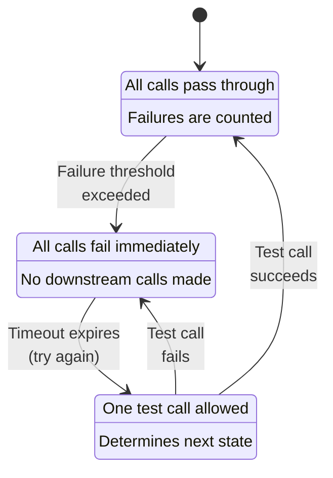

**States:**
- **Closed** (normal) — requests flow through. Failures are counted; when failures exceed a threshold (e.g., 5 failures in 60 seconds), the breaker trips to Open.
- **Open** (tripped) — all requests immediately fail without calling downstream. After a timeout (e.g., 30 seconds), the breaker moves to Half-Open.
- **Half-Open** (testing) — one request is allowed through. If it succeeds, the breaker resets to Closed. If it fails, the breaker returns to Open.

**In the context of messaging:** A consumer processing events might need to call an external API or database. If that dependency is down, the circuit breaker prevents the consumer from wasting retries and instead lets messages queue up (or NAK them for later redelivery) until the dependency recovers.

Popular implementations: Netflix Hystrix (legacy), Resilience4j (Java), Polly (.NET), gobreaker (Go).

---

## Schema Evolution

In an event-driven system, **events are a contract** between producers and consumers. Unlike REST APIs where you can version endpoints, events in a log persist forever (or for a long retention period). A consumer processing historical events must handle event formats from months or years ago.

### Why Schemas Matter

Without schemas, event-driven systems devolve into chaos:
- Producers add a field that consumers don't expect — consumers crash
- Producers rename a field — consumers silently lose data
- Producers change a field type from string to integer — deserialization fails
- Nobody knows what fields an event contains — developers resort to reading producer source code

### Compatibility Modes

| Mode | Rule | Producer Can | Consumer Can |
|------|------|-------------|-------------|
| **Backward compatible** | New schema can read old data | Add optional fields, remove fields | Old consumers continue to work |
| **Forward compatible** | Old schema can read new data | Remove fields | New consumers handle old events |
| **Full compatible** | Both directions | Add/remove optional fields only | Maximum safety, least flexibility |
| **None** | No rules enforced | Anything | Good luck |

**The practical recommendation:** Use **backward compatibility** as the default. This means consumers running the new schema can always read events produced by the old schema. This is the most common requirement — you upgrade consumers before (or independently of) producers.

### Schema Registry Pattern

A **schema registry** is a centralized service that stores and enforces event schemas:

1. Producers register schemas before publishing
2. The registry validates compatibility with previous versions
3. Events carry a schema ID instead of the full schema, reducing message size
4. Consumers look up the schema by ID to deserialize

**Kafka ecosystem:** Confluent Schema Registry supports Avro, Protobuf, and JSON Schema. Deeply integrated with Kafka serializers/deserializers.

**NATS ecosystem:** No built-in schema registry, but you can use the same Confluent Schema Registry (or alternatives like Apicurio) alongside NATS. Define schemas in Protobuf or JSON Schema and validate at the application level.

### Contract-First Design

The best practice is **contract-first**: define the event schema *before* writing producer or consumer code.

1. Define the event in a shared schema file (Avro `.avsc`, Protobuf `.proto`, or JSON Schema)
2. Register it in the schema registry
3. Generate language-specific classes/structs from the schema
4. Use those generated types in producer and consumer code

This ensures the event contract is explicit, versioned, and enforced — not an implicit agreement hidden in application code.

---

## Anti-Patterns to Avoid

Knowing what NOT to do is as important as knowing the patterns. These anti-patterns are common in early event-driven architectures.

### Event Soup

**Symptom:** Dozens of granular, low-level events flying around with no clear domain meaning. Services publish events for every database field change: `UserEmailUpdated`, `UserPhoneUpdated`, `UserNameUpdated`, `UserAddressLine1Updated`...

**Problem:** Consumers need to aggregate many events to understand what happened. Business meaning is lost in the noise. System becomes fragile and hard to reason about.

**Fix:** Design events around business domain concepts, not database changes. Instead of field-level events, publish `UserProfileUpdated` with the complete updated profile. Events should represent **meaningful business facts**, not CRUD operations.

### God Events

**Symptom:** A single event type carries everything — `OrderEvent` with a `type` field that could be `CREATED`, `UPDATED`, `CANCELLED`, `SHIPPED`, `RETURNED`, and a massive payload that includes every field an order could ever have.

**Problem:** Every consumer receives every event type and must filter. The schema is bloated and impossible to evolve. Adding a new field to shipping affects the billing consumer's deserialization.

**Fix:** Use specific, typed events: `OrderCreated`, `OrderShipped`, `OrderCancelled`. Consumers subscribe only to the events they care about. Each event carries only the data relevant to that business fact.

### Distributed Monolith

**Symptom:** Services are technically separate and communicate via events, but they are so tightly coupled on event schemas, ordering, and timing that you cannot deploy one without deploying all the others.

**Problem:** You have the complexity of both microservices AND a monolith, with the benefits of neither. Deployments require coordination across teams. Schema changes break multiple services simultaneously.

**Fix:** Design for loose coupling. Use backward-compatible schema evolution. Consumers should tolerate unknown fields (forward compatibility). Services should not depend on the ordering of events across different streams. Each service should be deployable independently.

### Sync-Over-Async

**Symptom:** A service publishes an event and then **blocks waiting for a response event** before proceeding — essentially doing synchronous request-reply over an asynchronous messaging system.

**Problem:** You get the worst of both worlds: the latency and complexity of asynchronous messaging with the coupling of synchronous calls. If the responding service is slow, the requesting service blocks. Timeouts are awkward to implement over event streams.

**Fix:** If you need a synchronous response, use synchronous communication (HTTP, gRPC, or NATS request-reply which is designed for this). Use async events for fire-and-forget or eventual consistency scenarios. Don't force async infrastructure into a sync interaction pattern.

---

## Key Takeaways

1. **Event-Carried State Transfer** is the default choice for inter-service events. It maximizes autonomy and eliminates runtime coupling. Use Event Notification only when payloads would be prohibitively large and most consumers don't need the data.

2. **Event Sourcing** is powerful but complex. Use it when you genuinely need an audit trail, temporal queries, or multiple projections — not because it sounds architecturally elegant. Most services do not need it.

3. **CQRS** makes sense when read and write workloads are fundamentally different. It pairs naturally with Event Sourcing but works without it too. Don't add it to simple CRUD services.

4. **The Transactional Outbox** is non-negotiable for reliable event publishing. Never do a bare dual write (update DB then publish event). Combine with Debezium CDC for production-grade reliability.

5. **Sagas** replace distributed transactions. Use choreography for simple flows (2-4 steps) and orchestration for complex business processes. Always design compensating transactions for every forward step.

6. **Idempotent consumers** (via the Inbox pattern or natural idempotency) are essential. At-least-once delivery is the norm; your consumers must handle duplicates.

7. **Schema evolution** is a first-class concern, not an afterthought. Use a schema registry, enforce backward compatibility, and design contracts first.

8. **Avoid the anti-patterns** — event soup, god events, distributed monolith, and sync-over-async will erode every benefit that event-driven architecture provides.

---

## References

- Fowler, M. (2017). ["What do you mean by Event-Driven?"](https://martinfowler.com/articles/201701-event-driven.html) — The foundational taxonomy of Event Notification, Event-Carried State Transfer, and Event Sourcing.
- Richardson, C. (2018). *Microservices Patterns*. Manning Publications. — Comprehensive coverage of Sagas, CQRS, Transactional Outbox, and other microservice patterns.
- Kleppmann, M. (2017). *Designing Data-Intensive Applications*. O'Reilly Media. — Deep treatment of event sourcing, log-based messaging, and distributed systems consistency.
- Confluent Documentation. ["Transactional Outbox"](https://www.confluent.io/blog/using-the-outbox-pattern-with-apache-kafka/) — Practical guide to implementing the outbox pattern with Kafka Connect and Debezium.
- Debezium Documentation. ["Outbox Event Router"](https://debezium.io/documentation/reference/transformations/outbox-event-router.html) — Debezium's built-in support for the outbox pattern.
- Confluent Schema Registry. ["Schema Evolution and Compatibility"](https://docs.confluent.io/platform/current/schema-registry/fundamentals/schema-evolution.html) — Detailed reference on backward, forward, and full compatibility.
- Nygard, M. (2018). *Release It!* 2nd Edition. Pragmatic Bookshelf. — Circuit breaker, bulkhead, and other stability patterns.
- NATS Documentation. ["JetStream"](https://docs.nats.io/nats-concepts/jetstream) — NATS's approach to persistence, replay, and consumer configuration.
- Stopford, B. (2018). *Designing Event-Driven Systems*. O'Reilly Media / Confluent. — Free e-book covering event-driven patterns with Kafka.

---

*Next up: [Choosing a Messaging System](./choosing-a-messaging-system.md)*
