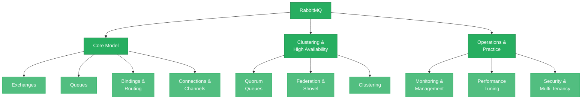

# RabbitMQ

RabbitMQ is the most widely deployed traditional message broker in the world. Originally built to implement the AMQP (Advanced Message Queuing Protocol) standard, RabbitMQ has evolved into a versatile, polyglot messaging platform that supports multiple protocols, sophisticated routing patterns, and a plugin-based extensibility model. While Kafka and NATS dominate conversations about event streaming and cloud-native messaging, RabbitMQ remains the default choice for a large class of workloads — particularly task queues, RPC-style communication, and applications that need flexible message routing without the operational weight of a log-based system.

This section takes you from RabbitMQ's architecture and protocol model through to production-grade operational guidance. Whether you are evaluating RabbitMQ for a new project, already running it in production, or comparing it against Kafka and NATS, these pages will give you the depth you need.

---

## Concept Map

---

## Pages in This Section

| # | Page | What You Will Learn |
|---|------|---------------------|
| 1 | [RabbitMQ Architecture](./rabbitmq-architecture.md) | The AMQP model — exchanges, queues, bindings, and routing keys. How producers, consumers, connections, and channels work. Exchange types (direct, fanout, topic, headers) and when to use each. Virtual hosts for multi-tenancy. How RabbitMQ differs from log-based systems like Kafka. |
| 2 | [RabbitMQ in Practice](./rabbitmq-in-practice.md) | Clustering and high availability with quorum queues. Federation and shovel for multi-datacenter deployments. Producer confirms and consumer acknowledgments. Performance tuning (prefetch, batching, persistence). Monitoring with the management plugin. When (and when not) to use RabbitMQ. |

---

## Suggested Reading Order

1. **Start with [RabbitMQ Architecture](./rabbitmq-architecture.md)** to build the mental model of how RabbitMQ routes messages. The exchange-binding-queue model is fundamentally different from Kafka's partitioned log and NATS's subject-based routing — understanding it is the foundation for everything else.

2. **Then read [RabbitMQ in Practice](./rabbitmq-in-practice.md)** to learn how to run RabbitMQ in production — clustering, quorum queues, performance tuning, monitoring, and the decision framework for when RabbitMQ is (and is not) the right choice.

---

## Prerequisites

You should be comfortable with the concepts from [Messaging Foundations](../01-messaging-foundations/README.md), especially delivery semantics (at-most-once, at-least-once, exactly-once) and messaging paradigms (pub/sub, request-reply, point-to-point). If those terms are unfamiliar, start there first.

---

*Next up: [RabbitMQ Architecture](./rabbitmq-architecture.md)*
