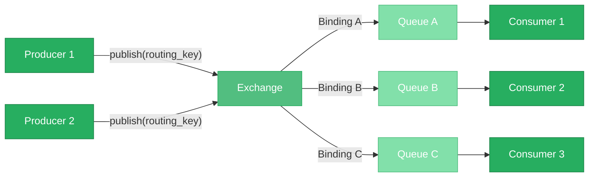
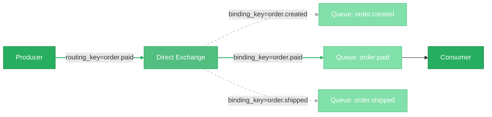
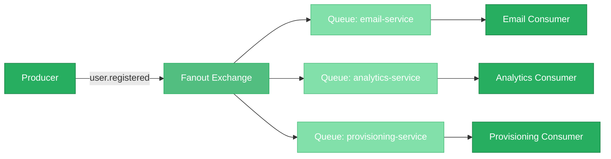
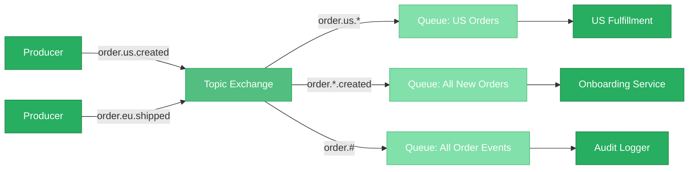
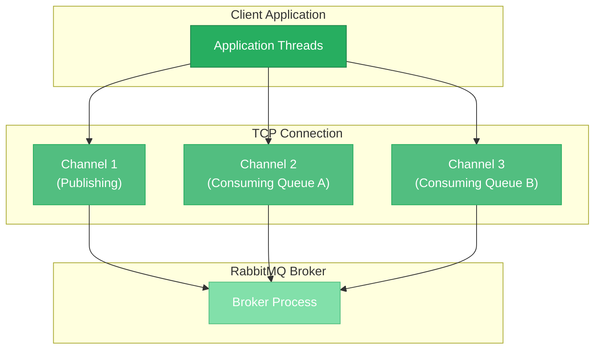
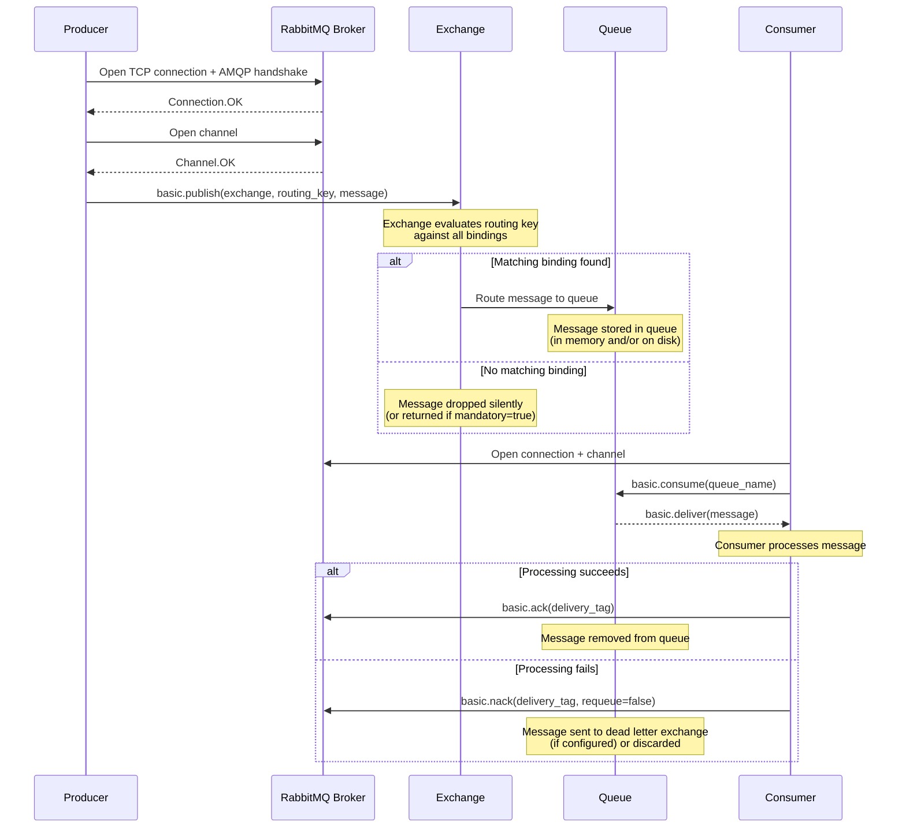

# RabbitMQ Architecture

> **TL;DR:** RabbitMQ is a traditional message broker built on Erlang/OTP that implements the AMQP 0-9-1 protocol. Messages flow from **producers** through **exchanges**, which route them via **bindings** to **queues**, where **consumers** receive them. RabbitMQ provides four exchange types (direct, fanout, topic, headers) that cover routing patterns from simple point-to-point delivery to complex content-based routing. Unlike log-based systems like Kafka, RabbitMQ deletes messages after acknowledgment, making it a **smart broker / dumb consumer** architecture optimized for task distribution, RPC, and flexible routing rather than event replay and stream processing.

---

## Table of Contents

- [Why This Matters](#why-this-matters)
- [What Is RabbitMQ?](#what-is-rabbitmq)
- [The AMQP 0-9-1 Model](#the-amqp-0-9-1-model)
- [Exchange Types](#exchange-types)
  - [Direct Exchange](#direct-exchange)
  - [Fanout Exchange](#fanout-exchange)
  - [Topic Exchange](#topic-exchange)
  - [Headers Exchange](#headers-exchange)
  - [Choosing an Exchange Type](#choosing-an-exchange-type)
- [Queues](#queues)
  - [Queue Flavors: Classic, Quorum, and Streams](#queue-flavors-classic-quorum-and-streams)
  - [Queue Properties](#queue-properties)
  - [Dead Letter Exchanges](#dead-letter-exchanges)
  - [Priority Queues](#priority-queues)
- [Connections and Channels](#connections-and-channels)
- [Virtual Hosts](#virtual-hosts)
- [Message Flow in Detail](#message-flow-in-detail)
- [How RabbitMQ Differs from Log-Based Systems](#how-rabbitmq-differs-from-log-based-systems)
- [Key Takeaways](#key-takeaways)
- [References](#references)

---

## Why This Matters

RabbitMQ is the most widely deployed open-source message broker in the world, running in production at companies from small startups to Fortune 500 enterprises. When you need to decouple services, distribute background work, implement request-reply patterns, or route messages based on content, RabbitMQ is often the first tool that appears on the shortlist. Understanding its architecture is not optional -- it directly determines whether your message routing works correctly, whether consumers receive the right messages, whether you lose data during failures, and whether your system can scale to meet demand. Every configuration decision you make -- exchange type, queue durability, prefetch count, acknowledgment mode -- flows from the mental model this page builds.

---

## What Is RabbitMQ?

RabbitMQ is an **open-source message broker** that implements the Advanced Message Queuing Protocol (AMQP 0-9-1) as its primary wire protocol. It was originally developed in 2007 by Rabbit Technologies Ltd, a small London-based company founded by Alexis Richardson and Matthias Radestock. The team chose **Erlang/OTP** as the implementation language -- a decision that remains central to RabbitMQ's identity. Erlang was designed by Ericsson in the 1980s for building fault-tolerant, highly concurrent telecom switches, making it an ideal runtime for a message broker that must handle thousands of concurrent connections, survive process crashes through supervision trees, and support hot code upgrades without downtime.

Rabbit Technologies was acquired by **SpringSource** in 2010, which was itself acquired by **VMware** shortly after. RabbitMQ then moved through VMware's reorganizations -- to **Pivotal Software** in 2013, back to VMware when Pivotal was reabsorbed in 2019, and finally to **Broadcom** when it acquired VMware in 2023. Throughout these ownership changes, RabbitMQ has remained open-source under the Mozilla Public License 2.0 and has maintained an active community and core development team.

RabbitMQ was purpose-built to implement the AMQP standard, which was created by JPMorgan Chase in 2003 to standardize enterprise messaging. While AMQP aimed to be the "HTTP of messaging" -- a single interoperable wire protocol for all message brokers -- the reality is that AMQP 0-9-1 (the version RabbitMQ implements natively) and AMQP 1.0 (the later OASIS standard) are fundamentally different protocols. RabbitMQ supports AMQP 1.0 via a plugin but its core model is built on 0-9-1. Today, RabbitMQ also supports MQTT (for IoT), STOMP (for simple text-based messaging), and HTTP-based management APIs, making it a polyglot broker that can serve many different client ecosystems.

### Positioning: RabbitMQ vs Kafka vs NATS

RabbitMQ, Apache Kafka, and NATS each solve messaging problems, but they solve them with fundamentally different architectures and design philosophies. Understanding where each fits is critical to choosing the right tool.

| Dimension | RabbitMQ | Apache Kafka | NATS |
|-----------|----------|-------------|------|
| **Core model** | Message broker with exchanges, bindings, and queues | Distributed commit log with topics and partitions | Subject-based pub/sub with optional persistence (JetStream) |
| **Storage model** | Messages deleted after consumer acknowledgment | Durable append-only log with configurable retention | In-memory by default; JetStream adds file/memory-backed persistence |
| **Delivery model** | Push-based (broker pushes to consumers) | Pull-based (consumers poll for records) | Push-based (server pushes to subscribers) |
| **Routing** | Rich exchange-based routing (direct, fanout, topic, headers) | Topic-based with consumer-side filtering | Subject hierarchy with wildcard subscriptions |
| **Ordering** | Per-queue FIFO ordering | Per-partition ordering | No ordering guarantees (core NATS); per-stream with JetStream |
| **Primary protocol** | AMQP 0-9-1 | Kafka binary protocol (custom) | NATS protocol (custom text-based) |
| **Implementation language** | Erlang/OTP | Java/Scala | Go |
| **Replay capability** | No (message consumed and deleted) | Yes (consumers can seek to any offset) | Limited (JetStream supports replay from stream start or time) |
| **Best suited for** | Task queues, RPC, complex routing, legacy integration | Event streaming, log aggregation, high-throughput data pipelines | Cloud-native microservices, request-reply, edge/IoT |
| **Throughput** | Tens of thousands msg/s per node | Millions of msg/s per cluster | Millions of msg/s per server (core); lower with JetStream |

The key insight: RabbitMQ is a **smart broker** that takes responsibility for routing, filtering, and delivering messages to the right consumers. Kafka is a **dumb broker** that simply appends records to a log and lets consumers figure out what to read. NATS sits in between, using subject-based addressing with server-side filtering but minimal broker-side state by default.

---

## The AMQP 0-9-1 Model

The AMQP 0-9-1 protocol defines four core entities that together form RabbitMQ's message routing model:

1. **Producer** -- An application that publishes messages. Producers never send messages directly to queues. They send messages to an exchange along with a **routing key** (a string that the exchange uses to determine where to route the message).

2. **Exchange** -- A routing engine that receives messages from producers and routes them to zero or more queues based on the exchange type, the routing key, and the bindings in place. Think of an exchange as a post office that reads the address on an envelope and drops it into the correct mailbox.

3. **Binding** -- A rule that links an exchange to a queue. A binding may include a **binding key** (sometimes called a routing pattern) that the exchange compares against the message's routing key to decide whether the message should be routed to that queue.

4. **Queue** -- A buffer that stores messages until a consumer retrieves them. Queues are the only place in RabbitMQ where messages come to rest. They are FIFO by default -- the first message published is the first one delivered to a consumer.

5. **Consumer** -- An application that subscribes to a queue and receives messages from it. A consumer acknowledges each message after processing it, at which point RabbitMQ removes the message from the queue.

**Why this indirection matters:** The exchange-binding-queue model decouples producers from consumers entirely. A producer does not know (or care) which queues exist, how many consumers are listening, or what routing rules are in place. It simply publishes a message with a routing key and trusts the exchange to deliver it. This means you can add new consumers, change routing rules, or restructure your queue topology without modifying a single line of producer code. In a microservices architecture, this decoupling is essential -- it lets teams evolve their services independently.

---

## Exchange Types

RabbitMQ provides four built-in exchange types, each implementing a different routing algorithm. Choosing the right exchange type is one of the most important architectural decisions you will make when designing a RabbitMQ-based system.

### Direct Exchange

A direct exchange routes a message to queues whose **binding key exactly matches** the message's routing key. This is the simplest and most common routing strategy.

**Example:** An order processing system has three queues: `order.created`, `order.paid`, and `order.shipped`. Each queue is bound to a direct exchange with a binding key matching its name. When a producer publishes a message with routing key `order.paid`, only the queue bound with that exact key receives the message.

RabbitMQ includes a **default exchange** (the nameless exchange, `""`), which is a direct exchange with a special behavior: every queue is automatically bound to it with a binding key equal to the queue name. This means you can publish to `routing_key=my-queue` on the default exchange and the message will arrive in the queue named `my-queue` -- creating the illusion that you are publishing directly to a queue, even though an exchange is always involved.

**When to use:** Point-to-point task distribution where each message type has a known, fixed destination. Worker queues, command routing, simple service-to-service communication.

---

### Fanout Exchange

A fanout exchange routes a message to **all queues bound to it**, regardless of the routing key. The routing key is completely ignored. This is broadcast routing.

**Example:** A user registration service publishes a `user.registered` event. Multiple downstream services need to react: the email service sends a welcome email, the analytics service records the signup, and the provisioning service creates default resources. Each service has its own queue bound to the same fanout exchange.

**When to use:** Event broadcasting where every subscriber must receive every message. Pub/sub patterns, event notification, cache invalidation across multiple services.

---

### Topic Exchange

A topic exchange routes messages based on **wildcard pattern matching** between the routing key and the binding key. Routing keys are dot-delimited strings (e.g., `order.us.created`), and binding keys can include two special wildcards:

- `*` (star) -- matches **exactly one word** in the routing key.
- `#` (hash) -- matches **zero or more words** in the routing key.

**Example:** A multi-region e-commerce platform publishes order events with routing keys in the format `order.{region}.{action}`. Different services subscribe to different subsets:

- `order.us.*` -- receives all US order events (created, paid, shipped, cancelled).
- `order.*.created` -- receives order creation events from all regions.
- `order.#` -- receives every order event regardless of region or action.

In the example above, publishing `order.us.created` would route to all three queues: it matches `order.us.*` (the `*` matches `created`), `order.*.created` (the `*` matches `us`), and `order.#` (the `#` matches `us.created`). Publishing `order.eu.shipped` would route only to `order.#` (matches everything) -- it does not match `order.us.*` (wrong region) or `order.*.created` (wrong action).

**When to use:** Multi-criteria routing where consumers need different subsets of a message stream. Multi-tenant systems, geographic routing, event categorization where the routing hierarchy has multiple dimensions.

---

### Headers Exchange

A headers exchange ignores the routing key entirely and routes based on **message header attributes**. When binding a queue to a headers exchange, you specify a set of header key-value pairs and a matching mode:

- `x-match = all` -- the message must contain **all** the specified headers with matching values.
- `x-match = any` -- the message must contain **at least one** of the specified headers with a matching value.

**Example:** A notification system routes messages based on headers like `format=pdf`, `type=report`, and `priority=high`. A queue bound with `{format: pdf, x-match: all}` receives only messages whose headers include `format=pdf`.

Headers exchanges are the most flexible but also the slowest exchange type because the broker must inspect message headers rather than performing simple string matching. They are rarely used in practice -- most use cases that seem to require headers routing can be modeled with topic exchanges by encoding the relevant attributes into the routing key.

**When to use:** When routing criteria cannot be expressed as a hierarchical dot-delimited string. Attribute-based routing, content-type routing, complex multi-dimensional filtering that does not fit a topic key structure.

---

### Choosing an Exchange Type

| Exchange Type | Routing Logic | Routing Key Used? | Performance | Use Case |
|---------------|--------------|-------------------|-------------|----------|
| **Direct** | Exact match on routing key | Yes | Fastest | Task queues, point-to-point commands |
| **Fanout** | Broadcast to all bound queues | No (ignored) | Very fast | Event broadcasting, pub/sub notifications |
| **Topic** | Wildcard pattern match (`*`, `#`) | Yes | Fast (slightly slower than direct) | Multi-criteria routing, hierarchical events |
| **Headers** | Match on message header attributes | No (ignored) | Slowest | Attribute-based routing when topic keys are insufficient |

In practice, the vast majority of RabbitMQ deployments use **direct** and **topic** exchanges. Fanout is common for simple broadcast scenarios. Headers exchanges are niche and should be a last resort.

---

## Queues

Queues are where messages live inside RabbitMQ. They are the only storage mechanism in the system -- exchanges are stateless routing engines, and bindings are just rules. If you want a message to survive a broker restart, survive a node failure, or be available for a consumer that is not currently connected, the queue is what provides that.

### Queue Flavors: Classic, Quorum, and Streams

RabbitMQ offers three fundamentally different queue implementations, each designed for different reliability and performance requirements.

| Property | Classic Queue | Quorum Queue | Stream |
|----------|--------------|-------------|--------|
| **Replication** | Optional mirroring (deprecated) | Raft-based consensus across multiple nodes | Replicated append-only log |
| **Data safety** | Depends on mirroring and persistence config | Strong (Raft guarantees majority consensus) | Strong (replicated, append-only) |
| **Ordering** | FIFO | FIFO | Offset-based (like Kafka) |
| **Message deletion** | After consumer acknowledgment | After consumer acknowledgment | Retention-based (time or size) |
| **Performance** | Highest throughput for single-node | Lower throughput than classic (consensus overhead) | High throughput for fan-out reads |
| **Use case** | Non-critical workloads, development, single-node | Production workloads requiring high availability | Event streaming, large fan-out, audit logs |
| **Poison message handling** | No built-in mechanism | Built-in delivery count tracking | N/A (consumers manage their own offsets) |

**Classic queues** are the original queue type. They store messages on a single node and were historically replicated via mirrored queues (ha-mode policies). Mirrored queues have been **deprecated** in favor of quorum queues because they had fundamental design flaws -- they could silently lose messages during network partitions and had complex, error-prone synchronization behavior.

**Quorum queues** (introduced in RabbitMQ 3.8) use the **Raft consensus algorithm** to replicate messages across an odd number of nodes (typically 3 or 5). A message is only considered committed when a majority of nodes have written it. This provides strong durability guarantees and automatic leader election when a node fails. Quorum queues are the **recommended queue type for production** workloads that require high availability.

**Streams** (introduced in RabbitMQ 3.9) bring Kafka-like semantics to RabbitMQ. They store messages in a replicated append-only log with offset-based access. Messages are not deleted after consumption -- they are retained based on time or size policies. Streams are designed for scenarios where multiple consumers need to read the same data (fan-out), where you need message replay, or where you want Kafka-style semantics without running Kafka.

### Queue Properties

When declaring a queue, you configure several properties that determine its behavior:

- **Durable** -- A durable queue survives broker restarts. Its metadata (name, properties, bindings) is written to disk. Note that making a queue durable does not make its *messages* durable -- for that, messages must also be published with `delivery_mode=2` (persistent). If you have a durable queue with transient messages, the queue itself survives a restart but all its messages are lost.

- **Exclusive** -- An exclusive queue can only be accessed by the connection that declared it and is automatically deleted when that connection closes. Useful for temporary reply queues in RPC patterns.

- **Auto-delete** -- The queue is automatically deleted when the last consumer unsubscribes. Useful for temporary queues that should not accumulate messages when nobody is listening.

- **Message TTL** (`x-message-ttl`) -- Messages that sit in the queue longer than this duration (in milliseconds) are discarded or dead-lettered. Useful for time-sensitive data like OTP codes or session tokens.

- **Max length** (`x-max-length`, `x-max-length-bytes`) -- Limits the number of messages or total bytes in the queue. When the limit is reached, the oldest messages are either dropped or dead-lettered (controlled by the overflow behavior setting).

### Dead Letter Exchanges

A **dead letter exchange (DLX)** is a regular exchange to which RabbitMQ automatically routes messages that cannot be delivered normally. A message becomes "dead-lettered" when:

1. The message is **negatively acknowledged** (rejected or nacked) by a consumer with `requeue=false`.
2. The message's **TTL expires** while it is sitting in the queue.
3. The queue's **max length is exceeded** and the overflow policy is `reject-publish` or `drop-head`.

Dead letter exchanges are a critical pattern for building robust systems. Instead of silently dropping failed messages, you route them to a dead letter queue where they can be inspected, retried, or logged for debugging. This is the RabbitMQ equivalent of a dead letter mailbox -- a place for messages that could not reach their intended destination.

**Example:** An order processing queue is configured with `x-dead-letter-exchange=dlx.orders` and `x-dead-letter-routing-key=failed.orders`. When a consumer fails to process an order three times and rejects it, the message automatically appears in the dead letter queue bound to `dlx.orders`, where an operator or automated retry service can handle it.

### Priority Queues

RabbitMQ supports **priority queues** by setting the `x-max-priority` argument when declaring a queue (typically a value between 1 and 10). Producers then set the `priority` property on each message. Higher-priority messages are delivered to consumers before lower-priority ones, even if the lower-priority messages arrived first.

Priority queues break FIFO ordering by design -- that is their purpose. Use them when some messages genuinely need to jump the line, such as alerting messages in a notification system or VIP customer requests in a support ticket queue. Avoid them when strict ordering matters, and keep the priority range small (using a max priority of 255 creates 255 internal sub-queues and wastes memory).

---

## Connections and Channels

Understanding the relationship between connections and channels is essential for writing efficient RabbitMQ clients and avoiding resource exhaustion.

A **connection** is a TCP connection between a client application and a RabbitMQ broker. Establishing a connection involves a TCP handshake followed by an AMQP handshake where the client and broker negotiate protocol version, authentication (typically SASL with username/password), and connection parameters like heartbeat interval and maximum frame size. Connections are expensive to create -- each one consumes a TCP socket, memory on both client and server, and undergoes the full authentication and negotiation process.

A **channel** is a lightweight, virtual connection multiplexed over a single TCP connection. Channels share the underlying TCP socket but are otherwise independent -- each channel has its own flow control, its own set of consumers, and its own error handling. If a channel-level error occurs (such as publishing to a non-existent exchange), only that channel is closed; the connection and other channels remain unaffected.

**Why channels exist:** Without channels, every thread in your application that needed to publish or consume would require its own TCP connection. A web server handling 100 concurrent requests, each of which publishes a message, would need 100 TCP connections. With channels, you open a single TCP connection and multiplex 100 channels over it. This dramatically reduces resource consumption on both the client and the broker.

**Best practices for connections and channels:**

- Use **one connection per application process** and create a **channel per thread** (or per logical operation). Channels are not thread-safe in most client libraries, so sharing a channel across threads without synchronization will cause protocol errors.
- Configure **heartbeats** (default: 60 seconds) to detect dead connections. If the broker does not receive a heartbeat within the configured interval, it closes the connection and releases all its resources.
- Set a reasonable **channel_max** limit to prevent misbehaving clients from opening thousands of channels and exhausting broker memory.
- **Do not create and destroy channels rapidly** for single-operation use. The overhead of channel creation, while much less than connection creation, is not zero. Reuse channels for multiple operations where possible.

---

## Virtual Hosts

A **virtual host (vhost)** is a logical namespace within a RabbitMQ broker that provides complete isolation of exchanges, queues, bindings, users, permissions, and policies. Think of vhosts as separate mini-brokers running inside the same physical RabbitMQ process.

Each vhost has its own:

- Set of exchanges (including the default exchange).
- Set of queues.
- Set of bindings.
- Set of user permissions (a user may have full access in one vhost and no access in another).
- Set of policies (for TTLs, max lengths, dead letter configuration, etc.).

A client connection is scoped to exactly one vhost, specified at connection time. A client connected to vhost `/production` cannot see or interact with queues in vhost `/staging`.

**Common use cases for vhosts:**

- **Multi-tenancy:** Run a single RabbitMQ cluster for multiple teams or customers, each isolated in their own vhost. Team A cannot accidentally consume messages from Team B's queues.
- **Environment separation:** Use vhosts like `/development`, `/staging`, and `/production` on a shared broker for non-production environments (though production should ideally have its own dedicated cluster).
- **Application isolation:** Give each application its own vhost to prevent namespace collisions (two applications both wanting a queue named `notifications`).

RabbitMQ ships with a default vhost named `/`. For simple deployments, this is sufficient. For any multi-team or multi-application deployment, creating explicit vhosts is a best practice that prevents accidental cross-contamination.

---

## Message Flow in Detail

To solidify the mental model, let us trace a message through the entire RabbitMQ pipeline, from producer to consumer, step by step.

**Step-by-step breakdown:**

1. **Connection establishment.** The producer opens a TCP connection to the broker and performs the AMQP handshake (protocol version negotiation, SASL authentication, vhost selection). It then opens a channel on this connection.

2. **Publishing.** The producer calls `basic.publish`, specifying the target exchange name, a routing key, message properties (headers, delivery mode, content type, priority, etc.), and the message body (payload). The producer does not specify a queue -- it trusts the exchange to route correctly.

3. **Exchange routing.** The exchange receives the message and evaluates the routing key against all bindings attached to it. The routing algorithm depends on the exchange type (direct, fanout, topic, or headers). If a match is found, the message is forwarded to the matching queue(s). If no match is found, the message is either silently dropped or returned to the producer (if the `mandatory` flag was set).

4. **Queue storage.** The queue stores the message either in memory, on disk, or both, depending on the message's `delivery_mode` property and the queue's configuration. Persistent messages (`delivery_mode=2`) on durable queues are written to disk and survive broker restarts. Transient messages on non-durable queues live only in memory.

5. **Consumer subscription.** A consumer opens its own connection and channel, then calls `basic.consume` to subscribe to a queue. RabbitMQ pushes messages to the consumer as they arrive (up to the prefetch limit).

6. **Delivery.** RabbitMQ delivers the message to the consumer via `basic.deliver`, assigning a unique **delivery tag** (a channel-scoped integer) that the consumer uses to reference this specific message when acknowledging.

7. **Acknowledgment.** After processing, the consumer sends `basic.ack` with the delivery tag. RabbitMQ removes the message from the queue permanently. If the consumer crashes before acknowledging, RabbitMQ redelivers the message to another consumer (or the same consumer when it reconnects). If the consumer sends `basic.nack` or `basic.reject` with `requeue=false`, the message is either discarded or routed to a dead letter exchange.

---

## How RabbitMQ Differs from Log-Based Systems

The architectural differences between RabbitMQ and log-based systems like Apache Kafka are not superficial -- they reflect fundamentally different design philosophies that make each system better suited to different problem classes.

### Smart Broker vs Dumb Broker

RabbitMQ follows the **smart broker / dumb consumer** pattern. The broker takes responsibility for:

- Routing messages to the correct queues based on exchange rules.
- Tracking which messages have been delivered and acknowledged.
- Removing messages from queues after acknowledgment.
- Redelivering unacknowledged messages to other consumers.
- Enforcing TTLs, max lengths, and dead letter policies.

Consumers are "dumb" in the sense that they receive messages pushed by the broker and do not need to track their position, manage offsets, or understand the topology. They subscribe to a queue and process what arrives.

Kafka follows the **dumb broker / smart consumer** pattern. The broker simply appends records to a log and serves them when asked. Consumers are "smart" -- they track their own offsets, decide what to read, and can seek to any position in the log. The broker does not know or care whether a consumer has processed a record.

### Message Lifecycle

| Behavior | RabbitMQ | Kafka |
|----------|----------|-------|
| **After successful processing** | Message deleted from queue | Message remains in log until retention expires |
| **Message replay** | Not possible (message is gone) | Consumer can seek to any offset and reprocess |
| **Unprocessed messages** | Accumulate in queue, creating backpressure | Consumers simply have higher lag; log is unaffected |
| **Multiple consumers, same data** | Each consumer needs its own queue (via fanout/topic) | Multiple consumer groups read from the same partition independently |
| **Storage growth** | Proportional to unconsumed messages | Proportional to retention policy (time/size) regardless of consumption |

### When RabbitMQ's Model Is Better

- **Task distribution and work queues.** When each message represents a unit of work that should be processed exactly once and then forgotten, RabbitMQ's delete-after-ack model is a natural fit. You do not need to manage offsets or worry about retention policies -- once the work is done, the message is gone.

- **Complex routing.** When messages need to be routed to different consumers based on content, type, or attributes, RabbitMQ's exchange system provides this out of the box. In Kafka, you would need either separate topics for each message type or consumer-side filtering, both of which have trade-offs.

- **Request-reply (RPC).** RabbitMQ has first-class support for request-reply patterns using exclusive queues and correlation IDs. While possible in Kafka, RPC patterns are awkward and inefficient on a commit log.

- **Low message volume with rich routing needs.** If you are processing thousands (not millions) of messages per second and need flexible routing, RabbitMQ's operational simplicity and routing power outweigh Kafka's throughput advantages.

### When Kafka's Model Is Better

- **Event sourcing and audit logs.** When you need to replay the full history of events to rebuild state, Kafka's retention-based log is essential. RabbitMQ cannot do this -- once a message is acknowledged, it is permanently deleted.

- **High-throughput data pipelines.** Kafka's batched, pull-based, partitioned architecture achieves significantly higher throughput than RabbitMQ's per-message, push-based model.

- **Multiple consumers reading the same data.** In Kafka, adding a new consumer group that reads from the beginning of a topic is trivial and imposes no additional load on producers. In RabbitMQ, you need to create a new queue, bind it to the exchange, and the data is only available from the point of binding onward -- you cannot go back in time.

- **Stream processing.** Kafka's log model integrates naturally with stream processing frameworks (Kafka Streams, Flink, Spark Streaming). RabbitMQ's transient message model does not support windowed aggregations, joins, or temporal reasoning over historical data.

---

## Key Takeaways

1. **RabbitMQ is a smart broker that routes messages through exchanges to queues.** Understanding the exchange-binding-queue model is foundational -- producers never send directly to queues, and the exchange type determines how routing decisions are made.

2. **The four exchange types cover the full spectrum of routing needs.** Direct for point-to-point, fanout for broadcast, topic for wildcard-based multi-criteria routing, and headers for attribute-based routing. Topic exchanges handle the majority of real-world use cases.

3. **Quorum queues are the recommended queue type for production.** They use Raft consensus to replicate messages across multiple nodes, providing strong durability and automatic failover. Classic mirrored queues are deprecated due to fundamental reliability issues.

4. **Channels multiplex over connections to avoid TCP overhead.** Use one connection per process and one channel per thread. Creating a new TCP connection for every operation is a common performance anti-pattern.

5. **Messages are deleted after consumer acknowledgment.** This is the defining architectural difference from log-based systems like Kafka. It makes RabbitMQ ideal for task queues and work distribution, but unsuitable for event replay and stream processing.

6. **Dead letter exchanges provide a safety net for failed messages.** Always configure a DLX on production queues so that rejected, expired, or overflow messages are captured rather than silently lost.

7. **Virtual hosts provide logical isolation within a single broker.** Use them for multi-tenancy, environment separation, or application isolation to prevent namespace collisions and accidental cross-consumption.

8. **Choose RabbitMQ when you need smart routing and task distribution; choose Kafka when you need event replay and high-throughput streaming.** They are complementary tools, not competitors -- many production architectures use both.

---

## References

- [RabbitMQ Official Documentation](https://www.rabbitmq.com/docs) -- The canonical reference for all RabbitMQ concepts, configuration, and operations.
- [AMQP 0-9-1 Model Explained (RabbitMQ)](https://www.rabbitmq.com/tutorials/amqp-concepts) -- RabbitMQ's own guide to the AMQP model, exchanges, queues, and bindings.
- [RabbitMQ Tutorials](https://www.rabbitmq.com/tutorials) -- Step-by-step tutorials covering Hello World, work queues, pub/sub, routing, topics, and RPC.
- [Quorum Queues Documentation](https://www.rabbitmq.com/docs/quorum-queues) -- Architecture, configuration, and operational guidance for quorum queues.
- [RabbitMQ Streams Documentation](https://www.rabbitmq.com/docs/streams) -- Guide to RabbitMQ's Kafka-like stream feature.
- [Dead Letter Exchanges (RabbitMQ)](https://www.rabbitmq.com/docs/dlx) -- Configuration and behavior of dead letter exchanges.
- [AMQP 0-9-1 Complete Reference](https://www.rabbitmq.com/amqp-0-9-1-reference) -- The full protocol specification as implemented by RabbitMQ.
- [RabbitMQ in Depth (Manning)](https://www.manning.com/books/rabbitmq-in-depth) -- Comprehensive book by Gavin Roy covering RabbitMQ architecture and patterns.
- [CloudAMQP Blog -- RabbitMQ Best Practices](https://www.cloudamqp.com/blog/part1-rabbitmq-best-practice.html) -- Practical operational advice from a major RabbitMQ hosting provider.
- [Alvaro Videla and Jason Williams -- RabbitMQ in Action (Manning)](https://www.manning.com/books/rabbitmq-in-action) -- The original RabbitMQ book covering the AMQP model and messaging patterns.
