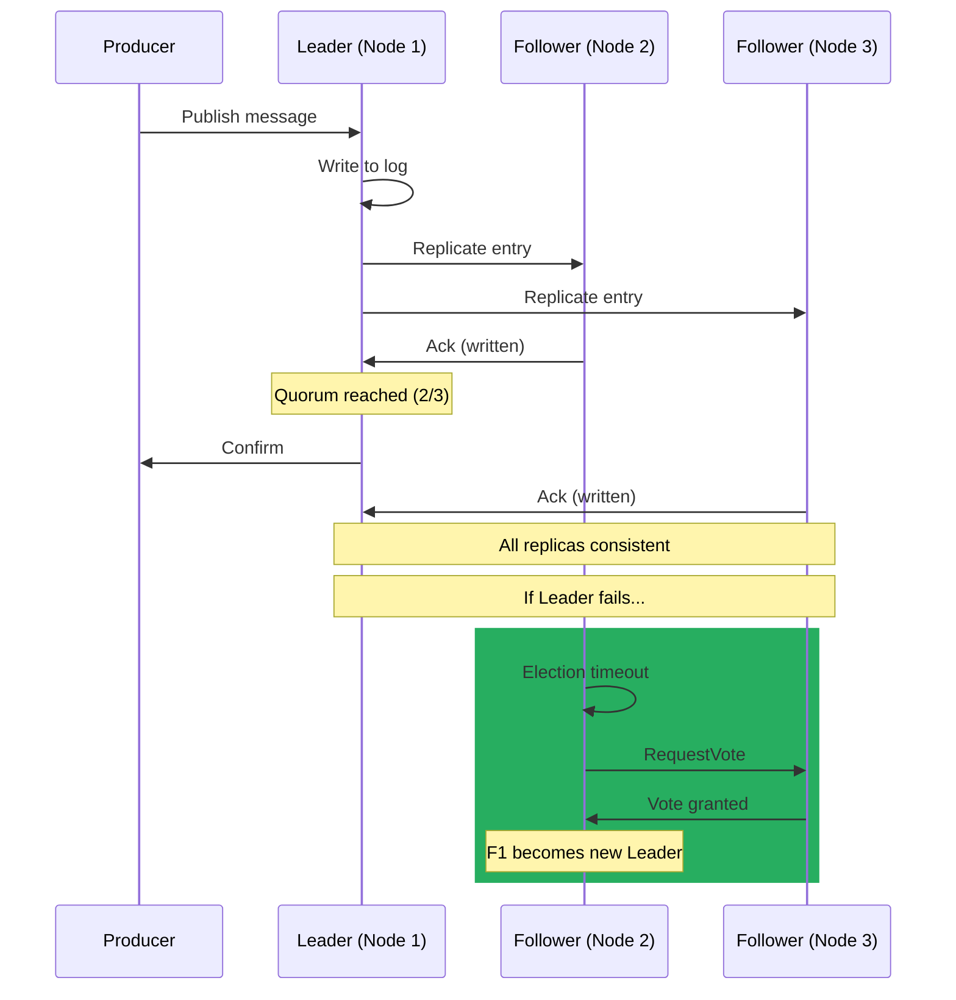
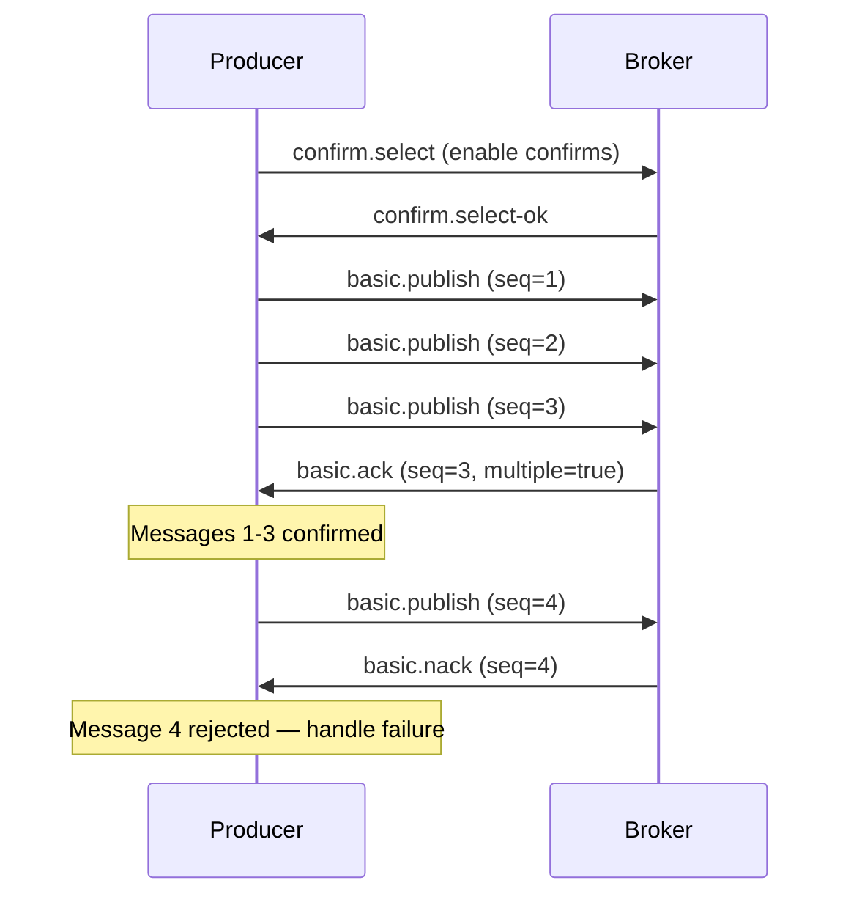
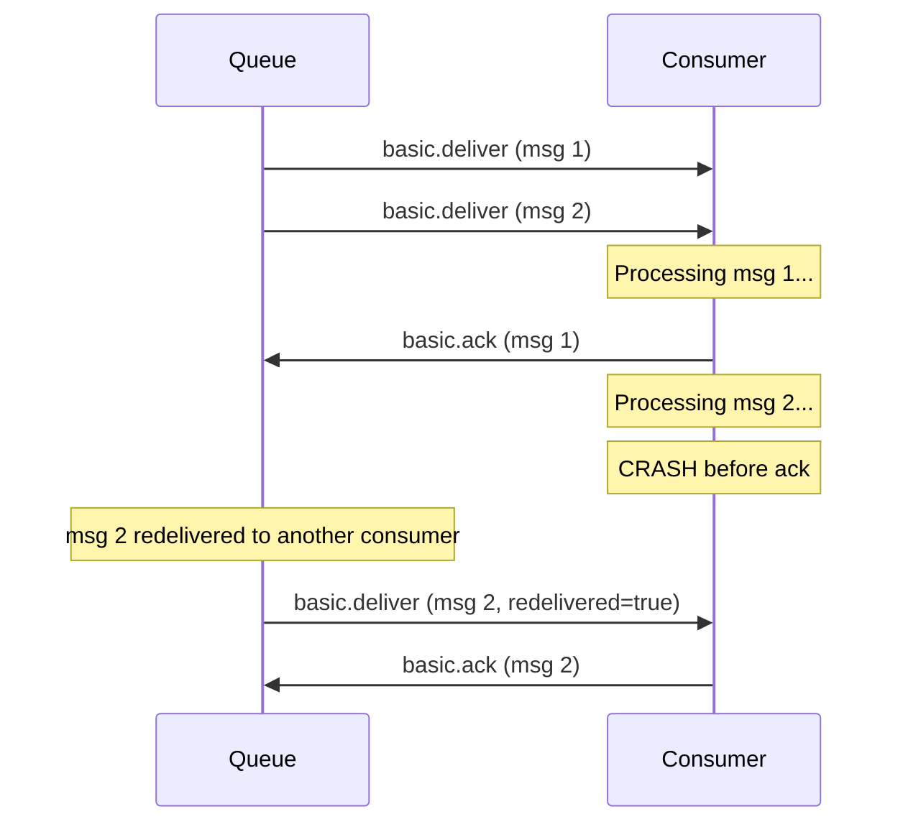

# RabbitMQ in Practice

> **TL;DR:** This page covers everything you need to run RabbitMQ in production. Clustering uses the Erlang distribution protocol to replicate metadata across nodes, but messages are not replicated unless you use **quorum queues** -- the Raft-based replacement for classic mirrored queues that provides leader-follower replication with majority-write semantics. **Streams** add a log-based append-only data structure for high-throughput fan-out and replay. On the reliability side, **publisher confirms** give you broker-level acknowledgment that a message has been persisted, while **consumer acknowledgments** with proper prefetch tuning prevent message loss without overwhelming consumers. Operationally, tune prefetch counts, use lazy queues for large backlogs, pool connections and channels, and monitor queue depth, consumer utilization, and memory alarms via the management plugin and Prometheus. For multi-datacenter deployments, **federation** and **shovel** bridge clusters without full mesh clustering. Finally, know when RabbitMQ is the right tool -- it excels at task queues, RPC, and complex routing, but falls short for high-throughput streaming, event replay, and log aggregation where Kafka or NATS are better fits.

---

## Table of Contents

- [Why This Matters](#why-this-matters)
- [Clustering](#clustering)
  - [How Clustering Works](#how-clustering-works)
  - [Metadata vs Message Replication](#metadata-vs-message-replication)
  - [Network Partitions](#network-partitions)
- [Quorum Queues](#quorum-queues)
  - [Why Classic Mirrored Queues Were Replaced](#why-classic-mirrored-queues-were-replaced)
  - [How Quorum Queues Work](#how-quorum-queues-work)
  - [Quorum Queues vs Classic Queues](#quorum-queues-vs-classic-queues)
  - [Configuration](#quorum-queue-configuration)
- [Streams](#streams)
  - [What Are Streams?](#what-are-streams)
  - [Streams vs Queues vs Kafka](#streams-vs-queues-vs-kafka)
  - [Offset Tracking](#offset-tracking)
- [Producer Confirms](#producer-confirms)
  - [The Publisher Confirms Protocol](#the-publisher-confirms-protocol)
  - [Individual vs Batch Confirms](#individual-vs-batch-confirms)
  - [Handling Nacks](#handling-nacks)
  - [Comparison with Kafka acks](#comparison-with-kafka-acks)
- [Consumer Acknowledgments](#consumer-acknowledgments)
  - [Manual vs Automatic Ack](#manual-vs-automatic-ack)
  - [Prefetch Count (QoS)](#prefetch-count-qos)
  - [Negative Ack and Requeue](#negative-ack-and-requeue)
  - [Dead Letter Exchanges](#dead-letter-exchanges)
- [Performance Tuning](#performance-tuning)
  - [Key Configuration Parameters](#key-configuration-parameters)
  - [Connection and Channel Pooling](#connection-and-channel-pooling)
  - [Batching Strategies](#batching-strategies)
- [Federation and Shovel](#federation-and-shovel)
  - [Federation Plugin](#federation-plugin)
  - [Shovel Plugin](#shovel-plugin)
  - [When to Use Which](#when-to-use-which)
- [Monitoring](#monitoring)
  - [Management Plugin and HTTP API](#management-plugin-and-http-api)
  - [Critical Metrics](#critical-metrics)
  - [Prometheus Integration](#prometheus-integration)
- [Security](#security)
- [When to Use RabbitMQ](#when-to-use-rabbitmq)
- [Key Takeaways](#key-takeaways)
- [References](#references)

---

## Why This Matters

RabbitMQ's documentation is thorough but spread across dozens of guides, each focused on a single feature. When you need to make production decisions -- how many nodes in the cluster, quorum queues or classic queues, what prefetch count, how to handle poison messages, whether to use federation or shovel -- you need opinionated guidance that connects these features into a coherent operational picture. This page provides that guidance.

---

## Clustering

### How Clustering Works

A RabbitMQ cluster is a group of Erlang nodes that share users, virtual hosts, exchanges, bindings, and runtime parameters. Clustering uses the **Erlang distribution protocol** -- nodes communicate over a single TCP connection (by default port 25672) authenticated by a shared **Erlang cookie**. Every node in the cluster must use the same cookie value.

```mermaid
graph TB
    subgraph "RabbitMQ Cluster"
        N1["Node 1<br/>(rabbit@node1)<br/>Disc Node"]
        N2["Node 2<br/>(rabbit@node2)<br/>Disc Node"]
        N3["Node 3<br/>(rabbit@node3)<br/>Disc Node"]

        N1 <-->|"Erlang Distribution<br/>Protocol"| N2
        N2 <-->|"Erlang Distribution<br/>Protocol"| N3
        N1 <-->|"Erlang Distribution<br/>Protocol"| N3
    end

    C1["Client A"] --> N1
    C2["Client B"] --> N2
    C3["Client C"] --> N3

    style N1 fill=#27ae60,stroke=#1e8449,color:#fff
    style N2 fill=#27ae60,stroke=#1e8449,color:#fff
    style N3 fill=#27ae60,stroke=#1e8449,color:#fff
    style C1 fill=#82e0aa,stroke=#52be80,color:#fff
    style C2 fill=#82e0aa,stroke=#52be80,color:#fff
    style C3 fill=#82e0aa,stroke=#52be80,color:#fff
```

Clients can connect to any node. If a client publishes to an exchange on Node 2 but the target queue lives on Node 3, Node 2 routes the message internally to Node 3. This transparency is convenient but adds inter-node latency -- in latency-sensitive deployments, connect clients directly to the node hosting the queue leader.

### Metadata vs Message Replication

This is the most misunderstood aspect of RabbitMQ clustering. The cluster replicates **metadata** -- exchanges, bindings, virtual hosts, users, policies -- to every node. But **classic queue messages are NOT replicated** by default. A classic queue exists on a single node. If that node goes down, the queue and its messages are unavailable until the node recovers.

| What | Replicated Across Cluster? | Notes |
|------|---------------------------|-------|
| Exchanges | Yes | Available on all nodes |
| Bindings | Yes | Available on all nodes |
| Users and permissions | Yes | Available on all nodes |
| Virtual hosts | Yes | Available on all nodes |
| Classic queue metadata | Yes | Queue declaration visible on all nodes |
| Classic queue messages | **No** | Messages live only on the queue's host node |
| Quorum queue messages | **Yes** | Replicated via Raft to a majority of nodes |
| Stream messages | **Yes** | Replicated across cluster members |

This means clustering alone does NOT give you high availability for messages. You need quorum queues or streams for that.

### Network Partitions

In a distributed system, network partitions are inevitable. When nodes in a RabbitMQ cluster lose connectivity to each other, the cluster enters a **partitioned state**. Each partition continues operating independently, which can lead to split-brain scenarios -- queues accepting messages on both sides of the partition, with no way to merge them afterward.

RabbitMQ provides three partition handling strategies:

| Strategy | Behavior | Use When |
|----------|----------|----------|
| **ignore** (default) | Do nothing. Both sides continue operating. Manual intervention required to heal. | Development environments, or when you have external monitoring and want manual control. |
| **pause-minority** | Nodes on the minority side of the partition pause themselves (stop accepting connections). The majority side continues. When connectivity is restored, minority nodes rejoin automatically. | **Recommended for production.** Prevents split-brain at the cost of availability on the minority side. |
| **autoheal** | After the partition heals, one side is chosen as the winner and the other side restarts. Messages on the losing side may be lost. | When you prefer availability over consistency and can tolerate some message loss. |

**Recommendation:** Use `pause-minority` with an **odd number of nodes** (3 or 5). This guarantees that at most one side can form a majority and continue operating.

---

## Quorum Queues

### Why Classic Mirrored Queues Were Replaced

Before RabbitMQ 3.8, the only way to replicate queue messages was **classic mirrored queues** (also called HA queues). They used a synchronous primary-mirror replication model that had serious problems:

- **Synchronization blocking** -- when a new mirror joined, synchronizing existing messages blocked the queue, stalling all producers and consumers.
- **Split-brain data loss** -- during network partitions, mirrors could promote to primary on both sides, leading to divergent data that could not be reconciled.
- **Performance overhead** -- every publish required synchronous confirmation from all mirrors, not just a majority.
- **No built-in leader election** -- mirror promotion was ad-hoc, not based on a proven consensus algorithm.

Classic mirrored queues were **deprecated in RabbitMQ 3.13** and are scheduled for removal. Quorum queues are the replacement.

### How Quorum Queues Work

Quorum queues use the **Raft consensus algorithm** for replication. Each quorum queue has a single **leader** and one or more **followers** (typically two, for a three-node replication group). All writes go through the leader, and a message is considered committed once a **majority (quorum)** of members have written it to disk.



Key behaviors of quorum queues:

- **Majority writes** -- a message is confirmed only after a quorum (e.g., 2 out of 3 nodes) has persisted it. This tolerates the failure of a minority of nodes without data loss.
- **Automatic leader election** -- if the leader node fails, the remaining followers elect a new leader using Raft. Clients reconnect and resume publishing.
- **No synchronization stalls** -- new members catch up asynchronously by replaying the Raft log. The queue remains available during this process.
- **Poison message handling** -- quorum queues track delivery counts per message and can automatically dead-letter messages that exceed a configured retry limit.

### Quorum Queues vs Classic Queues

| Aspect | Classic Queue | Quorum Queue |
|--------|--------------|-------------|
| Replication | None (single node) | Raft-based (leader + followers) |
| Data safety | Messages lost if host node fails | Tolerates minority node failures |
| Ordering | FIFO | FIFO (per consumer, when prefetch = 1) |
| Performance | Higher throughput for single-node | Slightly lower throughput due to replication |
| Memory management | Supports lazy mode | Always writes to disk (inherently lazy) |
| Poison message handling | Manual DLX setup | Built-in delivery count tracking |
| Non-durable support | Yes | No (always durable) |
| Priority queues | Yes | No |
| Global QoS | Yes | No (per-consumer only) |
| TTL per message | Yes | Limited (queue-level only) |

**When to use classic queues:** Temporary or exclusive queues, priority queues, use cases where you need per-message TTL, or where message loss on node failure is acceptable.

**When to use quorum queues:** Any durable queue where message loss is unacceptable. This is the default recommendation for production workloads.

### Quorum Queue Configuration

Declare a quorum queue by setting the `x-queue-type` argument:

```
channel.queueDeclare("orders.processing", true, false, false, Map.of(
    "x-queue-type", "quorum",
    "x-quorum-initial-group-size", 3,       // Number of replicas
    "x-delivery-limit", 5,                  // Max redelivery attempts
    "x-dead-letter-exchange", "orders.dlx"  // DLX for poison messages
));
```

| Parameter | Default | Description |
|-----------|---------|-------------|
| `x-quorum-initial-group-size` | Cluster size (all nodes) | Number of Raft members. Use 3 or 5. |
| `x-delivery-limit` | None (unlimited) | Max delivery attempts before dead-lettering. |
| `x-dead-letter-exchange` | None | Exchange to route poison messages to. |
| `x-max-in-memory-length` | None | Limit messages kept in memory (rest on disk). |
| `x-max-length` | None | Max queue length; excess messages are dropped or dead-lettered. |

---

## Streams

### What Are Streams?

RabbitMQ Streams (introduced in 3.9) are a **log-based data structure** -- an append-only, immutable, replicated log of messages. Unlike queues, where a message is removed once consumed, streams retain messages based on time or size limits, and multiple consumers can read from the same stream at different offsets without interfering with each other.

Streams are RabbitMQ's answer to the log-based consumption model popularized by Kafka, built natively into the broker rather than requiring a separate system.

Key properties:

- **Append-only** -- messages are written sequentially and never removed by consumers.
- **Offset-based consumption** -- consumers track their position (offset) in the stream, enabling replay from any point.
- **High fan-out** -- many consumers can read the same stream concurrently with no performance penalty per additional consumer.
- **Replicated** -- stream data is replicated across cluster nodes for durability.
- **Efficient storage** -- streams use a segment-based file format optimized for sequential reads, achieving much higher throughput than classic queues for large fan-out workloads.

### Streams vs Queues vs Kafka

| Aspect | RabbitMQ Queue | RabbitMQ Stream | Kafka Topic |
|--------|---------------|----------------|-------------|
| Data model | Mutable (consume = remove) | Append-only log | Append-only log |
| Consumer impact | Each message delivered to one consumer (competing) | Many consumers read independently | Many consumer groups read independently |
| Message replay | Not possible (message deleted on ack) | Replay from any offset | Replay from any offset |
| Retention | Until consumed or TTL expires | Time-based or size-based | Time-based or size-based |
| Ordering | FIFO per queue | Offset-ordered | Ordered per partition |
| Routing | Full exchange/binding model | Limited (direct binding) | Topic-based partitioning |
| Throughput | Moderate | High (sequential I/O) | Very high (distributed partitions) |
| Protocol | AMQP 0-9-1 | Stream protocol (binary, dedicated) or AMQP | Kafka protocol |
| Best for | Task distribution, RPC | Fan-out, audit logs, replay within RabbitMQ | Event streaming at scale |

**When to use streams over queues:** When you need multiple consumers to independently read the same data, when you need replay capability, or when you have high fan-out workloads where adding consumers to a queue would not scale.

**When to use Kafka over streams:** When you need horizontal partitioning across many brokers, when throughput requirements exceed what a single RabbitMQ cluster can handle, or when you need the broader Kafka ecosystem (Kafka Streams, Kafka Connect, Schema Registry).

### Offset Tracking

Stream consumers must track their offset (position in the log). RabbitMQ provides two approaches:

1. **Server-side offset tracking** -- the consumer provides a name, and RabbitMQ stores the offset on the server. On reconnect, the consumer resumes from the stored offset. This is the recommended approach for most use cases.

2. **Client-side offset tracking** -- the application stores offsets externally (e.g., in a database). This is useful when you need to coordinate offsets with application-level transactions.

Consumers can also start reading from special positions: `first` (beginning of the stream), `last` (most recent message), `next` (new messages only), or a specific timestamp.

---

## Producer Confirms

### The Publisher Confirms Protocol

By default, RabbitMQ does not acknowledge publishes -- a `basic.publish` is fire-and-forget. If the broker crashes or the message cannot be routed, the producer has no way of knowing. **Publisher confirms** solve this by having the broker send an acknowledgment (confirm) back to the producer after the message has been accepted.



To enable confirms, the producer calls `confirm.select` on the channel. From that point, the broker assigns each published message a **sequence number** and will eventually respond with a `basic.ack` (message accepted) or `basic.nack` (message rejected).

### Individual vs Batch Confirms

| Strategy | How It Works | Throughput | Latency | Complexity |
|----------|-------------|-----------|---------|------------|
| **Individual sync** | Publish one message, wait for confirm, then publish the next. | Low | High (round-trip per message) | Simple |
| **Batch sync** | Publish N messages, then wait for all confirms. | Medium | Medium (amortized over batch) | Moderate (must track and retry entire batch on nack) |
| **Async** | Publish continuously, handle confirms via callback/listener as they arrive. | High | Low | Higher (must track outstanding confirms and handle out-of-order responses) |

**Recommendation:** Use **asynchronous confirms** for production workloads. Maintain an in-memory map of sequence numbers to published messages, remove entries as confirms arrive, and retry or dead-letter on nack. This provides the best throughput while maintaining reliability.

### Handling Nacks

A `basic.nack` from the broker means the message was **not** accepted. Common causes include:

- Internal broker errors (disk full, queue at capacity).
- Mandatory messages with no matching queue (returned via `basic.return`, not nacked, but related).
- Quorum queue unable to achieve quorum (e.g., majority of nodes down).

On nack, the producer should retry with backoff or route the message to an error handling path. Never silently discard a nacked message.

### Comparison with Kafka acks

| Aspect | RabbitMQ Publisher Confirms | Kafka Producer acks |
|--------|---------------------------|-------------------|
| Mechanism | Channel-level confirm mode; broker acks each message by sequence number | Per-record acks setting (`acks=0`, `acks=1`, `acks=all`) |
| Granularity | Per message (or batch with `multiple=true`) | Per record (but responses are batched internally) |
| Durability guarantee | Message accepted by the queue (persisted if queue is durable) | `acks=all` means written to all in-sync replicas |
| Negative ack | `basic.nack` signals failure | Exception in callback signals failure |
| Ordering guarantee | Within a channel | Within a partition (with `max.in.flight.requests=1` or idempotency) |

---

## Consumer Acknowledgments

### Manual vs Automatic Ack

RabbitMQ supports two acknowledgment modes:

- **Automatic ack** (`autoAck=true`, also called `no-ack` mode) -- the broker considers the message delivered the moment it sends it to the consumer. If the consumer crashes before processing, the message is lost.
- **Manual ack** (`autoAck=false`) -- the consumer explicitly sends `basic.ack` after processing. If the consumer crashes before acknowledging, the broker redelivers the message to another consumer.



**Always use manual acknowledgments** for any workload where message loss is unacceptable. Automatic ack is only appropriate for advisory or best-effort messages where losing the occasional message is acceptable.

### Prefetch Count (QoS)

The **prefetch count** controls how many unacknowledged messages the broker will push to a consumer at once. Without a prefetch limit, the broker will push messages as fast as possible, potentially overwhelming a slow consumer and causing memory issues on the client side.

| Prefetch Value | Behavior | Use When |
|---------------|----------|----------|
| `1` | One message at a time. Maximum fairness, lowest throughput. | Expensive, long-running tasks where you want even distribution across consumers. |
| `10-50` | Balanced throughput and fairness. | General-purpose workloads. **Good starting point.** |
| `100-250` | High throughput, less fair distribution. | Fast consumers with predictable processing times. |
| Unlimited (`0`) | Broker pushes everything. Risk of consumer memory exhaustion. | **Never use in production.** |

Set it via `basic.qos`:

```
channel.basicQos(50);  // Prefetch 50 messages
```

The optimal value depends on your processing time and network latency. Start at 30, measure throughput and consumer utilization, and adjust.

### Negative Ack and Requeue

`basic.nack` and `basic.reject` allow a consumer to tell the broker that a message could not be processed:

- `basic.reject(deliveryTag, requeue=true)` -- reject a single message and put it back in the queue.
- `basic.nack(deliveryTag, multiple=false, requeue=true)` -- same as reject but supports rejecting multiple messages at once.
- With `requeue=false`, the message is discarded or dead-lettered (if a DLX is configured).

**Warning:** Requeueing a message that always fails creates an infinite retry loop. Always combine requeue with a delivery count check or a dead letter exchange.

### Dead Letter Exchanges

A **dead letter exchange (DLX)** is a normal exchange that receives messages that could not be processed. Messages are dead-lettered when:

1. A consumer rejects or nacks a message with `requeue=false`.
2. A message's TTL expires.
3. A queue exceeds its maximum length.
4. A quorum queue's delivery limit is exceeded.

Configure a DLX on the queue:

```
channel.queueDeclare("orders", true, false, false, Map.of(
    "x-dead-letter-exchange", "orders.dlx",
    "x-dead-letter-routing-key", "orders.failed"
));
```

Dead-lettered messages include headers with metadata about why and where they were dead-lettered (`x-death` header), making them inspectable for debugging and reprocessing.

---

## Performance Tuning

### Key Configuration Parameters

| Parameter | Default | Recommended | Impact |
|-----------|---------|-------------|--------|
| **Prefetch count** (`basic.qos`) | Unlimited | 30-50 | Controls consumer throughput vs fairness. Too low starves consumers; too high risks memory exhaustion. |
| **Persistent delivery mode** | Non-persistent (1) | Persistent (2) for important data | Persistent messages survive broker restarts but require disk I/O. Non-persistent messages are faster but lost on restart. |
| **Lazy queue mode** | Default (in-memory) | Lazy for large backlogs | Lazy queues write messages directly to disk, reducing memory pressure. Use when queues may grow large. Quorum queues are inherently lazy. |
| **Channel max** (`channel_max`) | 2047 | 128-256 per connection | Limits channels per connection. Lower values catch connection leaks early. |
| **Heartbeat timeout** (`heartbeat`) | 60s | 30-60s | Detects dead connections. Too low causes false positives over high-latency links. |
| **TCP buffer sizes** (`tcp_listen_options`) | OS default | 128-256 KB | Larger buffers improve throughput for high-volume connections. |
| **vm_memory_high_watermark** | 0.4 (40% of RAM) | 0.4-0.6 | Broker blocks publishers when memory exceeds this threshold. |
| **disk_free_limit** | 50 MB | `{mem_relative, 1.5}` | Broker blocks publishers when free disk drops below this. Use relative limit equal to 1-2x RAM. |
| **Queue max length** (`x-max-length`) | Unlimited | Set per queue based on SLA | Prevents unbounded queue growth. Excess messages are dropped or dead-lettered. |

### Connection and Channel Pooling

Connections are expensive (TCP + TLS handshake + AMQP handshake). Channels are lightweight multiplexed sessions within a connection. Best practices:

- **Use one connection per application process.** Multiple connections are only needed if you saturate a single TCP connection's throughput (rare).
- **Use one channel per thread.** Channels are not thread-safe. Never share a channel across threads.
- **Use separate channels for publishing and consuming.** A blocked publishing channel (due to flow control) should not stall your consumer.
- **Pool channels** rather than creating and destroying them per operation. Channel creation has non-trivial overhead.

### Batching Strategies

RabbitMQ does not have a native batching API like Kafka's producer batching. However, you can achieve similar effects:

- **Multi-message publish in a transaction** -- use `tx.select`, publish multiple messages, then `tx.commit`. All messages are atomically committed. However, transactions are slow (~250x slower than non-transactional publishes).
- **Batch publish with confirms** -- publish a batch of messages, then wait for all confirms. This amortizes the confirm round-trip over many messages.
- **Client-side buffering** -- buffer messages in the application and flush periodically or when the buffer reaches a threshold. Combine with async confirms for best throughput.

**Recommendation:** Avoid transactions for performance-sensitive paths. Use batch publishing with async confirms instead.

---

## Federation and Shovel

Federation and Shovel are two mechanisms for moving messages between RabbitMQ brokers (or clusters) that are **not** part of the same cluster. They are designed for multi-datacenter and WAN scenarios where full Erlang clustering is not feasible.

```mermaid
graph TB
    subgraph "Datacenter A"
        CA["Cluster A"]
        EA["Exchange: events"]
        QA["Queue: local.tasks"]
    end

    subgraph "Datacenter B"
        CB["Cluster B"]
        EB["Exchange: events"]
        QB["Queue: local.tasks"]
    end

    EA -->|"Federation Link<br/>(pull model)"| EB
    QA -->|"Shovel<br/>(push/pull)"| QB

    style CA fill=#27ae60,stroke=#1e8449,color:#fff
    style CB fill=#27ae60,stroke=#1e8449,color:#fff
    style EA fill=#52be80,stroke=#27ae60,color:#fff
    style EB fill=#52be80,stroke=#27ae60,color:#fff
    style QA fill=#82e0aa,stroke=#52be80,color:#fff
    style QB fill=#82e0aa,stroke=#52be80,color:#fff
```

### Federation Plugin

Federation creates **one-way links** between exchanges or queues on different brokers. The downstream broker declares a federated exchange or queue and pulls messages from an upstream broker over AMQP.

- **Federated exchanges** -- messages published to the upstream exchange are replicated to the downstream exchange. Consumers on either side see the messages.
- **Federated queues** -- a downstream queue pulls messages from an upstream queue when the downstream queue has consumers and the upstream queue has messages. This provides geographic load balancing.

Federation is:
- Tolerant of intermittent connectivity (buffers and retries).
- Non-intrusive (the upstream broker does not need any special configuration).
- Based on AMQP (works over WAN without Erlang clustering).

### Shovel Plugin

Shovel is a simpler, more explicit mechanism: it creates a dedicated client connection from one broker to another and moves messages from a source (queue or exchange) to a destination (queue or exchange). Shovels can be:

- **Static** -- defined in the broker configuration file. Starts when the broker starts.
- **Dynamic** -- created at runtime via the management API. Can be modified without restarting the broker.

Shovel provides more control over the transfer (acknowledgment mode, reconnect behavior, message transforms) but requires more explicit configuration.

### When to Use Which

| Scenario | Recommendation |
|----------|---------------|
| Replicate an exchange to multiple datacenters | **Federation** -- designed for this pattern |
| Balance consumers across geographies | **Federation** (federated queues) |
| Simple point-to-point data migration | **Shovel** -- explicit, easy to reason about |
| Move messages between different vhosts | **Shovel** -- federation requires separate brokers |
| Complex multi-hop topologies | **Federation** -- supports chaining upstream links |
| One-time queue drain or migration | **Shovel** -- configure, run, remove |

---

## Monitoring

### Management Plugin and HTTP API

The **RabbitMQ Management Plugin** (`rabbitmq_management`) provides a web UI on port 15672 and an HTTP API for monitoring and administration. It ships with RabbitMQ and is enabled by default in most distributions.

The HTTP API exposes endpoints for every management operation: listing queues, checking node health, publishing test messages, creating users, and exporting/importing definitions. Automation tools should use the API rather than the web UI.

### Critical Metrics

| Metric | What It Measures | Warning Threshold | Critical Threshold |
|--------|-----------------|-------------------|-------------------|
| **Queue depth** (messages ready) | Messages waiting to be delivered | Growing steadily | Exceeds max-length policy |
| **Message publish rate** | Messages published per second | Sudden drop (publisher failure) | Zero for active queues |
| **Message deliver/ack rate** | Messages consumed and acknowledged per second | Rate < publish rate (lag) | Zero for queues with consumers |
| **Consumer utilization** | Fraction of time consumers can receive messages (0.0-1.0) | < 0.5 (consumers idle, possible prefetch issue) | < 0.1 |
| **Connection count** | Number of open client connections | Approaching `connection_max` | At limit |
| **Channel count** | Number of open channels | Approaching `channel_max` | At limit |
| **Memory usage** | Broker memory consumption | > 60% of high watermark | Memory alarm triggered (publishers blocked) |
| **Disk free space** | Available disk on the broker | Approaching `disk_free_limit` | Disk alarm triggered (publishers blocked) |
| **File descriptors** | Open file descriptors | > 80% of `ulimit -n` | At limit (new connections refused) |
| **Erlang process count** | Running Erlang lightweight processes | > 80% of `+P` limit | At limit |
| **Unacknowledged messages** | Messages delivered but not yet acked | Growing (slow consumers or leaks) | Consumer crashed without acking |

### Prometheus Integration

RabbitMQ 3.8+ includes a built-in **Prometheus endpoint** via the `rabbitmq_prometheus` plugin, which exposes metrics at `/metrics` on port 15692. This is the recommended monitoring path for production:

1. Enable the plugin: `rabbitmq-plugins enable rabbitmq_prometheus`.
2. Configure Prometheus to scrape `http://<node>:15692/metrics`.
3. Import the official Grafana dashboards (available on grafana.com, IDs 10991 and 10992).

Key Prometheus metric names:

| RabbitMQ Metric | Prometheus Name |
|----------------|-----------------|
| Queue messages ready | `rabbitmq_queue_messages_ready` |
| Queue messages unacked | `rabbitmq_queue_messages_unacknowledged` |
| Published messages/s | `rabbitmq_channel_messages_published_total` |
| Delivered messages/s | `rabbitmq_channel_messages_delivered_total` |
| Consumer ack rate | `rabbitmq_channel_messages_acked_total` |
| Connections | `rabbitmq_connections` |
| Memory used (bytes) | `rabbitmq_process_resident_memory_bytes` |
| Disk free (bytes) | `rabbitmq_disk_space_available_bytes` |

---

## Security

RabbitMQ provides a layered security model covering transport encryption, authentication, and authorization:

**TLS/SSL** -- RabbitMQ supports TLS for both client connections (port 5671) and inter-node communication. In production, always enable TLS and disable the plaintext listener (port 5672). Configure mutual TLS (mTLS) for client certificate authentication in zero-trust environments.

**Authentication (SASL)** -- RabbitMQ supports multiple SASL mechanisms:

| Mechanism | Description |
|-----------|-------------|
| **PLAIN** | Username/password in plaintext (only safe over TLS). Default mechanism. |
| **AMQPLAIN** | RabbitMQ-specific variant of PLAIN. Legacy. |
| **EXTERNAL** | Authentication via TLS client certificate (CN or SAN used as username). |
| **RABBIT-CR-DEMO** | Challenge-response mechanism. Not recommended for production. |
| **LDAP** | Delegate authentication to an LDAP/AD server via the `rabbitmq_auth_backend_ldap` plugin. |
| **OAuth 2.0** | Token-based authentication via the `rabbitmq_auth_backend_oauth2` plugin. Tokens are validated against an authorization server (Keycloak, Auth0, etc.). |

**Authorization** -- RabbitMQ uses a three-level permission model:

1. **Virtual hosts** -- the top-level isolation boundary. Users are granted access to specific vhosts.
2. **Resource permissions** -- within a vhost, users are granted configure, write, and read permissions using regex patterns that match exchange and queue names.
3. **Topic-level authorization** -- for topic exchanges, RabbitMQ can enforce authorization at the routing key level. This allows fine-grained access control: a user may publish to `orders.*` but not `payments.*`.

**Best practices:**
- Disable the default `guest` user or restrict it to `localhost` only (default behavior since RabbitMQ 3.3).
- Use separate vhosts per application or team to enforce isolation.
- Use OAuth 2.0 for environments with centralized identity management.
- Rotate credentials regularly and never embed them in application code.

---

## When to Use RabbitMQ

### Where RabbitMQ Excels

| Use Case | Why RabbitMQ Fits |
|----------|------------------|
| **Task queues / work distribution** | Competing consumers pattern is native. Prefetch and ack give precise control over work distribution and backpressure. |
| **RPC (request-reply)** | Direct reply-to queues and correlation IDs are built into the AMQP model. Well-supported by every client library. |
| **Complex routing** | Exchange types (direct, topic, fanout, headers) with bindings provide routing logic that Kafka and NATS cannot match without application-level code. |
| **Polyglot environments** | AMQP is a standardized protocol. RabbitMQ also supports MQTT, STOMP, and HTTP. Clients exist for virtually every language. |
| **Message priority** | Classic queues support priority levels (1-255). Neither Kafka nor NATS have native priority support. |
| **Delayed messaging** | The delayed message exchange plugin enables scheduling messages for future delivery. |
| **Low-to-moderate throughput** | For workloads up to ~50,000 messages/second, RabbitMQ is simple to operate and well understood. |

### Where RabbitMQ Falls Short

| Scenario | Why Not RabbitMQ | Better Alternative |
|----------|-----------------|-------------------|
| **High-throughput event streaming** (>100K msg/s sustained) | RabbitMQ's per-message routing and acknowledgment model adds overhead at scale. | Kafka (partitioned log, batched I/O) |
| **Event replay / reprocessing** | Classic queues delete messages on consumption. Streams help but are less mature than Kafka's log. | Kafka (native replay via offsets) |
| **Log aggregation** | Not designed for append-only log storage at scale. | Kafka, Elasticsearch |
| **Long-term event storage** | Retention policies are limited compared to Kafka's tiered storage. | Kafka (tiered storage, compaction) |
| **Ultra-low latency** (< 1ms) | AMQP protocol overhead and broker-mediated delivery add latency. | NATS Core (direct routing, no persistence overhead) |
| **Global-scale geo-distribution** | Federation and shovel work but add operational complexity. No native multi-region replication. | NATS (leaf nodes, superclusters), Kafka (MirrorMaker 2) |

### Comparison: RabbitMQ vs Kafka vs NATS

| Dimension | RabbitMQ | Kafka | NATS |
|-----------|----------|-------|------|
| **Data model** | Broker with exchanges, queues, bindings | Distributed commit log (partitioned topics) | Subject-based pub/sub with optional JetStream persistence |
| **Message lifecycle** | Deleted on ack (queues) or retained (streams) | Retained for configurable period | At-most-once (core) or retained (JetStream) |
| **Routing flexibility** | Very high (exchange types, bindings, headers) | Low (topic + partition key) | Medium (subject hierarchies, wildcards) |
| **Throughput** | Moderate (~50K msg/s per node) | Very high (~1M msg/s per cluster) | High (~10M msg/s core, less with JetStream) |
| **Latency** | Low-medium (1-5ms) | Medium (2-10ms, due to batching) | Very low (< 1ms core) |
| **Replay** | Streams only (limited) | Native, full replay from any offset | JetStream (replay from any position) |
| **Consumer model** | Push (broker delivers to consumers) | Pull (consumers poll the broker) | Push (core), pull (JetStream) |
| **Protocol** | AMQP 0-9-1, MQTT, STOMP | Kafka binary protocol | NATS text protocol |
| **Exactly-once** | No (at-least-once with confirms + manual ack) | Yes (transactions + idempotent producer) | Yes (JetStream with dedup) |
| **Best for** | Task queues, RPC, complex routing | Event streaming, log aggregation, CDC | Real-time messaging, IoT, edge computing |

---

## Key Takeaways

1. **Clustering replicates metadata, not messages.** A RabbitMQ cluster alone does not provide message-level high availability. You need quorum queues or streams for durable, replicated messaging.

2. **Use quorum queues for all production durable queues.** They replace the deprecated classic mirrored queues with Raft-based consensus, providing majority-write durability, automatic leader election, and built-in poison message handling.

3. **Enable publisher confirms for all producers handling important data.** Use asynchronous confirms with a sequence-number tracking map for the best combination of throughput and reliability.

4. **Always use manual consumer acknowledgments with a bounded prefetch count.** Start with a prefetch of 30-50, measure consumer utilization, and tune from there. Never use unlimited prefetch in production.

5. **Configure dead letter exchanges to handle poison messages.** Combine DLX with quorum queue delivery limits to automatically route unprocessable messages to an inspection queue rather than letting them loop indefinitely.

6. **Use federation or shovel -- not clustering -- for WAN and multi-datacenter deployments.** Erlang distribution is designed for LAN; it does not tolerate high-latency or unreliable links.

7. **Monitor queue depth, consumer utilization, and memory/disk alarms as your primary health indicators.** Use the built-in Prometheus endpoint with Grafana dashboards for production observability.

8. **Know RabbitMQ's sweet spot.** It excels at task queues, RPC, and complex routing for low-to-moderate throughput workloads. For high-throughput streaming, event replay, or log aggregation, choose Kafka. For ultra-low-latency real-time messaging, choose NATS.

---

## References

- [RabbitMQ Official Documentation — Clustering Guide](https://www.rabbitmq.com/docs/clustering) — Complete guide to forming and managing clusters, including network partition handling.
- [RabbitMQ Official Documentation — Quorum Queues](https://www.rabbitmq.com/docs/quorum-queues) — Detailed reference for quorum queue configuration, behavior, and operational considerations.
- [RabbitMQ Official Documentation — Streams](https://www.rabbitmq.com/docs/streams) — Guide to RabbitMQ Streams, the log-based data structure for high-throughput fan-out workloads.
- [RabbitMQ Official Documentation — Publisher Confirms](https://www.rabbitmq.com/docs/confirms) — Publisher confirms and consumer acknowledgment protocol reference.
- [RabbitMQ Official Documentation — Federation Plugin](https://www.rabbitmq.com/docs/federation) — Guide to federated exchanges and queues for multi-datacenter deployments.
- [RabbitMQ Official Documentation — Shovel Plugin](https://www.rabbitmq.com/docs/shovel) — Guide to the shovel plugin for point-to-point message forwarding.
- [RabbitMQ Official Documentation — Monitoring](https://www.rabbitmq.com/docs/monitoring) — Monitoring guide covering the management plugin, Prometheus integration, and key metrics.
- [RabbitMQ Official Documentation — TLS Support](https://www.rabbitmq.com/docs/ssl) — Guide to configuring TLS for client and inter-node connections.
- [RabbitMQ Official Documentation — Access Control](https://www.rabbitmq.com/docs/access-control) — Authentication, authorization, and permission model reference.
- [RabbitMQ Official Documentation — Production Checklist](https://www.rabbitmq.com/docs/production-checklist) — Comprehensive checklist for deploying RabbitMQ in production.
- [CloudAMQP Blog — RabbitMQ Best Practices](https://www.cloudamqp.com/blog/part1-rabbitmq-best-practice.html) — Practical best practices for RabbitMQ performance and reliability.
- [RabbitMQ in Depth (Manning)](https://www.manning.com/books/rabbitmq-in-depth) — Comprehensive book on RabbitMQ architecture and production usage.
