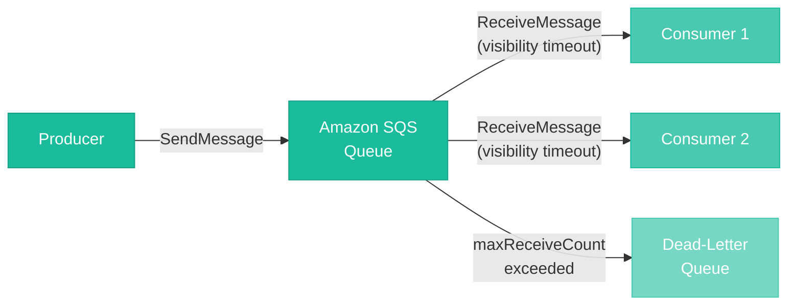
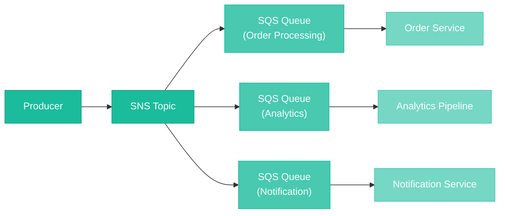
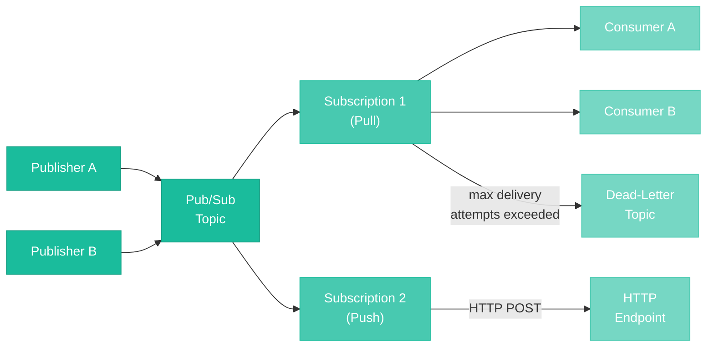
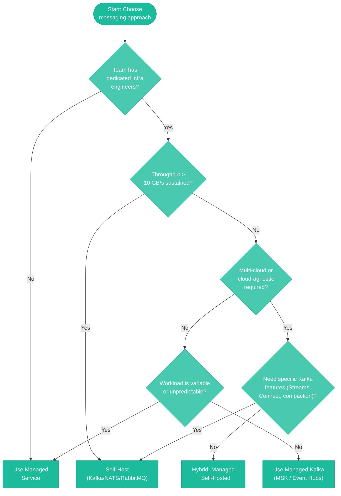
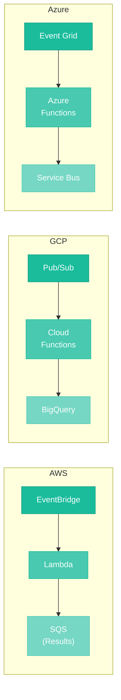
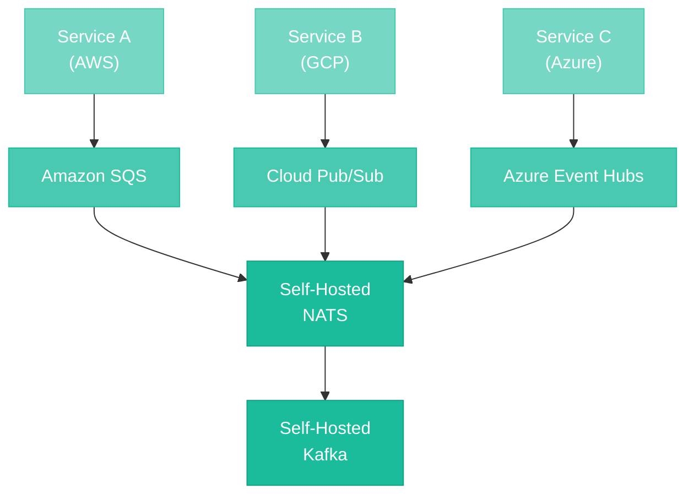

# Cloud-Managed Messaging Services

> **TL;DR:** Every major cloud provider offers managed messaging services that trade operational control for reduced infrastructure burden. AWS provides SQS (queuing), SNS (pub/sub), EventBridge (event routing), and MSK (managed Kafka). Google Cloud offers Pub/Sub (global serverless messaging) and Pub/Sub Lite (cost-optimized zonal variant). Azure provides Service Bus (enterprise messaging), Event Hubs (event streaming), and Event Grid (reactive event routing). Managed services eliminate the operational overhead of self-hosted brokers — patching, scaling, failover, monitoring — but introduce vendor lock-in, pricing unpredictability, and reduced configurability. The right choice depends on your team size, workload characteristics, multi-cloud requirements, and tolerance for operational complexity.

---

## Table of Contents

- [Why This Matters](#why-this-matters)
- [Why Cloud-Managed Messaging?](#why-cloud-managed-messaging)
  - [The Build vs Buy Trade-Off](#the-build-vs-buy-trade-off)
  - [Total Cost of Ownership](#total-cost-of-ownership)
- [AWS Messaging Services](#aws-messaging-services)
  - [Amazon SQS](#amazon-sqs)
  - [Amazon SNS](#amazon-sns)
  - [Amazon EventBridge](#amazon-eventbridge)
  - [Amazon MSK](#amazon-msk)
- [Google Cloud Messaging Services](#google-cloud-messaging-services)
  - [Google Cloud Pub/Sub](#google-cloud-pubsub)
  - [Google Cloud Pub/Sub Lite](#google-cloud-pubsub-lite)
- [Azure Messaging Services](#azure-messaging-services)
  - [Azure Service Bus](#azure-service-bus)
  - [Azure Event Hubs](#azure-event-hubs)
  - [Azure Event Grid](#azure-event-grid)
- [Cross-Cloud Comparison](#cross-cloud-comparison)
- [Self-Hosted vs Managed: Decision Framework](#self-hosted-vs-managed-decision-framework)
- [Vendor Lock-in and Portability](#vendor-lock-in-and-portability)
- [Common Patterns with Cloud Services](#common-patterns-with-cloud-services)
- [Key Takeaways](#key-takeaways)
- [References](#references)

---

## Why This Matters

Running a messaging system in production is not just about installing software and publishing messages. It is about capacity planning, version upgrades with zero downtime, security patching, monitoring broker health, managing disk space, handling rebalances, tuning garbage collection (for JVM-based systems), configuring replication, and being on-call when things break at 2 AM. For Kafka alone, a production-grade deployment requires expertise in partition management, ISR tuning, KRaft migration, Schema Registry operations, and Connect cluster maintenance.

Cloud-managed messaging services exist because most teams should not be in the business of running message brokers. The same way most teams use managed databases instead of operating their own PostgreSQL clusters, managed messaging lets you focus on your application logic rather than infrastructure operations.

But managed services are not a universal answer. They come with trade-offs — vendor lock-in, pricing that scales with usage (sometimes unpredictably), reduced configurability, and constraints that self-hosted deployments do not have. Understanding these trade-offs is what separates an informed architectural decision from a default one.

---

## Why Cloud-Managed Messaging?

### The Build vs Buy Trade-Off

Self-hosting a messaging system gives you full control: you choose the version, the configuration, the hardware, the network topology. You can tune every parameter, run any plugin, and switch providers without rewriting application code. But that control comes with a cost — an operational cost that is easy to underestimate.

**What self-hosting actually requires:**

| Responsibility | Kafka | RabbitMQ | NATS |
|----------------|-------|----------|------|
| **Provisioning and capacity planning** | Broker sizing, partition count, disk IOPS | Node sizing, queue depth projections | Server sizing, JetStream storage |
| **Version upgrades** | Rolling restarts, ISR monitoring, protocol compat | Rolling upgrades, plugin compatibility | Binary replacement, cluster coordination |
| **Security patching** | JVM + Kafka patches, TLS cert rotation | Erlang + RabbitMQ patches, TLS management | Go binary updates, TLS cert rotation |
| **Monitoring** | JMX metrics, consumer lag, under-replicated partitions | Management plugin, queue depth, connection count | NATS monitoring endpoints, JetStream metrics |
| **Scaling** | Add brokers, reassign partitions, rebalance | Add nodes, migrate queues | Add servers, stream placement |
| **Disaster recovery** | Cross-DC replication (MirrorMaker 2), backup strategies | Federation, shovel, backup | Cluster peering, stream mirroring |
| **On-call burden** | High (partition leader elections, ISR shrinks, disk full) | Medium (queue backlog, memory alarms, network partitions) | Low-medium (Raft leader elections, storage limits) |

Managed services eliminate most of these responsibilities. The cloud provider handles provisioning, patching, scaling, and failover. You interact with an API, publish messages, and consume them — the infrastructure is someone else's problem.

### Total Cost of Ownership

The pricing comparison between self-hosted and managed is not straightforward. Self-hosted has predictable compute costs but hidden operational costs (engineering time, on-call burden, incident response). Managed services have usage-based pricing that can be cheaper at low volume but expensive at high volume.

**When managed is typically cheaper:**

- Small to medium message volumes (under 1 billion messages/month)
- Variable or spiky workloads where auto-scaling matters
- Small teams without dedicated infrastructure engineers
- Prototyping and early-stage products where speed matters more than cost optimization

**When self-hosted is typically cheaper:**

- Very high, sustained throughput (billions of messages/day)
- Predictable, steady-state workloads where reserved instances can be optimized
- Large teams with existing infrastructure expertise
- Workloads where the managed service's per-message pricing exceeds compute costs

---

## AWS Messaging Services

AWS offers the broadest portfolio of messaging services, each designed for a different use case. The key to choosing the right one is understanding the boundaries between queuing, pub/sub, event routing, and event streaming.

### Amazon SQS

Amazon Simple Queue Service is a fully managed message queue that has been available since 2006 — one of the original AWS services. SQS requires zero provisioning: there are no brokers to manage, no capacity to plan, and no clusters to monitor. You create a queue, send messages, and receive them.

**Queue Types:**

| Feature | Standard Queue | FIFO Queue |
|---------|---------------|------------|
| **Delivery guarantee** | At-least-once (occasional duplicates) | Exactly-once processing |
| **Ordering** | Best-effort (no strict ordering) | Strict ordering within message group |
| **Throughput** | Nearly unlimited (tens of thousands of messages/second per queue) | 300 messages/second (3,000 with batching, higher with high-throughput mode) |
| **Deduplication** | None (consumer must be idempotent) | Content-based or explicit deduplication ID |
| **Pricing** | Lower per-request cost | Higher per-request cost |

**Core Concepts:**

- **Visibility timeout** -- When a consumer receives a message, it becomes invisible to other consumers for a configurable period (default 30 seconds). If the consumer does not delete the message before the timeout expires, the message becomes visible again and can be processed by another consumer. This is how SQS implements at-least-once delivery without explicit acknowledgments.
- **Dead-letter queues (DLQ)** -- After a configurable number of failed processing attempts (the `maxReceiveCount`), messages are moved to a separate dead-letter queue for inspection and debugging. This prevents poison messages from blocking the queue.
- **Long polling** -- Instead of repeatedly polling an empty queue (and paying for empty responses), long polling lets the consumer wait up to 20 seconds for a message to arrive. This reduces costs and improves efficiency.
- **Message retention** -- Messages can be retained for 1 minute to 14 days (default 4 days).
- **Message size** -- Up to 256 KB per message. For larger payloads, use the Extended Client Library to store the payload in S3 and pass a reference through SQS.

**When to use SQS:** Task queues, work distribution, decoupling microservices, buffering writes, any workload that needs a reliable queue without operational overhead. SQS is the default choice for point-to-point messaging on AWS.

### Amazon SNS

Amazon Simple Notification Service is a fully managed pub/sub service. Where SQS is a queue (one message consumed by one consumer), SNS is a topic (one message delivered to many subscribers).

**Topic Types:**

- **Standard topics** -- At-least-once delivery, best-effort ordering, nearly unlimited throughput. Subscribers can be SQS queues, Lambda functions, HTTP/S endpoints, email addresses, SMS, or mobile push.
- **FIFO topics** -- Strict ordering and exactly-once delivery, but only SQS FIFO queues and Lambda can subscribe. Limited to 300 publishes/second (3,000 with batching).

**Key Features:**

- **Message filtering** -- Subscribers can define filter policies on message attributes so they only receive messages that match specific criteria. This moves filtering logic from the consumer to the broker, reducing unnecessary processing and network traffic.
- **Fan-out pattern** -- The canonical SNS pattern is publishing to a topic that fans out to multiple SQS queues. Each queue feeds a different consumer or service. This decouples the publisher from the downstream processing pipeline.
- **Push-based delivery** -- Unlike SQS (where consumers poll), SNS pushes messages to subscribers. For HTTP endpoints, SNS sends an HTTP POST. For Lambda, it invokes the function. For SQS, it enqueues the message.
- **Cross-account and cross-region** -- SNS topics can deliver to subscribers in different AWS accounts and regions using resource-based policies.

**SNS + SQS Fan-Out Pattern:**

**When to use SNS:** Fan-out to multiple consumers, push-based delivery to HTTP endpoints or Lambda functions, mobile push notifications, email/SMS alerts. SNS is the default choice for one-to-many messaging on AWS.

### Amazon EventBridge

Amazon EventBridge is a serverless event bus designed for event-driven architectures. While SNS is a general-purpose pub/sub service, EventBridge is purpose-built for routing events based on their content — with first-class support for event schemas, cross-account routing, and integration with SaaS partners.

**Core Concepts:**

- **Event bus** -- The central router. AWS provides a default event bus for AWS service events, and you can create custom event buses for your application events.
- **Rules** -- Rules match incoming events against event patterns and route matching events to one or more targets. A single event bus can have hundreds of rules.
- **Event patterns** -- JSON-based matching on event attributes. You can match on exact values, prefixes, numeric ranges, and IP address ranges. This is more expressive than SNS filter policies.
- **Targets** -- Over 20 supported targets including Lambda, SQS, SNS, Step Functions, Kinesis, ECS tasks, API Gateway, and more.
- **Schema registry** -- EventBridge can discover and store event schemas automatically, generating code bindings for your events. This makes event-driven development more type-safe.

**How EventBridge differs from SNS:**

| Aspect | SNS | EventBridge |
|--------|-----|-------------|
| **Primary use case** | Fan-out messaging | Content-based event routing |
| **Filtering** | Attribute-based filter policies | JSON-based event patterns (richer matching) |
| **Schema support** | None | Schema registry with code generation |
| **SaaS integration** | None | 200+ SaaS partners (Shopify, Zendesk, Auth0, etc.) |
| **Cross-account** | Via resource policies | Native cross-account event buses |
| **Throughput** | Very high | Lower (varies by region, default soft limits) |
| **Archive and replay** | No | Yes -- events can be archived and replayed |
| **Pricing model** | Per message published + delivery | Per event published |

**When to use EventBridge:** Event-driven architectures with complex routing logic, SaaS integrations, cross-account event routing, schema-driven development, event archiving and replay. EventBridge is the default choice for event routing on AWS when you need more than simple fan-out.

### Amazon MSK

Amazon Managed Streaming for Apache Kafka is a managed Kafka service. Unlike SQS, SNS, and EventBridge (which are proprietary AWS services), MSK runs actual Apache Kafka — the same open-source software you would run on your own infrastructure, but with AWS managing the underlying compute, storage, and networking.

**What AWS manages:**

- Broker provisioning and hardware maintenance
- Apache ZooKeeper / KRaft controller quorum
- Patching and version upgrades
- Monitoring (integrated with CloudWatch)
- Storage scaling (auto-scaling available)
- Cross-AZ replication for high availability

**What you still manage:**

- Topic creation and configuration (partition count, replication factor, retention)
- Producer and consumer application code and configuration
- Schema Registry (you run Confluent Schema Registry yourself, or use AWS Glue Schema Registry)
- Kafka Connect clusters (you provision and manage these yourself, or use MSK Connect)
- Consumer group management and consumer lag monitoring
- Capacity planning (broker count, instance types) for provisioned mode

**MSK Deployment Modes:**

| Feature | MSK Provisioned | MSK Serverless |
|---------|----------------|----------------|
| **Pricing** | Per-broker-hour + storage | Per-cluster-hour + throughput + storage |
| **Capacity management** | You choose broker count and instance type | Automatic scaling |
| **Configuration control** | Full Kafka configuration access | Limited configuration |
| **Max throughput** | Depends on instance type (up to hundreds of MB/s) | Up to 200 MB/s per cluster |
| **Use case** | Production workloads requiring full Kafka control | Variable workloads, lower operational overhead |

**When to use MSK vs SQS/SNS:** Use MSK when you need Kafka's specific capabilities — log-based storage, consumer groups with partition-level ordering, stream processing with Kafka Streams or Flink, the Kafka Connect ecosystem, or compatibility with existing Kafka applications. Use SQS/SNS when you need a simple queue or pub/sub service without the complexity of operating Kafka topics, partitions, and consumer groups.

---

## Google Cloud Messaging Services

Google Cloud takes a different approach than AWS: instead of offering many specialized services, it provides one primary messaging service — Cloud Pub/Sub — that handles both queuing and pub/sub use cases, plus a cost-optimized variant for high-volume workloads.

### Google Cloud Pub/Sub

Cloud Pub/Sub is a fully managed, globally distributed messaging and event streaming service. It is serverless (no brokers to provision), globally replicated (messages are stored across multiple zones and regions by default), and supports both real-time messaging and event streaming patterns.

**Core Concepts:**

- **Topics** -- Named channels to which publishers send messages. Topics are global resources — they are not tied to a specific region.
- **Subscriptions** -- Named resources attached to topics. Each subscription receives a copy of every message published to the topic. Multiple subscriptions on the same topic enable fan-out. A single subscription with multiple subscribers enables load balancing.
- **Push vs Pull delivery** -- Pull subscriptions let consumers request messages on their own schedule (similar to SQS long polling). Push subscriptions deliver messages via HTTP POST to a configured endpoint (similar to SNS). Push delivery supports authentication via OIDC tokens.
- **Acknowledgment** -- Consumers must acknowledge messages within a configurable deadline (default 10 seconds, max 600 seconds). Unacknowledged messages are redelivered. This is analogous to SQS visibility timeout.

**Key Features:**

- **Exactly-once delivery** -- Pub/Sub supports exactly-once delivery within a single cloud region by using acknowledgment IDs to deduplicate redeliveries. This is a subscription-level setting.
- **Message ordering** -- Messages published with the same ordering key are delivered in order to pull subscribers. Without ordering keys, delivery order is not guaranteed.
- **Dead-letter topics** -- Messages that cannot be processed after a configurable number of delivery attempts are forwarded to a dead-letter topic.
- **Seek and replay** -- Subscriptions can "seek" to a past timestamp or a snapshot, replaying all messages from that point forward. This is similar to resetting Kafka consumer offsets.
- **Message retention** -- Topics can retain messages for up to 31 days, regardless of whether they have been acknowledged. Subscriptions can also retain acknowledged messages for replay.
- **Message size** -- Up to 10 MB per message.
- **Filtering** -- Subscriptions can define filters on message attributes, so subscribers only receive messages matching specific criteria.

**When to use Cloud Pub/Sub:** General-purpose messaging and event streaming on Google Cloud. Real-time analytics pipelines (Pub/Sub to Dataflow to BigQuery), event-driven microservices, IoT data ingestion, cross-region message replication. Pub/Sub is the default messaging service for virtually any use case on GCP.

### Google Cloud Pub/Sub Lite

Pub/Sub Lite is a cost-optimized, zonal messaging service designed for high-volume workloads where the global replication and serverless scaling of standard Pub/Sub is unnecessary or too expensive.

**Key Differences from Standard Pub/Sub:**

| Feature | Pub/Sub (Standard) | Pub/Sub Lite |
|---------|-------------------|--------------|
| **Availability** | Multi-zone, multi-region | Single zone (zonal Lite) or multi-zone (regional Lite) |
| **Capacity management** | Serverless, auto-scaling | Pre-provisioned throughput and storage capacity |
| **Pricing model** | Per-message (pay for what you use) | Per-provisioned capacity (pay for what you reserve) |
| **Ordering** | Ordering keys (optional) | Partition-based ordering (like Kafka) |
| **Message retention** | Up to 31 days | Configurable, limited by provisioned storage |
| **Global routing** | Yes | No |
| **Exactly-once delivery** | Yes | No (at-least-once only) |

**When to use Pub/Sub Lite:** High-volume, cost-sensitive workloads where you know your throughput in advance and can tolerate zonal availability. Common examples include high-volume logging, metrics ingestion, and event streaming where the per-message cost of standard Pub/Sub becomes prohibitive. If your monthly message volume exceeds roughly 100 TB, Pub/Sub Lite can be significantly cheaper.

---

## Azure Messaging Services

Azure provides three primary messaging services, each targeting a different point on the messaging spectrum: Service Bus for enterprise messaging, Event Hubs for event streaming, and Event Grid for reactive event routing.

### Azure Service Bus

Azure Service Bus is a fully managed enterprise message broker with support for queues (point-to-point) and topics/subscriptions (pub/sub). It is the Azure service closest to RabbitMQ in concept — a traditional message broker with rich routing, transactions, and message processing features.

**Core Features:**

- **Queues** -- Point-to-point delivery with at-least-once (peek-lock) or at-most-once (receive-and-delete) consumption. Messages are ordered (FIFO) and durable.
- **Topics and subscriptions** -- Pub/sub with per-subscription filtering rules. Each subscription receives a copy of matching messages, similar to SNS + SQS fan-out.
- **Sessions** -- Group related messages by session ID for ordered, stateful processing. A consumer locks a session and processes all its messages in order. This is similar to Kafka partition-level ordering but more flexible (sessions are logical, not physical).
- **Transactions** -- Atomic operations across multiple messages: send, complete, and defer in a single transaction. This is a feature that most cloud messaging services lack.
- **Dead-lettering** -- Built-in dead-letter sub-queue for messages that cannot be processed, expire, or violate subscription filter rules.
- **Scheduled delivery** -- Enqueue a message with a future delivery time. The message becomes visible to consumers only after the scheduled time.
- **Duplicate detection** -- Time-window-based deduplication by message ID. Useful for idempotent producers.
- **Auto-forwarding** -- Automatically forward messages from one queue or subscription to another, enabling chaining and routing patterns.

**Tiers:**

| Feature | Standard | Premium |
|---------|----------|---------|
| **Throughput** | Shared (variable) | Dedicated (predictable) |
| **Message size** | 256 KB | 100 MB |
| **Isolation** | Multi-tenant | Single-tenant (dedicated resources) |
| **Virtual network integration** | No | Yes |
| **Geo-disaster recovery** | No | Yes (metadata replication) |
| **Pricing** | Per-operation | Per messaging unit (hourly) |

**When to use Service Bus:** Enterprise integration, task processing with transactions, ordered message processing with sessions, workloads requiring scheduled delivery, and applications migrating from on-premises message brokers (MSMQ, IBM MQ, RabbitMQ).

### Azure Event Hubs

Azure Event Hubs is a managed event streaming platform with a partitioned consumer model. It is conceptually closest to Apache Kafka — and in fact, Event Hubs exposes a Kafka-compatible API, allowing Kafka clients to connect without code changes.

**Core Concepts:**

- **Event Hubs** -- Named streams that hold event data. Each Event Hub has a configurable number of partitions (1-32 in standard, up to 2,000 in dedicated).
- **Partitions** -- Ordered sequences of events. Events with the same partition key are routed to the same partition. Consumers read from partitions in order — the same model as Kafka.
- **Consumer groups** -- Named views over the event stream. Each consumer group independently tracks its position (offset) in each partition. Default limit is 5 consumer groups in standard tier.
- **Capture** -- Automatically archive event data to Azure Blob Storage or Azure Data Lake Store in Avro format. This is similar to Kafka Connect's S3 sink but built in.
- **Event retention** -- 1 to 90 days depending on tier. Events are not deleted after consumption — they remain for the retention period, just like Kafka.

**Tiers:**

| Feature | Standard | Premium | Dedicated |
|---------|----------|---------|-----------|
| **Throughput units** | 1-40 TUs (1 TU = 1 MB/s ingress, 2 MB/s egress) | Processing units (auto-scale) | Capacity units (single-tenant) |
| **Partitions** | Up to 32 | Up to 100 | Up to 2,000 |
| **Consumer groups** | 20 | 100 | 1,000 |
| **Retention** | Up to 7 days | Up to 90 days | Up to 90 days |
| **Kafka compatibility** | Yes | Yes | Yes |
| **Schema Registry** | Yes | Yes | Yes |

**When to use Event Hubs:** Event streaming, telemetry ingestion, log aggregation, real-time analytics, and any workload that benefits from Kafka's partitioned log model. Event Hubs is the natural choice for teams that want Kafka semantics without running Kafka clusters. The Kafka-compatible API makes migration straightforward.

### Azure Event Grid

Azure Event Grid is a serverless event routing service designed for reactive, event-driven architectures. Where Service Bus and Event Hubs handle high-volume messaging and streaming, Event Grid is optimized for reacting to state changes — a new blob created in storage, a resource deployed in Azure, or a custom event from your application.

**Core Concepts:**

- **Topics** -- Sources of events. System topics are automatically created for Azure services (Storage, Resource Manager, etc.). Custom topics are created for your application events.
- **Event domains** -- Organize related custom topics (up to 100,000 topics per domain) for multi-tenant applications.
- **Event subscriptions** -- Define which events to receive and where to deliver them. Subscriptions support filtering by event type, subject prefix/suffix, and advanced filters on data fields.
- **Event handlers** -- Targets for event delivery: Azure Functions, Logic Apps, Event Hubs, Service Bus queues/topics, Storage queues, Webhooks, and more.
- **Push-based delivery** -- Event Grid pushes events to handlers. It retries delivery on failure with exponential backoff and supports dead-lettering to a storage account.

**When to use Event Grid:** Reacting to Azure resource events (blob created, VM started, deployment completed), serverless event-driven workflows, lightweight event routing where sub-second latency is not critical, and integration between Azure services. Event Grid is not designed for high-throughput streaming or transactional messaging — use Event Hubs or Service Bus for those.

---

## Cross-Cloud Comparison

The following table compares the primary messaging services across all three cloud providers. Each column represents the service that most closely fills that architectural role.

### Queuing Services

| Feature | Amazon SQS | Azure Service Bus (Queues) | Cloud Pub/Sub (Pull) |
|---------|-----------|---------------------------|---------------------|
| **Delivery guarantee** | At-least-once (std) / exactly-once (FIFO) | At-least-once (peek-lock) / at-most-once (receive-and-delete) | At-least-once / exactly-once (regional) |
| **Ordering** | FIFO queues only | FIFO with sessions | Ordering keys |
| **Max message size** | 256 KB (2 GB with S3) | 256 KB (std) / 100 MB (premium) | 10 MB |
| **Message retention** | Up to 14 days | Up to 14 days | Up to 31 days |
| **Dead-letter support** | Yes | Yes | Yes (dead-letter topic) |
| **Transactions** | No | Yes | No |
| **Throughput** | Nearly unlimited (std) / 300-3,000 msg/s (FIFO) | Variable (std) / dedicated (premium) | Serverless auto-scaling |
| **Pricing model** | Per request | Per operation (std) / per unit (premium) | Per data volume |

### Pub/Sub and Event Routing Services

| Feature | Amazon SNS | Amazon EventBridge | Cloud Pub/Sub | Azure Event Grid |
|---------|-----------|-------------------|---------------|-----------------|
| **Delivery model** | Push | Push | Push or Pull | Push |
| **Filtering** | Attribute-based | JSON event patterns | Attribute-based | Event type + advanced filters |
| **Fan-out** | To SQS, Lambda, HTTP, email, SMS | To 20+ AWS targets | Multiple subscriptions | To Functions, Event Hubs, Service Bus, etc. |
| **Schema support** | No | Schema registry | Schema validation | CloudEvents schema |
| **Archive and replay** | No | Yes | Yes (seek/snapshot) | No (use dead-lettering) |
| **SaaS integration** | No | 200+ partners | No | Partner events |
| **Cross-account** | Yes | Yes | Cross-project IAM | Cross-subscription (Azure) |

### Event Streaming Services

| Feature | Amazon MSK | Azure Event Hubs | Cloud Pub/Sub (with ordering) | Cloud Pub/Sub Lite |
|---------|-----------|-----------------|-------------------------------|-------------------|
| **Model** | Kafka (log-based, partitioned) | Kafka-compatible (partitioned) | Topic/subscription | Partitioned (Kafka-like) |
| **Kafka API compatible** | Yes (it is Kafka) | Yes | No | No |
| **Ordering** | Per-partition | Per-partition | Per ordering key | Per-partition |
| **Retention** | Configurable (unlimited with tiered storage) | Up to 90 days | Up to 31 days | Configurable |
| **Consumer groups** | Native Kafka consumer groups | Up to 1,000 (dedicated) | Independent subscriptions | Consumer groups |
| **Stream processing** | Kafka Streams, Flink | Azure Stream Analytics | Dataflow | Dataflow |
| **Replay** | Offset reset | Offset reset | Seek to timestamp/snapshot | Offset reset |
| **Provisioning** | Provisioned or serverless | TU/PU/CU based | Serverless | Pre-provisioned |

---

## Self-Hosted vs Managed: Decision Framework

The decision between self-hosted and managed messaging is not binary — it depends on your team, your workload, and your organizational context. The following framework helps structure the decision.

**Factors favoring managed services:**

- **Small team** -- If your team is under 10 engineers, dedicating someone to broker operations is a significant cost. Managed services let you focus on application logic.
- **Rapid prototyping** -- When time-to-market matters more than unit cost, managed services eliminate infrastructure setup time.
- **Variable or unpredictable load** -- Serverless messaging services (SQS, Pub/Sub, EventBridge) scale automatically. Self-hosted systems require capacity planning and manual scaling.
- **Serverless architecture** -- If your compute is Lambda/Cloud Functions/Azure Functions, managed messaging integrates natively. Running Kafka alongside serverless compute creates architectural friction.
- **Compliance requirements** -- Managed services often come with compliance certifications (SOC 2, HIPAA, PCI) that would be expensive to achieve with self-hosted infrastructure.

**Factors favoring self-hosted:**

- **Extreme throughput** -- At very high volumes (tens of GB/s sustained), self-hosted Kafka on tuned hardware is cheaper and faster than any managed alternative.
- **Cost optimization at scale** -- When message volume is high and predictable, the per-message pricing of managed services exceeds the cost of self-hosted compute and storage.
- **Multi-cloud portability** -- Self-hosted Kafka, NATS, or RabbitMQ runs identically on any cloud (or on-premises). Managed services are cloud-specific.
- **Specific protocol or feature needs** -- Self-hosted gives you full access to every configuration parameter, plugin, and protocol version. Managed services restrict what you can configure.
- **Data residency** -- Some managed services replicate data across zones or regions automatically. If you need strict control over where data resides, self-hosted may be necessary.

---

## Vendor Lock-in and Portability

Vendor lock-in is the most commonly cited objection to managed messaging services — and it is a legitimate concern, but one that is often poorly understood. The real cost of lock-in is not that you cannot migrate; it is that migration is expensive enough to distort future architectural decisions.

**Where lock-in occurs:**

- **API and SDK coupling** -- Your application code uses cloud-specific SDKs (AWS SDK, Google Cloud client libraries, Azure SDK). Switching providers means rewriting all messaging integration code.
- **Feature coupling** -- You build on features that have no equivalent in other clouds: EventBridge's schema registry, Pub/Sub's seek-to-timestamp, Service Bus's sessions and transactions.
- **Infrastructure coupling** -- Your messaging is tightly integrated with other cloud services: SNS triggers Lambda, Pub/Sub feeds Dataflow, Event Grid triggers Azure Functions. Migrating messaging means migrating the entire event-driven pipeline.
- **Operational coupling** -- Your monitoring, alerting, and operational runbooks are built around cloud-specific metrics and dashboards (CloudWatch, Cloud Monitoring, Azure Monitor).

**Strategies to reduce lock-in:**

1. **CloudEvents specification** -- Use the CloudEvents standard for your event envelope format. CloudEvents defines a common set of metadata attributes (source, type, subject, time) that work across any messaging system. All three major cloud providers support CloudEvents natively.

2. **AsyncAPI** -- Define your message contracts using AsyncAPI, an open standard for documenting event-driven APIs. AsyncAPI is protocol-agnostic and can generate code for multiple messaging systems.

3. **Abstraction layers** -- Build a thin messaging abstraction in your application code that wraps the cloud-specific SDK. The abstraction exposes publish/subscribe/acknowledge operations; the implementation is cloud-specific. This limits the blast radius of a migration to a single module.

4. **Open protocols** -- Where possible, use services that support open protocols. Event Hubs supports the Kafka protocol. MSK is Kafka. This makes migration to self-hosted Kafka (or another Kafka-compatible service) straightforward.

5. **Avoid proprietary features unless they deliver significant value.** EventBridge's schema registry is convenient, but if portability matters, use an external schema registry (like Confluent Schema Registry or Apicurio) instead.

**The pragmatic perspective:** Complete cloud portability is expensive to achieve and rarely necessary. Most organizations will not switch cloud providers for their core infrastructure. The pragmatic approach is to (a) use CloudEvents for your event format, (b) build a thin abstraction layer around messaging operations, and (c) accept cloud-specific features where they deliver real value, knowing the migration cost if you ever need to move.

---

## Common Patterns with Cloud Services

### Fan-Out

The fan-out pattern delivers a single event to multiple downstream consumers, each processing the event independently. This is the most common messaging pattern in cloud architectures.

**AWS (SNS to SQS):**

A producer publishes an "OrderPlaced" event to an SNS topic. Three SQS queues subscribe to the topic: one for order fulfillment, one for analytics, and one for email notifications. Each queue feeds a separate service. If one service fails, the others are unaffected — the failed messages accumulate in the SQS queue (and eventually move to its DLQ).

**GCP (Pub/Sub multiple subscriptions):**

A producer publishes to a Pub/Sub topic. Three subscriptions are attached: one pull subscription for the fulfillment service, one push subscription for the analytics webhook, and one pull subscription for the notification service. Each subscription maintains independent acknowledgment state.

**Azure (Event Grid to multiple handlers):**

An Event Grid topic receives a custom event. Three event subscriptions deliver the event to an Azure Function (fulfillment), an Event Hubs instance (analytics), and a Service Bus queue (notifications).

### Event-Driven Serverless

Serverless compute pairs naturally with managed messaging because both are fully managed, scale-to-zero capable, and billed per invocation or per message.

The pattern is the same across clouds: an event source triggers a serverless function, which processes the event and optionally publishes results to another messaging service. The key advantage is that the entire pipeline — messaging, compute, and downstream storage — scales automatically with no provisioned infrastructure.

### Hybrid Cloud Messaging

Many organizations run a mix of self-hosted and cloud-managed messaging. The most common hybrid pattern bridges self-hosted Kafka with cloud-native services.

**Pattern 1: Kafka to Cloud (Data Lake Ingestion)**

Self-hosted Kafka handles the high-throughput operational workload. A Kafka Connect sink connector (or a custom consumer) forwards a subset of events to a cloud service — Cloud Pub/Sub for GCP analytics, Kinesis for AWS analytics, or Event Hubs for Azure analytics. This avoids the cost of running all analytics traffic through cloud messaging while keeping the cloud data pipeline fed.

**Pattern 2: Cloud to Kafka (Event Enrichment)**

Cloud events (SaaS webhooks received via EventBridge, Azure resource events from Event Grid, GCP audit logs from Pub/Sub) are forwarded to a self-hosted Kafka cluster for centralized event processing. This creates a single event backbone that unifies cloud and on-premises events.

**Pattern 3: Multi-Cloud Event Mesh**

For organizations operating across multiple clouds, a self-hosted NATS or Kafka cluster can serve as the central event backbone, with cloud-specific connectors bridging to each cloud's native messaging services. CloudEvents formatting ensures a consistent event envelope regardless of source or destination.

---

## Key Takeaways

1. **Managed messaging services eliminate operational burden, not complexity.** You still need to understand delivery semantics, ordering guarantees, dead-letter handling, and scaling characteristics. The difference is that you are not also responsible for patching brokers and managing disk space.

2. **AWS, GCP, and Azure take different architectural approaches.** AWS offers the most services (SQS, SNS, EventBridge, MSK) with clear separation of concerns. GCP centralizes on Pub/Sub as a single versatile service. Azure provides a spectrum from enterprise messaging (Service Bus) to event streaming (Event Hubs) to reactive routing (Event Grid).

3. **The build-vs-buy decision hinges on team size and workload characteristics.** Small teams, variable workloads, and serverless architectures strongly favor managed services. Large teams with extreme throughput, multi-cloud requirements, or deep infrastructure expertise may get better economics from self-hosting.

4. **Vendor lock-in is real but manageable.** Use CloudEvents for event formatting, AsyncAPI for contract documentation, thin abstraction layers in application code, and services that support open protocols (Kafka API on Event Hubs, MSK) to reduce the migration cost if you ever need to move.

5. **The SNS-to-SQS fan-out pattern (and its equivalents on GCP and Azure) is the most common cloud messaging pattern.** It cleanly separates event distribution from event processing, provides independent failure isolation per consumer, and integrates naturally with serverless compute.

6. **Managed Kafka (MSK, Event Hubs) occupies a middle ground.** It gives you Kafka's capabilities with reduced operational burden, but you still manage topics, consumers, and (in MSK's case) Schema Registry and Connect. It is not as hands-off as SQS or Pub/Sub.

7. **Hybrid architectures are common and practical.** Most organizations do not go all-managed or all-self-hosted. Bridging self-hosted Kafka with cloud-native services for analytics, serverless processing, or multi-cloud routing is a well-established pattern.

8. **Pricing models differ fundamentally across services.** Per-message (SQS, SNS), per-data-volume (Pub/Sub), per-provisioned-capacity (Pub/Sub Lite, Service Bus Premium), and per-broker-hour (MSK) create very different cost curves. Model your expected traffic before committing to a service.

---

## References

- AWS Documentation. ["Amazon SQS Developer Guide"](https://docs.aws.amazon.com/AWSSimpleQueueService/latest/SQSDeveloperGuide/welcome.html) -- Queue types, visibility timeout, dead-letter queues, and long polling.
- AWS Documentation. ["Amazon SNS Developer Guide"](https://docs.aws.amazon.com/sns/latest/dg/welcome.html) -- Topic types, message filtering, and fan-out patterns.
- AWS Documentation. ["Amazon EventBridge User Guide"](https://docs.aws.amazon.com/eventbridge/latest/userguide/eb-what-is.html) -- Event buses, rules, schema registry, and cross-account routing.
- AWS Documentation. ["Amazon MSK Developer Guide"](https://docs.aws.amazon.com/msk/latest/developerguide/what-is-msk.html) -- Managed Kafka provisioned and serverless modes.
- Google Cloud Documentation. ["Pub/Sub Documentation"](https://cloud.google.com/pubsub/docs/overview) -- Topics, subscriptions, ordering, exactly-once delivery, and seek.
- Google Cloud Documentation. ["Pub/Sub Lite Documentation"](https://cloud.google.com/pubsub/lite/docs/overview) -- Zonal messaging, provisioned capacity, and cost optimization.
- Microsoft Azure Documentation. ["Azure Service Bus Documentation"](https://learn.microsoft.com/en-us/azure/service-bus-messaging/service-bus-messaging-overview) -- Queues, topics, sessions, and transactions.
- Microsoft Azure Documentation. ["Azure Event Hubs Documentation"](https://learn.microsoft.com/en-us/azure/event-hubs/event-hubs-about) -- Partitioned event streaming, Kafka compatibility, and Capture.
- Microsoft Azure Documentation. ["Azure Event Grid Documentation"](https://learn.microsoft.com/en-us/azure/event-grid/overview) -- Event routing, domains, subscriptions, and filters.
- CNCF CloudEvents. ["CloudEvents Specification"](https://cloudevents.io/) -- The open specification for describing event data in a common format.
- AsyncAPI Initiative. ["AsyncAPI Specification"](https://www.asyncapi.com/) -- Open standard for defining event-driven API contracts.
- Confluent. ["Managed vs Self-Managed Kafka"](https://www.confluent.io/blog/kafka-managed-vs-self-managed/) -- Confluent's perspective on managed Kafka trade-offs.
- Kleppmann, M. (2017). *Designing Data-Intensive Applications*. O'Reilly Media. -- Chapter 11 (Stream Processing) covers messaging system design trade-offs relevant to managed services.

---

*Previous: [Section Overview](./README.md) | Back to [Cloud Messaging](./README.md)*
