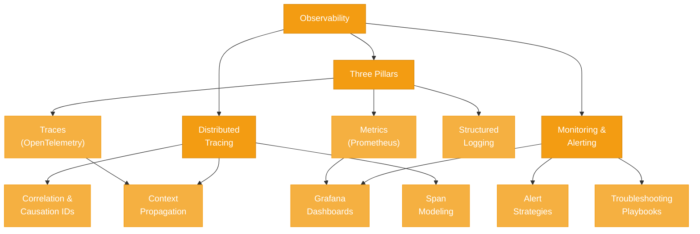

# Observability

> **You can't fix what you can't see.** Messaging systems introduce unique observability challenges that don't exist in synchronous architectures: messages cross asynchronous boundaries, fan out to multiple consumers, and flow through brokers where traditional request-response tracing falls apart. This section covers how to instrument, monitor, trace, and troubleshoot messaging systems in production — from Prometheus metrics to distributed tracing through message brokers.

---

## Concept Map

---

## Pages in This Section

| # | Page | What You Will Learn |
|---|------|---------------------|
| 1 | [Observability and Distributed Tracing](./observability-and-tracing.md) | The three pillars of observability applied to messaging, distributed tracing across async boundaries, correlation and causation ID patterns, key metrics for Kafka/RabbitMQ/NATS, monitoring architecture with Prometheus and Grafana, alerting strategies, troubleshooting playbooks, and structured logging best practices. |

---

## Suggested Reading Order

1. **Read [Observability and Distributed Tracing](./observability-and-tracing.md)** from start to finish. The page is structured progressively — from foundational concepts (three pillars, tracing) through implementation details (metrics, monitoring stacks) to operational practice (alerting, troubleshooting playbooks). Each section builds on the previous one.

2. **After completing this section**, you will have the operational knowledge to instrument, monitor, and troubleshoot the messaging systems covered in [Apache Kafka](../02-apache-kafka/README.md), [NATS](../03-nats/README.md), and [RabbitMQ](../05-rabbitmq/README.md) in production.

---

## Prerequisites

This section assumes familiarity with the messaging systems covered earlier in this knowledge base:

- **[Messaging Foundations](../01-messaging-foundations/README.md)** -- delivery semantics, broker architecture, consumer groups
- **[Apache Kafka](../02-apache-kafka/README.md)** -- partitions, consumer groups, ISR, replication (needed for Kafka-specific metrics)
- **[NATS](../03-nats/README.md)** -- core NATS, JetStream streams and consumers (needed for NATS-specific metrics)
- **[RabbitMQ](../05-rabbitmq/README.md)** -- exchanges, queues, channels, quorum queues (needed for RabbitMQ-specific metrics)

You do not need to have read every page in those sections, but you should understand the core architecture of at least one messaging system to get the most from this material.

---

*Start here: [Observability and Distributed Tracing](./observability-and-tracing.md)*
