# Observability and Distributed Tracing

> **TL;DR** -- Messaging systems are inherently harder to observe than synchronous services. Messages cross asynchronous boundaries, fan out to multiple consumers, and flow through brokers that break traditional request-response tracing. This page covers the three pillars of observability applied to messaging, distributed tracing through message brokers with OpenTelemetry, correlation and causation ID patterns for event lineage, the key metrics to monitor for Kafka, RabbitMQ, and NATS, production monitoring stacks with Prometheus and Grafana, alerting strategies that avoid fatigue, and troubleshooting playbooks for the most common messaging failures.

---

## Table of Contents

- [Why This Matters](#why-this-matters)
- [The Three Pillars of Observability](#the-three-pillars-of-observability)
- [Distributed Tracing for Messaging](#distributed-tracing-for-messaging)
- [Correlation IDs and Causation Chains](#correlation-ids-and-causation-chains)
- [Key Metrics for Messaging Systems](#key-metrics-for-messaging-systems)
- [Monitoring Architecture](#monitoring-architecture)
- [Alerting Strategies](#alerting-strategies)
- [Troubleshooting Playbooks](#troubleshooting-playbooks)
- [Logging Best Practices](#logging-best-practices)
- [Building an Observability Dashboard](#building-an-observability-dashboard)
- [Key Takeaways](#key-takeaways)
- [References](#references)

---

## Why This Matters

You have learned how to build event-driven systems with Kafka, NATS, and RabbitMQ. You know the patterns -- sagas, outbox, CQRS. But in production, the question is not "does it work?" but **"is it working right now, and how do I know?"**

Messaging systems make observability harder than synchronous architectures. In a REST-based system, you can trace a request from ingress to response. In an event-driven system, a single business operation might:

- Produce a message to Kafka, which fans out to three consumer groups
- Trigger a saga that publishes four more events across different topics
- Eventually land in a NATS JetStream consumer that calls a RabbitMQ-backed task queue

There is no single request-response pair to trace. There is no HTTP status code to check. Without deliberate instrumentation, you are flying blind -- and the first sign of trouble will be a customer complaint, not a dashboard alert.

This page gives you the tools and techniques to make messaging systems observable: what to measure, how to trace across async boundaries, what to alert on, and how to diagnose the inevitable production incidents.

---

## The Three Pillars of Observability

Observability rests on three complementary signal types: **metrics**, **logs**, and **traces**. Each answers a different question, and you need all three for a complete picture.

```mermaid
graph TB
    OBS["Observability"]

    MET["Metrics"]
    LOG["Logs"]
    TRC["Traces"]

    MET_D["Numeric time-series<br/>aggregated measurements"]
    LOG_D["Discrete events with<br/>structured context"]
    TRC_D["Request-scoped<br/>causal chains"]

    MET_Q["'What is happening<br/>right now?'"]
    LOG_Q["'What exactly<br/>happened?'"]
    TRC_Q["'How did it flow<br/>through the system?'"]

    OBS --> MET
    OBS --> LOG
    OBS --> TRC

    MET --> MET_D
    MET --> MET_Q
    LOG --> LOG_D
    LOG --> LOG_Q
    TRC --> TRC_D
    TRC --> TRC_Q

    style OBS fill:#f39c12,stroke:#d68910,color:#fff
    style MET fill:#f39c12,stroke:#d68910,color:#fff
    style LOG fill:#f39c12,stroke:#d68910,color:#fff
    style TRC fill:#f39c12,stroke:#d68910,color:#fff
    style MET_D fill:#f5b041,stroke:#f39c12,color:#fff
    style LOG_D fill=#f5b041,stroke:#f39c12,color:#fff
    style TRC_D fill:#f5b041,stroke:#f39c12,color:#fff
    style MET_Q fill:#fad7a0,stroke:#f5b041,color:#333
    style LOG_Q fill:#fad7a0,stroke:#f5b041,color:#333
    style TRC_Q fill:#fad7a0,stroke:#f5b041,color:#333
```

| Pillar | What It Captures | Messaging-Specific Challenges |
|--------|-----------------|-------------------------------|
| **Metrics** | Rates, counts, histograms, gauges -- quantitative measurements over time | Consumer lag, message age, and queue depth are messaging-specific metrics that have no equivalent in synchronous systems |
| **Logs** | Individual events with context -- a message was produced, consumed, failed, or sent to the DLQ | High-throughput messaging can generate millions of log lines per minute; structured logging with correlation IDs is essential to avoid drowning in noise |
| **Traces** | End-to-end request flow across services and boundaries | Traditional traces follow synchronous call chains; messaging introduces async gaps where a trace must survive serialization into a message header, broker storage, and deserialization by a consumer that may run hours later |

**Why messaging adds unique challenges:**

- **Asynchronous boundaries** -- a producer does not wait for the consumer; the trace context must be explicitly propagated through message headers, not implicitly through the call stack.
- **Fan-out** -- one published message may be consumed by multiple independent consumer groups, creating a tree of trace spans rather than a linear chain.
- **Temporal decoupling** -- a message may sit in a queue or topic for minutes, hours, or days before being consumed. The trace context must remain valid across that gap.
- **Decoupled ownership** -- the producer team and consumer team may not even know each other. Consistent instrumentation requires organizational standards, not just technical tooling.

---

## Distributed Tracing for Messaging

### Why HTTP Tracing Doesn't Directly Work

In a synchronous HTTP-based architecture, distributed tracing is relatively straightforward. An HTTP client injects a trace context (trace ID, span ID, sample flag) into request headers. The server extracts it, creates a child span, and propagates it to any downstream calls. The trace is a clean, linear chain of parent-child spans.

Messaging breaks this model in three ways:

1. **No request-response pair.** The producer sends a message and moves on. There is no "response" that carries the trace context back. The consumer span is not a child of a synchronous call -- it is a continuation of an asynchronous flow.
2. **The broker is in the middle.** The message sits in a broker (Kafka topic, RabbitMQ queue, NATS stream) for an indeterminate amount of time. The broker does not create spans or propagate trace context -- it just stores bytes.
3. **Multiple consumers.** A single produced message may be consumed by N independent consumer groups, each creating their own span tree. This is not a parent-child relationship -- it is a "link" relationship.

### Trace Context Propagation via Message Headers

The solution is to propagate trace context through **message headers** (or metadata), following the [W3C Trace Context](https://www.w3.org/TR/trace-context/) standard. The producer injects `traceparent` and optional `tracestate` headers into the message. Each consumer extracts them and continues the trace.

**W3C `traceparent` header format:**

```
traceparent: 00-<trace-id>-<parent-span-id>-<trace-flags>
             ^^  ^^^^^^^^    ^^^^^^^^^^^^^    ^^^^^^^^^^^
           version  32 hex      16 hex        01 = sampled
```

Example:
```
traceparent: 00-4bf92f3577b34da6a3ce929d0e0e4736-00f067aa0ba902b7-01
```

### Span Modeling: Producer, Broker, Consumer

OpenTelemetry defines semantic conventions for messaging spans. The key insight is that the producer span and consumer span are **not** in a direct parent-child relationship. Instead, the consumer span **links** to the producer span.

```mermaid
sequenceDiagram
    participant P as Producer Service
    participant B as Message Broker
    participant C1 as Consumer Service A
    participant C2 as Consumer Service B

    Note over P: Create PRODUCER span<br/>Inject traceparent into<br/>message headers

    P->>B: publish(message + traceparent header)

    Note over B: Broker stores message<br/>(no span created)

    B->>C1: deliver to consumer group A
    Note over C1: Create CONSUMER span<br/>Extract traceparent<br/>Link to producer span

    B->>C2: deliver to consumer group B
    Note over C2: Create CONSUMER span<br/>Extract traceparent<br/>Link to producer span

    Note over C1: Child spans for<br/>processing logic
    Note over C2: Child spans for<br/>processing logic
```



**Span types in OpenTelemetry messaging:**

| Span Kind | Created By | Attributes |
|-----------|-----------|------------|
| `PRODUCER` | Publishing service | `messaging.system`, `messaging.destination.name`, `messaging.message.id` |
| `CONSUMER` | Consuming service | `messaging.system`, `messaging.destination.name`, `messaging.consumer.group.name`, `messaging.message.id` |

**Handling fan-out with trace links:** When a single message is consumed by multiple consumer groups, each consumer creates its own `CONSUMER` span. These spans are not children of the producer span -- they are **linked** to it. OpenTelemetry's `Link` API connects the consumer span to the producer span's context, preserving the causal relationship without implying a synchronous parent-child hierarchy.

### OpenTelemetry Instrumentation by System

**Kafka:** The `opentelemetry-instrumentation-kafka` libraries (available for Java, Go, Python, .NET) automatically instrument `KafkaProducer` and `KafkaConsumer`. They inject/extract `traceparent` from Kafka record headers. The Java instrumentation is the most mature and wraps the native Kafka client transparently.

**RabbitMQ:** OpenTelemetry provides instrumentation for AMQP clients. Trace context is propagated through AMQP message properties (the `headers` field in the basic properties). Libraries like `opentelemetry-instrumentation-amqplib` (Node.js) and `opentelemetry-instrumentation-pika` (Python) handle this automatically.

**NATS:** NATS messages carry headers natively (since NATS 2.2+), making trace context propagation straightforward. The OpenTelemetry ecosystem has community-maintained instrumentation for NATS Go and Node.js clients. For JetStream, the same header mechanism applies -- trace context survives persistence and redelivery.

---

## Correlation IDs and Causation Chains

Distributed tracing captures the technical flow of spans through services. But business operations often span multiple traces -- a customer placing an order triggers events that flow through dozens of services over minutes or hours, potentially across multiple independent trace trees. **Correlation IDs** and **causation IDs** provide the business-level lineage that traces alone cannot.

### Correlation ID Pattern

A **correlation ID** is a unique identifier assigned at the start of a business operation and propagated through every event, message, and service call that is part of that operation. It answers the question: "show me everything that happened as a result of this order being placed."

### Causation ID Pattern

A **causation ID** tracks the direct parent-child relationship between events. Each event carries two IDs:

- `correlationId` -- the ID of the overall business operation (same for all events in the flow)
- `causationId` -- the ID of the specific event that directly caused this event to be produced

Together, they let you reconstruct the full event lineage graph.


In this diagram, `OrderPlaced` (evt-1) directly caused both `PaymentCharged` (evt-2) and `AnalyticsRecorded` (evt-6). The `correlationId: ord-42` ties all six events together as part of the same order flow, while the `causationId` on each event points to its direct parent.

### Implementation

Propagate both IDs through **message headers**:

```
x-correlation-id: ord-42
x-causation-id: evt-1
x-message-id: evt-2
```

When a service consumes an event and produces a new one:

1. Copy the `correlationId` from the incoming message to the outgoing message (unchanged)
2. Set the `causationId` of the outgoing message to the `messageId` of the incoming message
3. Assign a new unique `messageId` to the outgoing message

This is orthogonal to OpenTelemetry tracing. Trace context handles technical span propagation; correlation/causation IDs handle business event lineage. Use both.

### Building Event Lineage Graphs

With correlation and causation IDs consistently propagated, you can query your event store or log aggregation system to reconstruct the full lineage:

- **By correlation ID:** "Show me every event for order ord-42" -- returns the full tree
- **By causation ID:** "What caused event evt-4?" -- returns evt-3 (its direct parent)
- **By message ID:** "What did event evt-1 cause?" -- query for all events where `causationId = evt-1` -- returns evt-2 and evt-6

This is invaluable for debugging complex sagas, auditing business flows, and understanding cascading failures.

---

## Key Metrics for Messaging Systems

Not all metrics are created equal. The tables below organize the most important metrics by messaging system, from "alert on this immediately" to "useful on a dashboard." Universal metrics that apply to all systems are listed separately.

### Kafka Metrics

| Metric | Source | Why It Matters |
|--------|--------|---------------|
| **Consumer group lag** | `kafka_consumergroup_lag` (via Burrow or kafka-exporter) | The single most important Kafka metric. Growing lag means consumers are falling behind. If it keeps growing, you will eventually lose data when retention expires. |
| **Under-replicated partitions** | `kafka.server:UnderReplicatedPartitions` (JMX) | Partitions where follower replicas have fallen behind the leader. Indicates broker health issues, network problems, or disk I/O bottlenecks. Non-zero is a warning; persistent non-zero is critical. |
| **ISR shrink rate** | `kafka.server:IsrShrinksPerSec` (JMX) | Rate at which replicas are being removed from the in-sync replica set. Frequent shrinks indicate brokers struggling to keep up. |
| **Active controller count** | `kafka.controller:ActiveControllerCount` (JMX) | Must be exactly 1 across the cluster. Zero means no controller (cluster is non-functional). Greater than 1 indicates a split-brain scenario. |
| **Request latency (produce/fetch)** | `kafka.network:RequestMetrics` (JMX) | P99 produce and fetch latencies. Sustained increases indicate broker saturation. |
| **Log flush time** | `kafka.log:LogFlushRateAndTimeMs` (JMX) | How long it takes to flush log segments to disk. High values indicate disk I/O pressure. |
| **Bytes in/out per broker** | `kafka.server:BrokerTopicMetrics` (JMX) | Network throughput per broker. Uneven distribution indicates partition imbalance. |
| **Offline partitions** | `kafka.controller:OfflinePartitionsCount` (JMX) | Partitions with no available leader. Any non-zero value means data loss risk and requires immediate attention. |

### RabbitMQ Metrics

| Metric | Source | Why It Matters |
|--------|--------|---------------|
| **Queue depth** | `rabbitmq_queue_messages` (Prometheus plugin) | Number of messages sitting in a queue. Analogous to Kafka consumer lag -- growing depth means consumers are not keeping up. |
| **Message rates** | `rabbitmq_queue_messages_published_total`, `_delivered_total`, `_acknowledged_total` | Publish, deliver, and ack rates. A gap between deliver and ack rates indicates slow consumers. A gap between publish and deliver rates indicates queue backup. |
| **Consumer utilization** | `rabbitmq_queue_consumer_utilisation` | Fraction of time the queue can immediately deliver to consumers. Low utilization means consumers are idle or prefetch is misconfigured. |
| **Connection count** | `rabbitmq_connections` | Total connections to the broker. Spikes may indicate connection leaks or reconnection storms. |
| **Channel count** | `rabbitmq_channels` | Total channels across all connections. Excessively high channel counts waste memory and can destabilize the broker. |
| **Memory alarm** | `rabbitmq_node_mem_alarm` | Whether the memory high watermark has been hit. When triggered, the broker blocks all publishers. |
| **Disk alarm** | `rabbitmq_node_disk_free_alarm` | Whether free disk space is below the threshold. When triggered, the broker blocks all publishers. |
| **Quorum queue leader changes** | Management API or logs | Frequent leader elections indicate network instability or node failures. |

### NATS Metrics

| Metric | Source | Why It Matters |
|--------|--------|---------------|
| **Message rate (in/out)** | `nats-surveyor` or `/varz` endpoint | Messages per second in and out. Baseline throughput indicator. |
| **Subscription count** | `/subsz` endpoint | Number of active subscriptions. Unusually high counts may indicate subscription leaks. |
| **Slow consumers** | `nats_core_slow_consumer_count` | Consumers that cannot keep up with the message rate. NATS will eventually drop messages for slow consumers on core NATS (not JetStream). |
| **JetStream stream messages** | `jetstream_stream_total_messages` | Total messages stored in a stream. Combined with consumer ack tracking, gives you the equivalent of consumer lag. |
| **JetStream consumer pending** | `jetstream_consumer_num_pending` | Messages delivered but not yet acknowledged. Growing pending count indicates slow processing or ack issues. |
| **JetStream consumer ack pending** | `jetstream_consumer_num_ack_pending` | Messages awaiting acknowledgment within the ack window. High values risk redelivery storms. |
| **Connection count** | `/connz` endpoint | Active client connections. Monitor for connection storms after server restarts. |
| **CPU and memory per server** | `/varz` endpoint | NATS is lightweight, but JetStream with persistence can be resource-intensive. |

### Universal Metrics (All Systems)

| Metric | Description | Alert Threshold |
|--------|-------------|-----------------|
| **End-to-end latency** | Time from message produce to consumer processing complete | Depends on SLA; typically alert if P99 exceeds 2-5x baseline |
| **Message age** | Age of the oldest unprocessed message | Alert if older than your acceptable processing delay |
| **Error rate** | Percentage of messages that fail processing | Alert on sustained error rate above 1% (tune per use case) |
| **Dead letter queue depth** | Messages that exhausted all retries | Alert on any non-zero value; each DLQ message represents a business operation that did not complete |
| **Redelivery rate** | Percentage of messages delivered more than once | High redelivery rates indicate processing failures or ack timeouts |
| **Producer error rate** | Failed produce attempts | Any sustained producer errors mean data is not being captured |

---

## Monitoring Architecture

A production messaging monitoring stack typically combines Prometheus for metrics collection, Grafana for visualization, and system-specific exporters to bridge each messaging system's native metrics into the Prometheus format.

```mermaid
graph TB
    subgraph "Messaging Systems"
        KFK["Apache Kafka<br/>Brokers"]
        RMQ["RabbitMQ<br/>Nodes"]
        NATS_S["NATS<br/>Servers"]
    end

    subgraph "Exporters"
        JMX["JMX Exporter<br/>(sidecar on each broker)"]
        KE["kafka-exporter<br/>(consumer lag)"]
        RMQ_P["RabbitMQ<br/>Prometheus Plugin"]
        NS["nats-surveyor"]
    end

    subgraph "Metrics Pipeline"
        PROM["Prometheus"]
        AM["Alertmanager"]
    end

    subgraph "Visualization & Tracing"
        GRAF["Grafana"]
        JAEG["Jaeger / Tempo"]
        LOKI["Loki<br/>(Log Aggregation)"]
    end

    subgraph "Notification"
        PD["PagerDuty /<br/>OpsGenie"]
        SLACK["Slack"]
    end

    KFK --> JMX
    KFK --> KE
    RMQ --> RMQ_P
    NATS_S --> NS

    JMX --> PROM
    KE --> PROM
    RMQ_P --> PROM
    NS --> PROM

    PROM --> GRAF
    PROM --> AM
    AM --> PD
    AM --> SLACK

    GRAF --> JAEG
    GRAF --> LOKI

    style KFK fill:#f39c12,stroke:#d68910,color:#fff
    style RMQ fill:#f39c12,stroke:#d68910,color:#fff
    style NATS_S fill:#f39c12,stroke:#d68910,color:#fff
    style JMX fill:#f5b041,stroke:#f39c12,color:#fff
    style KE fill:#f5b041,stroke:#f39c12,color:#fff
    style RMQ_P fill:#f5b041,stroke:#f39c12,color:#fff
    style NS fill:#f5b041,stroke:#f39c12,color:#fff
    style PROM fill:#f39c12,stroke:#d68910,color:#fff
    style AM fill:#f39c12,stroke:#d68910,color:#fff
    style GRAF fill:#fad7a0,stroke:#f5b041,color:#333
    style JAEG fill:#fad7a0,stroke:#f5b041,color:#333
    style LOKI fill:#fad7a0,stroke:#f5b041,color:#333
    style PD fill=#f5b041,stroke:#f39c12,color:#fff
    style SLACK fill:#f5b041,stroke:#f39c12,color:#fff
```

### Kafka: JMX Exporter + kafka-exporter

Kafka exposes metrics via JMX (Java Management Extensions). To get them into Prometheus:

1. **JMX Exporter** -- run as a Java agent on each Kafka broker. It scrapes JMX MBeans and exposes them as Prometheus metrics on an HTTP endpoint. Configuration involves a YAML file mapping JMX MBean patterns to Prometheus metric names.
2. **kafka-exporter** (danielqsj/kafka_exporter) -- a standalone exporter that connects to Kafka as a client and exposes consumer group lag, topic partition offsets, and other client-visible metrics. This is the primary source for consumer lag monitoring.
3. **Burrow** (LinkedIn) -- a dedicated consumer lag monitoring tool that evaluates lag trends, not just point-in-time values. It can distinguish between "lag is stable" (consumer is slow but keeping up) and "lag is growing" (consumer is falling behind).

### RabbitMQ: Built-in Prometheus Plugin

RabbitMQ 3.8+ ships with a built-in Prometheus plugin (`rabbitmq_prometheus`). Enable it and Prometheus can scrape metrics directly from each RabbitMQ node on the `/metrics` endpoint. No sidecar or external exporter needed.

```
rabbitmq-plugins enable rabbitmq_prometheus
```

The plugin exposes hundreds of metrics covering queues, exchanges, connections, channels, Erlang VM stats, and Raft (quorum queue) internals.

### NATS: nats-surveyor

The `nats-surveyor` tool connects to NATS as a client, collects server statistics (from the `/varz`, `/connz`, `/subsz`, `/routez` monitoring endpoints), and exposes them in Prometheus format. For JetStream metrics, surveyor also collects stream and consumer statistics via the JetStream API.

### Pre-built Grafana Dashboards

Rather than building dashboards from scratch, start with community-maintained dashboards:

| System | Dashboard | Grafana ID |
|--------|-----------|------------|
| Kafka | Kafka Exporter Overview | 7589 |
| Kafka | Strimzi Kafka (if using Strimzi operator) | 11285 |
| RabbitMQ | RabbitMQ Overview (official) | 10991 |
| NATS | NATS Surveyor | 12837 |

Import these into Grafana, then customize panels for your specific SLOs and alert thresholds.

---

## Alerting Strategies

### What to Alert On vs. What to Dashboard

Not everything that is worth monitoring is worth waking someone up for. The distinction is critical for avoiding alert fatigue:

- **Alert** -- something that requires human action within a defined time window (minutes for critical, hours for warning). If no action is needed, it should not be an alert.
- **Dashboard** -- everything else. Trends, baselines, capacity planning data, and informational metrics that help during investigation but do not require proactive response.

### Alert Table

| Alert | Severity | Threshold | Action |
|-------|----------|-----------|--------|
| Consumer lag growing continuously | Critical | Lag increasing for > 15 minutes | Check consumer health, scale consumers, investigate slow processing |
| Under-replicated partitions (Kafka) | Critical | Any non-zero for > 5 minutes | Check broker health, disk I/O, network connectivity between brokers |
| Offline partitions (Kafka) | Critical | Any non-zero | Immediate investigation -- data loss risk; check broker logs, attempt leader election |
| Broker down | Critical | Broker unreachable for > 2 minutes | Check host health, restart broker, verify cluster quorum |
| DLQ messages appearing | Critical | Any new messages in DLQ | Investigate root cause: deserialization failure, schema change, or business logic bug |
| Disk space below threshold | Critical | < 15% free on broker data volume | Expand storage, reduce retention, or rebalance partitions |
| Memory alarm (RabbitMQ) | Critical | Alarm triggered | Publishers are blocked; investigate memory consumers, check for queue buildup |
| Active controller count != 1 (Kafka) | Critical | 0 or > 1 | Zero: cluster has no controller -- investigate ZooKeeper / KRaft. > 1: split brain -- network partition likely |
| Rebalancing events (Kafka) | Warning | More than N rebalances per hour | Check consumer stability, session timeout, heartbeat config |
| Slow consumers (NATS) | Warning | Slow consumer count > 0 | Investigate consumer processing speed, consider increasing buffer sizes |
| Connection spike | Warning | Connections increase > 50% in 5 minutes | Likely reconnection storm; check for network issues or broker restart |
| End-to-end latency P99 elevated | Warning | > 2x baseline for > 10 minutes | Check each stage: producer batching, broker load, consumer processing |
| High redelivery rate | Warning | > 10% of messages redelivered | Ack timeout too aggressive, or consumers failing intermittently |
| Producer errors | Warning | Any sustained errors > 1 minute | Check broker connectivity, topic existence, authorization |

### Avoiding Alert Fatigue

Alert fatigue is the number one reason monitoring fails in practice. When teams receive too many alerts, they start ignoring them -- and then miss the real ones.

**Prevention strategies:**

- **Runbook links** -- every alert should link to a runbook (even a brief one) that describes what the alert means and the first diagnostic steps. If you cannot write a runbook, question whether the alert is actionable.
- **Severity levels** -- use at least two levels (critical = page, warning = ticket/Slack). Never page on warnings.
- **Deduplication and grouping** -- Alertmanager's `group_by` and `group_wait` settings prevent a single incident from generating dozens of notifications.
- **Inhibition rules** -- if "broker down" is firing, suppress downstream alerts like "consumer lag growing" (they are symptoms of the same root cause).
- **Regular review** -- every quarter, review all alerts. If an alert has not led to human action in 90 days, consider removing it or converting it to a dashboard panel.

---

## Troubleshooting Playbooks

These playbooks cover the most common messaging system failures. Each follows the structure: **Symptom** -> **Possible Causes** -> **Diagnosis Steps** -> **Resolution**.

### Consumer Lag Is Growing

**Symptom:** Consumer group lag is increasing over time, meaning consumers are falling further behind the latest produced messages.

**Possible causes:**
- Consumer processing is too slow (downstream dependency, expensive computation)
- Insufficient consumer instances for the throughput
- Consumer group is rebalancing repeatedly (crash loop, session timeout misconfiguration)
- Partition skew -- one partition has significantly more traffic than others, creating a hot consumer
- Consumer is stuck on a poison pill message (failing and retrying the same message)

**Diagnosis steps:**
1. Check if lag is growing on all partitions or just one. If one partition, it is likely partition skew or a poison pill.
2. Check consumer group membership -- are consumers joining and leaving (rebalance churn)? Look for `JoinGroup` / `LeaveGroup` in broker logs.
3. Check consumer processing latency metrics. If P99 is climbing, the consumer is slowing down.
4. Check downstream dependency health. A slow database or external API will back up the consumer.
5. Check for poison pill messages -- a single message that always fails processing will block a partition if retries are not bounded.

**Resolution:**
- Scale consumer instances up to (but not beyond) the partition count
- Fix slow downstream dependencies or add caching/circuit breakers
- Increase `session.timeout.ms` and `max.poll.interval.ms` to reduce rebalance churn
- Implement bounded retries with DLQ to prevent poison pills from blocking a partition
- Rebalance partitions if traffic is skewed

---

### Messages Appearing in DLQ

**Symptom:** Messages are landing in the dead letter queue, indicating they could not be processed after exhausting all retries.

**Possible causes:**
- Deserialization failure -- producer changed the message format without updating consumers
- Schema incompatibility -- a schema registry rejected the message, or the consumer cannot parse the new schema version
- Business logic failure -- the message violates a business rule (e.g., order for a deleted customer)
- Infrastructure failure -- a required downstream service is persistently down

**Diagnosis steps:**
1. Sample DLQ messages and inspect the error metadata (error message, stack trace, original topic/partition/offset).
2. Check if all DLQ messages share a common pattern -- same error type, same topic, same producer.
3. If deserialization error: compare the message schema with the consumer's expected schema. Check schema registry for recent schema changes.
4. If business logic error: inspect the message payload for invalid data. Check if a related service state has changed (e.g., customer deleted, product discontinued).
5. Check the timeline -- did DLQ messages start appearing after a specific deployment?

**Resolution:**
- For schema issues: deploy a consumer update that handles both old and new schema versions, then reprocess DLQ messages
- For business logic issues: fix the logic or update the business rules, then reprocess
- For infrastructure issues: restore the downstream service, then reprocess
- Always: build tooling to reprocess DLQ messages back to the source topic after the root cause is fixed

---

### Broker Disk Filling Up

**Symptom:** Broker disk usage is climbing toward capacity. If it hits 100%, the broker will stop accepting writes (Kafka) or trigger a disk alarm and block publishers (RabbitMQ).

**Possible causes:**
- Retention period is too long for the throughput volume
- Log compaction is not running (Kafka) or is failing
- A burst of large messages is consuming disk disproportionately
- Consumers are down, causing messages to accumulate in queues (RabbitMQ)
- JetStream stream limits are too generous (NATS)

**Diagnosis steps:**
1. Check which topics/queues/streams are consuming the most disk space.
2. Check retention configuration -- is it aligned with your actual needs?
3. For Kafka: check if log compaction is running (`kafka-log-dirs.sh`) and whether compaction is falling behind.
4. Check for unusually large messages in the largest topics.
5. Check if consumers are down or lagging significantly (messages accumulating because they are not being consumed and removed).

**Resolution:**
- Reduce retention periods for high-volume topics where historical data is not needed
- Add more disk capacity or move to tiered storage (Kafka Tiered Storage)
- Fix or restart log compaction if it is stalled
- Set max message size limits to prevent oversized messages
- For RabbitMQ: set queue length limits (`x-max-length`) or TTL (`x-message-ttl`)

---

### High End-to-End Latency

**Symptom:** The time from message production to consumer processing completion is abnormally high.

**Possible causes:**
- Producer-side batching (`linger.ms` in Kafka) introducing artificial delay
- Broker saturation -- request queues are full, causing queuing delay
- Consumer prefetch/poll misconfiguration -- consumer is not fetching messages fast enough
- Downstream dependency slowness during processing
- Network latency between producer/consumer and broker

**Diagnosis steps:**
1. Instrument and measure each stage independently: producer send time, broker queuing time, consumer fetch time, processing time.
2. Check producer configuration -- is `linger.ms` or `batch.size` causing excessive batching delay?
3. Check broker request latency metrics. If broker P99 is elevated, the broker is saturated.
4. Check consumer `fetch.min.bytes` and `fetch.max.wait.ms` -- overly conservative settings cause consumers to wait for full batches.
5. Check downstream dependency latency from the consumer's perspective.

**Resolution:**
- Reduce `linger.ms` if latency matters more than throughput
- Scale broker resources (CPU, disk I/O, network) if broker is saturated
- Tune consumer fetch parameters for lower latency
- Add caching or circuit breakers for slow downstream dependencies
- Consider co-locating producer/consumer and broker in the same network zone

---

### Split Brain / Network Partition

**Symptom:** Cluster nodes cannot communicate, leading to inconsistent state. In Kafka, you may see multiple controllers or under-replicated partitions across all topics. In RabbitMQ, you may see network partition detected in logs. In NATS, you may see cluster split warnings.

**Possible causes:**
- Network failure between cluster nodes (firewall change, switch failure, cloud availability zone issue)
- DNS resolution failure
- Node overload causing heartbeat timeouts that look like network failure

**Diagnosis steps:**
1. Check network connectivity between all cluster nodes (ping, telnet to cluster ports).
2. Check system logs for network interface errors or DNS failures.
3. For Kafka: check `ActiveControllerCount` on each broker -- more than one means split brain. Check ZooKeeper/KRaft health.
4. For RabbitMQ: check `rabbitmqctl cluster_status` and look for `partitions` in the output.
5. For NATS: check `nats server report` for route connectivity between servers.

**Resolution:**
- Restore network connectivity (the first priority)
- For Kafka: if split brain occurred, the cluster should self-heal once connectivity is restored. If KRaft metadata is inconsistent, manual intervention may be needed.
- For RabbitMQ: configure a partition handling strategy (`pause_minority`, `autoheal`, or `ignore`). `pause_minority` is recommended for most deployments -- it pauses the minority side, preventing data divergence.
- For NATS: NATS clusters use Raft consensus and will automatically resolve once a quorum is re-established. JetStream data remains consistent because the minority side stops accepting writes.
- Post-incident: review network topology, add monitoring for inter-node latency, and consider spreading nodes across failure domains.

---

## Logging Best Practices

### Structured Logging with Correlation IDs

In high-throughput messaging systems, unstructured log lines are useless. You cannot grep through millions of "Processing message..." lines. Every log entry should be structured (JSON) and carry the correlation ID, message ID, and relevant context.

**Example structured log entry:**

```json
{
  "timestamp": "2025-03-15T10:30:05.123Z",
  "level": "INFO",
  "service": "payment-service",
  "logger": "MessageConsumer",
  "message": "Payment processed successfully",
  "correlationId": "ord-42",
  "messageId": "evt-2",
  "causationId": "evt-1",
  "traceId": "4bf92f3577b34da6a3ce929d0e0e4736",
  "spanId": "00f067aa0ba902b7",
  "topic": "order.events",
  "partition": 3,
  "offset": 158492,
  "consumerGroup": "payment-processors",
  "durationMs": 47
}
```

With this structure, you can filter all logs for a single business operation (`correlationId = ord-42`), or all logs for a specific message (`messageId = evt-2`), or correlate logs with traces (`traceId`).

### What to Log at Each Stage

| Stage | Log Level | What to Log |
|-------|-----------|------------|
| **Produce** | INFO | Message ID, destination topic/queue, correlation ID, payload size |
| **Produce failure** | ERROR | Message ID, destination, error message, retry attempt number |
| **Consume (received)** | DEBUG | Message ID, source topic/queue/partition/offset, correlation ID, consumer group |
| **Processing start** | DEBUG | Message ID, correlation ID, processing handler name |
| **Processing complete** | INFO | Message ID, correlation ID, duration, outcome (success/failure) |
| **Processing failure** | ERROR | Message ID, correlation ID, error message, stack trace, retry count |
| **Sent to DLQ** | WARN | Original message ID, correlation ID, DLQ destination, failure reason, total retry attempts |
| **Ack/Nack** | DEBUG | Message ID, ack type (ack/nack/reject), offset committed |

### Log Levels for Messaging Operations

- **ERROR** -- message processing failed permanently (sent to DLQ), producer cannot connect to broker, deserialization failure
- **WARN** -- transient retry, message sent to DLQ, consumer rebalance, slow processing detected
- **INFO** -- message produced successfully, message processed successfully (with duration), consumer group started/stopped
- **DEBUG** -- message received, individual processing steps, ack/nack events, offset commits

### Avoiding Excessive Logging

At 100,000 messages per second, logging every message receipt at INFO level generates millions of log lines per minute. This costs money (storage, indexing) and can create backpressure.

**Practical guidelines:**
- Log **produce** and **processing complete** at INFO -- these are the bookends of each message's lifecycle
- Log **message received** and **ack** at DEBUG -- only enable when investigating issues
- Use **sampling** for extremely high-throughput topics -- log 1 in 100 messages at INFO, but always log errors at full rate
- Set up **rate limiting** on log output to prevent a burst of errors from filling disk

### Log Aggregation Integration

Ship structured logs to a centralized aggregation system:

- **ELK Stack** (Elasticsearch, Logstash, Kibana) -- the most established option. Use Filebeat to ship logs, Logstash for parsing, Elasticsearch for storage and search, Kibana for visualization.
- **Grafana Loki** -- lightweight, cost-effective alternative. Does not index log contents (only labels), so it is cheaper to run at scale. Pairs naturally with Grafana for a unified metrics + logs dashboard.
- **Datadog / Splunk / New Relic** -- SaaS options that reduce operational overhead at the cost of higher per-GB pricing.

Whichever system you choose, ensure that `correlationId`, `traceId`, and `messageId` are indexed fields so you can efficiently filter and correlate.

---

## Building an Observability Dashboard

### The Four Essential Panels: USE and RED

Two complementary frameworks guide what to put on a dashboard:

- **USE** (Utilization, Saturation, Errors) -- for infrastructure resources (brokers, disks, network)
- **RED** (Rate, Errors, Duration) -- for workloads (message processing)

Every messaging dashboard should have at minimum:

| Panel | Metric | Framework |
|-------|--------|-----------|
| **Throughput** | Messages produced/consumed per second | RED (Rate) |
| **Latency** | End-to-end message processing time (P50, P95, P99) | RED (Duration) |
| **Errors** | Failed messages, DLQ rate, producer errors | RED (Errors) / USE (Errors) |
| **Saturation** | Consumer lag, queue depth, broker disk/CPU/memory utilization | USE (Saturation) |

### Kafka Dashboard Layout

**Row 1: Cluster Health** -- Active controller count, under-replicated partitions, offline partitions, broker count. These are your "is the cluster healthy?" indicators.

**Row 2: Throughput** -- Messages in/out per second (by topic), bytes in/out per broker. Shows overall system activity.

**Row 3: Consumer Lag** -- Consumer group lag by topic and partition. This is the most-watched panel in any Kafka deployment. Use a heatmap to spot hot partitions.

**Row 4: Latency** -- Produce request latency (P99), fetch request latency (P99), end-to-end latency. Shows whether the system is performing within SLO.

**Row 5: Resources** -- Broker CPU, memory, disk usage, network I/O. Shows how close you are to capacity limits.

### RabbitMQ Dashboard Layout

**Row 1: Node Health** -- Node status (up/down), memory usage vs. watermark, disk free vs. threshold, Erlang process count. Shows whether the broker is at risk of triggering alarms.

**Row 2: Throughput** -- Message publish rate, deliver rate, ack rate (global and per-queue). The gap between publish and deliver is your backlog.

**Row 3: Queue Depth** -- Messages ready and unacknowledged per queue. The RabbitMQ equivalent of consumer lag.

**Row 4: Connections** -- Connection count, channel count, connection churn rate. Shows client health.

**Row 5: Quorum Queues** -- Raft term, leader elections, uncommitted entries. Specific to quorum queue health.

### NATS Dashboard Layout

**Row 1: Server Health** -- Server count, route connectivity, CPU, memory. NATS is lightweight, but JetStream workloads need monitoring.

**Row 2: Throughput** -- Messages in/out per second, bytes in/out. Shows overall cluster activity.

**Row 3: JetStream** -- Stream message count, consumer pending messages, ack pending, consumer delivery rate. The core JetStream health indicators.

**Row 4: Clients** -- Connection count, subscription count, slow consumer count. Slow consumer count is the NATS-specific metric to watch closely.

**Row 5: Latency** -- Request-reply latency (if using NATS request-reply), end-to-end message delivery latency.

### Business Metrics Overlay

The most useful dashboards overlay **business metrics** on top of infrastructure metrics. This answers "is the system serving its purpose?" not just "are the components healthy?"

Examples:
- **Orders processed per minute** overlaid with Kafka consumer lag -- shows whether lag is affecting business throughput
- **Payment success rate** overlaid with RabbitMQ queue depth -- shows whether queue backup correlates with payment failures
- **Notification delivery rate** overlaid with NATS slow consumer count -- shows whether slow consumers are causing notification delays

This correlation between infrastructure and business metrics is what turns a monitoring system into an observability system. Infrastructure health is a means to an end -- the end is business outcomes.

---

## Key Takeaways

1. **All three observability pillars are necessary for messaging.** Metrics tell you what is happening (quantitative), logs tell you why it happened (qualitative), and traces show you how it flowed across services (structural). Relying on only one or two leaves critical blind spots.

2. **Distributed tracing across message brokers requires explicit trace context propagation.** Inject W3C `traceparent` headers into messages on the producer side and extract them on the consumer side. Use OpenTelemetry span links (not parent-child) for fan-out scenarios where one message reaches multiple consumers.

3. **Correlation IDs and causation IDs provide business-level lineage that traces cannot.** Assign a correlation ID at the start of each business operation and propagate it through every downstream event. Use causation IDs to track direct parent-child relationships between events.

4. **Consumer lag (Kafka), queue depth (RabbitMQ), and pending messages (NATS JetStream) are the single most important metrics for each system.** They directly indicate whether consumers are keeping up with producers -- the fundamental health signal for any messaging system.

5. **Alert on conditions that require human action; dashboard everything else.** Every alert should have a runbook, a severity level, and a clear threshold. Use inhibition rules to suppress symptom alerts when the root-cause alert is already firing. Review alerts quarterly and remove any that have not led to action.

6. **Structured logging with correlation IDs is non-negotiable at messaging scale.** Unstructured logs at 100,000 messages per second are noise. Every log entry should carry the correlation ID, message ID, trace ID, and enough context to be useful in isolation.

7. **Build troubleshooting playbooks before you need them.** Document the diagnosis steps for consumer lag, DLQ messages, disk pressure, high latency, and split brain. When an incident happens at 3 AM, you want a checklist, not a brainstorming session.

8. **Overlay business metrics on infrastructure dashboards.** The goal of observability is not to know that the broker is healthy -- it is to know that the business is being served. Track orders processed, payments completed, and notifications delivered alongside consumer lag and queue depth.

---

## References

- OpenTelemetry. ["Messaging Semantic Conventions"](https://opentelemetry.io/docs/specs/semconv/messaging/) -- Official specification for instrumenting messaging producers and consumers with OpenTelemetry, including span naming, attributes, and context propagation.
- W3C. ["Trace Context"](https://www.w3.org/TR/trace-context/) -- The W3C standard for distributed trace context propagation via HTTP headers, adopted by OpenTelemetry for messaging header propagation.
- Prometheus. ["Overview"](https://prometheus.io/docs/introduction/overview/) -- Core documentation for the Prometheus monitoring system, including data model, PromQL, and alerting.
- Grafana Labs. ["Grafana Documentation"](https://grafana.com/docs/grafana/latest/) -- Documentation for building dashboards, configuring data sources, and setting up alerting in Grafana.
- Jaeger. ["Jaeger Documentation"](https://www.jaegertracing.io/docs/) -- Open-source distributed tracing backend compatible with OpenTelemetry, used for trace visualization and analysis.
- Grafana Labs. ["Tempo"](https://grafana.com/docs/tempo/latest/) -- Grafana's high-scale distributed tracing backend, designed as a cost-effective alternative to Jaeger/Zipkin for large-scale deployments.
- Grafana Labs. ["Loki"](https://grafana.com/docs/loki/latest/) -- Log aggregation system designed for efficient storage and querying of structured logs, paired with Grafana for visualization.
- Confluent. ["Monitoring Kafka"](https://docs.confluent.io/platform/current/kafka/monitoring.html) -- Confluent's guide to Kafka monitoring, including JMX metrics reference, consumer lag monitoring, and operational best practices.
- LinkedIn. ["Burrow: Kafka Consumer Lag Checking"](https://github.com/linkedin/Burrow) -- LinkedIn's open-source tool for monitoring Kafka consumer lag with trend analysis rather than simple threshold alerting.
- RabbitMQ. ["Monitoring with Prometheus and Grafana"](https://www.rabbitmq.com/docs/prometheus) -- Official RabbitMQ documentation for the built-in Prometheus plugin and recommended Grafana dashboards.
- NATS. ["Monitoring"](https://docs.nats.io/running-a-nats-service/configuration/monitoring) -- NATS server monitoring endpoints and nats-surveyor documentation for Prometheus integration.
- Brandur, B. ["Implementing Stripe's Idempotency Keys"](https://brandur.org/idempotency-keys) -- Practical guide to implementing idempotency and correlation patterns in distributed systems.
- Sridharan, C. (2018). *Distributed Systems Observability*. O'Reilly Media. -- Concise overview of observability principles for distributed systems, including the three pillars framework.
- Tom Wilkie. ["The RED Method"](https://grafana.com/blog/2018/08/02/the-red-method-how-to-instrument-your-services/) -- Rate, Errors, Duration framework for monitoring request-driven services, applicable to messaging consumer workloads.
- Brendan Gregg. ["The USE Method"](https://www.brendangregg.com/usemethod.html) -- Utilization, Saturation, Errors framework for monitoring infrastructure resources, applicable to broker health monitoring.

---

*Back to [Observability section overview](./README.md)*
